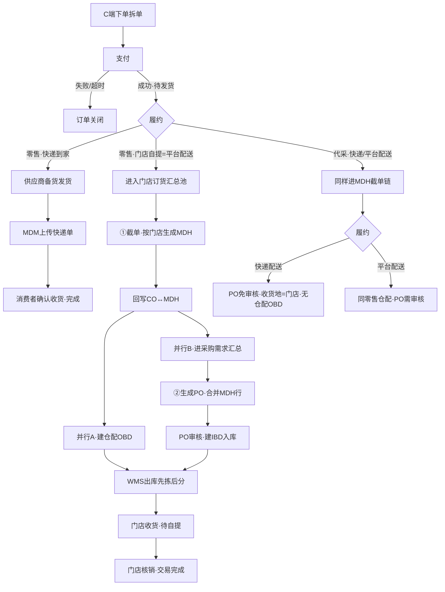
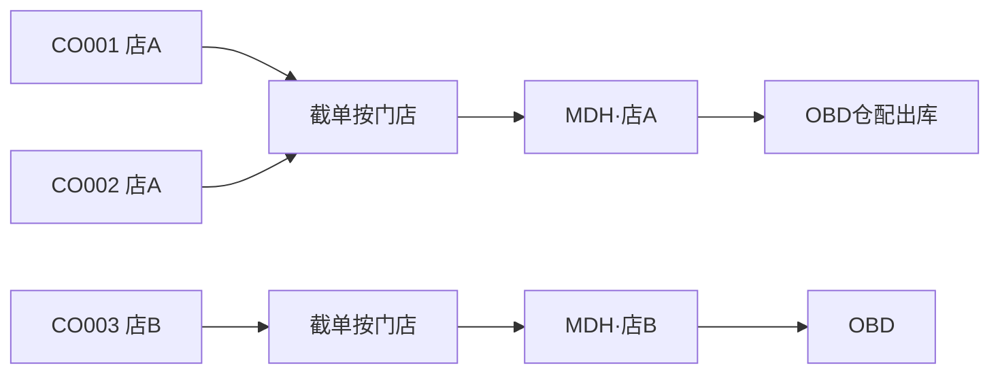
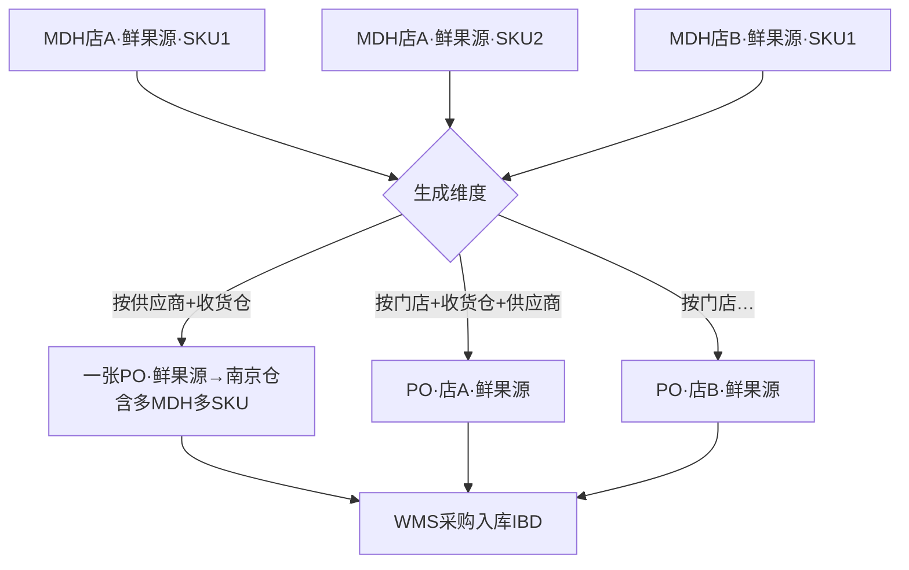
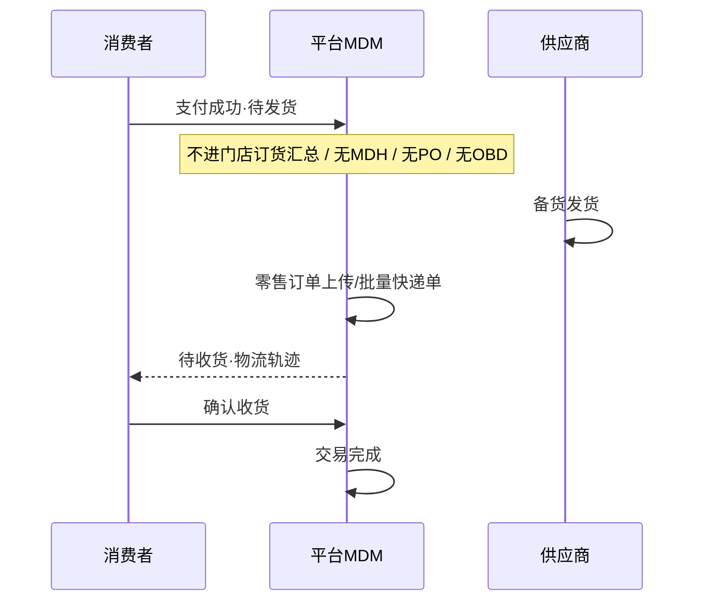
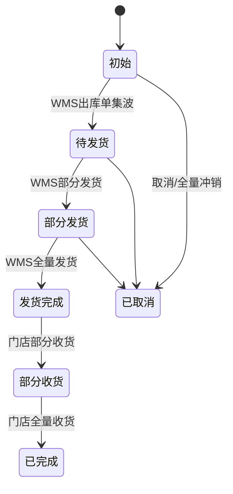
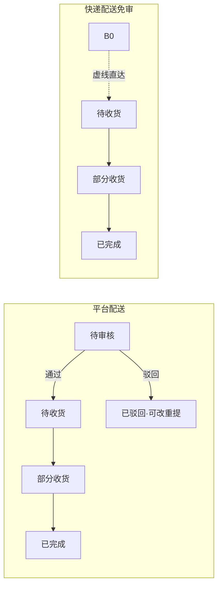
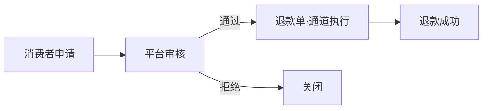
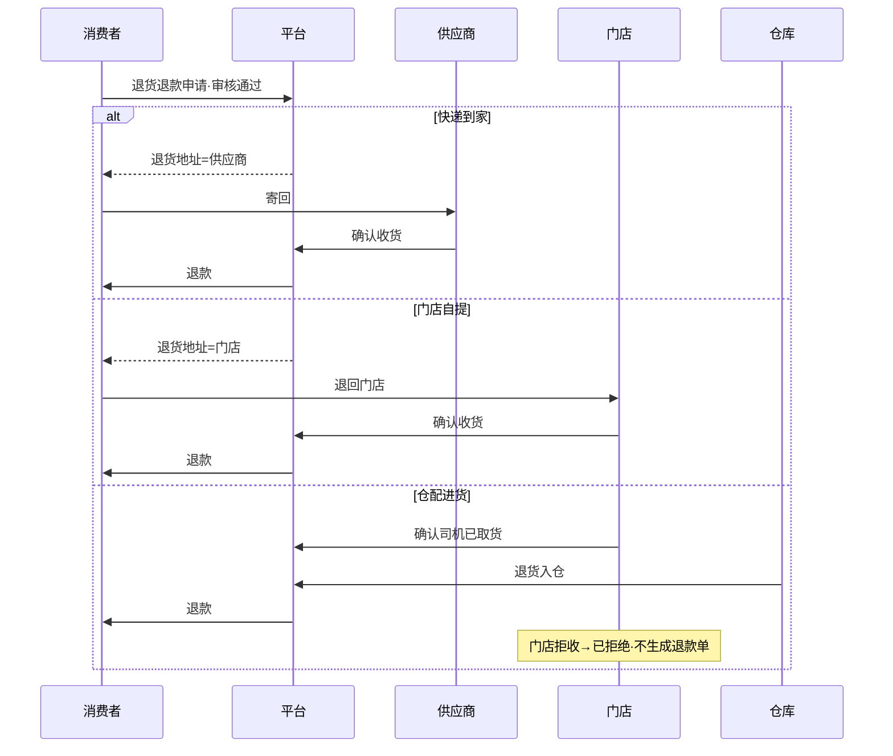
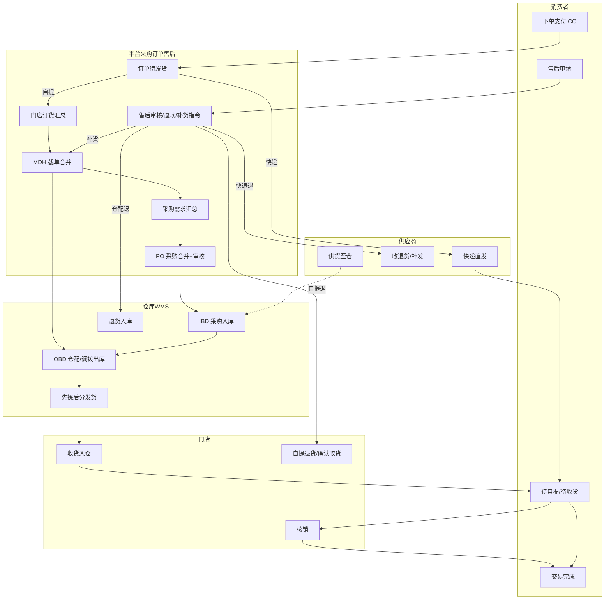

# C 端订单 UAT 全流程模拟（四方 · 单据合并 · 出入库）

> 按 UAT（opsapp）真实菜单与原型规则，完整模拟：下单 → 支付 → **两级合并（截单→采购）** → 出入库 → 门店核销 → 售后。  
> 依据：`门店订货/采购/出入库` 流程图、采购单状态机、UAT 菜单树、`purchase-*-data.js`、user-app / MDM 售后。

---

## 0. 先对齐：单据与术语

| 口语 | 单号样例 | 系统位置 |
|------|----------|----------|
| 消费者订单（零售） | `CO*` / `ORD-*` | 订单 → 零售/商城订单；user-app |
| 门店订货单 | `MDH*` | 采购 → 门店订货单 |
| 采购单 | `PO*` | 采购 → 采购单 |
| WMS 出库单 | `OBD*` | 仓储 → 出库单 |
| WMS 入库单 | `IBD*` | 仓储 → 入库单 |
| 售后单 / 退款单 | — | 售后 → 售后单 / 退款单 |

| C 端履约 | SCM 履约枚举 | 是否进门店订货/采购 |
|----------|--------------|---------------------|
| 门店自提（仓配到店） | **平台配送**（零售仅此） | ✅ |
| 快递到家 | 零售侧供应商直发 | ❌ 不进 MDH/PO/仓配 |
| 门店进货·快递到店 | **快递配送** | ✅ 进 MDH/PO；**无**仓配 OBD；PO **免审核** |
| 门店进货·平台配送 | **平台配送** | ✅ 完整采购+WMS |

**演示合并样例**（`js/purchase-store-order-data.js`）：

- 同一 `MDH2026042012000037` 挂 `CO202604200001` + `CO202604200002`（同店 ST001）  
- 同时挂 `relatedOrderNo=OBD…` 与 `poNo=PO…`（截单后 **出库与采购并行**）

---

## 1. 核心结论：两级合并（用户说的「多单合并生成采购单」）

```text
多笔消费者订单 CO
    │  ① 截单：按【门店】合并
    ▼
门店订货单 MDH（一张可含多 CO、多 SKU）
    │  ② 生成采购单：按【供应商 + 收货地】或【门店 + 收货地 + 供应商】合并
    ▼
采购单 PO（一张可挂多个 MDH，来源单号可逗号拼接）
    │
    ├─► 通知 WMS 建采购入库 IBD
    └─（截单当时已并行）► 通知 WMS 建仓配出库 OBD（±调拨）
```

| 合并步骤 | 时机 | 合并维度 | 产出 |
|----------|------|----------|------|
| ① 截单合并 | 门店订货汇总「截单并生成门店订货单」 | **按门店**（页可按商品/门店/规格查看，生成只按门店） | MDH，回写 CO |
| ② 采购合并 | 采购需求汇总「生成采购单」 | **按供应商**：供应商 + 收货地；**按门店**：门店 + 收货地 + 供应商 | PO，回写 MDH.`poNo` |

收货地随履约变化（`resolvePoPreviewReceiveLocation`）：

- 平台配送 → **收货仓库**
- 快递配送 → **门店**

→ 不同履约不会混进同一张 PO 的同一收货地维度。

---

## 2. 总览分叉（支付成功后）



---

## 3. UAT 主链路逐步模拟（零售 · 平台配送 / 自提）

按角色 + UAT 菜单路径操作，可直接当测试脚本。

### Phase 0 · 消费者下单支付

| 步 | 角色 | 动作 | 结果单据/状态 |
|----|------|------|----------------|
| 0.1 | 消费者 | user-app 确认订单（可拆快递/自提） | 待支付 |
| 0.2 | 消费者 | 唤起支付成功 | **CO → 待发货**；自提明细进入汇总池 |
| 0.3 | 平台订单 | 订单 → 零售/商城订单 核对 | 可见待发货；尚未挂 MDH |

> 汇总池入池条件：已支付 + 状态∈`待发货/退款中` + **未关联门店订货单**。

---

### Phase 1 · ① 截单合并：多 CO → MDH

| 步 | 角色 | UAT 路径 | 动作 | 结果 |
|----|------|----------|------|------|
| 1.1 | 平台采购 | 采购 → 门店订货 → **门店订货汇总** `/procurement/shipment-plan/cutoff` | 按商品/门店/规格查询 | 看到多笔 CO 明细汇总 |
| 1.2 | 平台采购 | 同上 | （可选）改「实际订货量」 | 以改后量参与生成 |
| 1.3 | 平台采购 | 同上 | **截单并生成门店订货单**（或自动截单：渠道×履约） | **按门店**生成 MDH，状态=`初始`，来源=`门店订货汇总生成` |
| 1.4 | 系统 | — | 回写消费者明细订货单 ID/单号 | CO ↔ MDH（一单多 CO，如演示） |
| 1.5 | 系统 | — | 通知 WMS 创建仓配出库单 | **OBD**，业务类型=`配送出库`；回写 MDH.`relatedOrderNo` |
| 1.6 | 系统/物流 | 物流 → 路由规则 | 若配送仓 ≠ 收货仓 | 首节点再建 **调拨出库**（业务类型=`仓库调拨`） |
| 1.7 | 平台采购 | 采购 → **门店订货单** `/procurement/shipment-plan/list` | 查 MDH；仅`初始`可编辑/取消 | 取消需联动 OBD/波次已取消量 |



---

### Phase 2 · ② 采购合并：多 MDH 行 → PO

| 步 | 角色 | UAT 路径 | 动作 | 结果 |
|----|------|----------|------|------|
| 2.1 | 平台采购 | 采购 → **采购需求汇总** `/procurement/procurManagement/PurDemSum/list` | 过滤：MDH 明细非已完成/已取消且未挂 PO | 需求池 |
| 2.2 | 平台采购 | 同上 | 维护实际采购量 | 以实际量生成 |
| 2.3 | 平台采购 | 同上 | **生成采购单** → 选维度 | 见下表 |
| 2.4 | 系统 | — | 回写 MDH 明细 `poNo` | 可一 PO 挂多 MDH |
| 2.5 | 系统 | — | 通知 WMS 建采购入库单 | **IBD**：入库类型=`采购入库`，业务类型=`采购直送`，来源=PO |
| 2.6 | 采购主管 | 采购 → **采购单** | 平台配送：**待审核** → 通过 → **待收货**；驳回可改重提 | 快递配送代采：**免审核** 直接待收货 |
| 2.7 | 仓库 | 仓储 → **入库单** | 收货录入 → 收货中 → 关闭 | 回写 PO：部分收货 / 已完成 |

**生成维度（文档 + 原型）**：

| 选项 | 合并键 | 说明 |
|------|--------|------|
| 按供应商（页称「按供应商维度」） | 供应商 + 收货地 | SKU 进明细行；多门店同行供应商可并一单 |
| 按门店（页称「按门店维度」） | 门店 + 收货地 + 供应商 | 备注可记门店拆分信息 |



---

### Phase 3 · WMS 出库（仓配到店 · 先拣后分）

截单后 OBD 已创建；库存通常依赖 Phase 2 入库（或仓内已有库存）。出库作业：

| 步 | 角色 | UAT 路径 | 动作 | 回写 |
|----|------|----------|------|------|
| 3.1 | 仓库 PC | 出库管理 → 出库单 / 波次 | **集波** | OBD→已集波；**MDH 初始→待发货** |
| 3.2 | 仓库 PC | 波次管理 | 分配库存（可定时） | 分配记录；出库状态推进 |
| 3.3 | 仓库移动端 | 任务 | 拣货（先拣后分） | 拣货完成 → 生成分拣单 |
| 3.4 | 仓库移动端 | 分拣 | 按站点/线路分拣 | 生成包裹；分拣完成 |
| 3.5 | 仓库移动端 | 复核 → 装载发货 | 确认发货 | OBD 发货完成；**MDH→部分发货/发货完成** |
| 3.6 | （异常） | 异常管理 → 出库异常 | 缺货/货损受理 | 有货回流或缺货调整 |

用户端此时：货往自提门店，界面仍多显示 **「待发货」**（后台常为待收货 / to_store）。

---

### Phase 4 · 门店收货与核销

| 步 | 角色 | 路径 | 动作 | 结果 |
|----|------|------|------|------|
| 4.1 | 门店 | 门店侧收货 | 收货入仓 | MDH→部分收货/已完成；用户订单→**待自提** |
| 4.2 | 门店 | store-app **核销** | 扫用户会员码 | 消费者订单→**交易完成** |
| 4.3 | — | — | 补货到店 | **不单独建补货核销单**，随原订单会员码核销 |

---

## 4. 旁路：零售快递到家（不进合并链）



UAT：订单 → 零售订单（上传快递单）；供应商无独立 opsapp 作业菜单。

---

## 5. 代采（门店进货）与零售差异

| 项 | 零售·平台配送 | 代采·平台配送 | 代采·快递配送 |
|----|---------------|---------------|---------------|
| 截单 MDH | ✅ | ✅ | ✅ |
| 生成 PO | ✅ | ✅ | ✅ |
| PO 审核 | 待审核 | 待审核 | **免审核** |
| 仓配 OBD | ✅ | ✅ | ❌（`relatedOrderNo` 空） |
| 采购入库 IBD | ✅ | ✅ | 可有；收货地=门店 |
| C 端终点 | 门店核销 | 门店收货 | 门店收快递 |

---

## 6. 状态对照（后台 ↔ 用户端）

### 6.1 门店订货单 MDH



### 6.2 采购单 PO（平台配送 vs 快递配送）



### 6.3 消费者订单（自提）

| 事件 | 用户端 | 备注 |
|------|--------|------|
| 支付成功 | 待发货 | 进汇总池 |
| WMS 集波/发货 | 仍「待发货」 | 货在送往门店 |
| 门店收货 | **待自提** | |
| 核销 | 交易完成 | |

### 6.4 消费者订单（快递）

| 事件 | 用户端 |
|------|--------|
| 上传快递单 | 待收货 |
| 确认收货 | 交易完成 |

---

## 7. 售后全流程（挂回上述单据）

### 7.1 类型矩阵（零售）

| 阶段 | 仅退款 | 退货退款 | 补货 | 换货 |
|------|--------|----------|------|------|
| 未发货 / 到店途中 | ✓ | — | — | — |
| 已发货后 | ✓ | ✓ | ✓ | —（零售不做） |
| 门店进货 | ✓ | ✓ | ✓ | ✓ |

### 7.2 仅退款



- 不重建 PO/OBD；若 MDH 仍 `初始` 可取消并联动出库取消。  
- 「退款中」明细仍可进汇总池（入池规则含退款中）。

### 7.3 退货退款 · 三落点



退货入库走 **退货入库**（非重建正向采购）。

### 7.4 补货（重建订货履约）

| 步 | 说明 |
|----|------|
| 1 | 售后审核通过 → 向采购下发补货指令 |
| 2 | 生成 MDH，`docSource=售后补送`（演示 `MDH2026042414300088` 挂原 `CO202604200001`） |
| 3 | 快递：供应商补发 + 物流回传 |
| 4 | 自提/仓配：再走截单后出库/采购链 → 到店 |
| 5 | 核销：**挂原订单** 会员码，不单独建补货单 |

---

## 8. 四方职责 · 按阶段

| 阶段 | 平台 | 供应商 | 仓库 | 门店 |
|------|------|--------|------|------|
| 下单支付 | 接单、支付、订单状态 | — | — | — |
| 截单 | 订货汇总、生成 MDH | — | 收 OBD 通知 | — |
| 采购 | 需求汇总、生成/审核 PO | 供货（外部） | 采购入库 IBD | — |
| 发货·仓配 | 监控 MDH/订单 | — | 集波→拣→分→复核→发 | 收货、待自提 |
| 发货·快递 | 上传快递单 | 备货发货 | — | — |
| 完成 | 状态完成 | — | — | **核销** |
| 售后 | 审核、退款、补货下发 | 收退货/补发 | 退货入仓/补货出库 | 自提退货确认、确认取货 |

---

## 9. UAT 一页操作清单（仓配自提主路径）

1. **消费者** user-app：下单支付（自提）  
2. **平台订单**：零售订单 → 待发货  
3. **采购** 门店订货汇总 → 改量（可选）→ **截单** → 多 CO 并入 MDH  
4. **采购** 门店订货单：核对 MDH / `relatedOrderNo`  
5. **采购** 采购需求汇总 → **生成采购单**（选供应商或门店维度）  
6. **采购主管** 采购单：**审核通过**  
7. **仓库** 入库单：采购收货关闭  
8. **仓库** 出库：集波 → 分配 → 拣货 → 分拣 → 复核 → 装载发货  
9. （跨仓）**物流** 路由规则：调拨出库  
10. **门店** 收货 → 待自提 → **扫码核销**  
11. （售后）**平台** 售后单 / 退款单；补货则再出「售后补送」MDH，从步骤 3/8 再走

---

## 10. 端到端总图（单据级）



---

## 相关文档

| 文档 | 内容 |
|------|------|
| `docs/门店订货业务流程图.md` | 截单、MDH 状态、调拨 |
| `docs/采购业务流程图.md` | 需求汇总 → PO → IBD |
| `docs/采购单状态机流转图.html` | 审核 / 免审核 |
| `docs/出库业务流程图.md` | 先拣后分细节点 |
| `docs/入库业务流程图.md` | 采购入库 |
| `docs/异常业务流程图.md` | 出库异常 |
| `docs/冷丰UAT-opsapp-菜单树.txt` | UAT 菜单路径 |
| `js/purchase-store-order-data.js` | CO 合并进 MDH、售后补送样例 |
