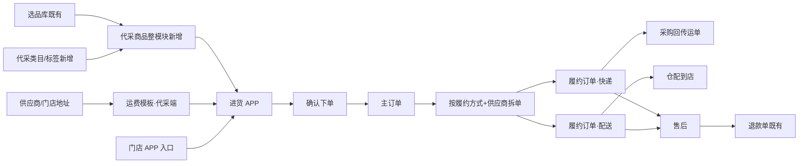

# 代采业务线 · 履约与售后闭环 产品需求文档

---

## 文档信息

| 字段 | 内容 |
|------|------|
| 文档标题 | 代采业务线（地址 / 运费 / 商品 / 订单拆单 / 售后 / **进货 APP**） |
| 产品/功能名称 | 冷丰 ERP · 代采履约闭环 |
| 文档版本 | v1.1 |
| 状态 | 原型对齐稿 |
| 作者 | 产品（据原型实现整理） |
| 最后更新 | 2026-07-30 |
| 文档用途 | 研发评审 / 业务对齐 |
| 原型范围 | `MDM` 供应商/门店档案、运费、选品库（既有底座）、**代采商品/类目/标签（整模块新增）**、代采订单、售后单、退款单；结算策略与结算表；`SCM` 采购回传；**进货 APP**（`user-app/h5/restock*` 等，可由门店 APP 进入） |

**变更记录**

| 版本 | 日期 | 说明 |
|------|------|------|
| v1.1 | 2026-07-30 | ① **补货关闭**：后台/门店确认收货；快递上传物流满 10 天自动确认；配送待收货满 10 天自动确认；门店收货入库反写关闭；自动/反写时实际补货数=申请补货数（两字段分立）② **可售后数量池**：可退池与补货池分立 ③ 采购补货指令展示字段「采购单号」→「订货单号」 |
| v1.0 | 2026-07-29 | ① 整合地址→运费→商品→订单→售后→**进货 APP**全链路；② **代采商品/类目/标签整模块新增**（选品库为上游既有底座；含列表/从库添加/编辑上架、履约与 ETA、SKU/售价/售卖范围等）；③ 主订单按「履约方式+供应商」拆履约订单；④ 代采快递/配送补货下发「采购补货指令」（字段「采购单号」）；⑤ 上门取件、退货退仓、**换货**本期未开发；⑥ 供应商结算/佣金清算沿用原逻辑，策略拆为零售/代采订单策略，结算表增加订单类型（代采/零售） |

---

## 一、背景与目标

### 1.1 背景

代采（门店订货）需打通「供应商发货 / 仓配到店」两条履约。**代采业务的客户端为「进货 APP」**（门店采购员使用；可由门店 APP 工作台进入）。本期在既有选品库、退款单能力上，**整模块新增代采商品（含列表/编辑、类目、标签）**，并补齐履约配置、**主订单拆履约订单**、平台售后与补货类型，与进货 APP 端到端对齐。

### 1.2 目标

- **代采商品整模块可用**：从选品库引入、编辑上架、类目/标签维护、SKU/售价/售卖范围等完整闭环
- 统一代采履约枚举：**快递（到店）**、**配送（仓配到店）**；商品可维护履约方式与预计到店时间
- **进货 APP 确认下单后：主订单按【履约方式 + 供应商】拆成多笔履约订单**（见第七节）
- 后台履约订单按矩阵支持取消、平台发起售后；快递运单由采购回传
- 售后覆盖代采快递/配送，类型含仅退款、退货退款、补货（进货 APP 与后台一致）
- 明确客户端：**进货 APP**（入口可挂在门店 APP）

### 1.3 范围

| 类型 | 内容 |
|------|------|
| **本期包含** | 供应商/门店收货地址；运费模板（代采端）；**代采商品整模块新增**（列表/从库添加/编辑上架、类目管理、标签管理；含履约方式、ETA、SKU、售价、售卖范围等）；**主订单→履约订单拆单**；履约订单取消与平台售后；代采售后主流程（见下表例外）；退款单联动；**进货 APP 全链路**（选品/加购/购物车/确认拆单/订单/售后）；结算侧策略命名与订单类型字段（见第十一节） |
| **既有底座** | 选品库主数据与审核（上游商品池，不承载代采履约/ETA）；退款单列表/凭证；SCM 收货基础能力；**供应商结算与佣金清算业务逻辑（沿用原功能，不重做）** |
| **本期未开发（功能与文档均不变，仅标注）** | ① **退货退款 · 上门取件**（预约取件/取件码/取消寄件等）<br>② **退货退款 · 商品退仓阶段**（配送退货：司机取货后仓库入仓确认等退仓闭环）<br>③ **换货**（整类型本期不做；平台抽屉/进货 APP 不开放换货申请） |
| **本期不包含** | 真实支付/结算对账；MDM 运费与进货 APP 阶梯实时打通；商品 ETA 自动写入确认页送达文案；零售 C 端商城（属零售线） |

### 1.4 履约枚举对照

| 业务语义 | 商品字段 | 履约订单标识 | APP fulfillment | APP deliveryType | 运费模板 |
|----------|----------|--------------|-----------------|------------------|----------|
| 快递到店 | `express` | `store` | 快递 | `store` | 代采端·快递 |
| 仓配到店 | `platform` | `warehouse` | 配送 | `warehouse` | 代采端·配送 |

---

## 二、角色与端侧

| 角色 | 端 | 职责 |
|------|-----|------|
| 运营/商品 | MDM | 档案、运费、选品、代采商品/类目/标签、履约订单、售后、退款单 |
| 采购/仓配 | SCM | 采购单回传快递物流；仓配入库 |
| **门店采购员 / 店主** | **进货 APP（代采客户端）** | 选品、加购、购物车、确认拆单支付、履约订单查看、售后申请 |
| 门店人员 | 门店 APP（工作台） | **入口**：工作台「进货」跳转进货 APP；会员核销（补货随原履约订单，不单独核销） |

> **口径**：代采 C 端 = **进货 APP**，不是零售用户 APP。原型页面落在 `user-app/h5/restock.html` 等，带 `from=restock.html` / `from=store-app` 区分进货场景；门店 APP 仅作入口壳，不承载进货交易主流程。

---

## 三、端到端流程（总览）



---

## 四、基础主数据

### 4.1 供应商档案与收货地址

**页面：** `MDM/mdm_archive_supplier.html`

| 字段 | 说明 |
|------|------|
| 供应商ID / 主体名称 / 供应商名称 | 基础标识 |
| **供应商简称** | 进货 APP 购物车/确认单展示名 = `简称 \|\| 名称` |
| 省市区 / 详细地址 | 档案默认地址 |
| 供应商类型 / 负责人 / 手机 / 配送方式 | 统配/直配等 |
| 进件 / 余额支付 / 状态 | |

**收货地址页签：** 收货人、手机、省市区、详细地址、是否默认（唯一）。  
**用途：** 代采退货退款（快递）寄回供应商默认收货地址。

### 4.2 门店档案与收货地址

**页面：** `MDM/mdm_archive_store.html`

| 字段 | 说明 |
|------|------|
| 门店ID / 名称 / 类型 / 联系人 / 电话 | |
| 省市区 / 详细地址 / 履约仓库 | |
| 收货地址页签 | 结构同供应商；代采收货语义读取默认地址 |

代采履约**无自提**（自提属零售线）。订单收货信息含所属门店：快递=到店；配送=仓配到店。

---

## 五、运费管理（代采端）

**页面：** `MDM/mdm_settle_freight_config.html`

| 字段 | 说明 |
|------|------|
| 应用端口 | **代采端** |
| 履约方式 | 配送、快递 |
| 编码/名称/有效期 | |
| 计费 | 货款阶梯；tiers：地区、金额区间、运费 |

**进货 APP 原型规则：** 快递免运费；配送按同履约合并货款分档（0–200→¥12；200–399→¥8；≥399→免运）。MDM 与进货 APP 演示双轨，正式需统一。

---

## 六、商品体系

> **口径**：**代采商品模块（列表/编辑、类目管理、标签管理）整模块为本期新增**，不是在旧代采商品上仅加履约字段。选品库为上游既有商品池，经「从商品库添加」进入代采列表后，在代采侧完成配置与上架。

### 6.1 选品库（既有底座 · 上游）

**页面：** `MDM/mdm_product_selection.html`、`MDM/mdm_product_audit.html`（商品详情/审核）

| 能力 | 说明 |
|------|------|
| 主数据 | 编码、名称、采购价、渠道、类目、售卖/审核状态等 |
| 审核 | 待审核商品详情：通过 / 驳回（含原因） |
| 与代采边界 | **不在选品库落履约方式 / 预计到店时间**；履约与售卖配置在代采商品编辑完成 |

### 6.2 代采商品（本期整模块新增）

**页面：** `MDM/mdm_product_proxy_list.html`（列表 + 页内编辑表单；无独立 form 页）

#### 6.2.1 列表与从库添加

| 能力 | 规则 |
|------|------|
| 筛选 | 商品编码、名称、类目、标签、状态（草稿/已上架/已下架）、**履约方式（快递/配送）** |
| **从商品库添加** | 右侧抽屉自选品库引入 → 进入**草稿**，须编辑完善后上架 |
| 行操作 | 编辑；更多：上架 / 下架 / 删除（按状态矩阵） |
| 状态机 | 草稿 → 已上架 ↔ 已下架 |

#### 6.2.2 编辑表单（本期新增能力全集）

| 板块 | 字段 / 能力 |
|------|-------------|
| 基础信息 | 类目、标签、**履约方式（快递/配送）**、**预计到店时间**（数值 + 天/小时，默认「天」） |
| 售卖规格 | SKU、售价体系、限购 |
| 售卖范围 | 按区域 / 门店选择可售范围 |
| 内容 | 媒体与图文详情 |
| 上下架 | 编辑完善后上架；已上架可下架再上架 |

> 履约方式、ETA 为闭环关键字段，但与类目/标签/SKU/售价/售卖范围等同属本模块新增范围，**勿按「仅增量字段」验收**。

### 6.3 代采类目管理（本期整模块新增）

**页面：** `MDM/mdm_product_proxy_category.html`

| 能力 | 规则 |
|------|------|
| 结构 | 一 / 二 / 三级级联类目 |
| 操作 | 新增、编辑、上架/下架、删除 |
| 约束 | 有绑定商品时禁删（及相应提示）；进货 APP 仅展示已上架类目 |

### 6.4 代采标签管理（本期整模块新增）

**页面：** `MDM/mdm_product_proxy_tag.html`

| 能力 | 规则 |
|------|------|
| 操作 | 标签列表 CRUD |
| 约束 | 标签名 ≤5 字；删除后从已绑定代采商品上移除 |

---

## 七、订单：主订单 → 履约订单（拆单）【写清】

> 本节说明代采「一张主单如何拆成多笔履约订单」，是本期核心规则。

### 7.1 概念

| 概念 | 定义 |
|------|------|
| **主订单** | 进货 APP 一次确认支付产生的交易单 |
| **履约订单** | 主订单按拆单维度拆出的履约执行单；后台「代采订单」与进货 APP「我的订单」操作对象均为履约订单 |
| **拆单维度** | **【履约方式 + 供应商】**（同供应商下不同履约再拆；同履约不同供应商亦拆） |

补充：同一供应商、同一履约下，若收货仓/店不同，进货 APP 确认页可再按仓/店分子包裹；落库后仍归属对应「履约方式+供应商」的履约订单。

### 7.2 拆单规则

```
主订单（一次支付）
  ├─ 履约订单 A：供应商 S1 + 快递
  ├─ 履约订单 B：供应商 S1 + 配送
  ├─ 履约订单 C：供应商 S2 + 快递
  └─ …
```

| 规则 | 说明 |
|------|------|
| 分组键 | `supplierId` + `fulfillmentMethod`（快递/配送） |
| 商品归属 | 购物车行携带供应商与履约；同键商品归入同一履约订单 |
| 金额 | 各履约订单独立商品货款；运费按履约方式分计（见第五节） |
| 状态 | **各履约订单状态独立流转**（互不影响） |
| 售后/取消 | 针对**履约订单**（或订单内商品行），不整笔主单一刀切 |

**确认页（进货）对应关系：**  
`供应商` 分组下，再按 `履约方式 + 仓/店` 展示多包裹 → 支付成功后生成上述履约订单。

### 7.3 履约订单列表与字段

**页面：** `MDM/mdm_order_proxy.html`

| 字段 | 说明 |
|------|------|
| 订单号 | 履约订单号（可关联主单号，原型以列表单号为准） |
| 下单时间 / 下单门店或账号 | |
| 收货人 / 电话 / 地址 / 所属门店 | |
| 商品 / 件数 / 金额 / 支付渠道 | |
| **履约方式** | 快递 / 配送 |
| **订单状态** | 见 7.4 |
| 操作 | 见 7.5 |

### 7.4 履约订单状态

| 状态 | 说明 |
|------|------|
| 已创建 | 未支付 |
| 已支付 | 已付待处理 |
| 待发货 | 待出库/待揽收 |
| 待收货 | 在途或待门店收（代采无「待提货」） |
| 已完成 | 确认收货 |
| 已关闭 | 取消 |

### 7.5 履约差异与操作矩阵

| 项 | 快递履约订单 | 配送履约订单 |
|----|--------------|--------------|
| 详情 | 收货信息 + 包裹/运单/轨迹 | 收货信息，无快递区块 |
| 运单 | **采购单回传**，订单侧不可上传改单 | 无 |
| 确认收货 | 待收货 → 已完成 | 同左 |
| **取消订单** | 待支付 / 已创建 / 已支付 / 待发货 | 同左 |
| **平台退款** | **待收货** → 售后抽屉 | 同左 |

---

## 八、代采售后

**页面：** `MDM/mdm_aftersale_ticket.html`、详情页  
**原因：** `js/mdm-aftersale-reasons.js`（与**进货 APP**售后原因对齐）

### 8.1 维度

**订单来源=代采** × **履约∈{快递, 配送}** × **类型∈{仅退款, 退货退款, 补货}** × 业务状态。  
售后挂在**履约订单**（及商品行）上。**换货本期不做**，不纳入本期类型矩阵。

### 8.2 售后类型

| 类型 | 生成退款单 | 说明 |
|------|------------|------|
| 仅退款 | ✓ | 无实物寄回 |
| 退货退款 | ✓ | 需退货后再退款 |
| **补货** | ✗ | 补发实物；审核通过后下发 **采购补货指令**（见 8.4.1） |
| 换货 | — | **本期不做** |

### 8.3 业务状态

| 类型 | 状态 |
|------|------|
| 仅退款 | 待审批、已拒绝、退款中、退款异常、已完成、已取消 |
| 退货退款 | 上表 + 待退货、待收货 |
| 补货 | 待审批、已拒绝、待收货、已完成、已取消 |

### 8.4 快递 vs 配送（含本期未开发标注）

| 环节 | 快递 | 配送 |
|------|------|------|
| 退货地址 | 供应商收货地址 | 仓库地址（目标语义） |
| 退货物流（门店寄回） | 进货 APP 自填运单等（本期主路径） | — |
| **上门取件** | **本期未开发**（预约取件/取件码/取消寄件等不做） | **本期未开发** |
| **退仓阶段** | — | **本期未开发**（司机取货后仓库入仓确认等退仓闭环不做） |
| 采购补货指令 | ✓ 审核通过后下发 | ✓ 审核通过后下发 |
| 补货履约 | 可回传物流（采购回传） | 仓配到店，无物流轨迹 |
| 补货关闭 | 确认收货 / 上传物流满 10 天自动确认 | 确认收货入库 / 待收货满 10 天自动确认；门店入库反写 |
| 退款触发 | 仅退款审核通过；或退货确认收货后 | 同左（退仓未开发期间，配送退货收货节点按现有原型演示，不扩展退仓能力） |

> **说明：** 上门取件、代采退货退仓仅为规划能力，**本期功能不开发、既有原型表现不变**；文档保留目标差异表，以本表「本期未开发」为准。

### 8.4.1 补货 · 采购补货指令（售后详情）

代采 **快递、配送** 补货审核通过后，均向采购端下发 **采购补货指令**；售后详情展示该指令区块，展示字段为 **订货单号**（非「指令单号」/「采购单号」；状态文案「已下发订货」）。

| 履约 | 采购补货指令 | 补货路径说明 |
|------|--------------|--------------|
| **快递** | ✓ | 生成采购单；等待采购回传补货物流；确认收货并录入实际补货数量 |
| **配送** | ✓ | 生成采购单；供应商补发至仓库再仓配到店（无快递轨迹）；门店确认入库并回写实际数量 |

> 对照零售：零售自提补货同样有采购补货指令；**零售快递**补货绕过仓储、直连供应商，**无**采购补货指令（见零售 PRD）。

### 8.4.2 可售后数量池（商品行）

同一履约订单商品行维护两套上限（进货 APP / 平台发起共用口径）：

| 池 | 适用类型 | 计算（摘要） | 互斥关系 |
|----|----------|--------------|----------|
| **可退池** | 仅退款、退货退款 | 购买数 − 已退成功 − 进行中退款类占用 | **补货不占用可退池** |
| **补货池** | 补货 | 购买数 − 已售后累计（进行中+已完成的退款/退货/补货等） | **退款会占用补货上限**；补货不反向扣可退 |

> **申请补货数量** 与 **实际补货数量** 为两个字段：申请时写申请数；关闭补货时再回写实际数。

### 8.4.3 补货关闭（完结）规则

补货业务状态进入 **已完成** 的触发（满足任一即可）。关闭时 **申请补货数量不变**；**实际补货数量** 按下列规则写入：

| # | 触发方 | 适用履约 | 实际补货数量 |
|---|--------|----------|--------------|
| 1 | 后台售后详情「确认收货」并录入 | 快递 / 配送 | 人工录入（≤申请数） |
| 2 | 进货 APP / 门店端「确认收货」或「确认入库」并录入 | 快递 / 配送 | 人工录入（≤申请数） |
| 3 | 上传补货物流后满 **10 天**未确认 → 系统自动确认 | **快递** | **= 申请补货数量** |
| 4 | 订单流转至**待收货**后满 **10 天**未确认 → 系统自动确认 | **配送** | **= 申请补货数量** |
| 5 | 门店操作**收货入库** → 状态反写关闭补货 | **配送** | **= 申请补货数量**（门店在入库弹层录入时则以录入值为准） |

计时锚点：快递以**补货物流上传时间**起算；配送以进入**待收货**时间起算。

### 8.5 售后原因（摘要）

| 场景 | 桶 |
|------|-----|
| 发货前仅退款 | pre_ship |
| 未收到货 / 已收到货仅退款 | not_received / received |
| 退货退款 | return_refund |
| 补货 | restock（破损/少件/发错货/物流未到/协商一致） |
| 换货 | exchange（**本期不做**，原因枚举可保留不启用） |

筛选项「售后原因」随「售后类型」联动；本期筛选项不含换货。

### 8.6 平台发起售后抽屉（履约订单侧）

售后发生时间；商品勾选与可退信息；类型（仅退款/退货退款/补货）；退款金额或补货数量；原因；描述≤200；凭证≤9；底栏已选与合计退款。

---

## 九、退款单（既有）

仅「仅退款 / 退货退款」生成；补货不生成。来源含售后退款、履约调整、订单取消。线下待退款可上传凭证。

---

## 十、进货 APP（代采客户端）【查漏补缺重点】

> **产品定义**：代采业务唯一交易客户端 = **进货 APP**。  
> **实现提示**：页面集中在 `user-app/h5/`，以 `restock.html` 为首页，链路参数 `from=restock.html`；门店 APP（`store-app`）工作台「进货」以 `?from=store-app` 跳入同一套进货 APP。

### 10.1 入口

| 入口 | 路径 |
|------|------|
| 门店 APP 工作台 | `store-app/h5/home.html` → 进货 → `user-app/h5/restock.html?from=store-app` |
| 进货 APP 直达 | `user-app/h5/restock.html`（标题语义：进货） |

门店 APP 另含会员核销等能力：**补货随原履约订单核销，不单独建补货核销单**（与进货售后补货约定一致）。

### 10.2 页面地图（全链路）

| 环节 | 页面（原型） | 说明 |
|------|--------------|------|
| 首页 / 分类选品 | `restock.html` | 分类树、商品流、加购；供应商简称展示 |
| 商品详情 | `product-detail.html?from=restock.html` | 规格、履约方式、加购 |
| 购物车 | `restock.html` 内购物车（或同源购物车能力） | 按供应商分组；行含履约方式 |
| 确认订单 | `checkout.html?from=restock.html` | 按供应商+履约（+仓/店）展示包裹与运费；提交支付 |
| 我的订单 | `orders.html?from=restock.html` | 履约订单列表 |
| 订单详情 | `order-detail.html`（进货场景） | 履约/物流信息；发起售后入口 |
| 售后列表 | `order-aftersale-list.html?from=restock.html` | |
| 仅退款 | `order-refund-only.html` / `order-refund-pre-ship.html` | 发货前/后原因分流 |
| 退货退款 | `order-refund-return*.html`、`-return-ship.html` 等 | 快递寄供应商；配送目标退仓（退仓阶段本期未开发） |
| 补货 | `order-refund-restock.html` | 配送无物流；快递可寄出 |
| 上门取件相关页 | `order-refund-pickup-*.html` | **本期未开发**（页面可存，能力不验收） |
| 换货 | `order-refund-exchange.html` | **本期不做**（页面可存，能力不验收） |

### 10.3 购物车行关键字段

| 字段 | 说明 |
|------|------|
| `supplierId` / `supplierName` | 供应商；展示名简称优先 |
| `fulfillmentMethod` | 快递 / 配送（来自代采商品履约） |
| 商品信息 | id/spu、标题、规格、单价、数量、图片、勾选等 |

购物车持久化示例：`ua_restock_cart_v2`。

### 10.4 确认下单 → 主订单 / 履约订单

1. 确认页按 **供应商** 分组，组内按 **履约方式**（及仓/店）展示多包裹与分计运费  
2. 支付成功生成 **主订单**  
3. 系统按 **【履约方式 + 供应商】** 拆出多笔 **履约订单**（见第七节）  
4. 进货 APP「我的订单 / 详情 / 售后」与后台代采订单，均以 **履约订单** 为操作单元  

运费规则见第五节（快递免运；配送阶梯）。

### 10.5 进货 APP 售后（与后台对齐）

| 类型 | 快递 | 配送 |
|------|------|------|
| 仅退款 | ✓ | ✓ |
| 退货退款 | 寄回供应商 + 自填物流（主路径） | 目标退仓库；**退仓阶段本期未开发** |
| 上门取件 | **本期未开发** | **本期未开发** |
| 换货 | **本期不做** | **本期不做** |
| 补货 | 可有寄出物流；**有采购补货指令（订货单号）**；上传物流满 10 天自动确认 | 无物流，仓配到店；**有采购补货指令（订货单号）**；待收货满 10 天自动确认；门店入库反写关闭 |

售后跳转需携带进货场景参数（如 `from=restock.html`）与履约参数（`delivery=store|warehouse`），避免与零售 C 端售后混淆。

### 10.6 与零售用户 APP 的边界

| 维度 | 进货 APP（代采） | 用户 APP 商城（零售） |
|------|------------------|----------------------|
| 使用者 | 门店采购员 | C 端消费者 |
| 履约 | 快递到店 / 配送到店 | 快递到家 / 门店自提 |
| 拆单键 | 履约方式 + **供应商** | 履约方式 + 供应商或门店 |
| 文档 | **本文** | 零售业务线 PRD |

---

## 十一、供应商结算与佣金清算（沿用原逻辑）

> 详细资金链路见 [结算规则总概述](./结算规则总概述.md)。本节只说明代采线与结算的对接变更，**不改写一清/二清/异常补偿/逆向冲减算法**。

### 11.1 原则

| 项 | 说明 |
|----|------|
| **业务逻辑** | 代采履约订单的**供应商结算、佣金（分佣）清算走原功能逻辑**（清分 → 结账单 → 一清供应商 → 分佣订单二清等，与既有一致） |
| **本期变更** | 仅配置入口命名与结算表字段区分订单类型，便于零售/代采分策略运营 |
| **不变更** | 账户体系、单据状态机、异常补偿、结算前后退款处理规则 |

### 11.2 策略配置变更

| 变更前（概念） | 变更后 |
|----------------|--------|
| 统一/笼统的订单结算策略配置 | 拆为两套策略入口：**零售订单策略**、**代采订单策略** |

| 策略 | 适用范围 |
|------|----------|
| **代采订单策略** | 订单类型=代采 的履约订单（及由其产生的清分/结账/结款/分佣数据） |
| 零售订单策略 | 见零售业务线 PRD（本文不展开） |

代采履约订单匹配、计算分佣时，读取 **代采订单策略**；计算过程仍按原清分/分佣规则执行。

### 11.3 结算表 · 订单类型字段

各结算相关表（如清分明细、结账单、供应商结款单、分佣/佣金清算明细等）增加：

| 字段 | 枚举 | 说明 |
|------|------|------|
| **订单类型** | `代采` / `零售` | 标识结算数据来源业务线；代采履约订单落库为 **代采** |

用途：列表筛选、对账导出、按策略回溯；**不改变原结算金额计算方式**。

### 11.4 与履约订单 / 进货 APP 关系

```
进货 APP 支付 → 主订单 → 按【履约方式+供应商】拆履约订单（订单类型=代采）
                      → 按「代采订单策略」走原清分/供应商结算/佣金清算
```

---

## 十二、本期迭代清单

| 板块 | 迭代点 |
|------|--------|
| 供应商档案 | 简称透出至**进货 APP** |
| 运费 | 代采端 × 快递/配送；进货 APP 分计 |
| **代采商品（整模块新增）** | 列表/从商品库添加/编辑上架；履约方式与 ETA；SKU、售价、售卖范围、媒体详情；状态草稿→上架↔下架 |
| **代采类目 / 标签（整模块新增）** | 三级类目 CRUD 与上下架约束；标签 CRUD（名≤5 字） |
| **订单** | **主订单按履约方式+供应商拆履约订单**；取消/平台退款矩阵；快递单采购回传 |
| 售后 | 代采快递/配送主流程；补货类型；原因与**进货 APP**对齐；采购补货指令（订货单号）；可售后数量池；补货关闭规则 |
| 售后（未开发） | 上门取件；配送退货退仓阶段；**换货** |
| **进货 APP** | 选品→加购→确认拆单→订单→售后全链路；门店 APP 仅作入口；补货确认收货/入库与关闭规则对齐 |
| **结算** | 策略拆为零售/代采订单策略；结算表增加订单类型；**结算/佣金逻辑沿用原功能** |

---

## 十三、验收要点

1. **代采商品整模块**：可从选品库添加进草稿，编辑类目/标签/SKU/售价/售卖范围/履约/ETA 后上架；列表可按履约等方式筛选；可下架/删除（按状态）  
2. **代采类目 / 标签**：三级类目与标签可维护；有绑品时类目禁删等约束生效；APP 仅见已上架类目  
3. **进货 APP 一笔支付后，不同「供应商+履约」生成多笔履约订单，状态独立**  
4. 后台履约订单：待发货前可取消；待收货可平台退款；快递单不可在订单侧改  
5. 进货 APP 售后主路径可走通；**不验收上门取件、退仓阶段、换货**  
6. 代采快递/配送补货审核通过后，售后详情均展示采购补货指令（展示 **订货单号**）  
7. 补货关闭符合 8.4.3：后台/门店确认收货；快递物流满 10 天、配送待收货满 10 天自动确认（实际数=申请数）；配送门店入库反写关闭  
8. 可退池与补货池按 8.4.2 独立计算；申请数与实际数为两个字段  
9. 门店 APP 可跳入进货 APP；进货内供应商展示名简称优先  
10. 结算侧可见 **代采订单策略**；代采相关结算单据 **订单类型=代采**；清分/结款/分佣结果与原逻辑一致  
11. 进货 APP 链路与零售用户 APP 通过 `from=restock` 等参数隔离，不串售后模板  

---

## 附录 · 原型路径

| 模块 | 路径 |
|------|------|
| 供应商/门店 | `MDM/mdm_archive_supplier.html`、`mdm_archive_store.html` |
| 运费 | `MDM/mdm_settle_freight_config.html` |
| 选品库（既有底座） | `MDM/mdm_product_selection.html`、`mdm_product_audit.html` |
| **代采商品（整模块新增）** | `MDM/mdm_product_proxy_list.html`（列表+编辑） |
| **代采类目 / 标签（整模块新增）** | `MDM/mdm_product_proxy_category.html`、`mdm_product_proxy_tag.html` |
| 代采订单 | `MDM/mdm_order_proxy.html` |
| 售后/退款 | `MDM/mdm_aftersale_ticket*.html`、`mdm_aftersale_refund.html` |
| **进货 APP** | `user-app/h5/restock.html`、`product-detail.html`、`checkout.html`、`orders.html`、`order-detail.html`、`order-refund-*.html`、`order-aftersale-list.html` |
| 门店 APP 入口 | `store-app/h5/home.html`（进货跳转） |
| 结算规则 | `docs/结算规则总概述.md` |
