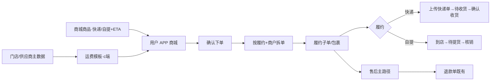

# 零售业务线 · 快递履约与售后闭环 产品需求文档

---

## 文档信息

| 字段 | 内容 |
|------|------|
| 文档标题 | 零售业务线（快递为主，自提对照；地址 / 运费 / 商城商品 / 订单 / 售后 / 用户 APP） |
| 产品/功能名称 | 冷丰 ERP · 零售快递履约闭环 |
| 文档版本 | v1.2 |
| 状态 | 原型对齐稿 |
| 作者 | 产品（据原型实现整理） |
| 最后更新 | 2026-07-30 |
| 文档用途 | 研发评审 / 业务对齐 |
| 原型范围 | `MDM` 门店档案、运费、商城商品/类目/标签、零售订单、售后单、退款单；结算策略与结算表；`user-app` 商城购物车/确认单/订单/售后 |

**变更记录**

| 版本 | 日期 | 说明 |
|------|------|------|
| v1.2 | 2026-07-30 | ① **补货关闭**：后台/用户确认收货；快递上传物流满 10 天自动确认；自提待核销满 10 天自动确认；原单该商品剩余数量全量核销反写关闭；自动/反写时实际补货数=申请补货数（两字段分立）② **可售后数量池**：可退池与补货池分立 ③ 采购补货指令展示字段「采购单号」→「订货单号」④ 零售快递补货：供应商寄回后由**后台上传物流**（非供应商侧回传演示） |
| v1.1 | 2026-07-29 | **补货指令**：明确零售自提补货下发「采购补货指令」（字段「采购单号」）；零售快递补货绕过仓储、直连供应商补发，不展示采购补货指令 |
| v1.0 | 2026-07-29 | **合并说明**：① 整合地址→运费→商城商品→订单→售后→用户 APP 全链路（自提作对照）；② 明确确认下单按「履约方式+商户」拆单，并标注上门取件、**换货**本期未开发；③ 供应商结算/佣金清算沿用原逻辑，策略拆为零售/代采订单策略，结算表增加订单类型（代采/零售） |

---

## 一、背景与目标

### 1.1 背景

零售商城需同时支撑 **快递到家** 与 **门店自提**。本期在既有商城商品、退款单能力上，补齐履约与预计到店配置、按商户拆单、订单取消与平台售后矩阵，并在原有「零售自提仅退款/退货退款」基础上扩展 **零售快递售后** 与售后类型 **补货**。

### 1.2 目标

- 商城商品可配置履约：**快递 / 自提**，并维护预计到店（可提）时间
- 用户确认订单按 **履约方式 + 商户主体（快递=供应商 / 自提=门店）** 拆单（可产生多笔履约子单/多包裹）
- 后台零售订单按履约区分状态、核销、快递单上传、取消与平台退款
- 售后覆盖零售快递与自提；类型含仅退款、退货退款、补货
- 供应商展示名简称优先；售后原因与用户 APP 对齐

### 1.3 范围

| 类型 | 内容 |
|------|------|
| **本期包含** | 门店地址（自提点）；运费模板（c 端）；商城商品履约/ETA；商城类目/标签；零售订单矩阵；零售快递售后 + 补货；用户 APP 拆单与售后主路径；结算侧策略命名与订单类型字段（见第十二节） |
| **既有底座** | 商城商品库基础能力；退款单列表/凭证；零售自提仅退款/退货退款主流程；**供应商结算与佣金清算业务逻辑（沿用原功能，不重做）** |
| **本期未开发（功能与文档均不变，仅标注）** | ① **退货退款 · 上门取件**（预约取件/取件码/取消寄件等）<br>② **换货**（整类型本期不做；平台抽屉/用户 APP 不开放换货申请） |
| **本期不包含** | 真实支付与物流对接；运费模板与 APP 实时计费打通（APP 演示多为免运费） |

### 1.4 履约枚举对照

| 业务语义 | 商品 deliveryMode | 商户主体 | APP fulfillType | 售后 delivery | 运费模板 |
|----------|-------------------|----------|-----------------|---------------|----------|
| 快递到家 | `express` | 供应商 | `express` | `store` | c端·快递 |
| 门店自提 | `pickup` | 门店 | `pickup` | `pickup` | c端·自提 |

---

## 二、角色与端侧

| 角色 | 端 | 职责 |
|------|-----|------|
| 运营/商品 | MDM | 门店档案、运费、商城商品/类目/标签、零售订单、售后、退款单 |
| 客服/履约 | MDM 订单 | 上传快递单、核销（自提）、取消、平台发起售后 |
| C 端用户 | 用户 APP | 商城浏览、加购、拆单结算、订单与售后 |

---

## 三、端到端流程（快递主路径）



---

## 四、基础主数据

### 4.1 门店地址 / 自提点

**后台：** `MDM/mdm_archive_store.html`  
字段：门店ID、名称、类型、联系人/电话、省市区、详细地址、履约仓库、状态等。

**用户 APP：** 提货点名称、地址、联系人、距离/评分、`pickupBadge`（可提文案）。  
用于自提履约、自提售后退回门店。

### 4.2 供应商简称（快递商户名）

展示名 = `shortName || name`，用于详情/购物车/确认页/订单列表店铺名。

---

## 五、运费管理（c 端）

**页面：** `MDM/mdm_settle_freight_config.html`

| 字段 | 说明 |
|------|------|
| 应用端口 | **c端** |
| 履约方式 | 自提、快递 |
| 编码/名称/有效期/阶梯 | 货款阶梯计费 |

用户 APP 确认页演示多为免运费；正式应对齐模板。

---

## 六、商城商品体系

### 6.1 商城商品（既有 + 迭代）

**页面：** `MDM/mdm_product_mall.html`

| 迭代字段 | 规则 |
|----------|------|
| **履约方式** | 快递 / 自提 |
| **预计到店时间** | 数值 + 单位（天/小时） |

既有：编码、名称、标签、类目、规格、售价/积分价、销量、上下架、SKU/图文/售卖范围等。

### 6.2 商城类目（扁平列表）

图片（80×80 圆图）、名称≤10 字不可重名、绑定商品数、状态、创建时间。  
`productCount > 0` 时禁止下架、删除。与代采三级类目独立。

### 6.3 商城标签

排序、名称、绑定商品数、创建时间等。

### 6.4 用户 APP 展示

| 履约 | 展示 |
|------|------|
| 快递 | `快递 · {deliveryText}`；商户=供应商（简称优先） |
| 自提 | `自提 · {pickupBadge}`；提货门店 |

---

## 七、零售订单与拆单

### 7.1 拆单规则（用户确认下单）

**拆单维度：** `履约方式 + 商户主体`

| 履约 | 商户主体 | 结果 |
|------|----------|------|
| 快递 | **供应商** | 不同供应商 → 不同履约子单/包裹 |
| 自提 | **门店** | 按门店分包（演示通常单门店） |

- 确认页：自提包裹优先展示；每包含商户名、履约标签、预计时间、商品、备注  
- 自提门店信息块整单只展示一次  
- 支付后可产生多子单/多包裹；后台列表按履约订单（子单）维度操作

> 与代采对照：代采拆单键为 **【履约方式 + 供应商】**（无自提）；零售快递侧同为供应商维度，另增自提×门店。

### 7.2 列表与状态

**页面：** `MDM/mdm_order_retail.html`

| 后台状态 | 快递 | 自提 | 用户 APP（典型） |
|----------|------|------|------------------|
| 已创建 | 未支付 | 未支付 | unpaid |
| 待发货 | 备货 | 备货 | shipping |
| **待收货** | 在途待签收 | 配送到店途中 | receipt / to_store |
| **待提货** | — | 到店可核销 | pickup |
| 已完成 | 确认收货 | 已自提 | completed |
| 已关闭 | 取消 | 取消 | closed |

### 7.3 操作矩阵

| 操作 | 快递 | 自提 |
|------|------|------|
| 查看 | ✓ | ✓ |
| **上传快递单** | 非已完成/已关闭/已取消 | ✗ |
| **核销** | ✗ | 状态=**待提货** |
| **取消订单** | 待支付/已创建/已支付/待发货 | 待支付/已创建/待发货/待收货/待提货 |
| **平台退款** | **待收货** | **待收货、待提货** |

### 7.4 快递单（仅零售）

单笔/批量上传；批量按订单号、商品名称、规格、物流单号；单号校验 1～50 且 `[A-Za-z0-9_-]`。代采快递不走本入口。

### 7.5 平台发起售后抽屉

售后发生时间；商品勾选与可退信息；类型（仅退款/退货退款/补货）；退款金额或补货数量；原因；描述；凭证；底栏合计。

---

## 八、零售售后

### 8.1 相对既有能力的扩展

| 既有 | 本期扩展 |
|------|----------|
| 零售自提 · 仅退款 / 退货退款 | **零售快递** 全类型售后 |
| — | 售后类型 **补货** |
| — | 原因与 APP 对齐 |

### 8.2 类型与退款单

| 类型 | 生成退款单 | 快递 | 自提 |
|------|------------|------|------|
| 仅退款 | ✓ | 无寄回 | 同左 |
| 退货退款 | ✓ | 寄回供应商 + **用户自填运单（主路径）** | 退回门店，门店确认，无运单 |
| **上门取件**（退货退款附属能力） | — | **本期未开发** | **本期未开发** |
| **补货** | ✗ | 可有补货物流；**不走仓储/采购指令** | 到店自提核销，无物流；随原单核销；**下发采购补货指令** |
| 换货 | — | **本期不做** | **本期不做** |

> **说明：** 上门取件、换货为规划能力，**本期功能不开发**；退货退款以用户自行寄回/门店退回为主路径；本期售后类型仅 **仅退款 / 退货退款 / 补货**。

### 8.2.1 补货 · 采购补货指令（售后详情）

审核通过后，后台售后详情按履约区分是否展示 **采购补货指令**（展示字段 **订货单号**，非「指令单号」/「采购单号」）：

| 履约 | 采购补货指令 | 补货路径说明 |
|------|--------------|--------------|
| **自提** | ✓ 展示 | 经采购/仓储侧下发补货指令；到店后用户自提核销；实际补货数量为独立字段，关闭时回写 |
| **快递** | ✗ 不展示 | **绕过仓储系统**，直接与供应商对接补发；供应商寄回后由**后台上传物流**；确认收货时录入实际补货数量 |

> 对照代采：代采快递/配送补货均下发采购补货指令（见代采 PRD）。

### 8.2.2 可售后数量池（商品行）

同一履约订单商品行维护两套上限（申请数量不得超各自上限；用尽则隐藏/禁用对应入口）：

| 池 | 适用类型 | 计算（摘要） | 互斥关系 |
|----|----------|--------------|----------|
| **可退池** | 仅退款、退货退款 | 购买数 − 已退成功 − 进行中退款类占用 | **补货不占用可退池** |
| **补货池** | 补货 | 购买数 − 已售后累计（进行中+已完成的退款/退货/补货等） | **退款会占用补货上限**；补货不反向扣可退 |

> **申请补货数量** 与 **实际补货数量** 为两个字段：申请时写申请数；关闭补货时再回写实际数。

### 8.2.3 补货关闭（完结）规则

补货业务状态进入 **已完成** 的触发（满足任一即可）。关闭时 **申请补货数量不变**；**实际补货数量** 按下列规则写入：

| # | 触发方 | 适用履约 | 实际补货数量 |
|---|--------|----------|--------------|
| 1 | 后台售后详情「确认收货」并录入 | 快递 / 自提 | 人工录入（≤申请数） |
| 2 | 用户端「确认收货」并录入 | 快递（到家等） | 人工录入（≤申请数） |
| 3 | 上传补货物流后满 **10 天**未确认 → 系统自动确认 | **快递** | **= 申请补货数量** |
| 4 | 原单流转至**待核销**后满 **10 天**未核销 → 系统自动确认 | **自提** | **= 申请补货数量** |
| 5 | 用户对该商品**剩余数量全量核销** → 状态反写关闭补货 | **自提** | **= 申请补货数量** |

计时锚点：快递以**补货物流上传时间**起算；自提以进入**待核销/待自提**时间起算。

### 8.3 业务状态

| 类型 | 状态 |
|------|------|
| 仅退款 | 待审批、已拒绝、退款中、退款异常、已完成、已取消 |
| 退货退款 | + 待退货、待收货 |
| 补货 | 待审批、已拒绝、待收货、已完成、已取消 |

### 8.4 货物状态与原因

补货、待发货仅退款：货态「/」。  
待收货(待自提)/已完成 + 仅退款：可选已收/未收。  
退货退款：固定已收到货。  
原因桶：pre_ship / not_received / received / return_refund / restock / exchange。

---

## 九、退款单（既有）

仅「仅退款、退货退款」生成；补货不生成。来源：售后退款 / 履约调整 / 订单取消。线下待退款可上传凭证。

---

## 十、用户 APP · 商城快递

### 10.1 页面

商城 / 购物车 / 确认订单 / 订单列表与详情 / 物流 / 售后各 `order-refund-*.html`。

### 10.2 拆单（同 7.1）

键：`fulfillType + ':' + merchantId`（快递→供应商；自提→门店）。

### 10.3 列表 Tab

全部 | 待付款 | 待发货 | 待自提/待收货 | 待评价。  
「待自提/待收货」覆盖自提待提货与快递待收货。

### 10.4 售后主路径（含未开发标注）

| 类型 | 快递 | 自提 |
|------|------|------|
| 仅退款 | 按货态分流原因 | 同左 |
| 退货退款 | 寄回供应商 + 自填物流 | 退回门店 |
| 上门取件 | **本期未开发** | **本期未开发** |
| 换货 | **本期不做** | **本期不做** |
| 补货 | 审核→供应商直连补发→后台上传物流→确认收货/10 天自动确认 | 审核→采购补货指令→到店→待自提→随原单核销（全量核销或 10 天自动确认关闭） |

---

## 十一、快递 vs 自提对照

| 维度 | 快递 | 自提 |
|------|------|------|
| 拆单商户 | 供应商 | 门店 |
| 后台状态链 | 待发货→待收货→完成 | 待发货→待收货→**待提货**→完成 |
| 关键操作 | 上传快递单 | 核销 |
| 可取消至 | 待发货（含已支付） | 待提货 |
| 平台退款 | 待收货 | 待收货、待提货 |
| 退货主路径 | 供应商+自填物流 | 门店确认 |
| 上门取件 | **本期未开发** | **本期未开发** |
| 补货 | 可有物流（后台上传）；**直连供应商，无采购补货指令**；满 10 天自动确认 | 到店核销、无物流；**有采购补货指令（订货单号）**；全量核销反写 / 满 10 天自动确认 |

---

## 十二、供应商结算与佣金清算（沿用原逻辑）

> 详细资金链路见 [结算规则总概述](./结算规则总概述.md)。本节只说明零售线与结算的对接变更，**不改写一清/二清/异常补偿/逆向冲减算法**。

### 12.1 原则

| 项 | 说明 |
|----|------|
| **业务逻辑** | 零售订单（含快递/自提履约子单）的**供应商结算、佣金（分佣）清算走原功能逻辑** |
| **本期变更** | 仅配置入口命名与结算表字段区分订单类型 |
| **不变更** | 账户体系、单据状态机、异常补偿、结算前后退款处理规则 |

### 12.2 策略配置变更

| 变更前（概念） | 变更后 |
|----------------|--------|
| 统一/笼统的订单结算策略配置 | 拆为两套策略入口：**零售订单策略**、**代采订单策略** |

| 策略 | 适用范围 |
|------|----------|
| **零售订单策略** | 订单类型=零售 的订单/履约子单（及由其产生的清分/结账/结款/分佣数据） |
| 代采订单策略 | 见代采业务线 PRD |

零售订单匹配、计算分佣时，读取 **零售订单策略**；计算过程仍按原清分/分佣规则执行。

### 12.3 结算表 · 订单类型字段

各结算相关表（如清分明细、结账单、供应商结款单、分佣/佣金清算明细等）增加：

| 字段 | 枚举 | 说明 |
|------|------|------|
| **订单类型** | `代采` / `零售` | 零售侧落库为 **零售** |

用途：列表筛选、对账导出、按策略回溯；**不改变原结算金额计算方式**。

### 12.4 与拆单关系

```
确认下单 → 按【履约+商户】拆履约子单（订单类型=零售）
         → 按「零售订单策略」走原清分/供应商结算/佣金清算
```

---

## 十三、本期迭代清单

| 板块 | 迭代点 |
|------|--------|
| 商城商品 | 履约方式、预计到店时间；类目/标签管理 |
| 运费 | c 端 × 自提/快递 |
| 订单 | 按履约+商户拆单；取消/平台退款矩阵；快递单上传 |
| 售后 | 零售快递售后；补货类型；可售后数量池；补货关闭（确认收货 / 10 天自动 / 自提核销反写） |
| 售后（未开发） | 退货退款上门取件；**换货** |
| 用户 APP | 拆单结算；售后主路径；补货确认收货与关闭规则对齐 |
| **结算** | 策略拆为零售/代采订单策略；结算表增加订单类型；**结算/佣金逻辑沿用原功能** |

---

## 十四、验收要点

1. 商城商品可配快递/自提与 ETA  
2. 确认页不同供应商快递拆多包；自提按门店；简称优先  
3. 快递可上传运单；自提待提货可核销  
4. 取消/平台退款符合第七节矩阵  
5. 退货主路径可走通；**不验收上门取件、换货**  
6. 补货不生成退款单；自提补货随原单核销，售后详情展示采购补货指令（展示 **订货单号**）  
7. 零售快递补货不展示采购补货指令；供应商寄回后后台上传物流；确认收货可录入实际补货数  
8. 补货关闭符合 8.2.3：后台/用户确认收货；快递物流满 10 天、自提待核销满 10 天自动确认（实际数=申请数）；自提全量核销反写关闭  
9. 可退池与补货池按 8.2.2 独立计算；申请数与实际数为两个字段  
10. 结算侧可见 **零售订单策略**；零售相关结算单据 **订单类型=零售**；清分/结款/分佣结果与原逻辑一致  

---

## 附录 · 原型路径

| 模块 | 路径 |
|------|------|
| 门店/运费 | `MDM/mdm_archive_store.html`、`mdm_settle_freight_config.html` |
| 商城商品 | `MDM/mdm_product_mall*.html` |
| 零售订单 | `MDM/mdm_order_retail.html` |
| 售后/退款 | `MDM/mdm_aftersale_ticket*.html`、`mdm_aftersale_refund.html` |
| 用户 APP | `user-app/h5/mall.html`、`cart.html`、`order-confirm.html`、`orders.html`、`order-detail.html`、`order-refund-*.html` |
| 结算规则 | `docs/结算规则总概述.md` |
