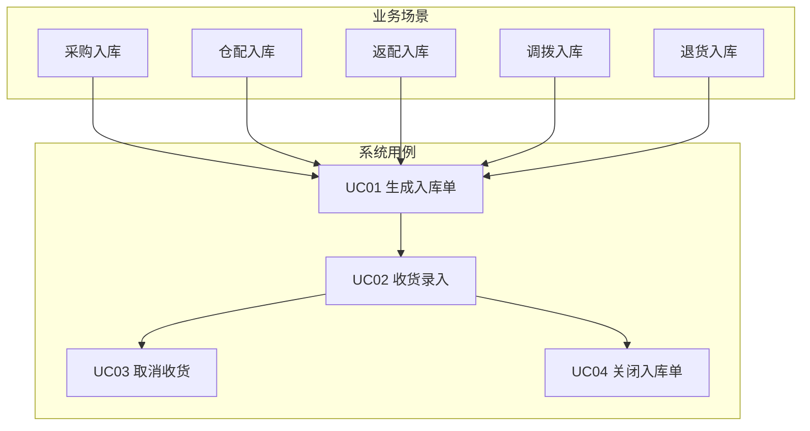
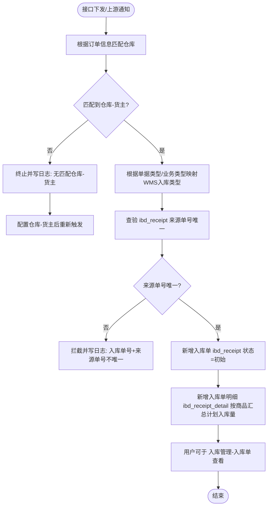
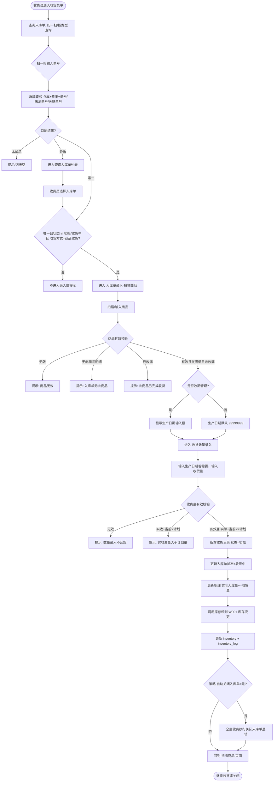
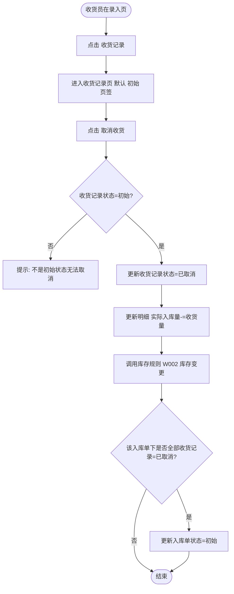
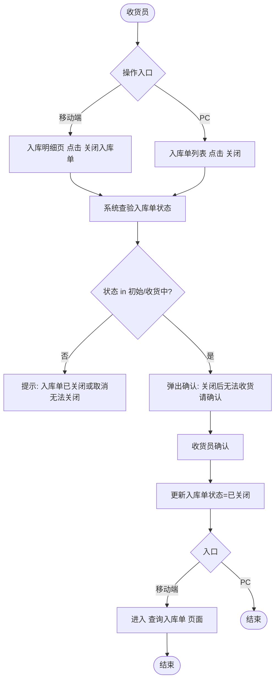
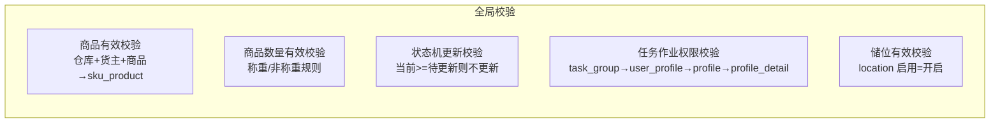
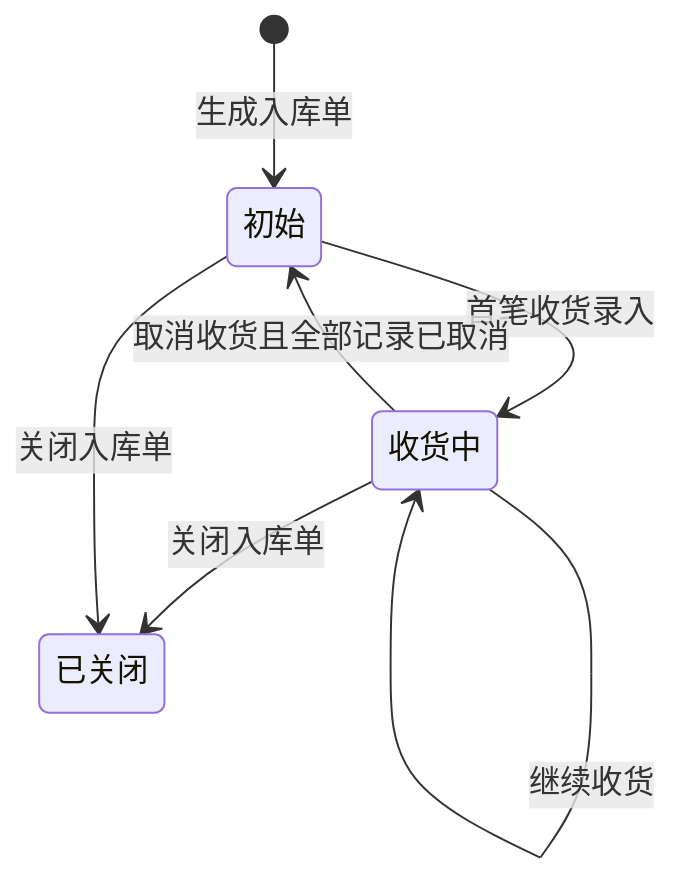

# 入库业务流程图

基于《需求说明-入库》文档整理的 Mermaid 格式流程图，可在支持 Mermaid 的 Markdown 预览或 [Mermaid Live Editor](https://mermaid.live) 中查看。

---

## 1. 入库业务总览

---

## 2. UC01 生成入库单

---

## 3. UC02 收货录入（按商品收货）

---

## 4. UC03 取消收货

---

## 5. UC04 关闭入库单

---

## 6. 全局校验（引用关系）

以下校验在文档「全局说明」中定义，在收货录入等流程中被引用：

---

## 7. 入库单状态与主流程关系

---

以上流程图覆盖文档中的业务用例、系统用例（UC01～UC04）及主要/替代路径，可直接复制 Mermaid 代码块到支持 Mermaid 的编辑器中渲染查看。
