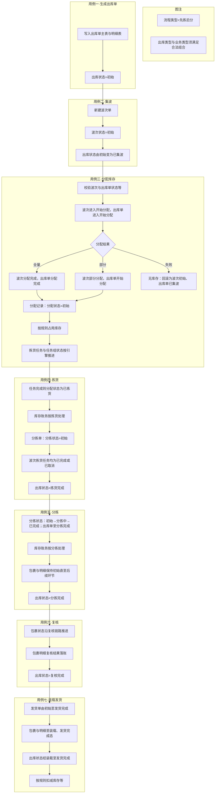
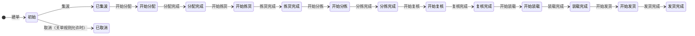

# 出库业务（先拣后分）业务流程图

> **依据**：《需求说明-出库》V1.0、《表设计-出库》、《系统枚举表》  
> **范围**：文档 **§5.2.1「拣货2B分拣发货（先拣后分）」** 及 **用例 01～07**；状态取值以《系统枚举表》为准。  
> **说明**：下文凡涉状态名、类型名均用中文；表名不采用物理库英文命名。

---

## 1. 状态与主流程对应（核心）

| 阶段 | 状态/类型（中文名） | 取值含义（顺序与系统一致） |
|------|---------------------|----------------------------|
| 流程前提 | 流程类型 = 先拣后分 | 拣货、分拣相关用例此前提成立 |
| 出库单头 | 出库状态 | 初始 → 已集波 → 开始分配 → 分配完成 → 开始拣货 → 拣货完成 → 开始分拣 → 分拣完成 → 开始复核 → 复核完成 → 开始装载 → 装载完成 → 开始发货 → 发货完成；**已取消**为终态分支 |
| 波次 | 波次状态 | 初始 → 开始分配 → **部分分配** → 分配完成；**已取消** |
| 分配记录 | 分配状态 | 初始  → 已拣货 → 已取消 |
| 任务组 / 任务 | 任务组状态 / 任务状态 | 任务组：初始 → 已释放 → 已指派 → 执行中 → 已完成 → 已取消；任务：含 **已完成**、**已取消** |
| 任务 | 任务类型 | **拣货任务**（与需求中移动端拣货一致） |
| 分拣单 | 分拣状态 | 初始 → 分拣中 → 已完成 |
| 包裹 | 包裹状态 | 初始 → 开始复核 → 复核完成 → 装载完成 → 发货完成 → 已取消 |
| 包裹明细 | 包裹明细状态 | 初始 → 复核完成 → 装载完成 → 发货完成 → 已取消 |
| 发货单 | 发货单状态 | 初始 → 发货完成 → 已取消 |
| 库存账务 | 库存来源类型（业务含义） | **拣货**、**分拣**（与需求中拣货移库、分拣移库一致） |

**出库类型与出库业务类型**在流程图上不逐段标注；须满足《系统枚举表》备注中的**合法组合**（如销售出库-直播订单、仓配出库-货到即配等），不可随意搭配。

---

## 2. 端到端主流程（泳道）

```mermaid
flowchart TB
    subgraph upstream["上游 / 集成"]
        A1[接收上游通知]
        A2[匹配仓库与货主]
        A3[映射上游单据类型至出库类型与业务类型]
        A4[(创建出库单及明细<br/>出库状态=初始)]
    end

    subgraph wh_pc["仓库电脑端"]
        B1[集波：按模板查询出库单]
        B2{待集波单据均为初始?}
        B3[按模板分组生成波次单]
        B4[(出库状态变为已集波<br/>回写波次信息)]
        C1[波次管理：勾选波次单]
        C2[分配库存，可定时自动]
        C3[匹配分配策略并执行分配]
        C4[(写入分配记录<br/>按库存规则占用库存)]
        C5[任务引擎：生成拣货任务与任务组]
    end

    subgraph mobile_pick["移动端·拣货（先拣后分）"]
        D1[领取拣货任务]
        D2[按储位与商品扫描执行拣货]
        D3[(按库存规则：释放占用并移至拣货目的储位<br/>库存来源类型为拣货)]
        D4[(生成或累加分拣单<br/>分拣状态=初始)]
        D5{波次下拣货任务是否全部完成?}
        D6[(出库状态=拣货完成)]
    end

    subgraph mobile_sort["移动端·分拣"]
        E1[扫描商品或站点或线路进入分拣]
        E2[目的储位与商品确认分拣量]
        E3[(按库存规则：分拣移库<br/>库存来源类型为分拣)]
        E4[(生成包裹与包裹明细<br/>包裹与明细均为初始)]
        E5{该分拣维度是否完成?}
        E6[(出库状态=分拣完成)]
  
    end

    subgraph mobile_check["移动端·复核"]
        F1[扫描站点]
        F2[包裹从初始经开始复核至复核完成]
        F3[(出库状态=复核完成)]
    end

    subgraph mobile_ship["移动端·装载发货"]
        G1[扫描车牌创建或进入发货单<br/>发货单状态=初始]
        G2[扫描包裹或站点装载至装载完成]
        G3[确认发货：发货单状态为发货完成，并按规则扣减库存]
        G4[(出库状态经开始发货至发货完成)]
    end

    subgraph close["运营关闭"]
        H1[关闭未全量发货的出库单等]
    end

    A1 --> A2 --> A3 --> A4
    A4 --> B1 --> B2
    B2 -->|是| B3 --> B4
    B2 -->|否| B1
    B4 --> C1 --> C2 --> C3 --> C4 --> C5
    C5 --> D1 --> D2 --> D3 --> D4 --> D5
    D5 -->|否| D2
    D5 -->|是| D6
    D6 --> E1 --> E2 --> E3 --> E4 --> E5
    E5 -->|未完成| E2
    E5 -->|完成| E6
    E6 --> F1 --> F2 --> F3
    F3 --> G1 --> G2 --> G3 --> G4
    G4 -.-> H1
```

---

## 3. 用例主路径（状态全中文）

---

## 4. 出库主状态机（出库状态）

与《系统枚举表》中**出库状态**顺序一致；需求全局说明「当前状态序号大于等于待更新状态则不更新」依赖该顺序，调整枚举时需同步规则。

## 
