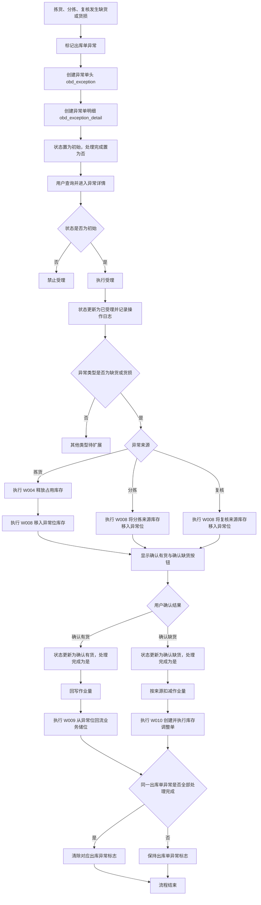
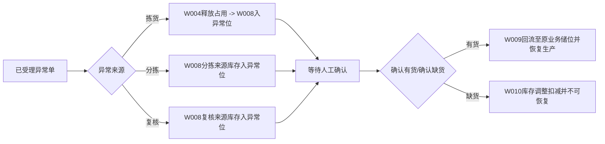
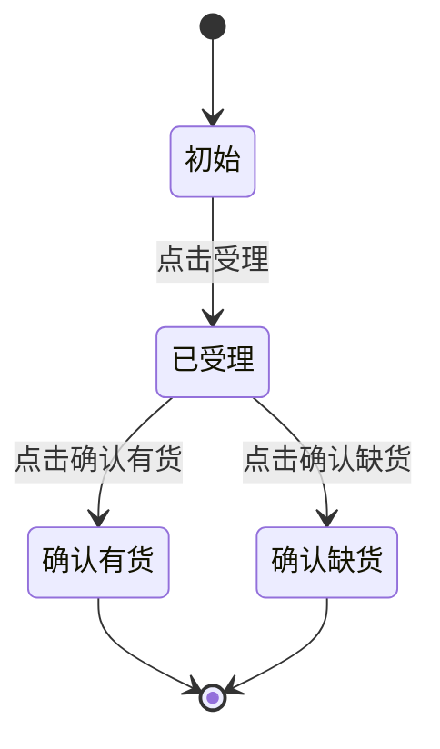

# 出库异常管理业务流程图

## 1. 文档目标与范围

基于以下需求文档进行分析输出：
- `需求说明-异常.md`
- `表设计-异常.md`

覆盖范围：
- 异常触发建单（UC01）
- 异常受理（UC02）
- 确认有货（UC03）
- 确认缺货（UC03）
- 相关库存规则（W004/W008/W009/W010）与日志链路

---

## 2. 业务主流程图（端到端）

---

## 3. 分来源处理流程图（受理后）

---

## 4. 状态机与按钮控制建议

建议的前端按钮可见性/可点击性：
- `初始`：仅`受理`可点击，`确认有货/确认缺货`置灰
- `已受理`：`确认有货/确认缺货`可点击，`受理`置灰
- `确认有货`或`确认缺货`：全部操作按钮隐藏/禁用（终态）
