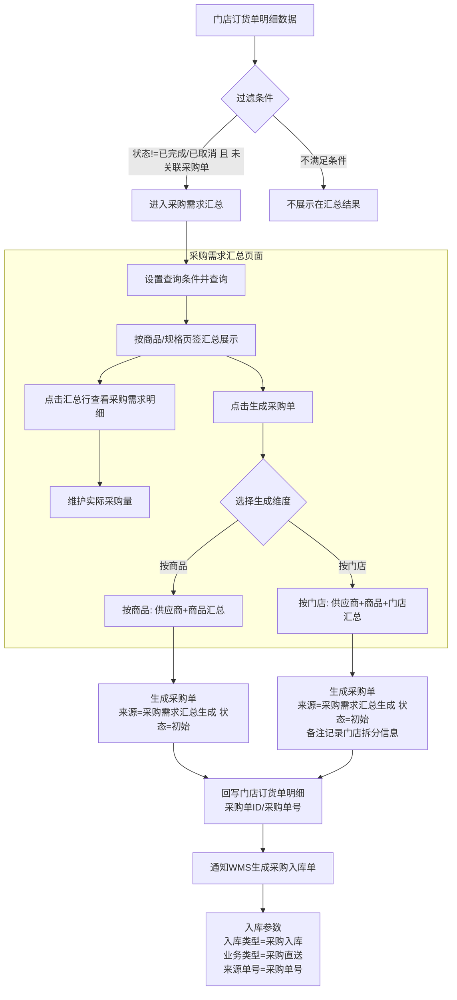
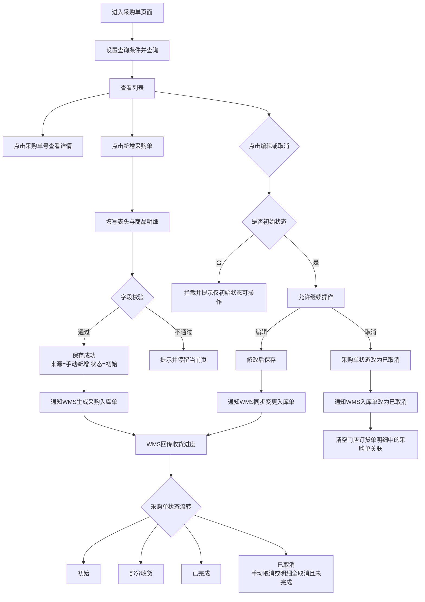

# 采购业务流程图

> 覆盖页面：`purchase_demand_summary.html`、`purchase_order.html`

## UC01 采购需求汇总（`purchase_demand_summary.html`）

```mermaid
flowchart TD
    A0[门店订货单明细数据] --> A1{过滤条件}
    A1 -->|状态!=已完成/已取消 且 未关联采购单| A2[进入采购需求汇总]
    A1 -->|不满足条件| A3[不展示在汇总结果]

    subgraph B[采购需求汇总页面]
        direction TB
        B1[设置查询条件并查询]
        B2[按商品/规格页签汇总展示]
        B3[点击汇总行查看采购需求明细]
        B4[维护实际采购量]
        B5[点击生成采购单]
        B6{选择生成维度}
        B7[按商品: 供应商+商品汇总]
        B8[按门店: 供应商+商品+门店汇总]
    end

    A2 --> B1 --> B2
    B2 --> B3 --> B4
    B2 --> B5 --> B6
    B6 -->|按商品| B7
    B6 -->|按门店| B8

    B7 --> C1[生成采购单<br/>来源=采购需求汇总生成 状态=初始]
    B8 --> C2[生成采购单<br/>来源=采购需求汇总生成 状态=初始<br/>备注记录门店拆分信息]
    C1 --> C3[回写门店订货单明细<br/>采购单ID/采购单号]
    C2 --> C3
    C3 --> C4[通知WMS生成采购入库单]
    C4 --> C5[入库参数<br/>入库类型=采购入库<br/>业务类型=采购直送<br/>来源单号=采购单号]
```

## UC02 采购单（`purchase_order.html`）

```mermaid
flowchart TD
    A0[进入采购单页面] --> A1[设置查询条件并查询]
    A1 --> A2[查看列表]
    A2 --> A3[点击采购单号查看详情]

    A2 --> B1[点击新增采购单]
    B1 --> B2[填写表头与商品明细]
    B2 --> B3{字段校验}
    B3 -->|通过| B4[保存成功<br/>来源=手动新增 状态=初始]
    B3 -->|不通过| B5[提示并停留当前页]
    B4 --> B6[通知WMS生成采购入库单]

    A2 --> C1{点击编辑或取消}
    C1 --> C2{是否初始状态}
    C2 -->|否| C3[拦截并提示仅初始状态可操作]
    C2 -->|是| C4[允许继续操作]

    C4 -->|编辑| C5[修改后保存]
    C5 --> C6[通知WMS同步变更入库单]

    C4 -->|取消| C7[采购单状态改为已取消]
    C7 --> C8[通知WMS入库单改为已取消]
    C8 --> C9[清空门店订货单明细中的采购单关联]

    B6 --> D1[WMS回传收货进度]
    C6 --> D1
    D1 --> D2{采购单状态流转}
    D2 --> D3[初始]
    D2 --> D4[部分收货]
    D2 --> D5[已完成]
    D2 --> D6[已取消<br/>手动取消或明细全取消且未完成]
```
