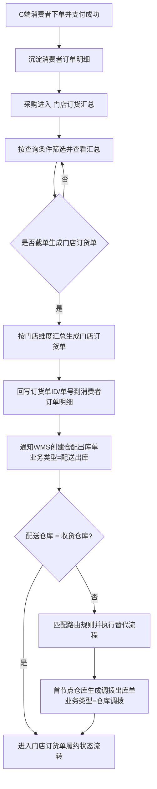
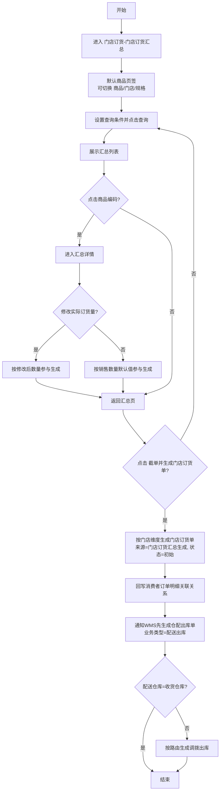
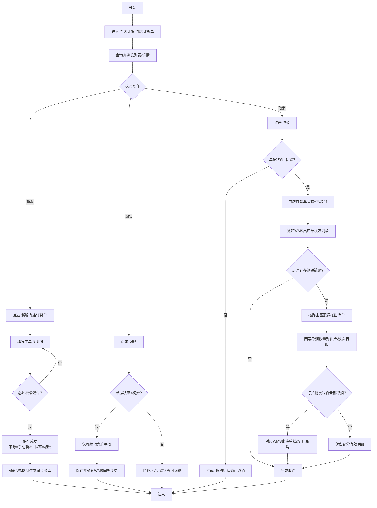
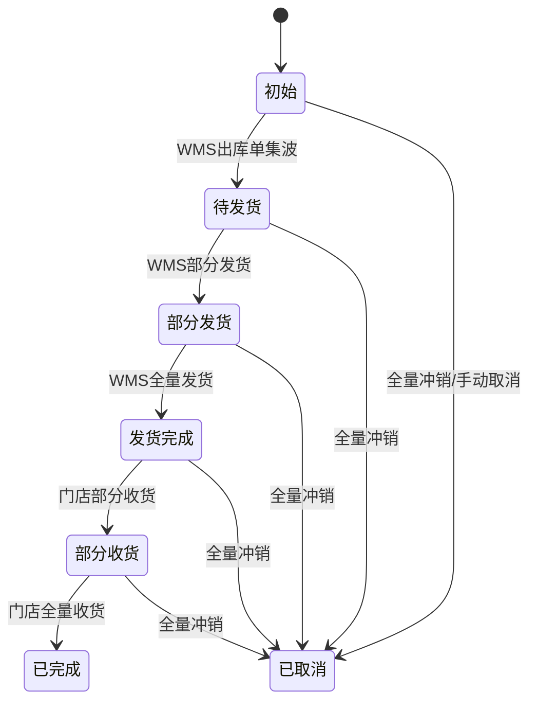

# 门店订货业务流程图

本文档基于 PRD《门店订货》与当前页面原型（`purchase_store_demand_summary.html`、`purchase_demand_summary.html`）整理，聚焦“门店订货汇总 → 门店订货单 → WMS出库联动”。

## 1. 全链路总览

## 2. UC01 门店订货汇总流程（截单并生成）

## 3. UC02 门店订货单流程（新增/编辑/取消）

## 4. 门店订货单状态流转

## 5. 关键规则摘录

- 数据来源：仅取 C 端下单并支付成功、且订单状态在`待发货/退款中`、且未关联门店订货单的订单明细。
- 汇总维度：页面支持`商品/门店/规格`查看，但生成门店订货单按门店维度汇总。
- 收货仓库规则：优先按路由规则匹配首个配送节点；匹配不到时收货仓库等于配送仓库。
- 订货单可编辑/可取消前提：仅`初始`状态允许。
- 取消联动：取消门店订货单时需同步变更 WMS 出库单与波次单已取消量，必要时将对应出库单置为`已取消`。
