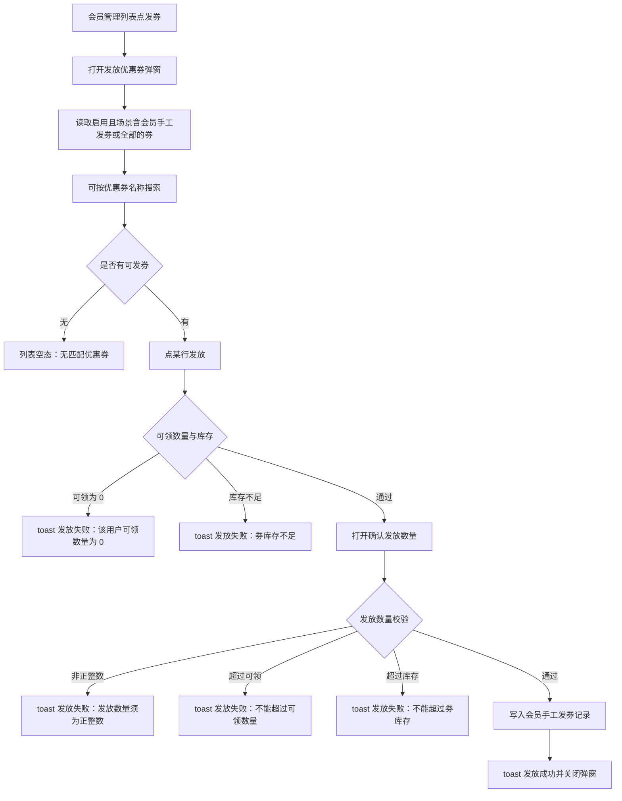
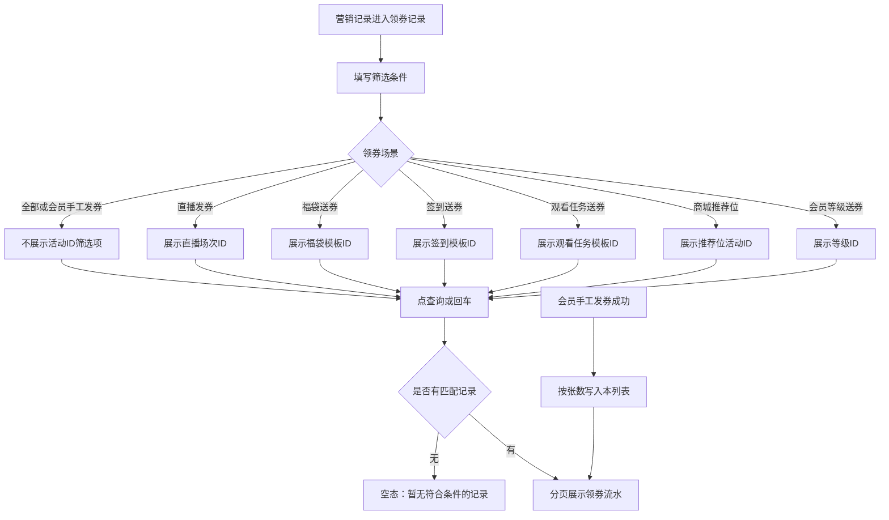
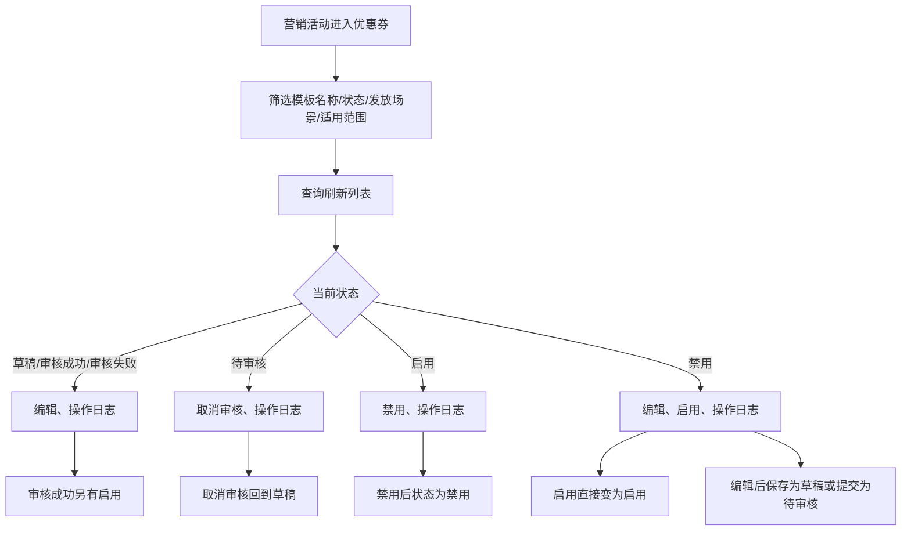
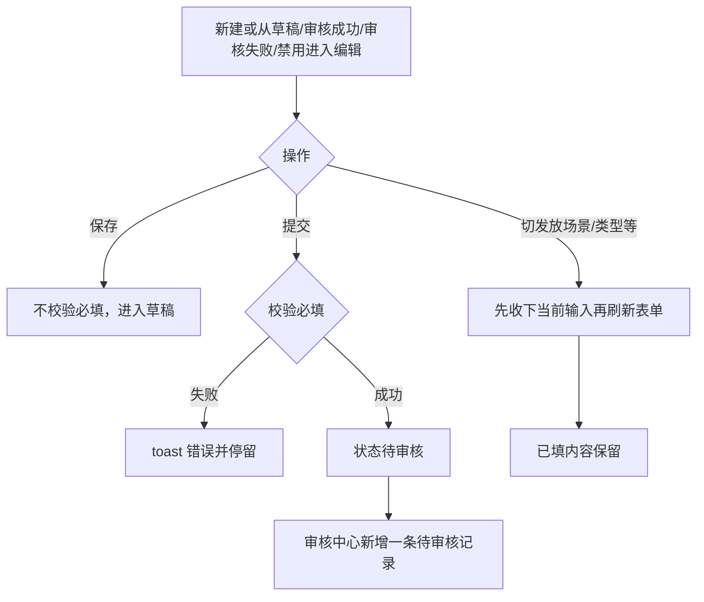
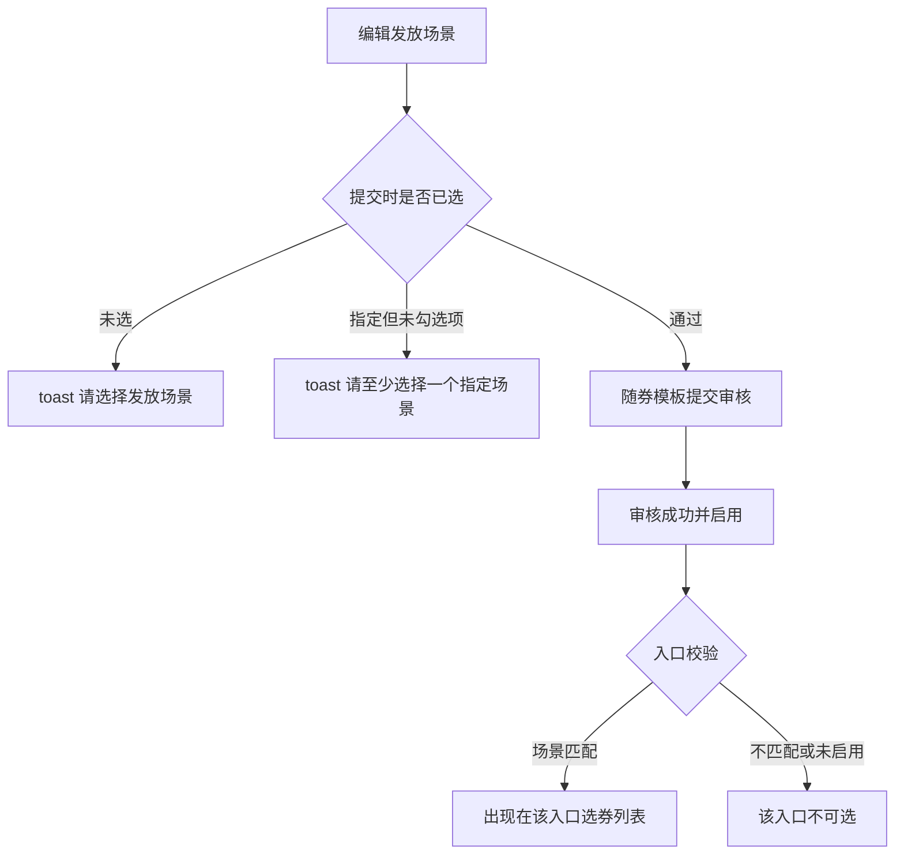
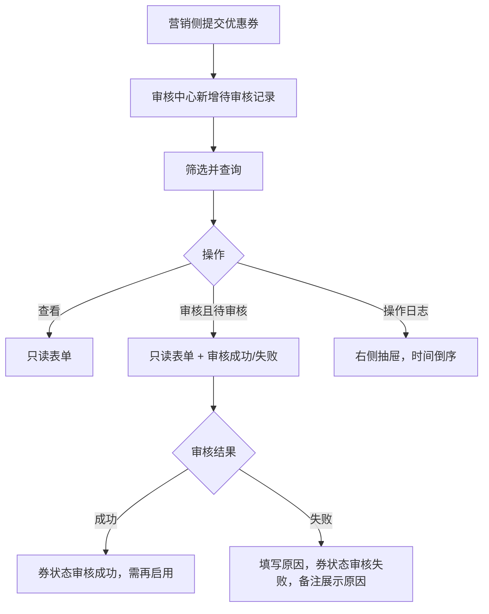
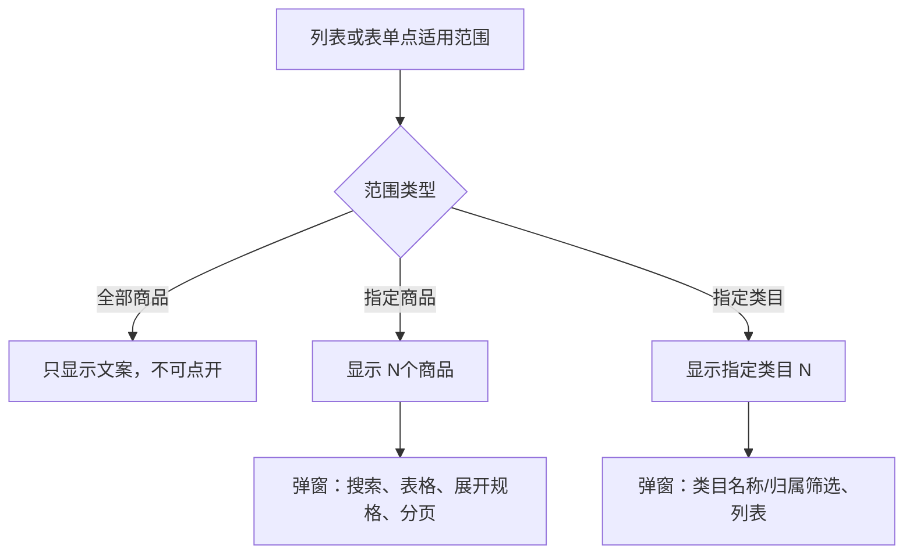
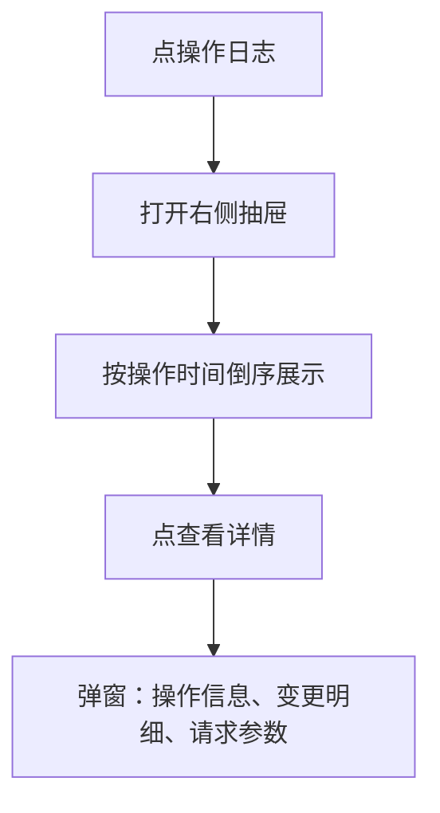
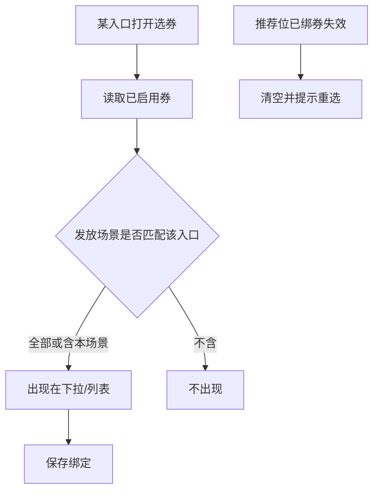
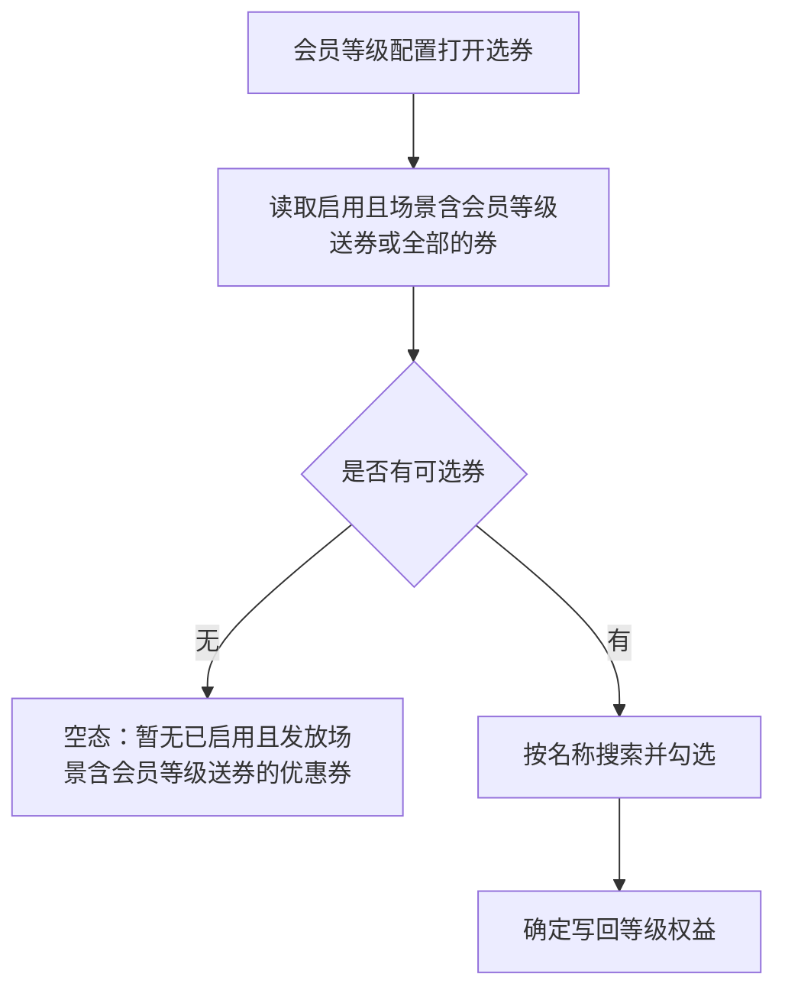

# 【23】会员发券以及优惠券增加审核

来源清单：`merged-20260907-02`（大版本 `2026090502优惠券` 小版本 `.1`～`.6`）+ `2026090502.7`（优惠券增加独立禁用状态）+ `2026090502.9`（发放场景与领券场景拆成七项并对齐活动 ID）

会员发券业务口径来源：[飞书文档 · 会员发券](https://lcnohxg915u5.feishu.cn/wiki/DqcEwOvYAiBw38k6XQncslxPn2g)。文档需登录才能打开原文；本章节按该文档对应的会员管理发券、营销记录-领券记录原型落地，并与优惠券模板审核、发放场景一并说明。

# 1. 后台业务 WEB 系统

## 1.1 概述

### 需求背景

优惠券原先作为营销模版配置里的一种模板类型，与福袋、签到、观看任务混在同一列表，没有独立状态机，也没有审核。运营发券入口只要券启用就能选，无法按场景隔离；后来虽有发放场景，福袋/签到/观看任务仍共用「营销送券」，会员管理发券叫「会员发券」，领券记录只有直播/福袋/签到/后台人工四项。本期按合并清单 `merged-20260907-02` 把优惠券拆成营销活动独立菜单，增加草稿 / 待审核 / 审核成功 / 审核失败 / 启用 / 禁用，提交后进入审核中心；发放场景与领券场景对齐为七项（直播发券、福袋送券、签到送券、观看任务送券、商城推荐位、会员等级送券、会员手工发券），启用且场景匹配的券才出现在对应入口；会员管理发券读取「会员手工发券」场景的券，按领取限制与库存确认发放数量，写入领券记录。从启用点禁用后为独立「禁用」状态，不再回到审核成功。

### 需求目标

1. 营销活动第一条为「优惠券」独立列表：筛选、状态矩阵、操作全部展开、适用商品/类目可点开查看、操作日志倒序。
2. 新建/编辑支持保存草稿（不校验必填）与提交（校验全部必填）；提交后生成审核记录。
3. 审核中心「营销审核 → 优惠券」可筛选（含审核状态）、查看、审核、看操作日志。
4. 发放场景提交必填：全部，或指定场景多选（直播发券、福袋送券、签到送券、观看任务送券、商城推荐位、会员等级送券、会员手工发券）。仅启用且场景匹配的券出现在对应入口。发放场景与领券记录的领券场景文案一致。
5. 会员管理发券：选券受发放场景控制（含「会员手工发券」或全部）；确认发放数量不能超过该用户可领数量和券库存；成功写入「会员手工发券」记录，活动 ID 为空。口径对齐飞书文档《会员发券》。
6. 营销记录-领券记录可按用户、领券场景、活动 ID、状态查询全渠道领券流水；选非「会员手工发券」时出现对应活动 ID 筛选项。会员手工发券写入的记录在此可见。
7. 编辑页字段行与其它 MDM 编辑页一致（标签 168px、控件 36px）；切单选/下一栏时已填内容不丢失。
8. 仅从启用点禁用后状态为「禁用」：可再启用，或编辑后保存为草稿、提交为待审核；列表状态筛选含禁用。审核成功未启用不是禁用。

## 1.2 管理范围

| 终端 | 模块 | 变更类型 |
|------|------|----------|
| B 端 MDM | 会员管理 · 发放优惠券 | 修改 |
| B 端 MDM | 营销记录 · 领券记录 | 修改 |
| B 端 MDM | 营销活动 · 优惠券列表 | 新增 |
| B 端 MDM | 营销活动 · 新建/编辑优惠券 | 新增 |
| B 端 MDM | 审核中心 · 营销审核 · 优惠券 | 新增 |
| B 端 MDM | 营销模版 · 模版配置 | 修改 |
| B 端 MDM | 直播场次 · 关联优惠券 | 修改 |
| B 端 MDM | 直播中控 · 发券选券 | 修改 |
| B 端 SCM | 基础设置 · 推荐位配置 | 修改 |
| B 端 MDM | 会员等级 · 等级权益选券 | 修改 |

本期不做：

- 不改 C 端用户 APP 领券界面（清单未涉及）
- 不改直播中控每轮每人限领、同一时刻只发一场（另见【659】）
- 无单独权限点（沿用各菜单操作账号）

## 1.3 需求详细说明

### 1.3.1 会员发券

#### 1.3.1.1 功能点：会员管理向指定会员发放优惠券

运营在会员管理列表对某一会员点「发券」，从已启用且发放场景含「会员手工发券」（或发放场景为全部）的券模板中选择，填写发放数量后写入该会员的优惠券记录。业务口径见飞书文档：[会员发券](https://lcnohxg915u5.feishu.cn/wiki/DqcEwOvYAiBw38k6XQncslxPn2g)。

#### 1.3.1.2 功能流程图

需要说明的问题：

- 飞书 wiki 需登录，本 PRD 按原型落地的发券弹窗、数量确认与记录写入描述；原文以飞书文档为准。
- 可领数量 = 券模板领取限制 − 该会员已领该券张数；领取限制为「不限」时显示「不限」。
- 一次发放 N 张会写入 N 条营销记录，领取方式为「会员手工发券」，活动 ID 为空。
- 仅启用状态的券会出现在弹窗；草稿 / 待审核 / 审核成功未启用 / 审核失败 / 禁用均不可选。

#### 1.3.1.3 功能描述

| 项 | 内容 |
|----|------|
| 功能类型 | 查询数据 / 新增数据 |
| 功能描述 | 向指定会员发放优惠券，校验可领数量与库存后写入会员手工发券记录 |
| 前提业务 | 券模板已审核成功并启用，发放场景含会员手工发券或全部 |
| 后继业务 | 营销记录-领券记录、会员详情优惠券均可见「会员手工发券」；券剩余库存扣减 |
| 功能约束 | 可领为 0 或库存为 0 不可进入确认数量 |
| 约束描述 | 无单独权限点 |
| 操作权限 | 会员管理操作账号 |

#### 1.3.1.4 界面设计

**1. 界面原型**

- 原型文件：`MDM/mdm_member_c.html`
- 本地预览：`http://localhost:5173/MDM/mdm_member_c`
- 布局：
  - 会员列表操作列点「发券」打开弹窗，标题「发放优惠券」
  - Tab：商品优惠券
  - 搜索：优惠券名称输入框 +「搜索」；回车等同搜索
  - 表格列：优惠券名称、券面值、门槛、适用渠道、有效期、领取限制、可领数量、剩余库存、操作「发放」
  - 空态：「无匹配优惠券」；底部分页每页 10 条
  - 点「发放」后嵌套弹窗「确认发放数量」：优惠券、可领数量、剩余库存只读；发放数量必填，默认 1，提示「不能超过该用户可领数量，也不能大于券库存」；取消 / 确定
  - 失败 toast 前缀「发放失败：」；成功 toast「发放成功」

#### 数据要求

| 字段名称 | 长度 | 录入方式 | 是否非空项 | 默认显示 |
|----------|------|----------|------------|----------|
| 优惠券名称（搜索） | - | 文本框 | N | 空，占位「请输入优惠券名称」 |
| 优惠券 | - | 只读展示 | Y | 所选券名称 |
| 可领数量 | - | 只读展示 | Y | 剩余可领张数或「不限」 |
| 剩余库存 | - | 只读展示 | Y | 券模板剩余库存 |
| 发放数量 | 正整数 | 文本框（数字） | Y | 1 |

#### 1.3.1.5 逻辑描述

1. 打开发券弹窗时读取优惠券模板：状态为启用，且发放场景为全部或指定场景勾选了「会员手工发券」。不含该场景的券不出现。
2. 按优惠券名称模糊搜索，分页刷新。过期演示券不展示。
3. 可领数量按该会员已领该券张数扣减领取限制；点「发放」时若可领为 0 或库存为 0，toast 失败原因，不打开确认弹窗。
4. 发放数量须为正整数；不能超过当前可领数量和剩余库存；输入超过上限时自动截到上限。
5. 确定后按数量写入营销记录-领券记录（领取方式「会员手工发券」、活动 ID 空、操作人写入备注），扣减弹窗内展示库存，关闭弹窗并 toast「发放成功」。见 1.3.2。
6. 与变更前差异：原先弹窗使用固定演示券列表，不读取券模板，也不按发放场景过滤；写入记录曾叫「后台人工发券」。

### 1.3.2 营销记录 · 领券记录

#### 1.3.2.1 功能点：查询全渠道领券流水

运营在营销记录「领券记录」查看用户领取/被发放的优惠券流水。会员管理手工发券成功后，按发放张数写入本列表（领券场景为「会员手工发券」）。同时收录直播发券、福袋送券、签到送券、观看任务送券、商城推荐位、会员等级送券。业务口径见飞书文档：[会员发券](https://lcnohxg915u5.feishu.cn/wiki/DqcEwOvYAiBw38k6XQncslxPn2g)。

#### 1.3.2.2 功能流程图

需要说明的问题：

- 一笔记录对应一张券。会员手工发券一次发 N 张，本列表新增 N 行，记录 ID 前缀为 `MR` + 日期。
- 会员手工发券的活动 ID 为空，列表展示「—」；备注为操作人「姓名 / 账号」。
- 核销关联订单可有多条，换行展示；核销后退货退回后状态可回到未使用，原订单号仍保留。
- 「待使用」与「未使用」视为同一状态，列表统一展示「未使用」。
- 发放场景与领券场景文案一致，共七项：直播发券、福袋送券、签到送券、观看任务送券、商城推荐位、会员等级送券、会员手工发券。旧文案「福袋发券 / 签到发券 / 后台人工发券 / 后台手工发券」进入页面后按新文案展示。

#### 1.3.2.3 功能描述

| 项 | 内容 |
|----|------|
| 功能类型 | 查询数据 |
| 功能描述 | 按用户、领券场景、活动、状态查询领券流水；承接会员管理写入的会员手工发券记录 |
| 前提业务 | 用户已领券或运营已人工发券 |
| 后继业务 | 会员详情优惠券 Tab 读取同一套记录 |
| 功能约束 | 本页只读，不提供作废/补发 |
| 约束描述 | 无单独权限点 |
| 操作权限 | 营销记录操作账号 |

#### 1.3.2.4 界面设计

**1. 界面原型**

- 原型文件：`MDM/mdm_marketing_mall_record.html`
- 本地预览：`http://localhost:5173/MDM/mdm_marketing_mall_record`
- 布局：
  - 侧栏：营销 / 营销记录 / 领券记录
  - 筛选：用户 ID、用户昵称、手机号、领券场景（全部 / 直播发券 / 福袋送券 / 签到送券 / 观看任务送券 / 商城推荐位 / 会员等级送券 / 会员手工发券）、状态（全部 / 未使用 / 已使用 / 已过期）；重置 / 查询
  - 领券场景与活动 ID 联动：直播发券→直播场次ID；福袋送券→福袋模板ID；签到送券→签到模板ID；观看任务送券→观看任务模板ID；商城推荐位→推荐位活动ID；会员等级送券→等级ID；全部或会员手工发券时该筛选项隐藏
  - 会员详情优惠券 Tab 使用同一套领券场景与活动 ID 筛选
  - 表格列：记录 ID、用户 ID、用户昵称、手机号、优惠券名称、面额、门槛、模版 ID、领取时间、领券场景、活动 ID、状态、核销关联订单、备注
  - 空态：「暂无符合条件的记录」；底部分页每页默认 10 条
  - 无行内操作按钮

#### 数据要求

| 字段名称 | 长度 | 录入方式 | 是否非空项 | 默认显示 |
|----------|------|----------|------------|----------|
| 用户ID | - | 文本框 | N | 空，占位「请输入用户ID」 |
| 用户昵称 | - | 文本框 | N | 空，占位「请输入昵称」 |
| 手机号 | - | 文本框 | N | 空，占位「请输入手机号」 |
| 领券场景 | - | 下拉 | N | 全部 |
| 直播场次ID / 福袋模板ID / 签到模板ID / 观看任务模板ID / 推荐位活动ID / 等级ID | - | 下拉 | N | 随领券场景出现，默认全部 |
| 状态 | - | 下拉 | N | 全部 |
| 记录ID | - | 只读展示 | Y | 如 MR20260801001 |
| 优惠券名称 | - | 只读展示 | Y | 券模板名称 |
| 面额 | - | 只读展示 | Y | 如 5元 |
| 门槛 | - | 只读展示 | Y | 如 50元 / 无门槛 |
| 模版ID | - | 只读展示 | Y | 券模板 ID |
| 领取时间 | - | 只读展示 | Y | 发券/领取时刻 |
| 活动ID | - | 只读展示 | N | 随场景为场次/模板/推荐位/等级 ID；会员手工发券为 — |
| 核销关联订单 | - | 只读展示 | N | 无则 —；多单换行 |
| 备注 | - | 只读展示 | N | 会员手工发券为操作人姓名 / 账号；其它为 — |

#### 1.3.2.5 逻辑描述

1. 进入页面加载全部领券记录。用户 ID、昵称模糊匹配；手机号包含匹配；领券场景、状态精确匹配。
2. 领券场景切到直播发券 / 福袋送券 / 签到送券 / 观看任务送券 / 商城推荐位 / 会员等级送券时，展示对应活动 ID 下拉（选项来自演示 ID 与已有记录）；切回全部或会员手工发券时隐藏该条件，查询不再带活动 ID。
3. 点查询或在筛选区回车刷新列表并回到第 1 页；点重置清空全部条件并隐藏活动 ID。
4. 会员管理发券成功：按发放数量逐张写入，领券场景「会员手工发券」，活动 ID 空，状态默认未使用，备注「操作人姓名 / 账号」，核销关联订单空。本页刷新后即可查到。
5. 状态徽章：未使用为成功色，已使用为灰色，已过期为警告色。
6. 与变更前差异：领券场景由四项（直播发券、福袋发券、签到发券、后台人工发券）改为与发放场景一致的七项；福袋/签到改称「送券」；会员手工发券不再叫后台人工发券；新增观看任务、商城推荐位、会员等级及对应活动 ID。

### 1.3.3 优惠券列表

#### 1.3.3.1 功能点：营销活动独立优惠券菜单与状态操作

优惠券从模版配置拆出，作为营销活动第一条。列表按状态展示可用操作，操作按钮全部直接展开，不再收入「更多」。

#### 1.3.3.2 功能流程图

需要说明的问题：

- 审核失败时备注展示最近一次失败原因。
- 启用后的券才会按发放场景出现在各发券入口；禁用后从各入口消失，再启用后按发放场景重新出现。
- 只有从启用点禁用才会进入禁用；审核成功未启用不是禁用。
- 状态矩阵与操作一一对应，列表不展示「查看」入口（查看走审核中心）。

#### 1.3.3.3 功能描述

| 项 | 内容 |
|----|------|
| 功能类型 | 查询数据 / 更新数据 |
| 功能描述 | 优惠券模板列表、筛选、按状态操作（编辑/取消审核/启用/禁用/操作日志） |
| 前提业务 | 营销活动菜单权限 |
| 后继业务 | 新建/编辑、审核中心记录、各端选券 |
| 功能约束 | 待审核不可编辑；启用中须先禁用再编辑；禁用可编辑或直接再启用 |
| 约束描述 | 无 |
| 操作权限 | 营销活动操作账号 |

#### 1.3.3.4 界面设计

**1. 界面原型**

- 原型文件：`MDM/mdm_marketing_coupon.html`
- 本地预览：`http://localhost:5173/MDM/mdm_marketing_coupon`
- 布局：
  - 顶栏业务提示：保存进草稿、提交进待审核、启用后按发放场景出现在直播发券、福袋送券、签到送券、观看任务送券、商城推荐位、会员等级送券、会员手工发券的选券列表中；从启用禁用后进入禁用，可再启用或编辑
  - 筛选：模板名称（券名称或模板 ID）、状态、发放场景、适用范围；重置 / 查询
  - 「新建优惠券」
  - 表格：模板 ID、券名称、券面值、券门槛、适用渠道、适用商品、创建时间、状态、备注、操作
  - 适用商品：全部商品文案；指定类目「指定类目（N）」可点开；指定商品「N个商品」可点开
  - 操作列当前状态可用按钮全部平铺（如审核成功：编辑、启用、操作日志；禁用：编辑、启用、操作日志）
  - 右侧操作日志抽屉，样式同模版配置

#### 数据要求

| 字段名称 | 长度 | 录入方式 | 是否非空项 | 默认显示 |
|----------|------|----------|------------|----------|
| 模板名称 | - | 文本框 | N | 空 |
| 状态 | - | 下拉 | N | 全部（草稿/待审核/审核成功/审核失败/启用/禁用） |
| 发放场景 | - | 下拉 | N | 全部（直播发券/福袋送券/签到送券/观看任务送券/商城推荐位/会员等级送券/会员手工发券） |
| 适用范围 | - | 下拉 | N | 全部（全部商品/指定商品/指定类目） |

#### 1.3.3.5 逻辑描述

1. 查询按模板名称/ID、状态、发放场景、适用范围过滤；重置清空条件。状态筛选含禁用。
2. 草稿 / 审核成功 / 审核失败 / 禁用可编辑；待审核点取消审核回到草稿；审核成功可启用；启用点禁用后状态为禁用（确认文案：禁用后不可被发放场景选择），不再回到审核成功。
3. 禁用点启用直接变为启用；禁用点编辑进入编辑页。均有操作日志。
4. 操作列不再把超出两个的按钮收进「更多」。
5. 与变更前差异：原先优惠券在模版配置里与其它模板类型混排，无本状态机；启用点禁用曾回到审核成功，没有独立禁用状态。

### 1.3.4 新建 / 编辑优惠券

#### 1.3.4.1 功能点：保存草稿、提交待审核与表单填写

新建/编辑底栏提供保存、提交。保存进入草稿且不校验必填；提交校验全部必填后进入待审核，并在审核中心生成一条待审核记录。从禁用进入编辑后同样按保存/提交变为草稿或待审核。字段行对齐其它编辑页；切换单选时已填内容保留。

#### 1.3.4.2 功能流程图

需要说明的问题：

- 查看 / 审核模式字段只读；审核底栏为审核失败 / 审核成功。
- 启用中的券须先禁用再编辑；待审核券不可编辑；禁用可直接编辑。
- 整页编辑用 `pts-rule-field` / `erp-input`（36px），不要套弹窗 32px 字段行。

#### 1.3.4.3 功能描述

| 项 | 内容 |
|----|------|
| 功能类型 | 新增数据 / 更新数据 |
| 功能描述 | 维护券模板：草稿保存、提交审核；编辑页布局与输入保留 |
| 前提业务 | 从优惠券列表新建或编辑 |
| 后继业务 | 审核中心审核；启用后各端选券 |
| 功能约束 | 提交须填齐必填；草稿不校验 |
| 约束描述 | 无 |
| 操作权限 | 营销活动操作账号 |

#### 1.3.4.4 界面设计

**1. 界面原型**

- 原型文件：`MDM/mdm_marketing_coupon_form.html`
- 本地预览：`http://localhost:5173/MDM/mdm_marketing_coupon_form`
- 布局：
  - 返回优惠券（审核入口则返回优惠券审核）
  - 业务提示：保存进草稿、提交生成待审核记录；禁用状态编辑后同样按保存/提交变为草稿或待审核
  - 字段行：标签 168px 右对齐，输入框/下拉高度 36px，单选与标签同一行高
  - 底栏固定：取消、保存、提交（审核模式改为审核失败 / 审核成功）
  - 审核失败弹窗填写失败原因

#### 数据要求

| 字段名称 | 长度 | 录入方式 | 是否非空项 | 默认显示 |
|----------|------|----------|------------|----------|
| 券名称 | 最多 50 | 文本框 | 提交时 Y | 空 |
| 发放场景 | - | 单选：全部 / 指定场景；指定时多选 | 提交时 Y，无默认 | 空 |
| 优惠券类型 | - | 下拉：满减 / 无门槛 | Y | 满减 |
| 减免条件 | - | 文本框（消费金额、减免金额） | 提交时 Y | 空 |
| 适用渠道 | - | 单选：全部渠道 / 仅直播 / 仅商城 | Y | 全部渠道 |
| 可用时间 | - | 单选：不限 / 指定时间 | 指定时起止 Y | 不限 |
| 适用商品 | - | 单选：全部商品 / 指定商品 / 指定类目 | 指定时须选完 | 全部商品 |
| 领取上限 | - | 下拉：不限 / 每人 N 次 | N | 不限 |
| 发放数量 | 最多 8 位正整数 | 文本框 | 提交时 Y | 空 |

#### 1.3.4.5 逻辑描述

1. 保存：直接写入草稿，toast「已保存为草稿」，回到列表。不校验名称、场景、库存等。从禁用进入编辑后保存，状态同样变为草稿。
2. 提交校验：券名称、发放场景（指定场景至少勾一项）、发放数量为正整数且最多 8 位、满减金额与门槛、无门槛减免金额、指定时间起止、指定商品/类目已选。失败 toast 对应文案并停留。
3. 提交成功：状态待审核，审核中心新增待审核记录，toast「已提交，进入待审核」。从禁用进入编辑后提交，同样变为待审核。
4. 填写过程中点发放场景、改优惠券类型、选适用商品等会刷新表单时，先收下当前输入再重绘，已填内容不丢失。
5. 与变更前差异：原先在模版配置弹窗里编辑，无草稿/提交；编辑页曾套 32px 弹窗行且切栏会冲掉输入；启用点禁用曾回到审核成功后再编辑，没有从独立禁用状态保存/提交。

### 1.3.5 发放场景

#### 1.3.5.1 功能点：按场景控制各端能否选该券

发放场景决定券能否被直播场次、福袋、签到、观看任务、商城推荐位、会员等级、会员手工发券选择。选「全部」则所有入口可选；选指定场景则仅勾选的入口可选。仅启用状态会出现在对应入口。发放场景与领券记录的领券场景文案一致。

#### 1.3.5.2 功能流程图

需要说明的问题：

- 指定场景七项与领券场景一一对应，不再用「营销送券」覆盖福袋、观看任务、签到。
- 直播场次与直播中控发券均按「直播发券」场景过滤。
- 会员等级配置选券按「会员等级送券」过滤；会员管理发券按「会员手工发券」过滤。

#### 1.3.5.3 功能描述

| 项 | 内容 |
|----|------|
| 功能类型 | 更新数据 |
| 功能描述 | 配置券可用发放入口，启用后各端选券按场景过滤 |
| 前提业务 | 新建/编辑优惠券 |
| 后继业务 | 各端选券列表 |
| 功能约束 | 提交必填，无默认值 |
| 约束描述 | 无 |
| 操作权限 | 营销活动操作账号 |

#### 1.3.5.4 界面设计

**1. 界面原型**

- 原型文件：`MDM/mdm_marketing_coupon_form.html`
- 本地预览：`http://localhost:5173/MDM/mdm_marketing_coupon_form`
- 布局：
  - 发放场景：全部 / 指定场景
  - 指定场景多选：直播发券、福袋送券、签到送券、观看任务送券、商城推荐位、会员等级送券、会员手工发券
  - 字段下提示：发放场景决定该券能否被直播场次、福袋、签到、观看任务、商城推荐位、会员等级、会员手工发券选择

#### 数据要求

| 字段名称 | 长度 | 录入方式 | 是否非空项 | 默认显示 |
|----------|------|----------|------------|----------|
| 发放场景模式 | - | 单选 | 提交时 Y | 空（无默认） |
| 指定场景 | - | 多选 | 指定模式下 Y | 空 |

#### 1.3.5.5 逻辑描述

1. 未选发放场景提交：toast「请选择发放场景」。
2. 指定场景但未勾任何项：toast「请至少选择一个指定场景」。
3. 启用后：`issueSceneMode=ALL` 或指定列表含对应场景码时，该入口 `listSelectable` 才返回该券。场景码：LIVE 直播发券、BAG 福袋送券、SIGNIN 签到送券、WATCH 观看任务送券、MALL 商城推荐位、LEVEL 会员等级送券、MEMBER 会员手工发券。禁用后不再出现在各入口；再启用后按场景重新出现。
4. 与变更前差异：原先选券只要求启用；后来虽有发放场景，福袋/签到/观看任务共用营销送券，会员管理叫会员发券，没有会员等级送券。

### 1.3.6 优惠券审核

#### 1.3.6.1 功能点：审核中心营销审核优惠券

每次营销侧提交都会生成一条审核记录。审核列表可按券模板 ID、券名称、券面值、适用渠道、审核状态筛选。待审核可审核；均可查看与看操作日志。查看/审核打开与新建/编辑同一套券模板表单。

#### 1.3.6.2 功能流程图

需要说明的问题：

- 审核通过后状态为「审核成功」，不会自动启用。
- 审核失败必须填写原因。
- 营销侧取消审核后，对应审核记录为「取消审核」。

#### 1.3.6.3 功能描述

| 项 | 内容 |
|----|------|
| 功能类型 | 查询数据 / 更新数据 |
| 功能描述 | 审核券模板提交记录：查看、通过、驳回、操作日志 |
| 前提业务 | 营销活动已提交优惠券 |
| 后继业务 | 审核成功后运营启用；失败后可编辑再提交 |
| 功能约束 | 仅待审核可点审核 |
| 约束描述 | 无 |
| 操作权限 | 审核中心操作账号 |

#### 1.3.6.4 界面设计

**1. 界面原型**

- 原型文件：`MDM/mdm_audit_coupon.html`、`MDM/mdm_marketing_coupon_form.html`
- 本地预览：`http://localhost:5173/MDM/mdm_audit_coupon`
- 布局：
  - 路径：审核中心 / 营销审核 / 优惠券
  - 筛选：券模板 ID、券名称、券面值、适用渠道、审核状态（全部 / 待审核 / 审核失败 / 审核成功）；重置 / 查询
  - 表格：券模板 ID、券名称、券面值、券门槛、适用渠道、适用商品、提交时间、审核状态、操作
  - 操作：查看、审核（仅待审核）、操作日志
  - 审核页底栏：审核失败（弹窗填原因）、审核成功（确认后通过）

#### 数据要求

| 字段名称 | 长度 | 录入方式 | 是否非空项 | 默认显示 |
|----------|------|----------|------------|----------|
| 券模板ID | - | 文本框 | N | 空 |
| 券名称 | - | 文本框 | N | 空 |
| 券面值 | - | 文本框 | N | 空 |
| 适用渠道 | - | 下拉 | N | 全部 |
| 审核状态 | - | 下拉 | N | 全部 |
| 审核失败原因 | - | 文本域 | 点审核失败时 Y | 空 |

#### 1.3.6.5 逻辑描述

1. 查询按五项条件过滤；重置清空含审核状态在内的全部条件。
2. 查看进入只读表单；审核仅待审核可进，确认通过后券为审核成功；失败须填原因。
3. 操作日志抽屉与模版配置一致，按操作时间倒序；可点查看详情（操作信息、变更明细、请求参数）。
4. 与变更前差异：原先无优惠券审核菜单，也不能按审核状态筛选。

### 1.3.7 适用商品与指定类目

#### 1.3.7.1 功能点：列表与审核页点开查看适用范围

指定商品显示商品数量，指定类目显示类目数量，均可点开弹窗查看。商品弹窗支持按名称、编码搜索，展开规格，每页 20 条。类目弹窗可按类目名称、类目归属筛选。

#### 1.3.7.2 功能流程图

需要说明的问题：

- 营销列表、审核列表、查看/审核页共用同一套弹窗。
- 商品搜索含规格编码。

#### 1.3.7.3 功能描述

| 项 | 内容 |
|----|------|
| 功能类型 | 查询数据 |
| 功能描述 | 查看券已选商品或类目明细 |
| 前提业务 | 券已配置指定商品或指定类目 |
| 后继业务 | 无 |
| 功能约束 | 只读查看 |
| 约束描述 | 无 |
| 操作权限 | 营销 / 审核操作账号 |

#### 1.3.7.4 界面设计

**1. 界面原型**

- 原型文件：`MDM/mdm_marketing_coupon.html`、`MDM/mdm_audit_coupon.html`、`MDM/mdm_marketing_coupon_form.html`
- 本地预览：`http://localhost:5173/MDM/mdm_marketing_coupon`
- 布局：
  - 指定商品弹窗：商品名称、商品编码两个筛选项有标题且同一行，查询/重置在右侧；列：商品图片、商品名称、规格数量；点规格数量展开已选规格；每页 20 条
  - 指定类目弹窗：类目名称、类目归属（不限/商城/直播）；列：序号、类目名称、类目归属

#### 数据要求

| 字段名称 | 长度 | 录入方式 | 是否非空项 | 默认显示 |
|----------|------|----------|------------|----------|
| 商品名称 | - | 文本框 | N | 空 |
| 商品编码 | - | 文本框 | N | 空 |
| 类目名称 | - | 文本框 | N | 空 |
| 类目归属 | - | 下拉 | N | 不限 |

#### 1.3.7.5 逻辑描述

1. 点数量文案打开对应弹窗；搜索后刷新；展开只展示该券已选规格。
2. 与变更前差异：原先把规格名称顿号拼接在格子里，指定类目不能点开；商品弹窗筛选项挤在一起。

### 1.3.8 操作日志

#### 1.3.8.1 功能点：优惠券与审核记录操作日志

营销列表与审核列表的操作日志对齐模版配置：右侧抽屉、按操作时间倒序、方法展示请求方法与地址、结果为成功/失败标签、可查看详情。

#### 1.3.8.2 功能流程图

需要说明的问题：

- 日志覆盖创建、保存草稿、提交、取消审核、审核成功/失败、启用、禁用。禁用日志记录状态从启用变为禁用。

#### 1.3.8.3 功能描述

| 项 | 内容 |
|----|------|
| 功能类型 | 查询数据 |
| 功能描述 | 查看券模板操作轨迹 |
| 前提业务 | 已有操作记录 |
| 后继业务 | 无 |
| 功能约束 | 只读 |
| 约束描述 | 无 |
| 操作权限 | 营销 / 审核操作账号 |

#### 1.3.8.4 界面设计

**1. 界面原型**

- 原型文件：`MDM/mdm_marketing_coupon.html`、`MDM/mdm_audit_coupon.html`
- 本地预览：`http://localhost:5173/MDM/mdm_marketing_coupon`
- 布局：右侧抽屉标题「操作日志」；列：操作时间、操作内容、操作人、方法、结果、操作（查看详情）

#### 数据要求

| 字段名称 | 长度 | 录入方式 | 是否非空项 | 默认显示 |
|----------|------|----------|------------|----------|
| 操作时间 | - | 只读展示 | Y | 最新在上 |
| 操作内容 | - | 只读展示 | Y | 如提交审核、启用 |
| 操作人 | - | 只读展示 | Y | 当前操作账号 |
| 方法 | - | 只读展示 | Y | 请求方法与地址 |
| 结果 | - | 只读标签 | Y | 成功 / 失败 |

#### 1.3.8.5 逻辑描述

1. 打开抽屉加载该券日志，默认最新在上。
2. 查看详情弹出操作信息、变更明细、请求参数。
3. 与变更前差异：原先方法列写操作名称、结果纯文字、无详情、不保证倒序。

### 1.3.9 发放场景对各端选券

#### 1.3.9.1 功能点：模版配置、直播场次、直播中控、推荐位、会员等级按场景过滤

优惠券从模版配置拆出后，各入口只出对应发放场景的启用券：福袋→福袋送券，签到→签到送券，观看任务→观看任务送券，直播场次与中控→直播发券，商城推荐位→商城推荐位，会员等级→会员等级送券，会员管理发券→会员手工发券。不符合场景的已绑券需清空重选。

#### 1.3.9.2 功能流程图

需要说明的问题：

- 模版配置列表筛选与新增不再包含优惠券类型。
- 没有符合条件的券时，直播场次提示暂无。

#### 1.3.9.3 功能描述

| 项 | 内容 |
|----|------|
| 功能类型 | 查询数据 / 更新数据 |
| 功能描述 | 各发券入口只可选场景匹配的启用券 |
| 前提业务 | 券已启用且配置发放场景 |
| 后继业务 | 实际发券 / 领券 |
| 功能约束 | 未启用（含草稿/待审核/审核成功未启用/审核失败/禁用）或场景不匹配不可选 |
| 约束描述 | 无 |
| 操作权限 | 各菜单操作账号 |

#### 1.3.9.4 界面设计

**1. 界面原型**

- 原型文件：`MDM/mdm_marketing_template.html`、`MDM/mdm_live_session_form.html`、`MDM/mdm_live_control.html`、`SCM/basic_settings_recommendation.html`、`MDM/mdm_member_level_form.html`
- 本地预览：
  - `http://localhost:5173/MDM/mdm_marketing_template`
  - `http://localhost:5173/MDM/mdm_live_session_form`
  - `http://localhost:5173/MDM/mdm_live_control?sessionId=sess-001`
  - `http://localhost:5173/SCM/basic_settings_recommendation`
  - `http://localhost:5173/MDM/mdm_member_level_form`
- 布局：
  - 模版配置：模板类型仅福袋、签到、观看任务；选券下拉按模板类型分别过滤福袋送券 / 签到送券 / 观看任务送券
  - 直播场次：营销模板-优惠券下拉过滤直播发券
  - 直播中控发券选券同样过滤直播发券
  - 推荐位：每行关联优惠券下拉；页顶提示只能关联已启用且场景含商城推荐位（或全部）的券
  - 会员等级配置：升级礼包/生日礼包等选券弹窗过滤会员等级送券；无匹配时提示暂无该场景券

#### 数据要求

| 字段名称 | 长度 | 录入方式 | 是否非空项 | 默认显示 |
|----------|------|----------|------------|----------|
| 关联优惠券 | - | 下拉 | 按各入口规则 | 仅场景匹配的启用券 |

#### 1.3.9.5 逻辑描述

1. 模版配置不再把优惠券当模板类型新增/筛选。
2. 福袋选券：`listSelectable('BAG')`；签到：`listSelectable('SIGNIN')`；观看任务：`listSelectable('WATCH')`。无匹配时下拉提示暂无已启用且发放场景含对应文案的优惠券。
3. 直播场次、直播中控：`listSelectable('LIVE')`；无符合券时提示暂无。
4. 推荐位：`listSelectable('MALL')`；不符合场景的已绑券清空重选。
5. 会员等级配置选券：`listSelectable('LEVEL')`。见 1.3.10。
6. 会员手工发券见 1.3.1；写入的流水在营销记录-领券记录查看，见 1.3.2。
7. 与变更前差异：福袋/签到/观看任务曾共用营销送券；会员等级选券曾用写死演示名单；会员管理发券曾叫会员发券/后台人工发券。

### 1.3.10 会员等级选券

#### 1.3.10.1 功能点：等级权益优惠券读取会员等级送券场景

配置会员等级的升级礼包、生日礼包等优惠券时，选券弹窗只列出已启用且发放场景含「会员等级送券」或全部的券，不再使用写死的演示券名单。

#### 1.3.10.2 功能流程图

需要说明的问题：

- 会员等级送券与会员手工发券是两个场景：等级礼包勾 LEVEL，会员管理发券勾 MEMBER。
- 发放场景为全部的启用券也会出现在本弹窗。

#### 1.3.10.3 功能描述

| 项 | 内容 |
|----|------|
| 功能类型 | 查询数据 / 更新数据 |
| 功能描述 | 等级权益选券按发放场景「会员等级送券」过滤 |
| 前提业务 | 券已启用且发放场景含会员等级送券或全部 |
| 后继业务 | 会员达到该等级后按配置发券（领券场景为会员等级送券，活动 ID 为等级 ID） |
| 功能约束 | 未启用或未勾选会员等级送券的券不可选 |
| 约束描述 | 无 |
| 操作权限 | 会员等级操作账号 |

#### 1.3.10.4 界面设计

**1. 界面原型**

- 原型文件：`MDM/mdm_member_level_form.html`
- 本地预览：`http://localhost:5173/MDM/mdm_member_level_form`
- 布局：
  - 等级权益中优惠券选择器打开弹窗「选择优惠券」
  - 表格：优惠券名称、券面值、门槛、适用渠道、有效期、领取限制、剩余库存
  - 搜索：优惠券名称；空态见上

#### 数据要求

| 字段名称 | 长度 | 录入方式 | 是否非空项 | 默认显示 |
|----------|------|----------|------------|----------|
| 优惠券 | - | 弹窗选择 | 按权益是否开启 | 仅会员等级送券场景的启用券 |

#### 1.3.10.5 逻辑描述

1. 打开选券弹窗时读取 `listSelectable('LEVEL')`。
2. 按优惠券名称模糊搜索；无券时提示暂无该场景券，有券但无匹配时提示「无匹配优惠券」。
3. 确定后把所选券写回当前权益行。
4. 与变更前差异：原先使用页面内写死的演示券名单，不读优惠券发放场景。
