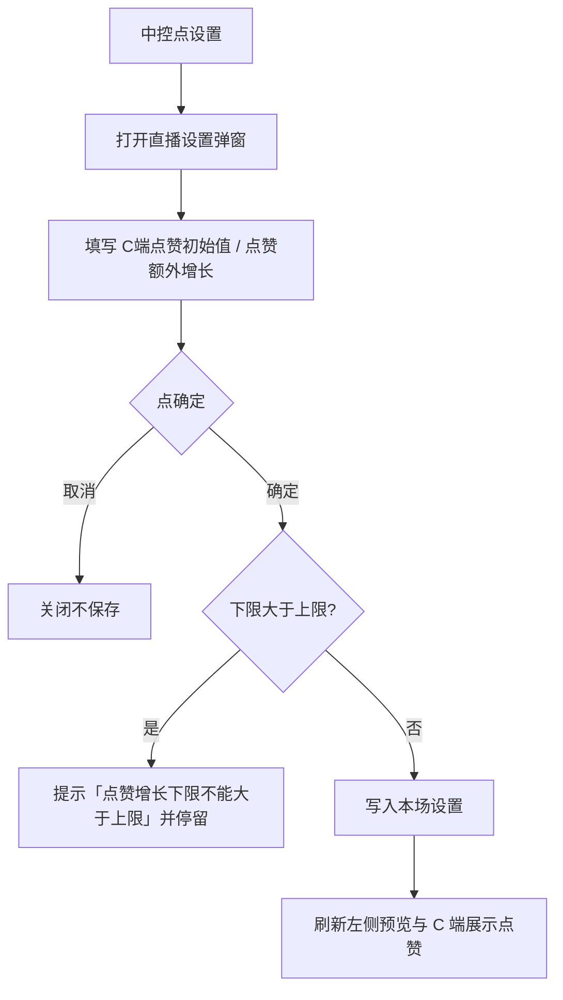
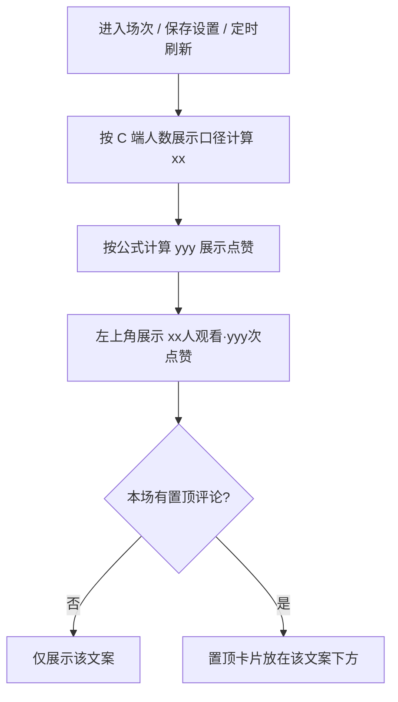
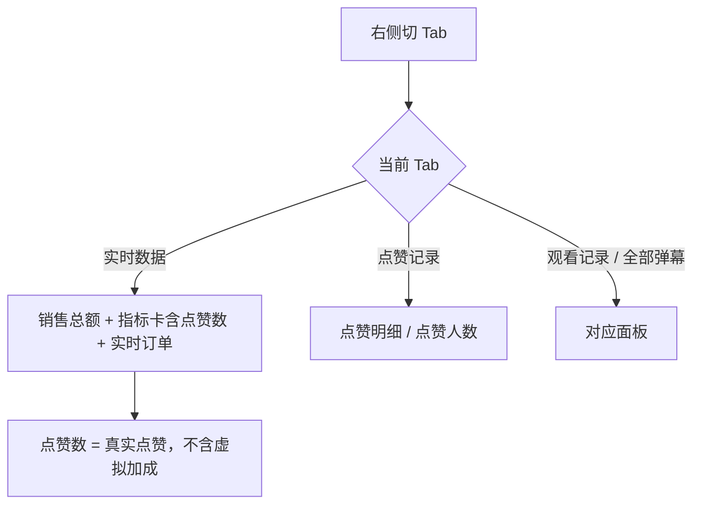
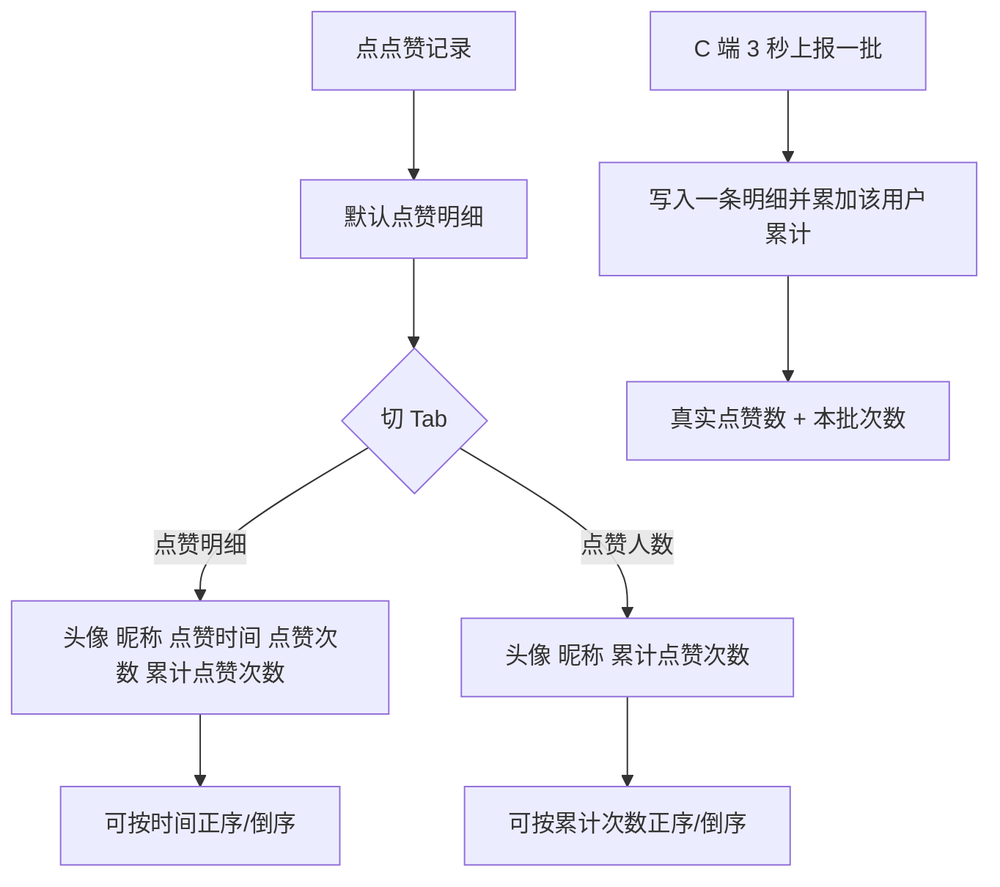
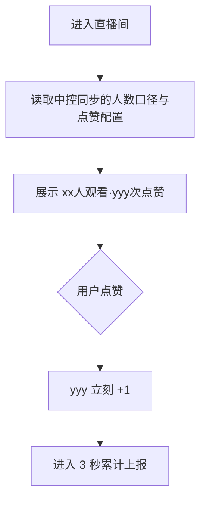
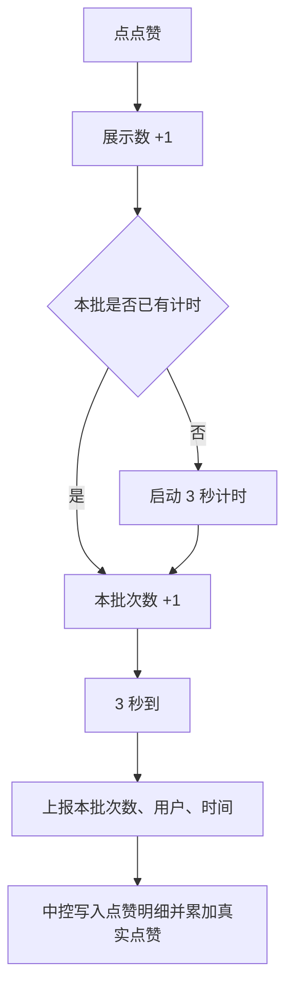

# 【303】虚拟点赞数

来源清单：`merged-20260827-01`（大版本 `2026082701C端点赞数设置` 全部小版本 `.1`～`.3`）

# 1. 后台业务 WEB 系统

## 1.1 概述

### 需求背景

中控台已支持 C 端观看人数的初始值和额外跟随，但点赞只能看真实数，直播间热度不够时无法按运营策略做展示加成。C 端原先只写「xx人正在观看」，没有点赞次数。本期按合并清单 `merged-20260827-01` 增加虚拟点赞配置、预览与 C 端同步展示，并补齐真实点赞的记录与 3 秒上报。

### 需求目标

1. 直播设置可配置 C 端点赞初始值、每隔 x 分钟额外随机增加 x–y 次（均为整数 0–999999，默认 0；间隔为 0 时不按时间增长）。
2. C 端展示点赞数 = 初始值 + 真实点赞 + 按间隔随机累加；中控左侧预览同步展示「xx人观看·yyy次点赞」（yyy 用该展示数）。
3. 右侧实时数据「点赞数」只展示真实点赞，不含虚拟加成。
4. 观看记录右侧增加「点赞记录」：点赞明细、点赞人数两个 Tab；与实时数据互斥，不串到实时数据面板里。
5. C 端文案由「xx人正在观看」改为「xx人观看」，并展示点赞次数；点赞后展示数立刻 +1，从本批第一次点赞起 3 秒累计上报一次。

## 1.2 管理范围

| 终端 | 模块 | 变更类型 |
|------|------|----------|
| B 端 MDM | 直播中控 · 直播设置 | 修改 |
| B 端 MDM | 直播中控 · 直播预览 | 新增 |
| B 端 MDM | 直播中控 · 实时数据 | 修改 |
| B 端 MDM | 直播中控 · 点赞记录 | 新增 |
| C 端用户 APP | 直播间 · 主播信息 | 修改 |
| C 端用户 APP | 直播间 · 点赞上报 | 修改 |

本期不做：

- 不按用户等级、商品讲解做差异化虚拟点赞。
- 不提供虚拟点赞的独立开关（间隔与上下限均为 0 即不虚增）。
- 点赞记录本期仅「点赞明细」「点赞人数」两个 Tab，不做第三项。
- 不对接真实直播数据中台；原型用本场演示数据与本机同步。

## 1.3 需求详细说明

### 1.3.1 直播设置

#### 1.3.1.1 功能点：C端点赞初始值与点赞额外增长

在直播中控「设置」中配置本场 C 端点赞展示基数，以及开播后按分钟随机加成。

#### 1.3.1.2 功能流程图

需要说明的问题：

- 字段为整数，范围 0–999999，默认 0；空按 0。
- 间隔为 0 时不按时间累加随机次数，展示数 = 初始值 + 真实点赞。
- 下限大于上限时不保存。
- 弹窗内不再出现「C端点赞数设置」标题，以免与人数「初始值」混淆。

#### 1.3.1.3 功能描述

| 项 | 内容 |
|----|------|
| 功能类型 | 更新数据 |
| 功能描述 | 配置本场 C 端点赞展示基数与按分钟随机加成 |
| 前提业务 | 已进入某场直播中控 |
| 后继业务 | 左侧预览、C 端直播间点赞展示按公式刷新 |
| 功能约束 | 整数 0–999999；下限不得大于上限 |
| 约束描述 | 间隔 0 表示关闭时间加成 |
| 操作权限 | 直播中控操作账号 |

#### 1.3.1.4 界面设计

**1. 界面原型**

- 原型文件：`MDM/mdm_live_control.html`
- 本地预览：`http://localhost:5173/MDM/mdm_live_control.html?sessionId=sess-001`
- 布局：
  - 中区直播商品工具行「设置」打开「直播设置」弹窗
  - 人数相关字段之后为点赞字段（中间分隔线，无「C端点赞数设置」标题）
  - 「C端点赞初始值」数字框；「点赞额外增长」：每隔 [分钟] 分钟，额外随机增加 [下限] - [上限] 次
  - 底栏：取消 / 确定
  - 校验失败：toast 提示，弹窗不关

#### 数据要求

| 字段名称 | 长度 | 录入方式 | 是否非空项 | 默认显示 |
|----------|------|----------|------------|----------|
| C端点赞初始值 | 0–999999 | 文本框（整数） | N | 0 |
| 间隔分钟 | 0–999999 | 文本框（整数） | N | 0 |
| 随机增加下限 | 0–999999 | 文本框（整数） | N | 0 |
| 随机增加上限 | 0–999999 | 文本框（整数） | N | 0 |

#### 1.3.1.5 逻辑描述

1. 非整数或越界按 0–999999 钳制；空按 0。
2. 下限 > 上限：toast「点赞增长下限不能大于上限」，停留在弹窗。
3. 确定成功：保存本场、关闭弹窗、toast「设置已保存」，预览与 C 端按新配置计算展示点赞。
4. 与变更前差异：原先无点赞配置；中间版本曾用「C端点赞数设置 / 初始值 / 额外增长」标题，后改为现文案。

### 1.3.2 直播预览

#### 1.3.2.1 功能点：观看人数与展示点赞

左侧直播画面展示与 C 端一致的观看、点赞文案；置顶评论在其下方。

#### 1.3.2.2 功能流程图

需要说明的问题：

- 观看文案随「C端人数展示」：实际在线为「n人观看」，累计人数为「n人看过」，累计人次为「n人次观看」。
- yyy = 初始值 + 真实点赞 + 开播后按间隔随机累加（已结束场次按关播时间截断）。
- 置顶评论不得挡住该文案。

#### 1.3.2.3 功能描述

| 项 | 内容 |
|----|------|
| 功能类型 | 查询数据 |
| 功能描述 | 在直播预览左上角展示观看人数与 C 端展示点赞数 |
| 前提业务 | 已进入本场中控 |
| 后继业务 | 与 C 端主播信息行文案一致 |
| 功能约束 | yyy 用虚拟加成后的展示数，不是实时数据里的真实点赞 |
| 约束描述 | 无 |
| 操作权限 | 直播中控操作账号（只读展示） |

#### 1.3.2.4 界面设计

**1. 界面原型**

- 原型文件：`MDM/mdm_live_control.html`
- 本地预览：`http://localhost:5173/MDM/mdm_live_control.html?sessionId=sess-001`
- 布局：
  - 左侧直播画面左上角深色底文案：`xx人观看·yyy次点赞`
  - 其下为置顶评论卡片（有则显示）
  - 画面底部仍滚动普通弹幕

#### 数据要求

| 字段名称 | 长度 | 录入方式 | 是否非空项 | 默认显示 |
|----------|------|----------|------------|----------|
| 观看人数文案 | - | 只读展示 | Y | 按人数展示口径 |
| 展示点赞次数 | - | 只读展示 | Y | 初始值+真实+时间加成 |

#### 1.3.2.5 逻辑描述

1. 进入场次、保存设置或直播进行中刷新时重算并展示。
2. 有置顶时卡片在文案下方；无置顶只留文案。
3. 与变更前差异：原先预览无该文案；曾放在右上角会与置顶重叠，后改左上角且置顶在下。

### 1.3.3 实时数据

#### 1.3.3.1 功能点：真实点赞数与面板互斥

右侧「实时数据」中的点赞数为真实点赞；点赞记录面板不得出现在本 Tab。

#### 1.3.3.2 功能流程图

需要说明的问题：

- 真实点赞随 C 端 3 秒上报累加。
- 「实时数据」与「点赞记录」互斥，指标与订单中间不得露出点赞明细。

#### 1.3.3.3 功能描述

| 项 | 内容 |
|----|------|
| 功能类型 | 查询数据 |
| 功能描述 | 展示本场真实点赞数，并保证面板不串台 |
| 前提业务 | 已进入本场中控 |
| 后继业务 | 点赞记录、C 端上报 |
| 功能约束 | 点赞数不含初始值和按分钟虚增 |
| 约束描述 | 无 |
| 操作权限 | 直播中控操作账号 |

#### 1.3.3.4 界面设计

**1. 界面原型**

- 原型文件：`MDM/mdm_live_control.html`
- 本地预览：`http://localhost:5173/MDM/mdm_live_control.html?sessionId=sess-001`
- 布局：
  - 右侧 Tab：实时数据 / 全部弹幕 / 观看记录 / 点赞记录
  - 实时数据：销售总额、观看人数、累计观看、峰值人数、点赞数、订单数、下单 GMV、实时订单
  - 空态：无订单时「当前暂无订单」

#### 数据要求

| 字段名称 | 长度 | 录入方式 | 是否非空项 | 默认显示 |
|----------|------|----------|------------|----------|
| 点赞数 | - | 只读展示 | Y | 真实点赞合计 |

#### 1.3.3.5 逻辑描述

1. 点赞数取本场实际上报点赞合计，不加初始值、不加时间随机。
2. 停留「实时数据」时隐藏点赞记录面板。
3. 与变更前差异：点赞数含义与 C 端展示数明确拆开；修掉实时数据里误露出点赞明细空面板。

### 1.3.4 点赞记录

#### 1.3.4.1 功能点：点赞明细与点赞人数

观看记录右侧新增「点赞记录」，分点赞明细、点赞人数。

#### 1.3.4.2 功能流程图

需要说明的问题：

- 点赞明细 Tab 文案「点赞明细(条数)」；点赞人数「点赞人数(人数)」。
- 点赞次数 = 本批上报次数；累计点赞次数 = 该用户本场合计。
- 同一用户多次上报只在点赞人数中计 1 人。
- 无数据：「暂无点赞明细」/「暂无点赞人数」。

#### 1.3.4.3 功能描述

| 项 | 内容 |
|----|------|
| 功能类型 | 查询数据 |
| 功能描述 | 查看本场真实点赞明细与点赞人数 |
| 前提业务 | 已进入本场中控；C 端会上报点赞 |
| 后继业务 | 实时数据点赞数同步增加 |
| 功能约束 | 仅两个 Tab |
| 约束描述 | 无 |
| 操作权限 | 直播中控操作账号 |

#### 1.3.4.4 界面设计

**1. 界面原型**

- 原型文件：`MDM/mdm_live_control.html`
- 本地预览：`http://localhost:5173/MDM/mdm_live_control.html?sessionId=sess-001`
- 布局：
  - 右侧第四个 Tab「点赞记录」
  - 子 Tab：点赞明细 / 点赞人数
  - 工具行：倒序 / 正序
  - 列表：头像 + 昵称 + 说明行

#### 数据要求

| 字段名称 | 长度 | 录入方式 | 是否非空项 | 默认显示 |
|----------|------|----------|------------|----------|
| 头像 | - | 只读展示 | Y | 昵称首字 |
| 昵称 | - | 只读展示 | Y | 观众昵称 |
| 点赞时间 | - | 只读展示 | Y | 本批上报时间（明细） |
| 点赞次数 | - | 只读展示 | Y | 本批次数（明细） |
| 累计点赞次数 | - | 只读展示 | Y | 该用户本场合计 |

#### 1.3.4.5 逻辑描述

1. 切入点赞记录才渲染列表；默认倒序。
2. 收到 C 端一批上报：插入明细、更新或新增点赞人数、真实点赞数加上本批次数。
3. 与变更前差异：原先无点赞记录入口。

### 1.3.5 C 端直播间展示

#### 1.3.5.1 功能点：观看人数与点赞次数

主播名称下方展示「xx人观看·yyy次点赞」。

#### 1.3.5.2 功能流程图

需要说明的问题：

- 「人正在观看」改为「人观看」；累计人数/人次口径仍随中控「C端人数展示」。
- yyy 含虚拟加成；本地点赞未上报部分也先加在展示数上。

#### 1.3.5.3 功能描述

| 项 | 内容 |
|----|------|
| 功能类型 | 查询数据 / 更新数据 |
| 功能描述 | 展示观看人数与点赞次数 |
| 前提业务 | 进入直播间 |
| 后继业务 | 点赞上报 |
| 功能约束 | 与预览文案口径一致 |
| 约束描述 | 无 |
| 操作权限 | 进入直播间的观众 |

#### 1.3.5.4 界面设计

**1. 界面原型**

- 原型文件：`user-app/h5/live-room.html`
- 本地预览：`http://localhost:5173/user-app/h5/live-room.html`
- 布局：
  - 顶部主播名称下方一行灰色小字：`xx人观看·yyy次点赞`
  - 底部点赞按钮仍在输入框左侧

#### 数据要求

| 字段名称 | 长度 | 录入方式 | 是否非空项 | 默认显示 |
|----------|------|----------|------------|----------|
| 观看人数 | - | 只读展示 | Y | 按 C端人数展示 |
| 点赞次数 | - | 只读展示 | Y | 展示点赞数 |

#### 1.3.5.5 逻辑描述

1. 无中控同步时可用演示场次计算；有同步则用中控配置。
2. 点赞后展示数立即 +1，toast「点赞成功」。
3. 与变更前差异：原先仅「xx人正在观看」，无点赞次数。

### 1.3.6 C 端点赞上报

#### 1.3.6.1 功能点：3 秒累计上报

观众点赞先本地累计，从本批第一次点赞起 3 秒后向中控台上报一次。

#### 1.3.6.2 功能流程图

需要说明的问题：

- 3 秒窗口内多次点赞合并为一条明细。
- 上报后开始下一批：再点赞重新计 3 秒。
- 离开页面时若有未上报次数，立即上报。

#### 1.3.6.3 功能描述

| 项 | 内容 |
|----|------|
| 功能类型 | 新增数据 |
| 功能描述 | 将观众点赞按 3 秒一批上报给中控台 |
| 前提业务 | 观众在直播间点赞 |
| 后继业务 | 点赞记录、实时数据真实点赞数 |
| 功能约束 | 每批最多等待 3 秒 |
| 约束描述 | 无 |
| 操作权限 | 进入直播间的观众 |

#### 1.3.6.4 界面设计

**1. 界面原型**

- 原型文件：`user-app/h5/live-room.html`
- 本地预览：`http://localhost:5173/user-app/h5/live-room.html`
- 布局：底部点赞按钮；无单独上报界面，观众只看到展示数变化和「点赞成功」

#### 数据要求

| 字段名称 | 长度 | 录入方式 | 是否非空项 | 默认显示 |
|----------|------|----------|------------|----------|
| 本批点赞次数 | - | 系统累计 | Y | 本批点击次数 |
| 用户昵称 | - | 系统带出 | Y | 当前观众身份 |
| 上报时间 | - | 系统生成 | Y | 上报时刻 |

#### 1.3.6.5 逻辑描述

1. 点击点赞：展示数 +1；本批无计时则开 3 秒计时。
2. 3 秒到或离开页面：把本批次数上报中控，生成一条点赞明细，更新点赞人数累计，真实点赞数加上本批次数。
3. 与变更前差异：原先点赞只改本机展示，不上报明细。
