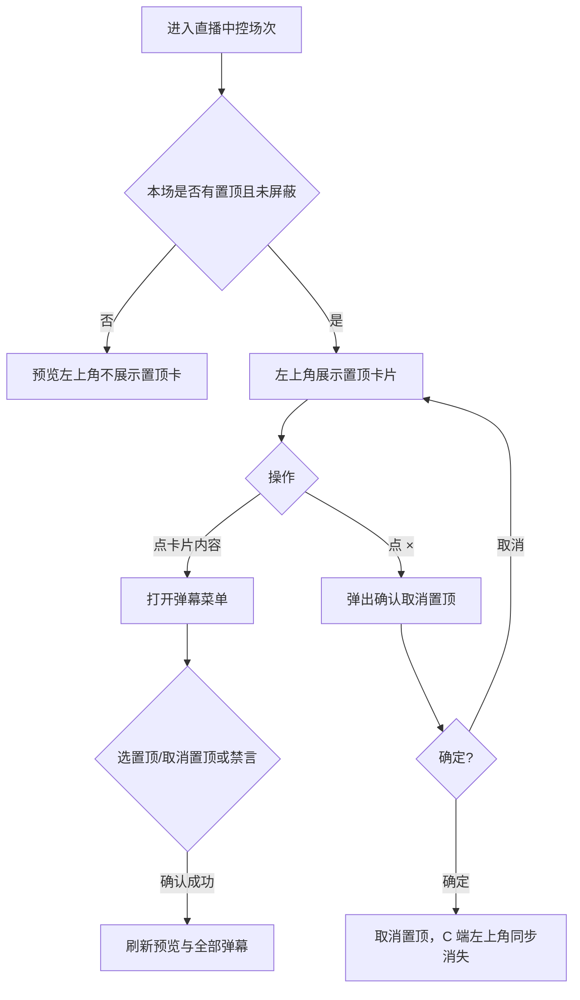
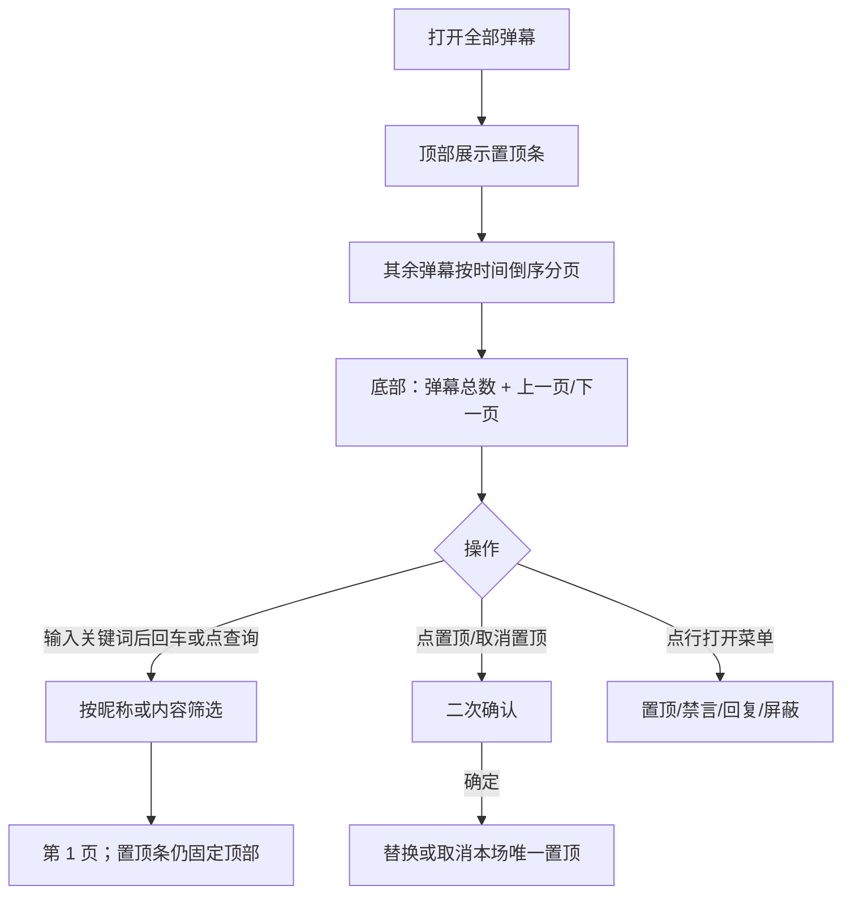
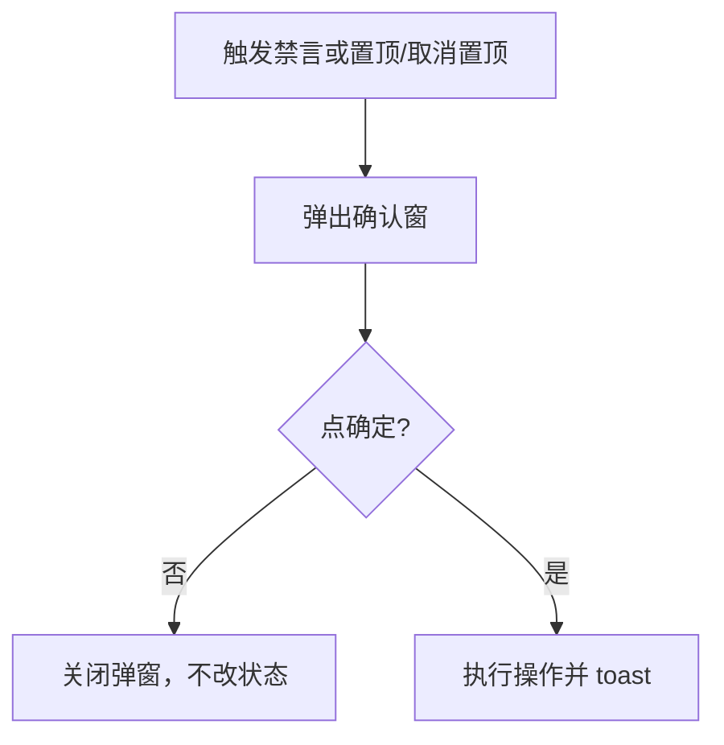
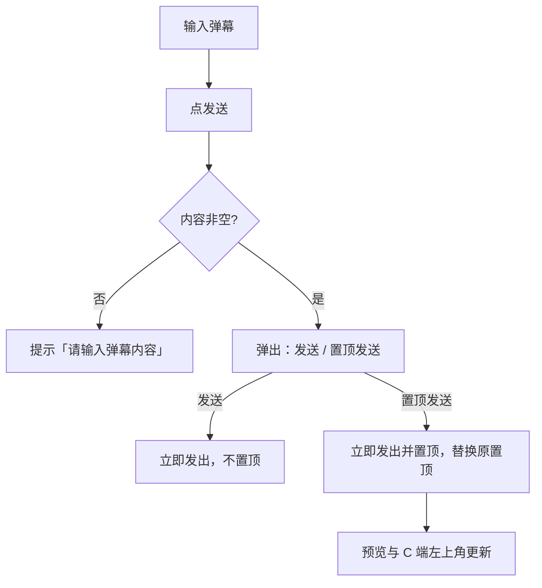
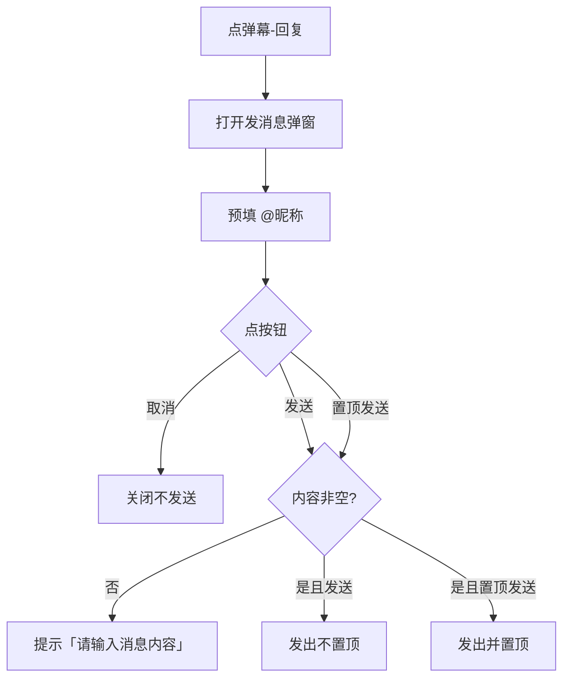
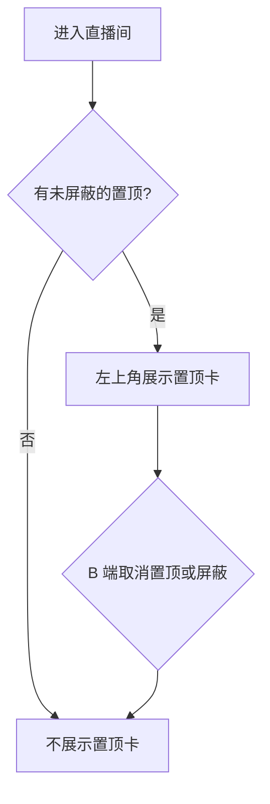

# 【306】直播弹幕置顶

来源清单：`merged-20260821-01`（大版本 `2026082101直播弹幕置顶` 全部小版本 `.1`～`.5`）

# 1. 后台业务 WEB 系统

## 1.1 概述

### 需求背景

直播中控只能对弹幕做禁言、回复、屏蔽，重要评论无法固定给观众看。C 端弹幕只在左下角滚动，关键说明容易被刷走。本期按合并清单 `merged-20260821-01` 补齐本场唯一置顶、中控置顶发送/管理，以及 C 端左上角置顶展示。

### 需求目标

1. 本场同时仅 1 条置顶；新置顶替换旧置顶；屏蔽置顶条时自动取消置顶。
2. B 端直播中控左侧预览左上角同步展示置顶卡片，右上角「×」可取消置顶（二次确认）；点卡片内容可打开弹幕菜单。
3. 右侧全部弹幕可置顶/取消置顶；置顶条固定在列表顶部（翻页仍可见）；支持关键词查询、每页 50 条、底部展示弹幕总数。
4. 全场禁言/取消禁言、对用户禁言/取消禁言、对已有弹幕置顶/取消置顶需二次确认。置顶发送不弹确认。
5. 中控点「发送」可选「发送」或「置顶发送」；回复弹幕弹窗也可置顶发送。
6. C 端直播间左上角只读展示置顶：半透明白底、左侧橙色竖条、第一行 @昵称、下方加粗正文。

## 1.2 管理范围

| 终端 | 模块 | 变更类型 |
|------|------|----------|
| B 端 MDM | 直播中控 · 弹幕预览 | 修改 |
| B 端 MDM | 直播中控 · 全部弹幕 | 修改 |
| B 端 MDM | 直播中控 · 弹幕操作确认 | 修改 |
| B 端 MDM | 直播中控 · 发布评论 | 修改 |
| B 端 MDM | 直播中控 · 回复弹幕弹窗 | 修改 |
| C 端用户 APP | 直播间 · 置顶评论 | 修改 |

本期不做：

- 不支持同时置顶多条弹幕。
- 观众端不可自行置顶或取消置顶。
- 不对接真实直播审核、风控处罚系统。
- 不分场次跨场保留置顶（关播后本场置顶结束）。

## 1.3 需求详细说明

### 1.3.1 弹幕预览置顶

#### 1.3.1.1 功能点：预览区展示与取消置顶

中控左侧直播画面左上角同步展示本场置顶评论；可通过「×」取消置顶。

#### 1.3.1.2 功能流程图

需要说明的问题：

- 本场同时仅 1 条置顶。
- 该条被屏蔽后自动取消置顶，预览与 C 端均不再展示。
- 无单独权限点（原型按已进入本场中控的账号处理）。

#### 1.3.1.3 功能描述

| 项 | 内容 |
|----|------|
| 功能类型 | 更新数据 |
| 功能描述 | 在直播画面预览左上角展示置顶评论，支持 × 取消置顶 |
| 前提业务 | 已进入某场直播中控 |
| 后继业务 | C 端直播间左上角同步；全部弹幕列表同步 |
| 功能约束 | 仅 1 条；屏蔽即取消 |
| 约束描述 | 系统消息不可置顶 |
| 操作权限 | 直播中控操作账号 |

#### 1.3.1.4 界面设计

**1. 界面原型**

- 原型文件：`MDM/mdm_live_control.html`
- 本地预览：`http://localhost:5173/MDM/mdm_live_control`
- 布局：
  - 左侧：直播画面预览；左上角置顶卡片（橙色竖条、@昵称、正文、右上角 ×）；底部滚动最近弹幕
  - 置顶卡片样式与 C 端一致：半透明白底圆角
  - 空态：无置顶时不展示卡片
  - 确认窗：标题「确认取消置顶」，确定 / 取消

#### 数据要求

| 字段名称 | 长度 | 录入方式 | 是否非空项 | 默认显示 |
|----------|------|----------|------------|----------|
| 置顶评论 | - | 只读展示 | N | 无则隐藏 |
| 用户昵称 | - | 只读展示 | Y | @昵称 |
| 评论内容 | - | 只读展示 | Y | 正文，最多两行 |

#### 1.3.1.5 逻辑描述

1. 进入场次后，若存在 `pinned=true` 且未屏蔽的弹幕，预览左上角展示该条。
2. 点 × → 确认弹窗 → 确定则取消置顶并 toast「已取消置顶」；点取消停留。
3. 点卡片内容打开菜单（置顶/取消置顶、禁言、回复、屏蔽）。
4. 与变更前差异：原先预览只有底部滚动弹幕，无左上角置顶、无 ×。

### 1.3.2 全部弹幕

#### 1.3.2.1 功能点：置顶管理、关键词查询与分页

右侧「全部弹幕」可置顶/取消置顶；置顶条固定列表顶部；支持关键词查询；其余弹幕分页，默认每页 50 条；底部展示弹幕总数。

#### 1.3.2.2 功能流程图

需要说明的问题：

- 置顶条不计入分页，翻页时仍留在列表上方。
- 关键词匹配昵称或内容；未点查询、未回车时不筛选。
- 搜索无结果时：置顶条仍可展示，列表区提示「没有符合条件的弹幕」。

#### 1.3.2.3 功能描述

| 项 | 内容 |
|----|------|
| 功能类型 | 查询数据 / 更新数据 |
| 功能描述 | 管理本场全部弹幕的置顶、搜索与分页 |
| 前提业务 | 已进入本场直播中控并切换到全部弹幕 |
| 后继业务 | 预览区、C 端置顶同步 |
| 功能约束 | 每页默认 50 条；同时仅 1 条置顶 |
| 约束描述 | 系统消息无置顶按钮 |
| 操作权限 | 直播中控操作账号 |

#### 1.3.2.4 界面设计

**1. 界面原型**

- 原型文件：`MDM/mdm_live_control.html`
- 本地预览：`http://localhost:5173/MDM/mdm_live_control`
- 布局：
  - 右侧页签：实时数据 / 全部弹幕 / 观看记录
  - 搜索行：关键词输入框、「查询」按钮
  - 置顶区：橙色底、标「已置顶」、操作「取消置顶」
  - 列表：昵称、内容、时间、置顶/取消置顶
  - 底栏：弹幕总数、上一页、当前页/总页、下一页
  - 空态：「暂无弹幕」或「没有符合条件的弹幕」

#### 数据要求

| 字段名称 | 长度 | 录入方式 | 是否非空项 | 默认显示 |
|----------|------|----------|------------|----------|
| 弹幕关键词 | - | 文本框 | N | 空 |
| 置顶 | - | 操作按钮 | N | 置顶 / 取消置顶 |
| 已置顶 | - | 只读展示 | N | 置顶条展示标签 |
| 弹幕总数 | - | 只读展示 | Y | 本场全部条数 |

#### 1.3.2.5 逻辑描述

1. 关键词为空时点查询或回车：展示全部（置顶固定顶、其余分页）。
2. 有关键词：过滤昵称或内容包含关键词的非置顶弹幕；置顶条仍固定顶部。
3. 点「置顶」→ 确认「将展示在观众端左上角，原置顶会被替换」→ 确定后生效。
4. 点「取消置顶」→ 确认后 C 端左上角不再展示。
5. 分页默认每页 50 条；上一页在第 1 页禁用，下一页在末页禁用。
6. 与变更前差异：原先无置顶、无搜索、无总数、无分页。

### 1.3.3 弹幕操作确认

#### 1.3.3.1 功能点：禁言与置顶二次确认

全场禁言/取消禁言、对用户禁言/取消禁言、对已有弹幕置顶/取消置顶，均需弹窗确认后才生效。

#### 1.3.3.2 功能流程图

需要说明的问题：

- 「置顶发送」不走本确认（见 1.3.4、1.3.5）。
- 回复、屏蔽不走本确认。

#### 1.3.3.3 功能描述

| 项 | 内容 |
|----|------|
| 功能类型 | 更新数据 |
| 功能描述 | 高风险弹幕操作二次确认 |
| 前提业务 | 已进入本场直播中控 |
| 后继业务 | 预览、全部弹幕、C 端展示 |
| 功能约束 | 无 |
| 约束描述 | 无 |
| 操作权限 | 直播中控操作账号 |

#### 1.3.3.4 界面设计

**1. 界面原型**

- 原型文件：`MDM/mdm_live_control.html`
- 本地预览：`http://localhost:5173/MDM/mdm_live_control`
- 布局：
  - 确认弹窗：标题（如「确认禁言」「确认置顶」）、说明文案、取消 / 确定
  - 入口：左侧全场禁言按钮、弹幕菜单、全部弹幕行内按钮、观看记录禁言、置顶卡 ×

#### 数据要求

| 字段名称 | 长度 | 录入方式 | 是否非空项 | 默认显示 |
|----------|------|----------|------------|----------|
| - | - | - | - | 无新增业务字段 |

#### 1.3.3.5 逻辑描述

1. 未点确定前不改变禁言或置顶状态。
2. 点确定后执行并提示成功；点取消或蒙层关闭则保持原状。
3. 与变更前差异：上述操作原先点击立即生效。

### 1.3.4 发布评论

#### 1.3.4.1 功能点：发送与置顶发送

中控输入框点「发送」后选择普通发送或置顶发送；禁言按钮收窄。

#### 1.3.4.2 功能流程图

需要说明的问题：

- 置顶发送不再二次确认。
- 回车与点「发送」相同，先出选择菜单。
- 无内容时不弹出选择菜单。

#### 1.3.4.3 功能描述

| 项 | 内容 |
|----|------|
| 功能类型 | 新增数据 / 更新数据 |
| 功能描述 | 中控发布弹幕，可选同时置顶 |
| 前提业务 | 已进入本场直播中控 |
| 后继业务 | 预览、全部弹幕、C 端置顶 |
| 功能约束 | 置顶发送后该条成为本场唯一置顶 |
| 约束描述 | 可用虚拟互动账号身份发送 |
| 操作权限 | 直播中控操作账号 |

#### 1.3.4.4 界面设计

**1. 界面原型**

- 原型文件：`MDM/mdm_live_control.html`
- 本地预览：`http://localhost:5173/MDM/mdm_live_control`
- 布局：
  - 预览下方：较窄的「禁言」按钮、多行输入框、「发送」按钮
  - 点发送后浮层：发送、置顶发送
  - 校验提示：请输入弹幕内容（停留在输入区）

#### 数据要求

| 字段名称 | 长度 | 录入方式 | 是否非空项 | 默认显示 |
|----------|------|----------|------------|----------|
| 弹幕内容 | - | 文本框 | Y | 空 |
| 发送方式 | - | 下拉选择（浮层） | Y | 点发送后选择 |

#### 1.3.4.5 逻辑描述

1. 内容为空：toast「请输入弹幕内容」，不发。
2. 选「发送」：立即入列，不置顶，toast「弹幕已发送」。
3. 选「置顶发送」：立即入列并置顶，toast「已置顶发送」，原置顶被替换。
4. 与变更前差异：原先只能普通发送；中间版本曾并排放两个按钮且置顶发送要再确认。

### 1.3.5 回复弹幕弹窗

#### 1.3.5.1 功能点：回复时置顶发送

回复弹窗增加「置顶发送」，与「发送」并列；置顶发送不弹确认。

#### 1.3.5.2 功能流程图

需要说明的问题：

- 系统消息不可回复。
- 置顶发送同样只保留 1 条置顶。

#### 1.3.5.3 功能描述

| 项 | 内容 |
|----|------|
| 功能类型 | 新增数据 / 更新数据 |
| 功能描述 | 回复观众弹幕，可选同时置顶 |
| 前提业务 | 已点开某条非系统弹幕的回复 |
| 后继业务 | 预览、全部弹幕、C 端置顶 |
| 功能约束 | 消息内容必填 |
| 约束描述 | 无 |
| 操作权限 | 直播中控操作账号 |

#### 1.3.5.4 界面设计

**1. 界面原型**

- 原型文件：`MDM/mdm_live_control.html`（弹窗）
- 本地预览：`http://localhost:5173/MDM/mdm_live_control`
- 布局：
  - 标题：发消息
  - 说明：将发送到本场直播间，观众可见
  - 消息内容多行输入
  - 底栏：取消、置顶发送、发送

#### 数据要求

| 字段名称 | 长度 | 录入方式 | 是否非空项 | 默认显示 |
|----------|------|----------|------------|----------|
| 消息内容 | - | 文本框 | Y | @被回复昵称 + 空格 |
| 置顶发送 | - | 按钮 | N | - |

#### 1.3.5.5 逻辑描述

1. 内容为空：toast「请输入消息内容」，弹窗不关。
2. 发送：发出不置顶，关闭弹窗。
3. 置顶发送：发出并置顶，关闭弹窗，不经确认窗。
4. 与变更前差异：回复弹窗原先只有取消和发送。

### 1.3.6 C 端置顶评论

#### 1.3.6.1 功能点：直播间左上角只读展示

观众直播间在主播信息下方左上角展示 B 端置顶的评论，样式按附图，观众不可操作。

#### 1.3.6.2 功能流程图

需要说明的问题：

- 观众不能置顶、取消置顶或关闭卡片。
- 与 B 端中控通过本机同步状态；刷新或轮询后更新。

#### 1.3.6.3 功能描述

| 项 | 内容 |
|----|------|
| 功能类型 | 查询数据 |
| 功能描述 | 展示本场置顶评论 |
| 前提业务 | B 端已置顶且未屏蔽 |
| 后继业务 | 无 |
| 功能约束 | 只读 |
| 约束描述 | 无 |
| 操作权限 | 进入直播间的观众 |

#### 1.3.6.4 界面设计

**1. 界面原型**

- 原型文件：`user-app/h5/live-room.html`
- 本地预览：`http://localhost:5173/user-app/h5/live-room.html`
- 布局：
  - 位置：主播信息下方、屏幕左侧
  - 卡片：半透明白底圆角，宽度约屏宽 40%
  - 左侧橙色竖条
  - 第一行 @昵称（灰色）
  - 下方评论正文加粗黑色，最多两行
  - 左下角仍滚动普通弹幕

#### 数据要求

| 字段名称 | 长度 | 录入方式 | 是否非空项 | 默认显示 |
|----------|------|----------|------------|----------|
| 置顶评论 | - | 只读展示 | N | 无则隐藏 |
| 用户昵称 | - | 只读展示 | Y | @昵称 |
| 评论内容 | - | 只读展示 | Y | 正文 |

#### 1.3.6.5 逻辑描述

1. 有置顶且未屏蔽：展示卡片；无则隐藏。
2. B 端取消置顶或屏蔽后，左上角消失。
3. 与变更前差异：原先弹幕只在左下角滚动；中间版本曾用深色条+「置顶」角标，后改为附图白底竖条样式。
