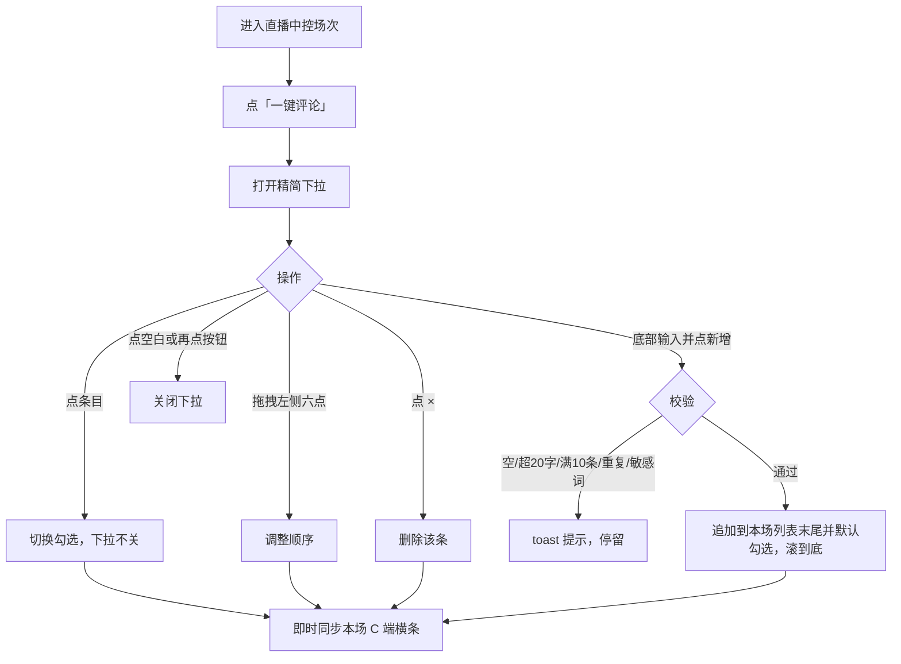
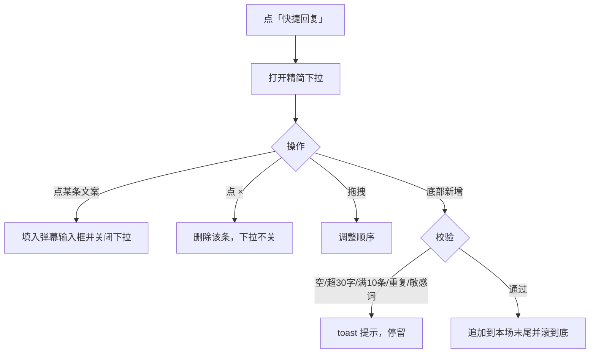
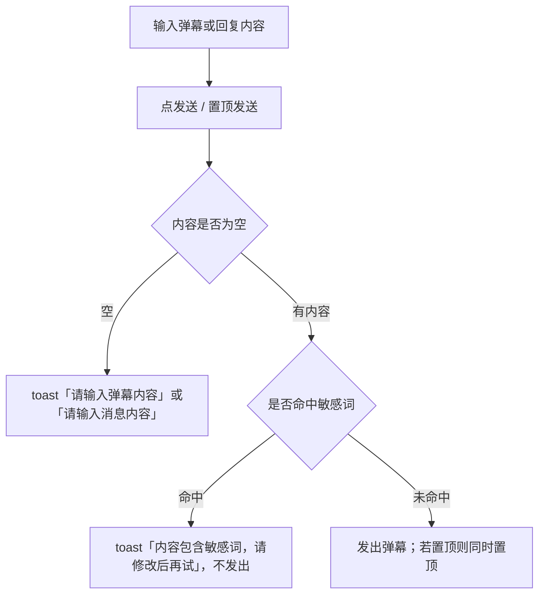
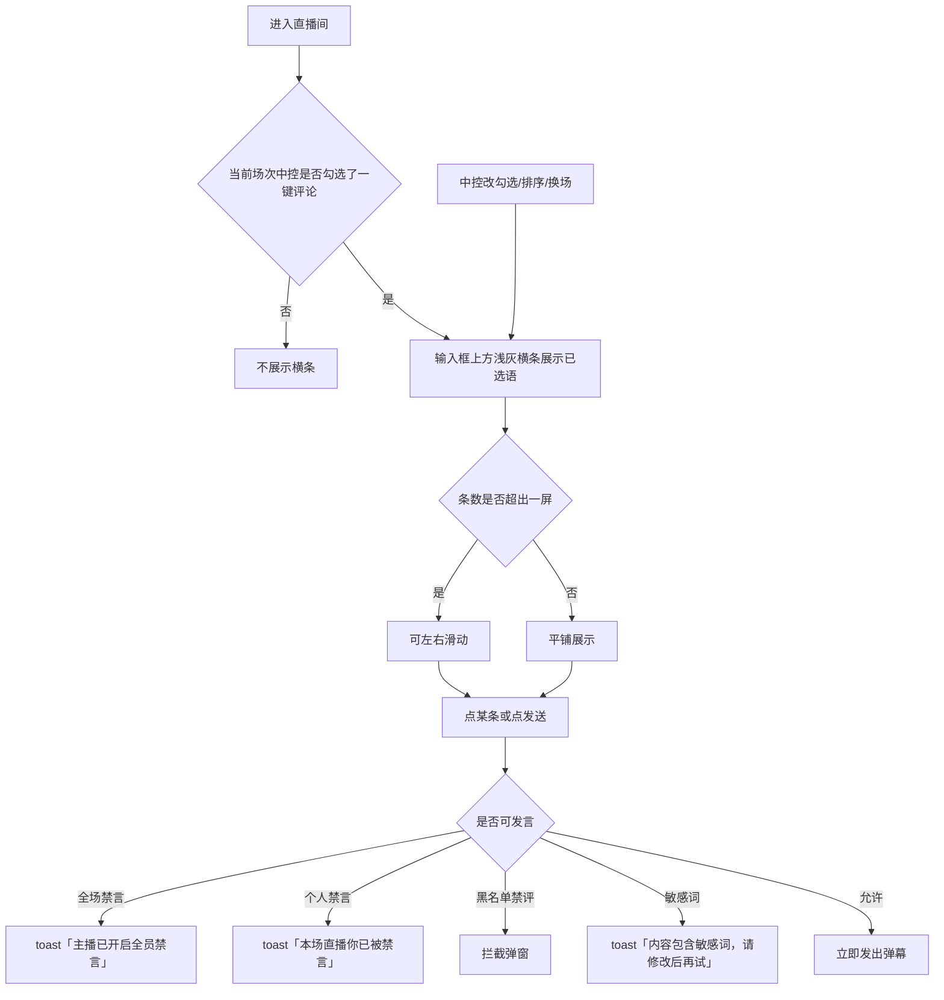

# 【311】直播c端用户一键评论

来源清单：`merged-20260821-03`（大版本 `2026082102一键评论` 全部小版本 `.1`～`.4`）

# 1. 后台业务 WEB 系统

## 1.1 概述

### 需求背景

直播中控原先只有给主播/场控用的固定「快捷回复」，不能配置观众端快捷话术。观众发弹幕只能手动输入，气氛互动效率低。语库若全场次共用，换场会串话术；新增与发送也不过敏感词。本期按合并清单 `merged-20260821-03`，在中控按场次配置一键评论并多选下发到 C 端，同时完善快捷回复，并对评论相关写入/发送对接敏感词风控。

### 需求目标

1. 中控互动工具栏增加「一键评论」：精简下拉，可多选、新增、删除、拖拽排序；勾选后下拉不关，新增后列表滚到底。
2. 评论语最多 20 字、最多 10 条；勾选的语即时同步到当前场次 C 端评论输入框上方，顺序与中控已勾选列表一致。
3. 「快捷回复」改为同款下拉，支持新增（最多 30 字、10 条）、删除、拖拽；点某条填入中控弹幕输入框，不自动发送。
4. 一键评论与快捷回复按直播场次分别存储，换场不串语库。
5. 新增评论语/回复语、中控发弹幕与回复、C 端手输或点一键发送，均过敏感词；命中 toast「内容包含敏感词，请修改后再试」并停留。
6. C 端仅展示当前场次已勾选语；条数多时可左右滑动；点某条立即发出（全场禁言、个人禁言、黑名单、敏感词仍拦截）。

## 1.2 管理范围

| 终端 | 模块 | 变更类型 |
|------|------|----------|
| B 端 MDM | 直播中控 · 一键评论 | 修改 |
| B 端 MDM | 直播中控 · 快捷回复 | 修改 |
| B 端 MDM | 直播中控 · 发布弹幕 | 修改 |
| C 端用户 APP | 直播间 · 一键评论 | 修改 |

本期不做：

- 观众端不可自行配置或改写一键评论语库。
- 不对接真实第三方审核接口（原型用演示词库模拟：微信、加v、qq、发票、返现、代购、赌博、色情）。
- 一键评论与快捷回复不是同一套数据：前者下发 C 端，后者只填中控弹幕框。
- 验收开关仅原型使用，不作为正式产品能力向观众展示。

## 1.3 需求详细说明

### 1.3.1 一键评论（中控配置）

#### 1.3.1.1 功能点：按场次多选下发观众端快捷话术

场控在当前直播场次的中控维护一键评论语库，勾选要给观众看的条目；勾选结果与排序即时同步到该场 C 端。

#### 1.3.1.2 功能流程图

需要说明的问题：

- 勾选控制 C 端是否展示，不是发送弹幕。
- 未勾选的语仍留在本场语库，观众端不展示。
- 按钮文案带已选条数，如「一键评论(4)」。
- 语库按场次隔离；新增过敏感词。
- 与快捷回复下拉互斥：打开其中一个会关掉另一个。
- 无单独权限点（原型按已进入本场中控的账号处理）。

#### 1.3.1.3 功能描述

| 项 | 内容 |
|----|------|
| 功能类型 | 新增数据 / 更新数据 / 删除数据 |
| 功能描述 | 按场次维护一键评论语库并多选下发到观众端 |
| 前提业务 | 已进入某场直播中控 |
| 后继业务 | 该场 C 端直播间评论框上方展示已选语 |
| 功能约束 | 最多 10 条；每条最多 20 字；可多选；按场次存储 |
| 约束描述 | 勾选、删除、排序、新增均即时生效，无需确定 |
| 操作权限 | 直播中控操作账号 |

#### 1.3.1.4 界面设计

**1. 界面原型**

- 原型文件：`MDM/mdm_live_control.html`
- 本地预览：`http://localhost:5173/MDM/mdm_live_control`
- 布局：
  - 左侧预览下方互动工具栏：「虚拟互动账号」「快捷回复」「一键评论」
  - 点「一键评论」在按钮上方弹出白色精简下拉（约 360px），无遮罩大弹窗
  - 列表项：左六点拖拽柄、评论语文案、勾选后橙色字+对勾、右侧灰色 ×
  - 底部分割线：输入框（占位「请输入评论语」，右侧 0/20）+ 橙色文字按钮「新增」
  - 空态：暂无一键评论，请在下方新增
  - 列表超出约 220px 高度时出现纵向滚动条

#### 数据要求

| 字段名称 | 长度 | 录入方式 | 是否非空项 | 默认显示 |
|----------|------|----------|------------|----------|
| 评论语 | 1～20 | 文本框 | Y（新增时） | 空；场次首次进入预置「已拍已拍」「给力给力」「满意满意」「爱了爱了」且默认勾选 |
| 是否展示 | - | 多选（点条目打勾） | N | 新增后默认勾选 |
| 排序 | - | 拖拽 | N | 按列表顺序 |

#### 1.3.1.5 逻辑描述

1. 新增内容为空：toast「请输入评论内容」，下拉不关。
2. 超过 20 字：输入框限制 maxlength；仍超则 toast「评论最多20个字」。
3. 已有 10 条再新增：toast「最多添加10个一键评论」。
4. 与本场已有条目文案完全相同：toast「该评论语已存在」。
5. 命中敏感词：toast「内容包含敏感词，请修改后再试」，不入库、不下发。
6. 新增成功：写入当前场次列表末尾并默认勾选，输入框清空，列表滚到底，C 端立即出现该语。
7. 点条目：已勾选则取消，未勾选则勾选；下拉保持打开，C 端横条即时增删。
8. 点 ×：从本场语库删除，若已勾选则 C 端同步去掉。
9. 拖拽：按落点重排，C 端左右顺序跟随。
10. 关闭：点页面空白或再点「一键评论」；勾选/删除/新增均不关闭。
11. 换场次：语库切换为该场自己的配置，不与其它场次共享。
12. 与变更前差异：原先没有一键评论；中间版本用带确定/取消的复选框弹窗，点选一条会关掉下拉；语库全场次共享且不过敏感词。

### 1.3.2 快捷回复（中控自用）

#### 1.3.2.1 功能点：按场次维护场控回复语

场控维护给自己填弹幕框用的快捷回复，支持新增、删除、拖拽；点某条填入输入框并关闭下拉。语库按场次隔离，新增过敏感词。

#### 1.3.2.2 功能流程图

需要说明的问题：

- 快捷回复不展示给 C 端观众。
- 点条目只填入，不等于发送；发送仍走发布弹幕。
- 与一键评论下拉互斥。
- 无单独权限点。

#### 1.3.2.3 功能描述

| 项 | 内容 |
|----|------|
| 功能类型 | 新增数据 / 更新数据 / 删除数据 |
| 功能描述 | 按场次维护场控快捷回复并一键填入弹幕框 |
| 前提业务 | 已进入某场直播中控 |
| 后继业务 | 中控发送/置顶发送弹幕 |
| 功能约束 | 最多 10 条；每条最多 30 字；按场次存储 |
| 约束描述 | 点条目即填入并关闭，不等于发送 |
| 操作权限 | 直播中控操作账号 |

#### 1.3.2.4 界面设计

**1. 界面原型**

- 原型文件：`MDM/mdm_live_control.html`
- 本地预览：`http://localhost:5173/MDM/mdm_live_control`
- 布局：
  - 与一键评论同款下拉：拖拽柄、文案、×、底部输入+「新增」
  - 快捷回复条目无「勾选对勾」（不是下发开关）
  - 输入框占位「请输入回复语」，字数 0/30
  - 空态：暂无快捷回复，请在下方新增

#### 数据要求

| 字段名称 | 长度 | 录入方式 | 是否非空项 | 默认显示 |
|----------|------|----------|------------|----------|
| 回复语 | 1～30 | 文本框 | Y（新增时） | 空；场次首次进入预置 3 条（欢迎来到直播间～ 等） |
| 排序 | - | 拖拽 | N | 按列表顺序 |

#### 1.3.2.5 逻辑描述

1. 新增为空：toast「请输入回复内容」。
2. 超过 30 字：toast「回复最多30个字」。
3. 满 10 条：toast「最多添加10条快捷回复」。
4. 重复文案：toast「该回复语已存在」。
5. 命中敏感词：toast「内容包含敏感词，请修改后再试」，不入库。
6. 新增成功：追加到当前场次末尾，列表滚到底，toast「已新增快捷回复」。
7. 点文案：填入「发送弹幕」输入框，关闭下拉；不自动发送。
8. 点 ×：删除该条，下拉不关。
9. 换场次：快捷回复切换为该场自己的配置。
10. 与变更前差异：原先只有 3 条固定按钮，不能新增、删除或排序；语库全场次共享且不过敏感词。

### 1.3.3 发布弹幕（中控发送/回复）

#### 1.3.3.1 功能点：发送与回复过敏感词

中控在输入框发送弹幕、置顶发送，以及弹幕回复弹窗的发送/置顶发送，均在发出前过敏感词；命中则拦截并保留原文。

#### 1.3.3.2 功能流程图

需要说明的问题：

- 与一键评论、快捷回复共用同一套演示词库。
- 拦截后输入框内容保留，便于修改。
- 无单独权限点。

#### 1.3.3.3 功能描述

| 项 | 内容 |
|----|------|
| 功能类型 | 新增数据 |
| 功能描述 | 中控发布/回复弹幕时过敏感词 |
| 前提业务 | 已进入某场直播中控 |
| 后继业务 | 本场弹幕列表、C 端滚动弹幕 |
| 功能约束 | 空内容不可发；命中敏感词不可发 |
| 约束描述 | 无 |
| 操作权限 | 直播中控操作账号 |

#### 1.3.3.4 界面设计

**1. 界面原型**

- 原型文件：`MDM/mdm_live_control.html`
- 本地预览：`http://localhost:5173/MDM/mdm_live_control`
- 布局：
  - 互动栏底部：禁言按钮、多行输入（占位「发送弹幕...」）、「发送」按钮
  - 点「发送」弹出菜单：发送 / 置顶发送
  - 弹幕操作「回复」打开弹窗：输入框、「取消」「置顶发送」「发送」
  - 命中敏感词时页面 toast，弹窗不关、输入不丢

#### 数据要求

| 字段名称 | 长度 | 录入方式 | 是否非空项 | 默认显示 |
|----------|------|----------|------------|----------|
| 弹幕内容 | - | 文本框 | Y | 空 |
| 回复内容 | - | 文本框 | Y | 空 |

#### 1.3.3.5 逻辑描述

1. 发送内容为空：toast「请输入弹幕内容」，不打开发送菜单。
2. 回复内容为空：toast「请输入消息内容」。
3. 命中敏感词：toast「内容包含敏感词，请修改后再试」，不发出、原文保留。
4. 未命中：普通发送 toast「弹幕已发送」；置顶发送 toast「已置顶发送」；回复对应「消息已发送」或「已置顶发送」。
5. 与变更前差异：原先只要填了内容就可以发出，不过敏感词。

### 1.3.4 C 端一键评论

#### 1.3.4.1 功能点：评论框上方快捷发送

观众直播间在评论输入框上方展示当前场次中控已勾选的一键评论语；点一条即作为自己的弹幕发出。手输发送同样过敏感词。

#### 1.3.4.2 功能流程图

需要说明的问题：

- 观众不能增删改语库，只能点发送。
- 展示顺序与当前场次中控列表中已勾选条目的顺序一致。
- 无勾选时横条隐藏，弹幕区底部位置恢复。
- 原型提供「敏感词验收开关」（按词库拦截 / 强制命中 / 强制放行），正式产品不向观众展示。

#### 1.3.4.3 功能描述

| 项 | 内容 |
|----|------|
| 功能类型 | 查询数据 / 新增数据 |
| 功能描述 | 展示当前场次中控下发的一键评论并一键发送 |
| 前提业务 | 中控已勾选至少 1 条一键评论 |
| 后继业务 | 弹幕列表出现该观众发言 |
| 功能约束 | 只读展示当前场次已勾选语；发送走与普通评论相同的禁言/黑名单/敏感词校验 |
| 约束描述 | 无 |
| 操作权限 | 进入直播间的观众 |

#### 1.3.4.4 界面设计

**1. 界面原型**

- 原型文件：`user-app/h5/live-room.html`
- 本地预览：`http://localhost:5173/user-app/h5/live-room.html`
- 布局：
  - 位置：底部「说点什么…」输入框正上方
  - 浅灰半透明横条，文案深色，多项横向排列
  - 超出一屏隐藏滚动条、可左右滑动
  - 点某条立即发送，不先填入输入框
  - 有横条时左下角滚动弹幕上移，避免被挡住

#### 数据要求

| 字段名称 | 长度 | 录入方式 | 是否非空项 | 默认显示 |
|----------|------|----------|------------|----------|
| 一键评论语 | 1～20 | 只读展示 / 点击发送 | N | 无勾选则隐藏 |
| 发送内容 | 同评论语 | 点击条目 | Y | - |

#### 1.3.4.5 逻辑描述

1. 当前场次中控未勾选任何语：不展示横条。
2. 有勾选：按该场中控顺序展示；中控增删勾选或拖拽后，观众端同步更新；换场后横条跟随新场次。
3. 点某条：通过校验则立即发出，toast「发送成功」。
4. 全场禁言：toast「主播已开启全员禁言」，不发送。
5. 个人禁言：toast「本场直播你已被禁言」，不发送。
6. 黑名单禁止直播评论：走既有拦截弹窗，不发送。
7. 敏感词：toast「内容包含敏感词，请修改后再试」，不发送（手输评论同样校验）。
8. 与变更前差异：原先评论区只有输入框和发送，输入框上方没有一键评论横条；语库不跟场次、发送不过敏感词。
