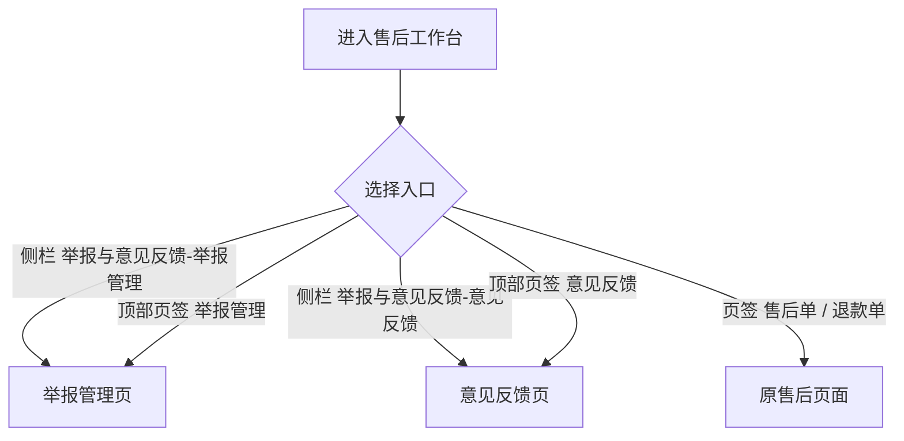
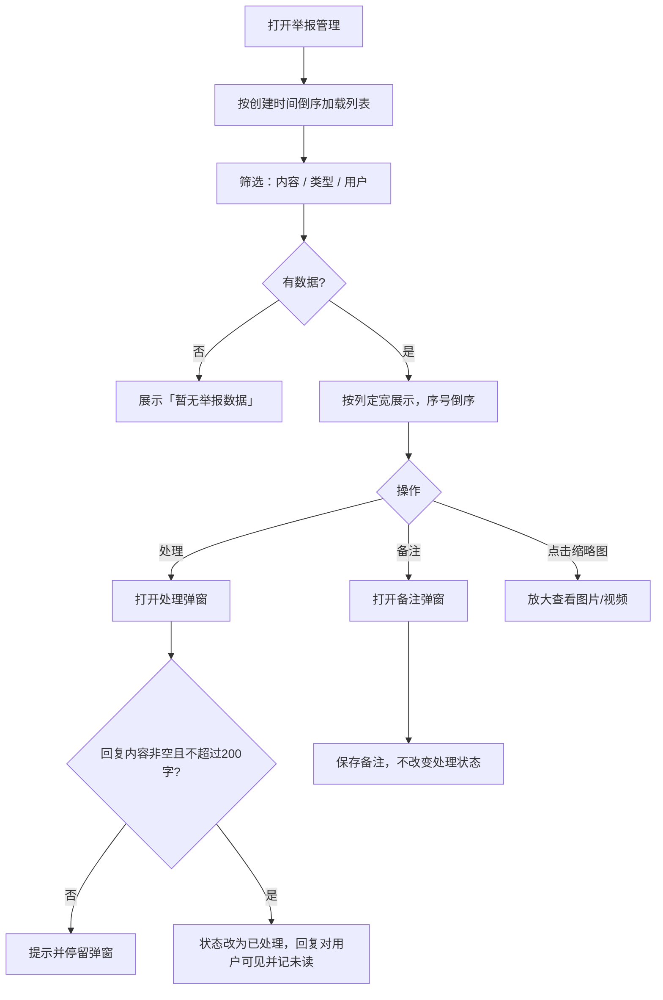
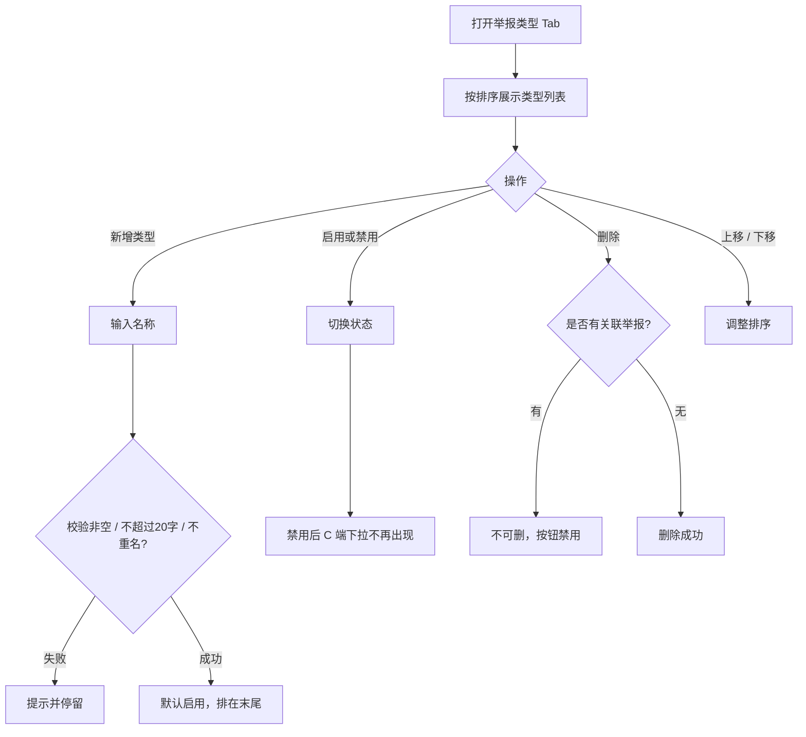
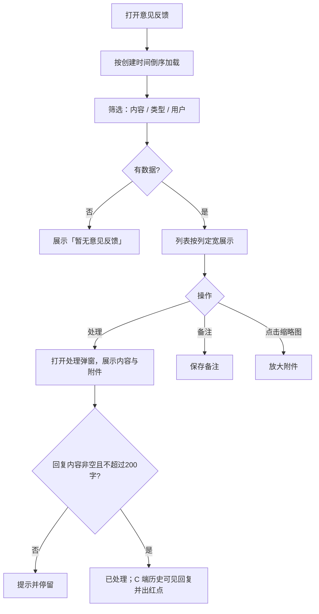
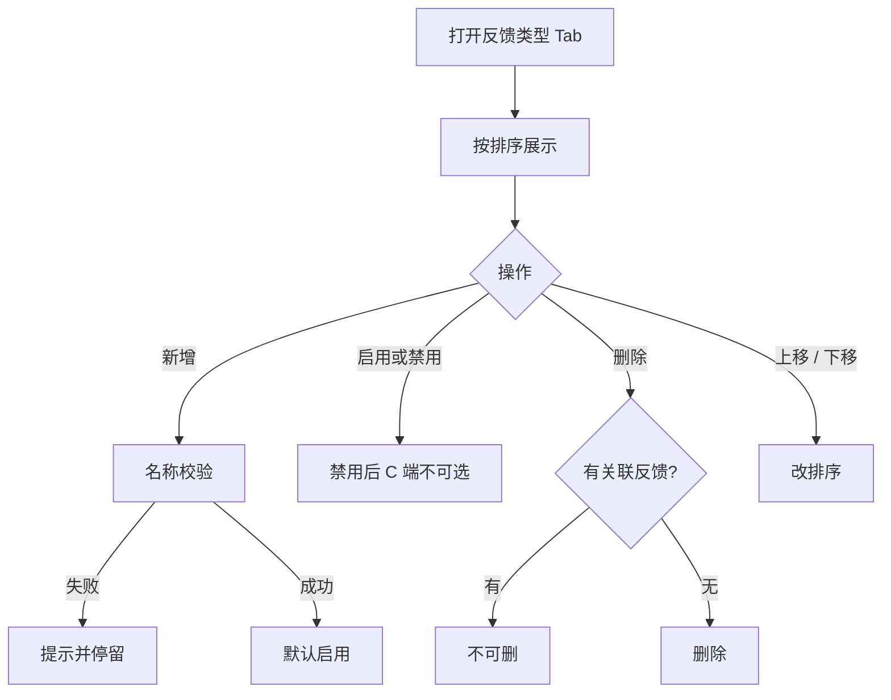
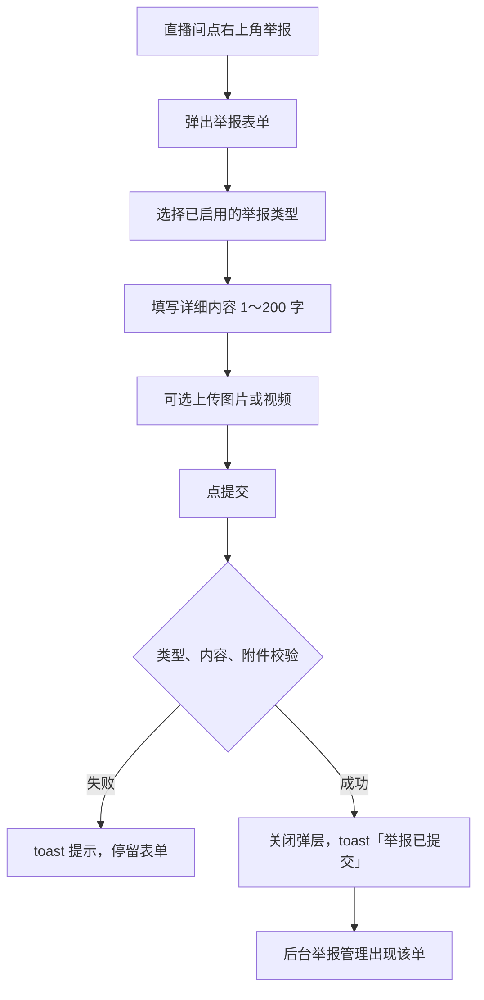
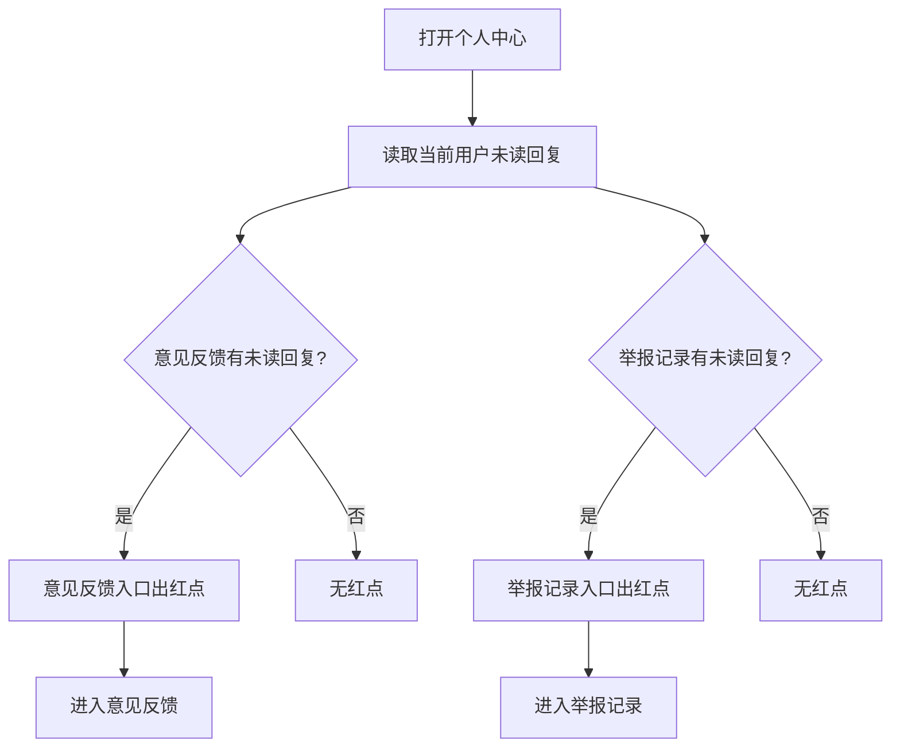
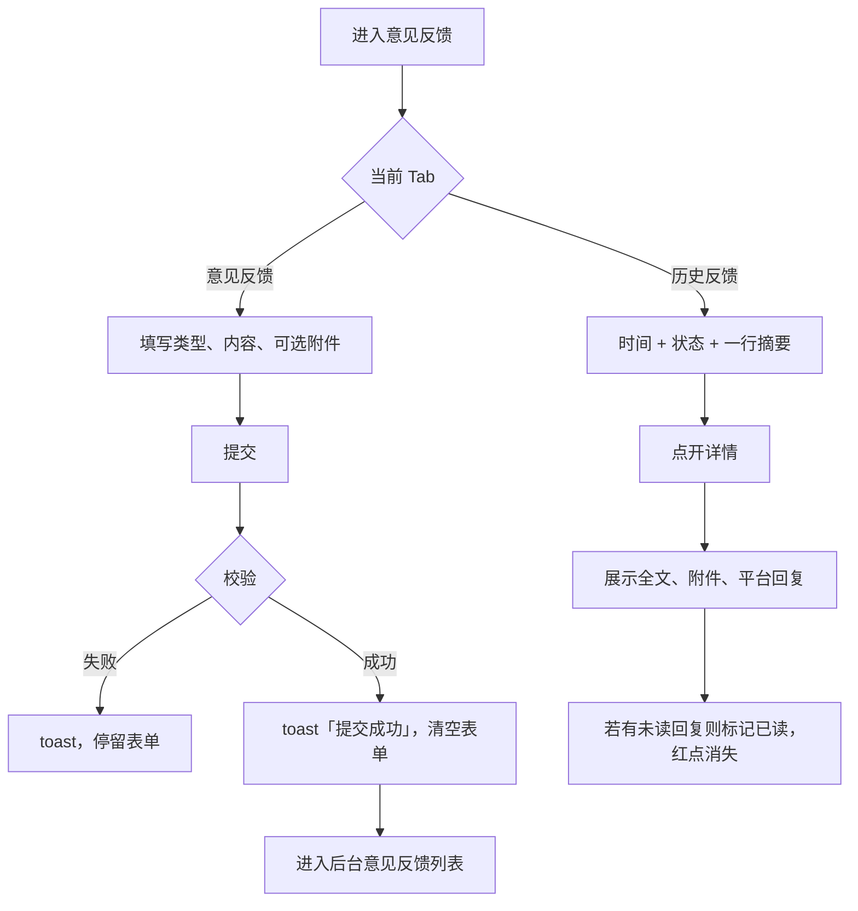
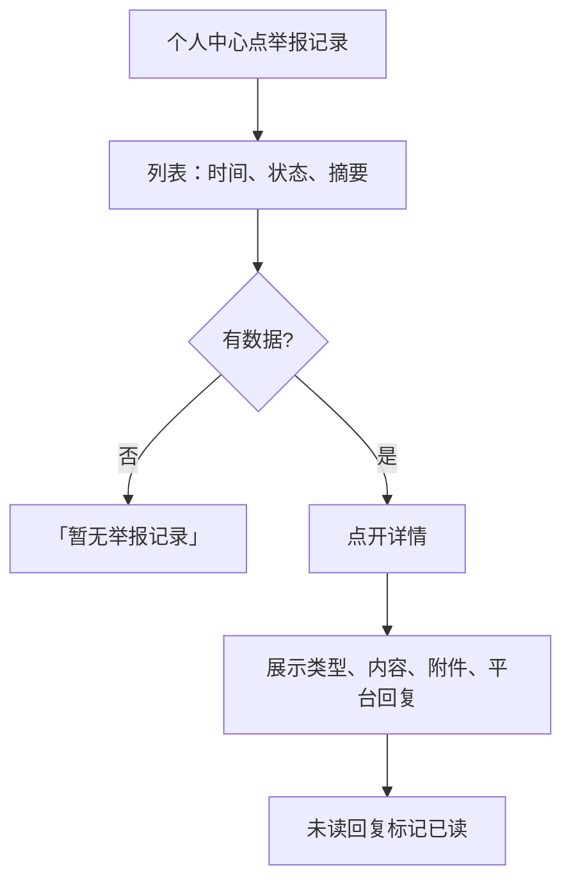

# 【312】举报和意见反馈

来源清单：`merged-20260820-01`（大版本 `2026081903举报与意见反馈` 全部小版本 `.1`～`.4`）

# 1. 后台业务 WEB 系统

## 1.1 概述

### 需求背景

直播间目前点「举报」只弹出演示提示，后台没有单据；个人中心「意见反馈」也是空链接。运营无法看到用户举报/反馈，无法回复，也无法配置 C 端可选类型。本期按合并清单 `merged-20260820-01` 补齐 B 端售后管理与 C 端提交、查询、红点闭环。

### 需求目标

1. 售后侧栏新增「举报与意见反馈」，页签可进入举报管理、意见反馈。
2. 可配置举报类型、反馈类型（20 字以内；启用/禁用；无关联才可删；可上移/下移）。禁用后 C 端不可选。
3. 用户在直播间提交举报到后台举报管理；在个人中心提交意见反馈到后台意见反馈。均可选传图片（最多 9 张、单张 ≤5MB）或视频（最多 1 个、≤100MB）。
4. 后台处理举报/反馈时回复内容必填、备注选填；处理后 C 端对应记录可见回复，未读出红点，点开详情后红点消失。
5. 列表按列定宽：内容/回复/备注两行截断、悬停看全文；处理状态徽章完整显示，不出现省略号。

## 1.2 管理范围

| 终端 | 模块 | 变更类型 |
|------|------|----------|
| B 端 MDM | 售后页签 / 侧栏 | 修改 |
| B 端 MDM | 举报管理 | 新增 |
| B 端 MDM | 举报类型 | 新增 |
| B 端 MDM | 意见反馈 | 新增 |
| B 端 MDM | 反馈类型 | 新增 |
| C 端用户 APP | 直播间举报 | 修改 |
| C 端用户 APP | 个人中心入口与红点 | 修改 |
| C 端用户 APP | 意见反馈 / 历史反馈 | 新增 |
| C 端用户 APP | 举报记录 | 新增 |

本期不做：

- 不对接真实直播审核、风控处罚、客服工单系统。
- 不支持后台代用户提交举报/反馈。
- 不支持用户在 APP 内撤回或修改已提交单据。
- 不支持按处理人、按场次批量处理。

## 1.3 需求详细说明

### 1.3.1 售后入口（页签与侧栏）

#### 1.3.1.1 功能点：售后页签与侧栏分组

售后管理页签与侧栏增加「举报管理」「意见反馈」入口，侧栏新增分组「举报与意见反馈」。

#### 1.3.1.2 功能流程图

需要说明的问题：

- 页签出现在售后单、退款单、举报管理、意见反馈四个售后页面顶部，便于来回切换。
- 无单独权限点（原型按已登录售后账号处理）。

#### 1.3.1.3 功能描述

| 项 | 内容 |
|----|------|
| 功能类型 | 查询数据 |
| 功能描述 | 售后人员从侧栏分组或顶部页签进入举报管理、意见反馈 |
| 前提业务 | 已进入售后工作台 |
| 后继业务 | 举报管理、意见反馈、类型配置 |
| 功能约束 | 无 |
| 约束描述 | 无 |
| 操作权限 | 售后后台账号 |

#### 1.3.1.4 界面设计

**1. 界面原型**

- 原型文件：`MDM/mdm_aftersale_ticket.html`、`MDM/mdm_aftersale_refund.html`、`MDM/mdm_aftersale_report.html`、`MDM/mdm_aftersale_feedback.html`
- 本地预览：`http://localhost:5173/MDM/mdm_aftersale_report`、`http://localhost:5173/MDM/mdm_aftersale_feedback`
- 布局：
  - 左侧侧栏：售后管理（售后单、退款单）；举报与意见反馈（举报管理、意见反馈）
  - 顶部页签：首页、售后单、退款单、举报管理、意见反馈
  - 当前页页签高亮

#### 数据要求

| 字段名称 | 长度 | 录入方式 | 是否非空项 | 默认显示 |
|----------|------|----------|------------|----------|
| - | - | - | - | 无新增业务字段 |

#### 1.3.1.5 逻辑描述

1. 点击侧栏或页签「举报管理」打开举报管理页；点击「意见反馈」打开意见反馈页。
2. 与变更前差异：页签和侧栏原先只有售后单、退款单。

### 1.3.2 举报管理

#### 1.3.2.1 功能点：举报列表查询与处理

展示 C 端直播间提交的举报；支持筛选、查看附件、处理（必填回复）和单独改备注。

#### 1.3.2.2 功能流程图

需要说明的问题：

- 已处理单据「处理」按钮禁用，不可再次处理；「备注」始终可改。
- 回复内容用户可在 C 端举报记录中查看；备注仅后台可见。
- 举报来源固定为直播详情，展示场次 ID（活动 ID）。

#### 1.3.2.3 功能描述

| 项 | 内容 |
|----|------|
| 功能类型 | 查询数据 / 更新数据 |
| 功能描述 | 查询、筛选举报单据；处理时填写回复；可单独维护备注；可预览附件 |
| 前提业务 | C 端直播间已提交举报，或列表已有演示数据 |
| 后继业务 | C 端举报记录展示平台回复与红点 |
| 功能约束 | 处理必须填写回复内容 |
| 约束描述 | 回复 1～200 字；备注选填，不超过 100 字 |
| 操作权限 | 售后后台账号 |

#### 1.3.2.4 界面设计

**1. 界面原型**

- 原型文件：`MDM/mdm_aftersale_report.html`
- 本地预览：`http://localhost:5173/MDM/mdm_aftersale_report`
- 布局：
  - 页内 Tab：举报管理（默认）/ 举报类型
  - 筛选：举报内容（文本）、类型（下拉，含全部）、举报用户（用户 ID / 昵称 / 手机号）；按钮「重置」「查询」
  - 表格列：序号、举报人、举报类型、举报内容、图片/视频、举报来源、举报时间、处理状态、回复内容、备注、操作
  - 操作：「处理」「备注」
  - 空态：「暂无举报数据」；底部分页
  - 处理弹窗：只读举报内容与附件；回复内容（必填，计数）；备注（选填，计数）
  - 备注弹窗：备注文本框
  - 附件点击打开灯箱放大
- 列宽规则：
  - 序号 / 类型 / 时间收窄；内容、回复、备注两行截断，悬停展示全文
  - 图片列压缩为缩略图
  - 处理状态列加宽，徽章「待处理」「已处理」完整显示，不截断

#### 数据要求

| 字段名称 | 长度 | 录入方式 | 是否非空项 | 默认显示 |
|----------|------|----------|------------|----------|
| 序号 | - | 只读展示 | Y | 倒序序号 |
| 举报人 | - | 只读展示 | Y | 头像 / 昵称 / 用户 ID |
| 举报类型 | 20 | 只读展示 | Y | 提交时的类型名称 |
| 举报内容 | 1～200 | 只读展示 | Y | 原文，列表两行截断 |
| 图片/视频 | 图≤9、视频≤1 | 只读展示 | N | 缩略图 / 视频占位 |
| 举报来源 | - | 只读展示 | Y | 直播详情 + 场次 ID |
| 举报时间 | - | 只读展示 | Y | 提交时间 |
| 处理状态 | - | 只读展示 | Y | 待处理 / 已处理 |
| 回复内容 | 1～200 | 文本框（处理弹窗） | 处理时 Y | 空 |
| 备注 | 0～100 | 文本框 | N | 空 |

#### 1.3.2.5 逻辑描述

1. 列表按创建时间倒序；序号按当前筛选结果从大到小编号。
2. 筛选：内容模糊匹配；类型精确匹配；用户匹配 ID / 昵称 / 手机号。点「查询」刷新，「重置」清空条件。
3. 处理：回复为空提示「请填写回复内容」；超过 200 字提示「回复内容不超过 200 个字」；成功后 toast「已处理并回复」，状态变为已处理，C 端该条回复未读。
4. 备注：保存后 toast「备注已保存」，不影响状态。
5. 与变更前差异：由无列表，逐步增加附件列、回复必填、列宽与状态徽章完整展示。

### 1.3.3 举报类型

#### 1.3.3.1 功能点：配置 C 端可选举报类型

维护举报类型名称、启用状态和排序，供直播间举报下拉使用。

#### 1.3.3.2 功能流程图

需要说明的问题：

- 添加人展示账号昵称和账号（原型为当前后台账号）。
- 已有关联举报的类型不可删除。

#### 1.3.3.3 功能描述

| 项 | 内容 |
|----|------|
| 功能类型 | 新增数据 / 更新数据 / 删除数据 / 查询数据 |
| 功能描述 | 新增、启用/禁用、删除、上移/下移举报类型 |
| 前提业务 | 进入举报管理页的「举报类型」Tab |
| 后继业务 | C 端直播间举报下拉只展示已启用类型 |
| 功能约束 | 名称 20 字以内且不可重名；有关联数据不可删 |
| 约束描述 | 空名称提示「请输入类型名称」；超长提示「类型名称不超过 20 个字」；重名提示「已存在同名类型」；有关联提示「已有关联数据，无法删除」 |
| 操作权限 | 售后后台账号 |

#### 1.3.3.4 界面设计

**1. 界面原型**

- 原型文件：`MDM/mdm_aftersale_report.html`（举报类型 Tab）
- 本地预览：`http://localhost:5173/MDM/mdm_aftersale_report`
- 布局：
  - 工具栏：「新增类型」
  - 表格：序号、举报类型、添加人、操作
  - 操作：启用/禁用、删除、上移、下移
  - 新增弹窗：类型名称（必填，计数 0 / 20）
  - 空态：「暂无举报类型」

#### 数据要求

| 字段名称 | 长度 | 录入方式 | 是否非空项 | 默认显示 |
|----------|------|----------|------------|----------|
| 序号 | - | 只读展示 | Y | 按排序 |
| 举报类型 | 1～20 | 文本框 | Y | 空 |
| 添加人 | - | 只读展示 | Y | 昵称 + 账号 |
| 启用状态 | - | 操作切换 | Y | 新增后默认启用 |

#### 1.3.3.5 逻辑描述

1. 新增成功 toast「类型已新增」，默认启用。
2. 启用/禁用成功分别 toast「已启用」「已禁用」。禁用后 C 端不可选该类型；已用该类型提交的历史单据仍显示原名称。
3. 无关联才可删除；有关联时删除按钮禁用，title「已有关联数据，无法删除」。
4. 上移到顶 / 下移到底时提示「已经是第一条」/「已经是最后一条」。
5. 与变更前差异：无（本次新增）。

### 1.3.4 意见反馈

#### 1.3.4.1 功能点：反馈列表查询与处理

展示 C 端意见反馈；处理必须填写回复，回复后用户在历史反馈可见并出红点。

#### 1.3.4.2 功能流程图

需要说明的问题：

- 处理逻辑与举报管理一致：回复必填、备注选填；已处理不可再点「处理」。
- 无「来源」列（反馈来自个人中心，不绑定直播场次）。

#### 1.3.4.3 功能描述

| 项 | 内容 |
|----|------|
| 功能类型 | 查询数据 / 更新数据 |
| 功能描述 | 查询、筛选意见反馈；处理时必填回复；可改备注；可预览附件 |
| 前提业务 | C 端已提交反馈，或列表已有演示数据 |
| 后继业务 | C 端历史反馈与个人中心红点 |
| 功能约束 | 处理必须填写回复内容 |
| 约束描述 | 回复 1～200 字；备注选填，不超过 100 字 |
| 操作权限 | 售后后台账号 |

#### 1.3.4.4 界面设计

**1. 界面原型**

- 原型文件：`MDM/mdm_aftersale_feedback.html`
- 本地预览：`http://localhost:5173/MDM/mdm_aftersale_feedback`
- 布局：
  - 页内 Tab：意见反馈（默认）/ 反馈类型
  - 筛选：反馈内容、类型、反馈用户（用户 ID / 昵称 / 手机号）；「重置」「查询」
  - 表格列：序号、反馈人、反馈类型、反馈内容、图片/视频、反馈时间、处理状态、回复内容、备注、操作
  - 操作：「处理」「备注」
  - 空态：「暂无意见反馈」
  - 列宽与状态徽章规则同举报管理

#### 数据要求

| 字段名称 | 长度 | 录入方式 | 是否非空项 | 默认显示 |
|----------|------|----------|------------|----------|
| 序号 | - | 只读展示 | Y | 倒序序号 |
| 反馈人 | - | 只读展示 | Y | 头像 / 昵称 / 用户 ID |
| 反馈类型 | 20 | 只读展示 | Y | 提交时的类型名称 |
| 反馈内容 | 1～200 | 只读展示 | Y | 原文，列表两行截断 |
| 图片/视频 | 图≤9、视频≤1 | 只读展示 | N | 缩略图 / 视频占位 |
| 反馈时间 | - | 只读展示 | Y | 提交时间 |
| 处理状态 | - | 只读展示 | Y | 待处理 / 已处理 |
| 回复内容 | 1～200 | 文本框（处理弹窗） | 处理时 Y | 空 |
| 备注 | 0～100 | 文本框 | N | 空 |

#### 1.3.4.5 逻辑描述

1. 筛选、分页、处理、备注、附件预览规则与举报管理相同。
2. 处理成功后该用户历史反馈及个人中心「意见反馈」入口出红点；用户打开对应详情后红点消失。
3. 与变更前差异：由无此页，到增加附件列、列宽与状态徽章完整展示。

### 1.3.5 反馈类型

#### 1.3.5.1 功能点：配置 C 端可选反馈类型

维护反馈类型，供意见反馈页下拉使用。规则与举报类型相同。

#### 1.3.5.2 功能流程图

需要说明的问题：

- 与举报类型共用同一套校验与操作，仅作用在反馈类型数据上。

#### 1.3.5.3 功能描述

| 项 | 内容 |
|----|------|
| 功能类型 | 新增数据 / 更新数据 / 删除数据 / 查询数据 |
| 功能描述 | 新增、启用/禁用、删除、排序反馈类型 |
| 前提业务 | 进入意见反馈页的「反馈类型」Tab |
| 后继业务 | C 端意见反馈下拉只展示已启用类型 |
| 功能约束 | 名称 20 字以内且不可重名；有关联数据不可删 |
| 约束描述 | 同举报类型 |
| 操作权限 | 售后后台账号 |

#### 1.3.5.4 界面设计

**1. 界面原型**

- 原型文件：`MDM/mdm_aftersale_feedback.html`（反馈类型 Tab）
- 本地预览：`http://localhost:5173/MDM/mdm_aftersale_feedback`
- 布局：工具栏「新增类型」；表格列序号、反馈类型、添加人、操作（启用/禁用、删除、上移、下移）；空态「暂无反馈类型」

#### 数据要求

| 字段名称 | 长度 | 录入方式 | 是否非空项 | 默认显示 |
|----------|------|----------|------------|----------|
| 序号 | - | 只读展示 | Y | 按排序 |
| 反馈类型 | 1～20 | 文本框 | Y | 空 |
| 添加人 | - | 只读展示 | Y | 昵称 + 账号 |
| 启用状态 | - | 操作切换 | Y | 新增后默认启用 |

#### 1.3.5.5 逻辑描述

1. 校验、启用/禁用、删除、排序提示文案与举报类型一致。
2. 与变更前差异：无（本次新增）。

# 2. 用户 APP

## 2.1 概述

C 端提供直播间举报、个人中心意见反馈与举报记录。提交写入同一套后台数据；平台回复后入口与列表出红点，点开详情后消除。

## 2.2 管理范围

见 1.2。C 端本期范围：直播间举报、个人中心两个入口及红点、意见反馈/历史反馈、举报记录。

## 2.3 需求详细说明

### 2.3.1 直播间举报

#### 2.3.1.1 功能点：提交直播举报

用户在直播间右上角点举报，填写类型、详细内容，可选附件，提交后进入后台举报管理，来源记为直播详情（场次 ID）。

#### 2.3.1.2 功能流程图

需要说明的问题：

- 类型下拉只含后台已启用的举报类型。
- 附件非必填：图片最多 9 张、单张不超过 5MB；视频最多 1 个、不超过 100MB。超限在选择时 toast 提示。

#### 2.3.1.3 功能描述

| 项 | 内容 |
|----|------|
| 功能类型 | 新增数据 |
| 功能描述 | 用户对当前直播场次提交举报 |
| 前提业务 | 后台已配置至少一条启用中的举报类型；用户在直播间 |
| 后继业务 | 后台举报管理；用户举报记录 |
| 功能约束 | 类型、详细内容必填 |
| 约束描述 | 未选类型提示「请选择举报类型」；未填内容提示「请填写详细举报内容」；内容超过 200 字不可提交 |
| 操作权限 | 登录用户 |

#### 2.3.1.4 界面设计

**1. 界面原型**

- 原型文件：`user-app/h5/live-room.html`
- 本地预览：`http://localhost:5173/user-app/h5/live-room`
- 布局：
  - 右上角「举报」入口
  - 底部弹层：标题「举报」、关闭
  - 字段：举报类型（下拉，必填）、详细举报内容（多行，必填，0 / 200）、图片/视频（九宫格 + 提示文案）
  - 底部按钮「提交」
  - 成功 toast「举报已提交」

#### 数据要求

| 字段名称 | 长度 | 录入方式 | 是否非空项 | 默认显示 |
|----------|------|----------|------------|----------|
| 举报类型 | - | 下拉 | Y | 「请选择举报类型」 |
| 详细举报内容 | 1～200 | 文本框 | Y | 空 |
| 图片/视频 | 图≤9、视频≤1 | 文件选择 | N | 空 |
| 场次 ID | - | 系统带出 | Y | 当前直播场次 |

#### 2.3.1.5 逻辑描述

1. 打开弹层时清空上次填写；类型刷新为当前已启用列表。
2. 校验失败停留弹层；成功关闭弹层并写入后台，来源为直播详情 + 场次 ID。
3. 与变更前差异：原先点举报只提示「已提交举报（演示）」，后台无记录、不能传附件。

### 2.3.2 个人中心入口与红点

#### 2.3.2.1 功能点：意见反馈、举报记录入口

功能服务增加有效入口；对应列表存在未读平台回复时入口出红点。

#### 2.3.2.2 功能流程图

需要说明的问题：

- 两个入口红点相互独立。
- 红点在用户打开对应详情并标记已读后消失。

#### 2.3.2.3 功能描述

| 项 | 内容 |
|----|------|
| 功能类型 | 查询数据 |
| 功能描述 | 进入意见反馈页、举报记录页；按未读回复展示红点 |
| 前提业务 | 用户已登录个人中心 |
| 后继业务 | 意见反馈、举报记录 |
| 功能约束 | 无 |
| 约束描述 | 无 |
| 操作权限 | 登录用户 |

#### 2.3.2.4 界面设计

**1. 界面原型**

- 原型文件：`user-app/h5/profile.html`
- 本地预览：`http://localhost:5173/user-app/h5/profile`
- 布局：功能服务列表中「意见反馈」「举报记录」；右侧可出现红点；点击进入对应页面

#### 数据要求

| 字段名称 | 长度 | 录入方式 | 是否非空项 | 默认显示 |
|----------|------|----------|------------|----------|
| - | - | - | - | 无新增录入字段 |

#### 2.3.2.5 逻辑描述

1. 意见反馈入口跳转意见反馈页；有未读平台回复时出红点。
2. 举报记录入口跳转举报记录页；有未读平台回复时出红点。
3. 与变更前差异：意见反馈原为无效链接且无红点；无举报记录入口。

### 2.3.3 意见反馈 / 历史反馈

#### 2.3.3.1 功能点：提交反馈并查看历史与回复

提交类型、内容、可选附件；历史列表简洁展示；详情可看附件和平台回复。

#### 2.3.3.2 功能流程图

需要说明的问题：

- 历史反馈 Tab 在有未读回复时展示红点。
- 列表不再用卡片铺全文，改为时间、状态、一行摘要。

#### 2.3.3.3 功能描述

| 项 | 内容 |
|----|------|
| 功能类型 | 新增数据 / 查询数据 / 更新数据 |
| 功能描述 | 提交意见反馈；查看历史；阅读平台回复并消除红点 |
| 前提业务 | 后台已配置启用中的反馈类型 |
| 后继业务 | 后台意见反馈处理 |
| 功能约束 | 类型、内容必填；附件非必填但有大小与数量限制 |
| 约束描述 | 未选类型提示「请选择反馈类型」；未填内容提示「请填写反馈内容」；内容不超过 200 字 |
| 操作权限 | 登录用户 |

#### 2.3.3.4 界面设计

**1. 界面原型**

- 原型文件：`user-app/h5/feedback.html`
- 本地预览：`http://localhost:5173/user-app/h5/feedback`
- 布局：
  - 顶栏：返回、标题「意见反馈」
  - Tab：意见反馈 / 历史反馈（可带红点）
  - 提交表单：反馈类型（必填下拉）、反馈内容（必填，0 / 200）、图片/视频（非必填提示）、提交按钮
  - 历史列表：时间、状态、一行摘要；空态「暂无历史反馈」
  - 详情层：反馈类型、内容、附件、平台回复；返回关闭详情

#### 数据要求

| 字段名称 | 长度 | 录入方式 | 是否非空项 | 默认显示 |
|----------|------|----------|------------|----------|
| 反馈类型 | - | 下拉 | Y | 「请选择反馈类型」 |
| 反馈内容 | 1～200 | 文本框 | Y | 空 |
| 图片/视频 | 图≤9、视频≤1 | 文件选择 | N | 空 |
| 平台回复 | 1～200 | 只读展示 | N | 处理后可见 |

#### 2.3.3.5 逻辑描述

1. 提交成功写入后台，表单清空；失败 toast 对应文案。
2. 历史只看当前用户单据，新在上。
3. 打开有未读回复的详情后，该条红点及个人中心入口红点按剩余未读刷新。
4. 与变更前差异：无此页 → 增加附件；历史由卡片全文改为摘要列表。

### 2.3.4 举报记录

#### 2.3.4.1 功能点：查看自己的举报与平台回复

个人中心进入，查看提交过的举报；处理后可见回复；未读出红点。

#### 2.3.4.2 功能流程图

需要说明的问题：

- 列表样式与历史反馈一致（时间 + 状态 + 一行摘要）。
- 用户不能在此修改或撤销举报。

#### 2.3.4.3 功能描述

| 项 | 内容 |
|----|------|
| 功能类型 | 查询数据 / 更新数据 |
| 功能描述 | 查看自己提交的举报及平台回复，阅读后消除红点 |
| 前提业务 | 用户曾在直播间提交举报 |
| 后继业务 | 无 |
| 功能约束 | 只读 |
| 约束描述 | 无 |
| 操作权限 | 登录用户（仅本人单据） |

#### 2.3.4.4 界面设计

**1. 界面原型**

- 原型文件：`user-app/h5/report-records.html`
- 本地预览：`http://localhost:5173/user-app/h5/report-records`
- 布局：
  - 顶栏：返回、标题「举报记录」
  - 列表：时间、状态、内容摘要；未读可带标记
  - 空态：「暂无举报记录」
  - 详情层：标题「举报详情」；举报类型、内容、附件、平台回复

#### 数据要求

| 字段名称 | 长度 | 录入方式 | 是否非空项 | 默认显示 |
|----------|------|----------|------------|----------|
| 举报类型 | - | 只读展示 | Y | 提交时的类型 |
| 举报内容 | 1～200 | 只读展示 | Y | 原文 |
| 图片/视频 | - | 只读展示 | N | 提交时的附件 |
| 平台回复 | 1～200 | 只读展示 | N | 处理后可见 |

#### 2.3.4.5 逻辑描述

1. 只展示当前用户提交的举报，新在上。
2. 有回复且未读时列表/入口出红点；打开详情后该条已读。
3. 与变更前差异：无（本次新增）。
