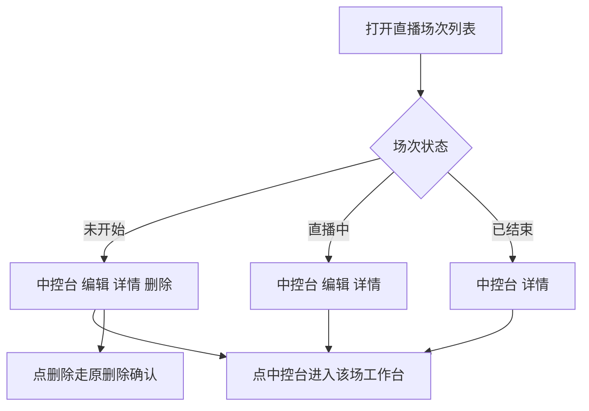
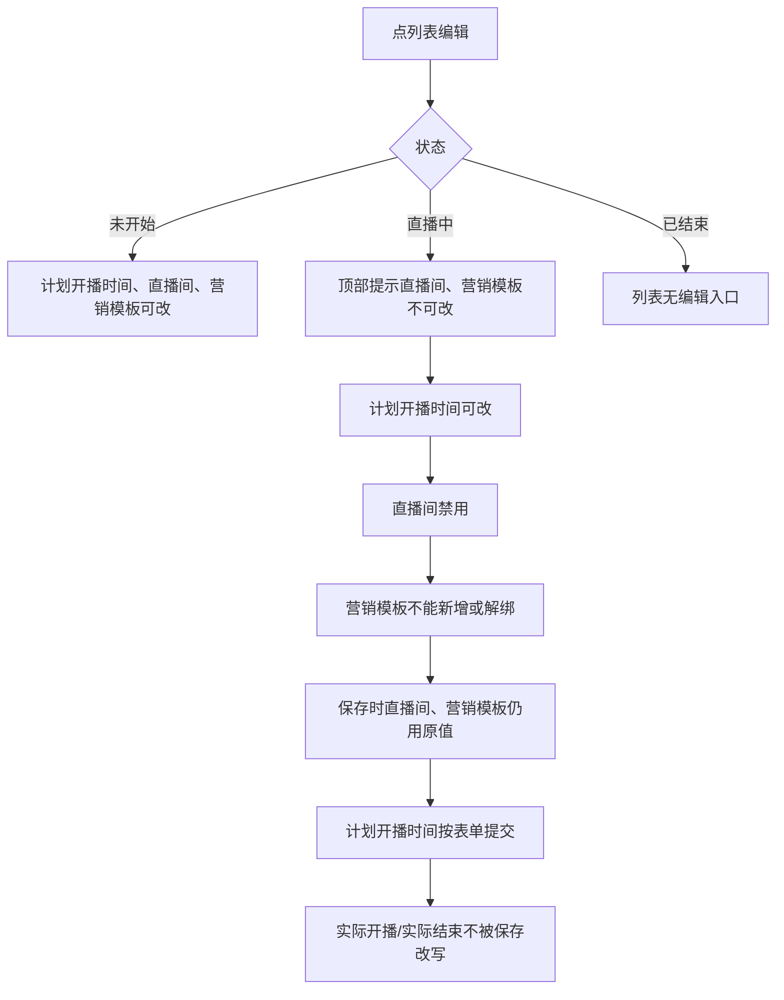
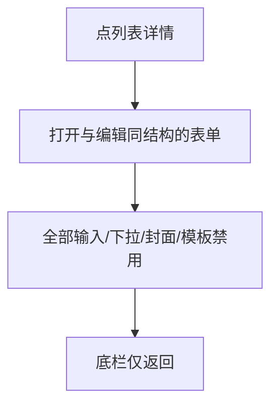
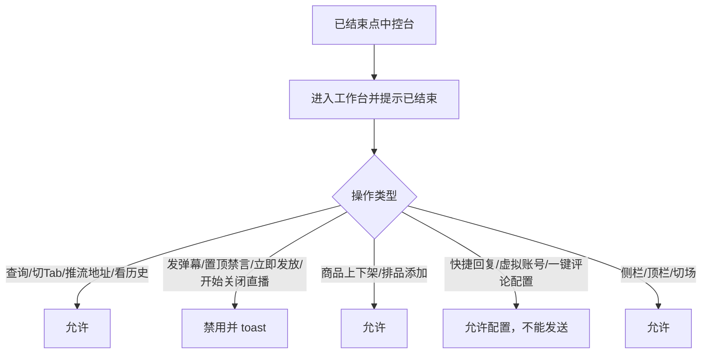
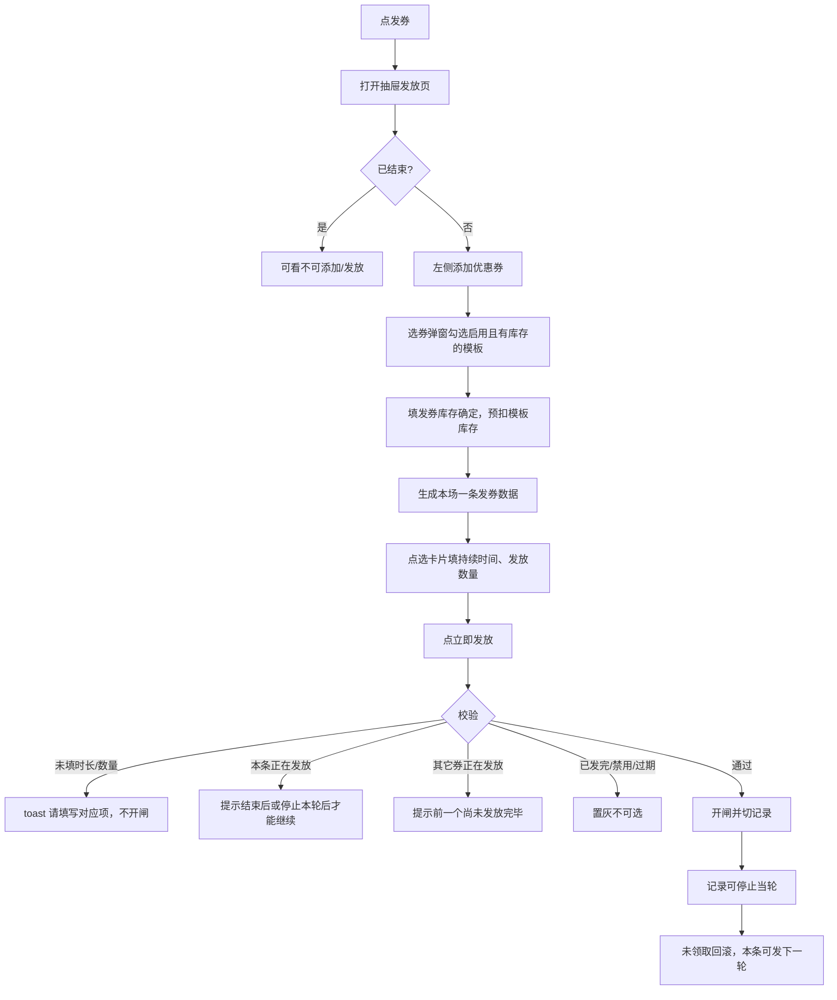
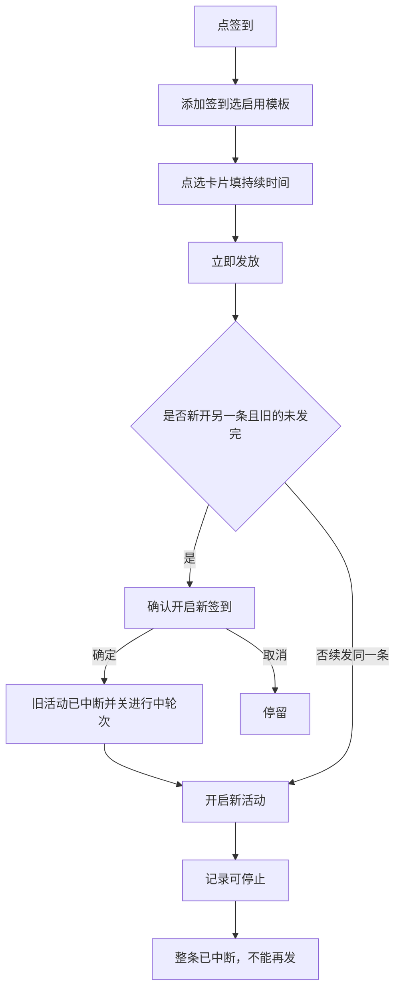
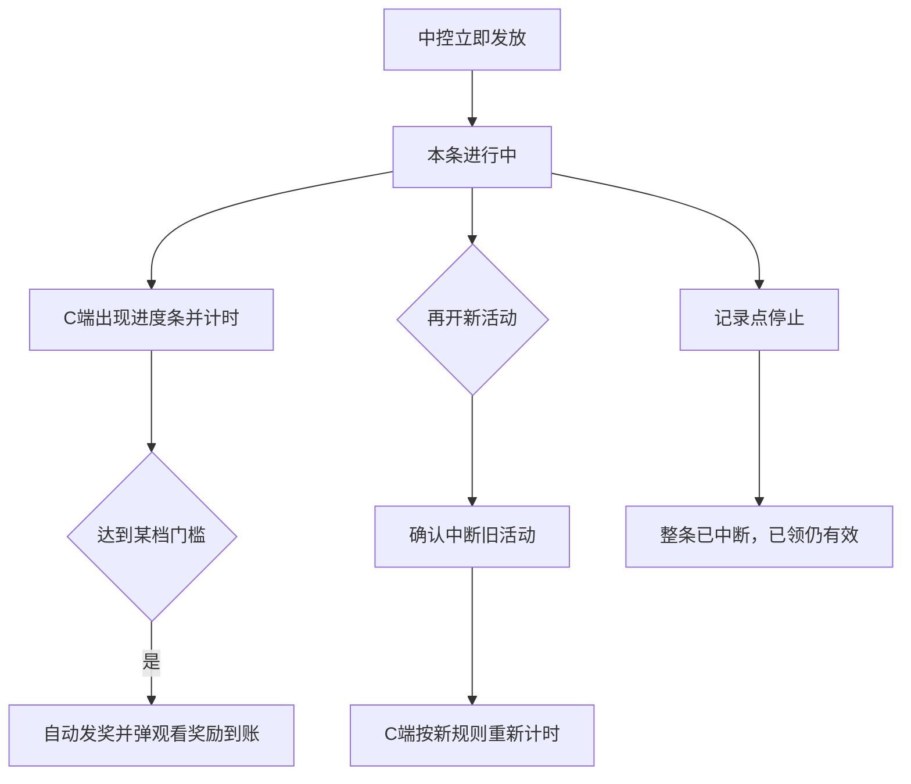
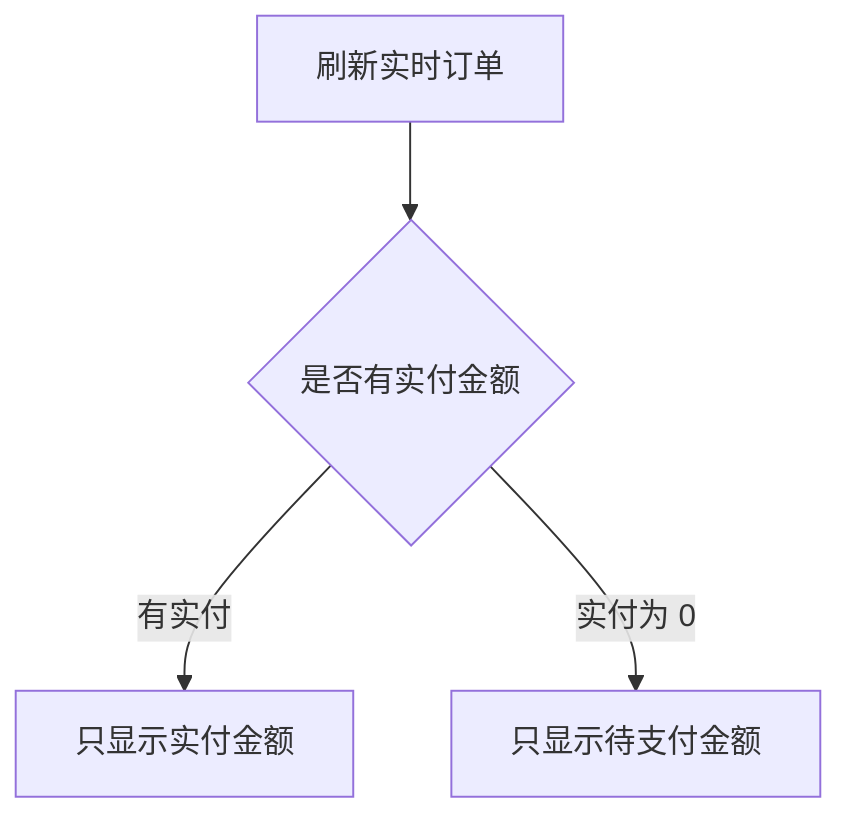
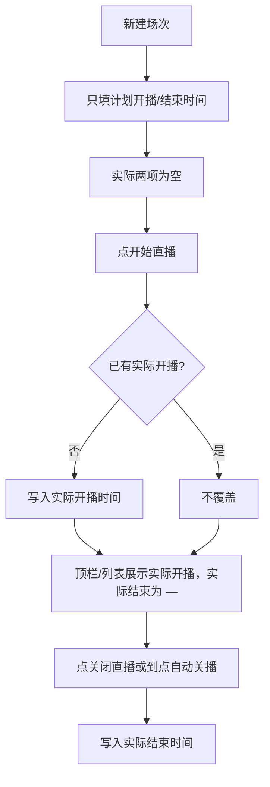

# 【466】【467】【468】【308】【305】直播场次状态对应操作和中控台的活动发放优化

来源清单：`merged-20260824-03`（大版本 `2026082301直播场次状态操作` 全部小版本 `.1`～`.27`）

# 1. 后台业务 WEB 系统

## 1.1 概述

### 需求背景

直播场次列表原先不按状态区分操作：未开始、直播中、已结束都显示「编辑、详情、进入中控、删除」，文案也不统一。直播中编辑页三个关键字段（计划开播时间、直播间、营销模板）仍可改，容易把正在播出的场次改乱。计划开播/结束时间与真实点开播、关播的时刻混在一起，列表上看不出实际开播、实际结束。详情页是另一套描述卡片，和编辑表单字段不一致。

已结束场次进入中控后，提交按钮边界不清：有的该锁没锁（发弹幕、发券、置顶禁言），有的不该锁被整页锁死（侧栏、切场、商品上下架）。营销活动原先只是中间栏一句说明加「立即发放」，看不到本场已绑活动，也不能从模板补货、预扣库存、看发放记录。

观众端观看奖励不跟中控发放状态联动，无法按档计时到账。实时订单曾并排展示「待支付/实付」两笔，已支付也会占一格 0 元，读起来费劲。发券曾把「还有剩余库存」当成未发完，停止本轮后反而不能续发；未领取的张数/个数仍占着已发库存。福袋指定中奖曾搜直播观众，结果还挤在搜索框右下角。

本期按合并清单 `merged-20260824-03`（`.1`～`.27`），把场次状态对应操作、计划时间与实际开播/结束时间、已结束中控权限、四类活动发放（券/福袋/签到/观看奖励，含互斥、回滚、指定中奖搜会员）、实时订单金额，以及福袋开奖虚拟用户补名单一次对齐。直播中编辑仅锁定直播间和营销模板，计划开播时间仍可改。

### 需求目标

1. 场次列表按状态展示操作：未开始=中控台、编辑、详情、删除；直播中=中控台、编辑、详情；已结束=中控台、详情。文案为「中控台」。
2. 直播中编辑锁定**直播间、营销模板**；**计划开播时间可改**。未开始时计划开播时间、直播间、营销模板均可改。计划开播/结束时间与实际开播/实际结束时间分开展示。
3. 详情页与编辑页同布局同字段，全部只读，底栏仅返回；含计划时间与实际时间。
4. 已结束可进中控查看历史数据；提交类操作按矩阵禁用/放开（见 1.3.4）；侧栏、顶栏、切场不被整页拦截。
5. 发券/福袋/签到/观看奖励改为右侧抽屉：本场可从模板添加多条、卡片只存模板 ID、名称规则实时读模板；发放必填项点「立即发放」时提示；记录 Tab 展示本场该类全部记录。
6. 优惠券、福袋：添加时预扣模板库存，关播释放剩余；停止只中断当前轮，同一条可继续发下一轮。同一时刻只允许一个券活动处于正在发放；停止或到期后未领取库存回滚到本活动可发数量。签到、观看奖励：停止后整条已中断，不能再发这一条。
7. C 端观看奖励仅在中控立即发放后开始计时，达标自动到账弹窗。
8. 中控实时订单右侧只展示一笔金额：支付成功展示用户实际支付金额；待支付、交易失败展示待支付金额。
9. 中控开始直播写入实际开播时间（已有不覆盖），关闭或到点自动关播写入实际结束时间；列表、编辑、详情、中控顶栏同步展示。
10. 福袋指定中奖搜索会员数据取会员360-会员管理；结果在搜索框正下方通栏两行展示（昵称+会员ID、手机号）。
11. 福袋开奖时若符合条件人数不足，按 y/a/x 规则自动补虚拟用户；名单人数为 min(y,a)；虚拟用户默认头像、随机昵称并标「虚」。

## 1.2 管理范围

| 终端 | 模块 | 变更类型 |
|------|------|----------|
| B 端 MDM | 直播场次列表 | 修改 |
| B 端 MDM | 编辑直播场次 | 修改 |
| B 端 MDM | 直播场次详情 | 修改 |
| B 端 MDM | 直播中控 · 已结束权限 | 修改 |
| B 端 MDM | 直播中控 · 发放优惠券 | 修改 |
| B 端 MDM | 直播中控 · 发放福袋 | 修改 |
| B 端 MDM | 直播中控 · 发放签到 | 修改 |
| B 端 MDM | 直播中控 · 发放观看奖励 | 修改 |
| B 端 MDM | 直播中控 · 实时订单 | 修改 |
| B 端 MDM | 直播中控 · 开播关播与实际时间 | 修改 |
| C 端用户 APP | 直播间 · 观看奖励 | 修改 |
| B 端 MDM | 直播中控 · 福袋虚拟用户开奖 | 修改 |

本期不做：

- 已结束场次不可重新开播、不可删除、不可从列表进编辑。
- 不对接真实支付、库存中心、会员中心接口（原型用演示数据）。
- 观众端不可自行配置券/福袋/签到/观看奖励。
- 定时添加排品、商品置顶/讲解/改序号/改库存/定时下架/设置，已结束场次仍不可用。
- 已结束场次不可发弹幕、置顶、回复、禁言，不可立即发放活动。


### 相关页面

点击下方链接可直接打开对应原型页：

- [直播场次](http://localhost:5173/MDM/mdm_live_session.html)
- [编辑直播场次](http://localhost:5173/MDM/mdm_live_session_form.html)
- [直播场次详情](http://localhost:5173/MDM/mdm_live_session_detail.html)
- [直播中控](http://localhost:5173/MDM/mdm_live_control.html)
- [黑灯直播间 · 用户 APP](http://localhost:5173/user-app/h5/live-room.html)

## 1.3 需求详细说明

### 1.3.1 直播场次列表操作

#### 1.3.1.1 功能点：按场次状态展示操作按钮

列表操作列按未开始 / 直播中 / 已结束展示不同按钮，顺序固定为中控台、编辑、详情、删除。

#### 1.3.1.2 功能流程图



需要说明的问题：

- 按钮文案为「中控台」，不再用「进入中控」。
- 已结束点中控台仍进入该场工作台（只读边界见 1.3.4）。
- 无单独权限点（原型按已登录 MDM 账号）。

#### 1.3.1.3 功能描述

| 项 | 内容 |
|----|------|
| 功能类型 | 查询数据 |
| 功能描述 | 按场次状态控制列表操作列按钮 |
| 前提业务 | 已进入直播场次列表 |
| 后继业务 | 进入中控 / 编辑 / 详情 / 删除 |
| 功能约束 | 已结束无编辑、无删除；直播中无删除 |
| 约束描述 | 按钮顺序固定 |
| 操作权限 | 直播场次管理账号 |

#### 1.3.1.4 界面设计

**1. 界面原型**

- 原型文件：[`MDM/mdm_live_session.html`](http://localhost:5173/MDM/mdm_live_session.html)
- 本地预览：[http://localhost:5173/MDM/mdm_live_session](http://localhost:5173/MDM/mdm_live_session)
- 布局：筛选 + 表格；开播时间、结束时间后为实际开播时间、实际结束时间；操作列链接「中控台 / 编辑 / 详情 / 删除」按状态显隐

#### 数据要求

| 字段名称 | 长度 | 录入方式 | 是否非空项 | 默认显示 |
|----------|------|----------|------------|----------|
| 场次状态 | - | 只读展示 | Y | 未开始 / 直播中 / 已结束 |
| 开播时间 / 结束时间 | - | 只读展示 | Y | 创建时填写的计划时间 |
| 实际开播时间 | - | 只读展示 | N | 未开播为 —；开播后有值 |
| 实际结束时间 | - | 只读展示 | N | 未结束为 —；关播后有值 |

#### 1.3.1.5 逻辑描述

1. 未开始：四项都有；删除仍走原确认。
2. 直播中：不展示删除。
3. 已结束：只展示中控台、详情。
4. 实际开播/结束时间列规则见 1.3.10。
5. 与变更前差异：原先所有状态都显示编辑、详情、进入中控、删除；列表没有实际开播/实际结束两列。

---

### 1.3.2 直播中编辑锁定

#### 1.3.2.1 功能点：直播中锁定直播间、营销模板

打开直播中场次编辑页时，**直播间、营销模板**只读；**开播时间（计划）可改**；其余字段仍可保存。实际开播时间、实际结束时间始终只读，保存不得改写。

#### 1.3.2.2 功能流程图



需要说明的问题：

- 「开播时间 / 结束时间」是创建场次时填的计划时间，不是中控真实开播、关播时刻。直播中仍可改计划开播时间，不会改写实际开播时间。
- 「实际开播时间 / 实际结束时间」由中控写入，编辑页只读，占位「开播后自动记录 / 关播后自动记录」。
- 保存接口（原型）对锁定的直播间、营销模板回写原值，且不改写实际时间，避免前端绕过。

#### 1.3.2.3 功能描述

| 项 | 内容 |
|----|------|
| 功能类型 | 更新数据 |
| 功能描述 | 直播中限制改直播间、营销模板；计划开播时间可改 |
| 前提业务 | 场次为直播中且从列表进入编辑 |
| 后继业务 | 保存后回列表 |
| 功能约束 | 仅直播中锁定直播间、营销模板；实际时间始终只读 |
| 约束描述 | 未开始时可改计划开播时间、直播间、营销模板 |
| 操作权限 | 直播场次管理账号 |

#### 1.3.2.4 界面设计

**1. 界面原型**

- 原型文件：[`MDM/mdm_live_session_form.html`](http://localhost:5173/MDM/mdm_live_session_form.html)
- 本地预览：[http://localhost:5173/MDM/mdm_live_session_form?id=sess-001](http://localhost:5173/MDM/mdm_live_session_form?id=sess-001)
- 布局：编辑页表单（基础信息、分发范围、腾讯云参数、营销模板）+ 固定底栏取消/保存；直播中顶部业务提示：直播间、营销模板不可修改；开播时间可编辑；计划时间下方为只读实际开播/实际结束

#### 数据要求

| 字段名称 | 长度 | 录入方式 | 是否非空项 | 默认显示 |
|----------|------|----------|------------|----------|
| 开播时间 | - | 日期时间 | Y | 创建时的计划开播 |
| 结束时间 | - | 日期时间 | Y | 创建时的计划结束 |
| 实际开播时间 | - | 只读展示 | N | 未开播为空 |
| 实际结束时间 | - | 只读展示 | N | 未关播为空 |
| 直播间 | - | 下拉（直播中只读） | Y | 原直播间 |
| 营销模板 | - | 标签选择（直播中不可增删） | N | 原绑定模板 |

#### 1.3.2.5 逻辑描述

1. 直播中：计划开播时间可改；直播间禁用；营销模板无新增/解绑。顶部提示不含开播时间。
2. 保存：直播间、营销模板用原值；计划开播时间按表单提交；实际开播/实际结束不被改写；其余字段按表单提交。
3. 未开始：计划开播时间、直播间、营销模板可改；实际两项仍只读。
4. 与变更前差异：直播中曾同时锁定计划开播时间、直播间、营销模板，保存时计划开播时间也被强制回写原值。

---

### 1.3.3 直播场次详情

#### 1.3.3.1 功能点：详情与编辑同表只读

详情页布局、字段与编辑页一致（含计划开播/结束时间与实际开播/结束时间），全部禁用，底栏只有返回。实际两项未发生时为空。

#### 1.3.3.2 功能流程图



需要说明的问题：

- 不能选区域/门店、不能改封面和模板。
- 无编辑按钮（改回去列表再点编辑，且已结束无编辑）。

#### 1.3.3.3 功能描述

| 项 | 内容 |
|----|------|
| 功能类型 | 查询数据 |
| 功能描述 | 以编辑表单的只读版查看场次 |
| 前提业务 | 列表进入详情 |
| 后继业务 | 返回列表 |
| 功能约束 | 全部只读 |
| 约束描述 | 无 |
| 操作权限 | 直播场次管理账号 |

#### 1.3.3.4 界面设计

**1. 界面原型**

- 原型文件：[`MDM/mdm_live_session_detail.html`](http://localhost:5173/MDM/mdm_live_session_detail.html)
- 本地预览：[http://localhost:5173/MDM/mdm_live_session_detail?id=sess-001](http://localhost:5173/MDM/mdm_live_session_detail?id=sess-001)
- 布局：与编辑页相同分区；底栏仅返回

#### 数据要求

字段同编辑页，录入方式均为只读展示。

#### 1.3.3.5 逻辑描述

1. 打开详情：按场次 ID 填表并全部禁用。
2. 无保存。
3. 计划时间与实际时间分开展示，规则同编辑页（见 1.3.10）。
4. 与变更前差异：原先详情是另一套描述卡片（含关播设置、C 端人数、状态备注），且有编辑按钮；计划开播曾被标成「实际开播时间」。

---

### 1.3.4 已结束中控权限边界

#### 1.3.4.1 功能点：已结束可进中控，按矩阵锁提交

已结束场次点中控台进入工作台。顶栏提示「已结束，操作提交已禁用」。查询、切 Tab、看推流地址可用。提交类操作按下列矩阵。

**禁用（点了 toast「已结束场次仅可查看，不能提交操作」或对应专项文案）：**

- 开始直播、关闭直播
- 发弹幕、置顶发送；弹幕输入框禁用
- 立即发放优惠券/福袋/签到/观看奖励；添加活动
- 弹幕置顶/回复/禁言/屏蔽；观看记录禁言/恢复
- 商品置顶、讲解、改序号、改库存、定时下架、设置
- 排品定时添加

**仍可用：**

- 查询、重置、切 Tab、看推流地址
- 查看历史弹幕、观看记录、实时数据（当前在线 0，累计/峰值/点赞/订单保留）
- 直播商品上架/预告/下架、SKU 上下架、批量下架
- 排品「添加到直播商品」、批量添加（弹出上架/预告可选确定）
- 虚拟互动账号、快捷回复、一键评论：可打开、增删、排序、勾选（不能发弹幕）
- 左侧菜单、顶栏、返回直播场次、选择其他场次
- 打开发券等抽屉查看（不挡侧栏和顶栏），不能发放

#### 1.3.4.2 功能流程图



需要说明的问题：

- 锁的是工作台提交，不是整页所有链接。
- 发券等抽屉打开时不挡住侧栏和顶栏。
- 已结束弹幕专项 toast：「已结束场次不能发布弹幕」；活动：「已结束场次不能发放活动，仅可查看」；置顶禁言：「已结束场次不能置顶、回复或禁言」。

#### 1.3.4.3 功能描述

| 项 | 内容 |
|----|------|
| 功能类型 | 查询数据 / 更新数据（仅允许的商品/配置项） |
| 功能描述 | 已结束中控只读边界与例外放开项 |
| 前提业务 | 已结束场次进入中控 |
| 后继业务 | 查看历史；维护商品上下架与话术库 |
| 功能约束 | 见矩阵 |
| 约束描述 | 无 |
| 操作权限 | 已进入该场中控的账号 |

#### 1.3.4.4 界面设计

**1. 界面原型**

- 原型文件：[`MDM/mdm_live_control.html`](http://localhost:5173/MDM/mdm_live_control.html)
- 本地预览：[http://localhost:5173/MDM/mdm_live_control?sessionId=sess-003](http://localhost:5173/MDM/mdm_live_control?sessionId=sess-003)
- 布局：顶栏状态徽标 +「已结束，操作提交已禁用」；左中右工作台；禁用控件置灰

#### 数据要求

| 字段名称 | 长度 | 录入方式 | 是否非空项 | 默认显示 |
|----------|------|----------|------------|----------|
| 场次状态 | - | 只读展示 | Y | 已结束 |
| 当前在线 | - | 只读展示 | Y | 0 |

#### 1.3.4.5 逻辑描述

1. 进入已结束中控：提示只读；按矩阵禁用提交。
2. 点禁用操作：toast 拦截，不提交。
3. 历史弹幕、观看名单、累计指标不隐藏。
4. 与变更前差异：原先已结束不能点开始直播，但商品上下架、发弹幕、发券等仍可点；或整页点击被拦截导致侧栏也打不开。

---

### 1.3.5 发放优惠券

#### 1.3.5.1 功能点：抽屉发放、从模板添加、记录与停止当轮

点「发券」打开右侧约 820px 抽屉，Tab「发放优惠券 / 优惠券记录」。本场可从券模板多次添加；卡片只存模板 ID 与本场库存进度；立即发放开闸；记录展示本场全部发券；停止只中断当前轮。

#### 1.3.5.2 功能流程图



需要说明的问题：

- 选券弹窗与会员-会员等级-新增「选择优惠券」一致：商品优惠券 Tab、按名称搜索、表格勾选、分页；底部另填发券库存。
- 名称、门槛、面值、模板状态不落库，按模板 ID 实时读。
- 互斥只认「正在发放」（进行中窗口）：当前卡片正在发放时不能再开闸；其它券只要没有正在发放的也可以立即发放。不要把「发过且还有剩余库存」当成未发完。
- 停止：只中断当前这一轮，记录该轮为已中断；活动卡片不标已中断。未领取数量回滚到本活动可发库存（本轮发放数量−领取人数），记录出现「回滚库存」，toast 提示回滚张数。本轮到期自动结束同样回滚。同一张券可继续立即发放下一轮。额度发完显示已结束，不能再发这一条。
- 关播后剩余库存=总数量−发放数量，释放回券模板，卡片出现「释放库存 xxx」，不能再立即发放。关播释放与当轮回滚不是同一件事。
- 添加按钮在发放页左侧。

#### 1.3.5.3 功能描述

| 项 | 内容 |
|----|------|
| 功能类型 | 新增数据 / 更新数据 |
| 功能描述 | 本场从券模板添加并开闸发放，记录可停当轮 |
| 前提业务 | 已进入中控；场次未结束才能添加/发放 |
| 后继业务 | 优惠券记录；关播释放库存 |
| 功能约束 | 库存正整数且不超过模板剩余；持续时间和发放数量必填正整数；同一模板可多次添加 |
| 约束描述 | 已结束不能添加、不能发放 |
| 操作权限 | 直播中控操作账号 |

#### 1.3.5.4 界面设计

**1. 界面原型**

- 原型文件：[`MDM/mdm_live_control.html`](http://localhost:5173/MDM/mdm_live_control.html)（`#welfareDrawer`、选券弹窗）
- 本地预览：[http://localhost:5173/MDM/mdm_live_control?sessionId=sess-001](http://localhost:5173/MDM/mdm_live_control?sessionId=sess-001)
- 布局：
  - 发放页左侧「添加优惠券」；紧凑卡片：标题加粗门槛+面值（如满99减20），正在发放标签；第二行券名称（模板 ID）、发放数量已发/总数、发放轮次（暂未发放/已发 n 轮）；禁用展示【禁用】；已发完或停用/过期置灰
  - 底部持续时间、发放数量（空、必填星号），「立即发放」可点
  - 记录 Tab：本场全部记录，最新在上，序号倒序最大在最上；标题为模板实时名称；轮次从 1；参与人数、参与次数；进行中可停止；停止或到期后可展示「回滚库存」

#### 数据要求

| 字段名称 | 长度 | 录入方式 | 是否非空项 | 默认显示 |
|----------|------|----------|------------|----------|
| 券模板 ID | - | 选券弹窗 | Y | - |
| 发券库存 | 正整数 | 文本框 | Y | 空 |
| 持续时间 | 正整数（分钟） | 文本框 | Y（发放时） | 空，无默认 |
| 发放数量 | 正整数 | 文本框 | Y（发放时） | 空，无默认 |
| 门槛/面值/名称/状态 | - | 只读（模板实时） | - | 跟模板 |

#### 1.3.5.5 逻辑描述

1. 未选活动点发放：提示请先选择优惠券活动。
2. 未填持续时间/发放数量：按钮仍可点，从上到下 toast「请填写持续时间」「请填写发放数量」，不开闸。
3. 当前券正在发放：立即发放置灰或点击提示「当前券活动正在发放，结束后或停止本轮后才能继续发放」，不会再开一轮。
4. 其它券正在发放：提示前一个券活动尚未发放完毕，不能发放下一个。没有正在发放窗口时，即使还有剩余库存也可以发下一个或续发本条。
5. 停止当轮：确认「确认提前停止此轮发放？停止后本轮变为已中断，未领取的券库存回滚到本活动可发数量，该券仍可继续发放下一轮。」；该轮已中断；未领取回滚；「正在发放」消失；立即发放恢复。
6. 关播释放剩余库存回模板。
7. 与变更前差异：原先中间栏内嵌说明+立即发放 toast 演示，无抽屉、无模板添加、无预扣释放、无记录；后续曾把剩余库存当成未发完导致停止后不能再发，未领取也不回滚。

---

### 1.3.6 发放福袋

#### 1.3.6.1 功能点：抽屉发放、模板添加、中奖设置、指定中奖、开奖补虚拟用户

点「福袋」打开约 860px 抽屉。可添加福袋模板并预扣库存；中奖设置单选需保存；中奖类型随机或指定；停止只中断当轮。本轮倒计时结束、提前停止或中断时开奖：符合条件人数不足则按 y/a/x 补虚拟用户（对应小版本 `2026082301.27`）。

#### 1.3.6.2 功能流程图

```mermaid
flowchart TD
  A[点福袋] --> B[发放页]
  B --> C[保存福袋中奖设置]
  C --> D[添加福袋并预扣库存]
  D --> E[点选卡片填时长、中奖人数]
  E --> F{中奖类型}
  F -->|随机| G[立即发放]
  F -->|指定中奖| H[搜索会员加入名单]
  H --> I{指定人数}
  I -->|大于中奖人数| J[拦截]
  I -->|小于等于| K[不足则随机补足后开闸]
  G --> L[切记录]
  K --> L
  L --> M[停止只中断当轮]
  M --> N[未领取回滚，可发下一轮]
  L --> O[倒计时结束 / 提前停止 / 中断]
  M --> O
  O --> P[开奖]
  P --> Q[指定中奖优先保留]
  Q --> R[其余从符合条件的参与人中抽]
  R --> S{名单人数}
  S -->|y≤a 且 x<y| T[补 y-x 个虚拟用户]
  S -->|y>a 且 x<a| U[补 a-x 个虚拟用户]
  S -->|真实人数已够| V[不补虚拟]
  T --> W[名单人数 min(y,a)]
  U --> W
  V --> W
  W --> X[记录展示中奖用户，虚拟标虚]
```

需要说明的问题：

- 参与规则固定：「每人每轮福袋都可以参与」，不可改。
- 中奖设置单选：每个场次每人只能中一次（默认）/ 每个福袋模板每人只能中一次 / 不限制；改选项后点保存才生效。问号悬停：每个人均可以参与任意一轮；若每人只能中一次，下次随机开奖自动剔除此人。
- 指定中奖不受中奖设置规则控制。指定人数不得大于本轮中奖人数；小于则可发，差额随机。悬停「指定中奖」说明该规则。
- 搜索会员数据取**会员360-会员管理**（列表种子如 U10001 小程序用户A，以及 localStorage 同步会员），按会员 ID、昵称、手机号搜。不再用直播间观众账号（如 10086011、u-guozi）。
- 点搜索后，结果在搜索框正下方通栏列表展开，每条两行：第一行昵称（会员ID），第二行手机号；可点选加入指定中奖。
- 停止当轮：未领取回滚到本活动可发库存（本轮中奖人数−已中奖人数），记录出现「回滚库存」。关播剩余仍释放回福袋模板。
- 奖品按模板实时：券/积分/商品。卡片第二行与优惠券一致。
- 已结束只读，不能改勾选、不能添加、不能发放。上一轮进行中时下一轮发放禁用。
- **开奖补虚拟用户（2026082301.27）**：y=本轮中奖人数，a=参与人数，x=符合中奖条件人数。名单人数 = min(y, a)。若 y≤a 且 x<y，补 y−x 个虚拟用户；若 y>a 且 x<a，补 a−x 个虚拟用户。虚拟用户默认头像、随机昵称并标「虚」；真实中奖用户展示头像首字。指定中奖优先保留。

#### 1.3.6.3 功能描述

| 项 | 内容 |
|----|------|
| 功能类型 | 新增数据 / 更新数据 |
| 功能描述 | 本场添加福袋并开闸，支持随机/指定中奖；开奖人数不足时补虚拟用户 |
| 前提业务 | 已进入中控 |
| 后继业务 | 福袋记录；关播释放库存 |
| 功能约束 | 库存、时长、中奖人数必填正整数；指定中奖时名单必填且人数≤中奖人数 |
| 约束描述 | 停止只停当轮 |
| 操作权限 | 直播中控操作账号 |

#### 1.3.6.4 界面设计

**1. 界面原型**

- 原型文件：[`MDM/mdm_live_control.html`](http://localhost:5173/MDM/mdm_live_control.html)（`#welfareDrawer`、`#addBagDialog`）
- 本地预览：[http://localhost:5173/MDM/mdm_live_control?sessionId=sess-001](http://localhost:5173/MDM/mdm_live_control?sessionId=sess-001)
- 布局：顶部「福袋中奖设置」横排单选+保存+问号；左侧添加福袋；紧凑卡片；指定中奖搜索框下通栏会员结果（两行：昵称+会员ID、手机号）；记录同券（模板名、倒序序号、轮次从 1、参与人数/次数、中奖名单脱敏、回滚库存）。中奖用户区：真实用户圆形头像（首字）+ 脱敏昵称；虚拟用户默认头像 + 随机昵称 + 橙色「虚」标

#### 数据要求

| 字段名称 | 长度 | 录入方式 | 是否非空项 | 默认显示 |
|----------|------|----------|------------|----------|
| 福袋模板 ID | - | 弹窗点选 | Y | - |
| 福袋库存 | 正整数 | 文本框 | Y | 空 |
| 福袋持续时间 | 正整数 | 文本框 | Y（发放时） | 空 |
| 中奖人数 | 正整数 | 文本框 | Y（发放时） | 空 |
| 中奖设置 | - | 单选+保存 | Y | 每个场次每人只能中一次 |
| 中奖类型 | - | 单选 | Y | 随机 |
| 指定中奖用户 | - | 搜索添加 | 指定中奖时 Y | 空 |
| 中奖用户 | - | 系统生成 / 只读 | N | 开奖前为空 |
| 是否虚拟 | - | 系统 | - | 真实无标；虚拟标「虚」 |

#### 1.3.6.5 逻辑描述

1. 未填时长/人数/指定用户：立即发放可点，依次 toast「请填写福袋持续时间」「请填写中奖人数」「请填写指定中奖用户」。
2. 指定人数 > 中奖人数：拦截。指定人数 < 中奖人数：开闸成功提示指定几人、其余几人随机。
3. 搜索：输入会员 ID/手机号/昵称后点搜索，匹配会员360会员，结果紧贴搜索框下方整行展开。
4. 停止当轮：确认「确认提前停止此轮福袋？停止后本轮变为已中断，未领取的福袋库存回滚到本活动可发数量，该福袋仍可继续发放下一轮。」；未领取回滚；活动可续发下一轮。
5. 开奖时机：倒计时结束、提前停止、中断活动。指定中奖优先保留，其余从符合条件的参与人中抽。
6. 开奖补虚拟用户：y=中奖人数，a=参与人数，x=符合条件人数。若 y≤a 且 x<y，补 y−x 个虚拟用户；若 y>a 且 x<a，补 a−x 个虚拟用户。名单人数 = min(y, a)。虚拟用户默认头像、随机昵称、标「虚」。
7. 与变更前差异：原先无抽屉、无模板添加、仅随机、无指定补足、停止会整条中断；指定中奖曾搜直播观众且结果挤在右下角；停止不回滚未领取库存。开奖后中奖名单只含指定用户或空名单，不会按参与人数和符合条件人数补虚拟用户。

#### 1.3.6.6 开奖补虚拟用户（小版本 2026082301.27）

倒计时结束、提前停止或中断时开奖。y=本轮中奖人数，a=参与人数，x=符合中奖条件人数。名单人数为 min(y, a)。真实中奖不够时自动补虚拟用户。

- 若 y≤a 且 x<y：补 y−x 个虚拟用户。
- 若 y>a 且 x<a：补 a−x 个虚拟用户。
- 虚拟用户：默认头像、随机昵称、橙色「虚」标。真实用户：头像首字。
- 指定中奖优先保留，其余从符合条件的参与人中抽。

---

### 1.3.7 发放签到

#### 1.3.7.1 功能点：多活动添加、开新活动中断旧活动、停止整条

点「签到」打开约 760px 抽屉。本场可挂多条签到（只存模板 ID+本场进度）。开启尚未开闸的新活动时，若存在已发未完未中断的其他签到，需确认后中断旧活动。停止后整条已中断，不能再发这一条。

#### 1.3.7.2 功能流程图



需要说明的问题：

- 确认文案标题「确定要开启新的签到活动吗？」；说明当前有未发放完毕的签到，开启新活动则之前活动中断且无法再次发放；用户重新签到新活动；已领奖励仍有效。
- 续发同一条未完成活动不弹此确认。
- 卡片：名称+状态，摘要（模板 ID、签到次数、已发/总轮、人次、奖励摘要），轮次胶囊（已发/可发/中断划掉）。
- 添加按钮在左侧。已结束不能添加、不能发放。
- 持续时间必填正整数，无默认；未填点立即发放 toast「请填写持续时间」。

#### 1.3.7.3 功能描述

| 项 | 内容 |
|----|------|
| 功能类型 | 新增数据 / 更新数据 |
| 功能描述 | 本场多条签到轮次发放，新开可中断旧活动 |
| 前提业务 | 已进入中控 |
| 后继业务 | 签到记录；C 端签到（清单未改 C 端签到页则不扩展） |
| 功能约束 | 仅启用模板可添加；停止后该条不能再发 |
| 约束描述 | 已领奖励仍有效 |
| 操作权限 | 直播中控操作账号 |

#### 1.3.7.4 界面设计

**1. 界面原型**

- 原型文件：[`MDM/mdm_live_control.html`](http://localhost:5173/MDM/mdm_live_control.html)（`#addSignDialog`）
- 本地预览：[http://localhost:5173/MDM/mdm_live_control?sessionId=sess-001](http://localhost:5173/MDM/mdm_live_control?sessionId=sess-001)
- 布局：添加弹窗含活动名称、模板 ID、签到次数、每轮奖励、模板状态；发放卡片紧凑；记录本场全部、倒序序号、模板名、轮次从 1、参与人数/次数

#### 数据要求

| 字段名称 | 长度 | 录入方式 | 是否非空项 | 默认显示 |
|----------|------|----------|------------|----------|
| 签到模板 ID | - | 弹窗点选 | Y | - |
| 持续时间 | 正整数 | 文本框 | Y（发放时） | 空 |
| 已用轮次/是否中断/人次 | - | 系统 | - | 0 / 否 / 0 |

#### 1.3.7.5 逻辑描述

1. 名称、次数、奖励按模板实时读，含关联券/福袋奖。
2. 停止：确认后整条已中断，立即发放不可用。
3. 全部轮次完成显示已结束，可发放下一个活动。
4. 与变更前差异：一场只绑一个签到；无模板添加；停止语义与券相同未拆开。

---

### 1.3.8 发放观看奖励

#### 1.3.8.1 功能点：多活动发放、C 端计时到账、停止整条

点「观看任务/观看奖励」打开约 760px 抽屉，Tab「开始任务 / 任务记录」（发放页「添加观看奖励」）。本场可挂多条，只存模板 ID 与发放状态。立即发放后 C 端开始计时。进行中再开新活动需确认并中断旧活动。记录可停止，停止后整条已中断。

#### 1.3.8.2 功能流程图



需要说明的问题：

- 未发放不计时、无进度。发放后才通知 C 端。
- 新活动确认文案：标题「确定要开启新的观看奖励活动吗？」；说明未发放完毕的观看奖励会被中断；用户按新活动计算；已领仍有效。
- 对已发放的同一条不能重复发放。
- 左下角「观看奖励验收开关」可切未发放/已发放未达标/达成第1档/第2档/全部已领/中断后按新活动，点应用并刷新（仅原型验收）。
- 卡片状态：未发放/进行中/已结束/已中断；档位胶囊「观看满 x 分钟+奖励」。

#### 1.3.8.3 功能描述

| 项 | 内容 |
|----|------|
| 功能类型 | 新增数据 / 更新数据 |
| 功能描述 | 中控发放观看奖励，C 端按档计时到账 |
| 前提业务 | 中控添加模板并立即发放 |
| 后继业务 | C 端进度与到账弹窗 |
| 功能约束 | 仅启用模板；停止后该条不能再发 |
| 约束描述 | 已领奖励仍有效 |
| 操作权限 | 中控操作账号；C 端当前观众 |

#### 1.3.8.4 界面设计

**1. 界面原型**

- 原型文件：[`MDM/mdm_live_control.html`](http://localhost:5173/MDM/mdm_live_control.html)、`user-app/h5/live-room.html`
- 本地预览：
  - `http://localhost:5173/MDM/mdm_live_control?sessionId=sess-001`
  - `http://localhost:5173/user-app/h5/live-room.html`
- 布局：B 端抽屉与签到类似；C 端直播间观看进度条、到账弹窗、左下验收开关

#### 数据要求

| 字段名称 | 长度 | 录入方式 | 是否非空项 | 默认显示 |
|----------|------|----------|------------|----------|
| 观看奖励模板 ID | - | 弹窗点选 | Y | - |
| 是否已发放/是否中断/人次 | - | 系统 | - | 否 / 否 / 0 |
| 观看时长 | - | C 端累计 | - | 未发放为 0 |

#### 1.3.8.5 逻辑描述

1. 添加后未点立即发放：C 端无进度。
2. 达标自动到账弹窗「观看奖励到账」。
3. 中断切新活动后按新规则重新计时，旧已领仍有效。
4. 记录停止：进行中出现「停止」，确认后已中断，可发放下一个观看奖励。
5. 与变更前差异：一场只能发一次观看任务；无 C 端计时；记录无停止。

---

### 1.3.9 实时订单金额

#### 1.3.9.1 功能点：只展示一笔金额

监控区实时订单右侧只显示一笔金额。支付成功展示用户实际支付金额，悬停「实付金额」；待支付、交易失败等未实付时展示待支付金额，悬停「待支付金额」。

#### 1.3.9.2 功能流程图



需要说明的问题：

- 不再并排「待支付/实付」两笔，中间不用斜线。
- 演示：已支付显示实付（如 ¥39.80）；待支付显示待支付金额（如 ¥0.01）；交易失败显示待支付金额（如 ¥1.00）。

#### 1.3.9.3 功能描述

| 项 | 内容 |
|----|------|
| 功能类型 | 查询数据 |
| 功能描述 | 实时订单按有无实付只展示一笔金额 |
| 前提业务 | 中控监控区有订单 |
| 后继业务 | 无 |
| 功能约束 | 无 |
| 约束描述 | 无 |
| 操作权限 | 进入中控即可查看 |

#### 1.3.9.4 界面设计

**1. 界面原型**

- 原型文件：[`MDM/mdm_live_control.html`](http://localhost:5173/MDM/mdm_live_control.html)（`#monitorOrders`）
- 本地预览：[http://localhost:5173/MDM/mdm_live_control?sessionId=sess-001](http://localhost:5173/MDM/mdm_live_control?sessionId=sess-001)
- 布局：订单行右侧一笔金额，悬停显示「实付金额」或「待支付金额」；下为状态与时间

#### 数据要求

| 字段名称 | 长度 | 录入方式 | 是否非空项 | 默认显示 |
|----------|------|----------|------------|----------|
| 实付金额 | - | 只读展示 | N | 有实付时展示 |
| 待支付金额 | - | 只读展示 | N | 实付为 0 时展示 |

#### 1.3.9.5 逻辑描述

1. 支付成功（有实付）：只显示用户实际支付金额，title「实付金额」。
2. 待支付或交易失败（未实付）：只显示待支付金额，title「待支付金额」。
3. 与变更前差异：曾固定并排「待支付金额/实付金额」两笔（已支付为 ¥0.00/实付，待支付为待支付/¥0.00）；更早只展示一笔订单总额。

---

### 1.3.10 实际开播时间与实际结束时间

#### 1.3.10.1 功能点：计划时间与真实开播/关播时刻分开

列表、编辑、详情、中控顶栏区分计划开播/结束时间与实际开播/实际结束时间。实际时间由中控写入，不可手工改。

#### 1.3.10.2 功能流程图



需要说明的问题：

- 计划「开播时间 / 结束时间」仍是创建时填写的字段。
- 点开始直播：写入当前时间到实际开播时间，已有则不覆盖。
- 点关闭直播或到点自动关播：写入实际结束时间。
- 未开播列表两列均为 —；直播中仅实际开播有值；已结束两列都有值。

#### 1.3.10.3 功能描述

| 项 | 内容 |
|----|------|
| 功能类型 | 新增数据 / 更新数据 |
| 功能描述 | 记录并展示真实开播、关播时刻 |
| 前提业务 | 场次已创建；中控点开始/关闭直播 |
| 后继业务 | 列表、编辑、详情、中控顶栏展示 |
| 功能约束 | 实际时间只读；保存编辑不得改写 |
| 约束描述 | 已有实际开播不因再次点开始而覆盖 |
| 操作权限 | 直播中控操作账号写入；场次管理账号只读查看 |

#### 1.3.10.4 界面设计

**1. 界面原型**

- 原型文件：[`MDM/mdm_live_session.html`](http://localhost:5173/MDM/mdm_live_session.html)、`MDM/mdm_live_session_form.html`、`MDM/mdm_live_session_detail.html`、`MDM/mdm_live_control.html`
- 本地预览：
  - `http://localhost:5173/MDM/mdm_live_session`（直播中 `sess-001` 有实际开播；已结束 `sess-003` 两列都有）
  - `http://localhost:5173/MDM/mdm_live_session_form?id=sess-001`
  - `http://localhost:5173/MDM/mdm_live_session_detail?id=sess-003`
  - `http://localhost:5173/MDM/mdm_live_control?sessionId=sess-001`
- 布局：
  - 列表：计划开播/结束时间后增加实际开播时间、实际结束时间
  - 编辑/详情：计划时间下只读实际开播、实际结束
  - 中控顶栏：计划时段旁展示实际开播、实际结束

#### 数据要求

| 字段名称 | 长度 | 录入方式 | 是否非空项 | 默认显示 |
|----------|------|----------|------------|----------|
| 开播时间 | - | 日期时间 | Y | 计划开播 |
| 结束时间 | - | 日期时间 | Y | 计划结束 |
| 实际开播时间 | - | 系统写入 / 只读 | N | 未开播为空或 — |
| 实际结束时间 | - | 系统写入 / 只读 | N | 未关播为空或 — |

#### 1.3.10.5 逻辑描述

1. 新建：实际两项为空。
2. 开始直播：写入实际开播；已有不覆盖。
3. 关闭直播或到点自动关播：写入实际结束。
4. 编辑保存不得改写实际两项。
5. 与变更前差异：列表只有计划开播/结束时间；编辑把计划开播标成「实际开播时间」；中控开/关播只改状态，不记真实时刻，顶栏只展示计划时段。

---

### 1.3.11 福袋虚拟用户开奖

> 本节与 **1.3.6 发放福袋** 为同一条需求（小版本 `2026082301.27`）。完整规则见上文 **1.3.6.6 开奖补虚拟用户**。下面保留摘要，避免只翻到文末时以为没有这条。

本轮福袋倒计时结束、提前停止或中断活动时开奖。y=本轮中奖人数，a=参与人数，x=符合中奖条件人数。名单人数为 min(y, a)。

- 若 y≤a 且 x<y：补 y−x 个虚拟用户。
- 若 y>a 且 x<a：补 a−x 个虚拟用户。
- 虚拟用户默认头像、随机昵称并标「虚」；真实中奖用户展示头像首字。指定中奖优先保留。
