# 【537】门店绑定与切店

来源清单：`merged-20260828-03`（大版本 `2026082703系统默认门店` 全部小版本 `.1`～`.7`）

# 1. 后台业务 WEB 系统

## 1.1 概述

### 需求背景

自然流量用户原先依赖地理位置授权匹配附近门店，容易落到未开通分账或非冷丰主体门店，造成分佣资损。C 端也没有「绑定当前门店 / 扫码进店 / 按已扫门店切换」的闭环；门店 APP 的「门店会员码」只是演示条码，用户端扫不到店。B 端会员管理看不到注册时间，也不能后台改绑定店，详情绑定页没有绑定/切换明细。本期按合并清单 `merged-20260828-03` 增加系统默认门店、去掉地理位置切店，新用户无门店参数时自动绑定系统默认店（不弹确认门店），用切店页扫门店推广码切店，并补齐会员管理侧绑定能力。

### 需求目标

1. 门店档案可把满足条件的门店设为全平台唯一「系统默认门店」；独立权限；默认店不允许禁用。
2. C 端不再走地理位置授权。无门店参数进首页时自动绑定系统默认门店并进入该店首页，不弹出「当前门店」。已绑定过则展示最近一次绑定的门店；URL 带门店参数时绑定该店。扫码进店、切店「选他」均视为一次绑定。
3. 首页顶栏展示当前门店名、箭头、营业时间，点击进入切换门店页；首页不提供扫一扫入口。
4. 切换门店只展示当前店与已扫过的非默认店；可切为空时提示「暂无可切门店，点击右上角扫一扫切换门店」。切店卡片不展示「距您 xxkm」。页背景为白色；可按门店名称搜索可切门店。
5. 门店 APP 工作台「门店会员码」改为「门店推广码」二维码，用户 APP 可识别进店。
6. 个人中心「自提门店」整块（含「切换门店」）可进入切换门店页，返回仍回我的。
7. 会员管理列表展示注册时间，查询区可按注册起止时间筛选；正常/黑名单会员可「变更绑定门店」；详情「绑定门店」页展示绑定与切换明细并按发生时间倒序。

## 1.2 管理范围

| 终端 | 模块 | 变更类型 |
|------|------|----------|
| B 端 MDM | 门店档案 · 设为系统默认门店 | 修改 |
| B 端 MDM | 门店档案 · 禁用门店 | 修改 |
| C 端用户 APP | 首页 · 自动绑定系统默认门店 | 修改 |
| C 端用户 APP | 首页 · 顶栏切店 | 修改 |
| C 端用户 APP | 切换门店 · 当前门店与可切门店 | 修改 |
| C 端用户 APP | 切换门店 · 搜索门店 | 新增 |
| C 端用户 APP | 切换门店 · 页面背景 | 修改 |
| C 端用户 APP | 扫一扫门店推广码 | 新增 |
| 门店 APP | 工作台 · 门店推广码 | 修改 |
| C 端用户 APP | 我的 · 自提门店 | 修改 |
| B 端 MDM | 会员管理 · 注册时间 | 新增 |
| B 端 MDM | 会员管理 · 变更绑定门店 | 新增 |
| B 端 MDM | 会员详情 · 绑定门店 | 修改 |

本期不做：

- 不按用户定位自动推荐附近门店，也不再弹地理位置授权。
- 不支持同时存在两家系统默认门店。
- 首页不弹「当前门店」确认弹窗；首页顶栏不提供扫一扫（扫码入口在切店页右上角）。
- 不在个人中心自提卡片上去掉「距您」展示（仅切店页去掉）。
- 注销、注销中会员不提供「变更绑定门店」，仅查看详情。
- 不对接真实地图、摄像头识码中台；原型用本机存储与验收开关模拟。

## 1.3 需求详细说明

### 1.3.1 设为系统默认门店

#### 1.3.1.1 功能点：独立权限设置全平台唯一默认店

在门店档案操作列，把满足进件与支付条件的门店设为系统默认门店，供自然流量用户作为默认店。

#### 1.3.1.2 功能流程图

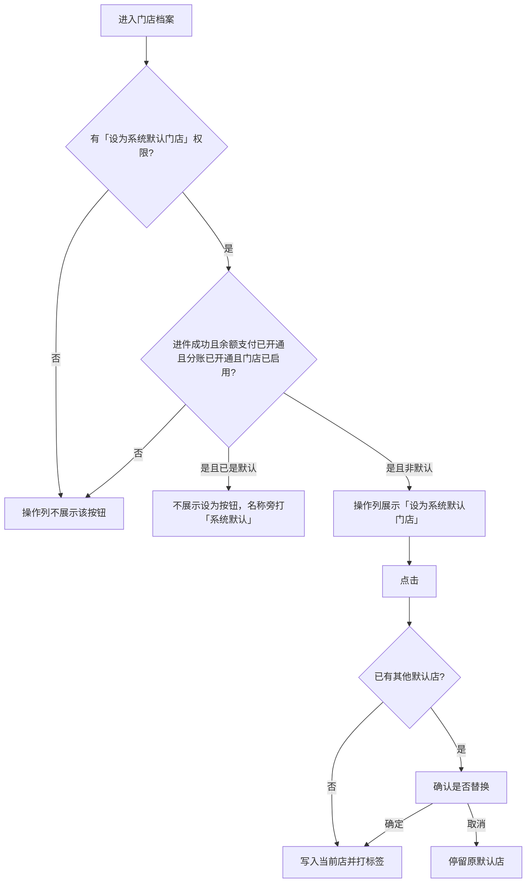

需要说明的问题：

- 独立权限点；无权限时按钮不出现（查询区勾选「设为系统默认门店权限」仅用于原型验收）。
- 四条件同时满足才可设：进件成功、余额支付已开通、分账服务已开通、门店已启用。
- 悬停文案：系统默认门店会作为自然流量用户的默认门店，避免造成分佣资损，请设置冷丰主体下的门店。
- 全平台最多一个；替换前需确认。

#### 1.3.1.3 功能描述

| 项 | 内容 |
|----|------|
| 功能类型 | 更新数据 |
| 功能描述 | 将符合条件的门店设为全平台唯一系统默认门店 |
| 前提业务 | 门店已建档，且进件、余额支付、分账、启用状态满足条件 |
| 后继业务 | C 端新用户确认门店弹窗读取该店 |
| 功能约束 | 独立权限；四条件；最多一个 |
| 约束描述 | 不满足条件或无权限时按钮不展示 |
| 操作权限 | 拥有「设为系统默认门店」权限的门店档案账号 |

#### 1.3.1.4 界面设计

**1. 界面原型**

- 原型文件：`MDM/mdm_archive_store.html`
- 本地预览：`http://localhost:5173/MDM/mdm_archive_store`
- 布局：
  - 查询区右侧勾选「设为系统默认门店权限」（原型验收，模拟独立权限开关）
  - 列表门店名称旁橙色「系统默认」标签
  - 操作列：编辑、去进件、设为系统默认门店（条件+权限且非当前默认时）
  - 悬停「设为系统默认门店」显示资损提示
  - 已有默认店时点击弹出浏览器确认：「已有系统默认门店「xxx」，确定改为当前门店？最多只能设置一个。」

#### 数据要求

| 字段名称 | 长度 | 录入方式 | 是否非空项 | 默认显示 |
|----------|------|----------|------------|----------|
| 设为系统默认门店 | - | 操作链接 | - | 满足条件且有权限时出现 |
| 系统默认标签 | - | 只读展示 | - | 当前默认店名称旁 |
| 设为系统默认门店权限 | - | 多选（勾选） | N | 勾选（有权限） |

#### 1.3.1.5 逻辑描述

1. 无权限：操作列不展示「设为系统默认门店」。
2. 有权限但不满足四条件：不展示按钮；若从其它入口点到则提示「仅进件成功、余额支付已开通、分账服务已开通且门店已启用时可设为系统默认门店」。
3. 尚无默认店：点击后写入并 toast「已设为系统默认门店」，名称旁打「系统默认」。
4. 已有其它默认店：确认后替换；取消则不变。
5. 与变更前差异：原先操作列只有编辑、去进件，没有系统默认门店。

### 1.3.2 禁用门店

#### 1.3.2.1 功能点：启用/禁用；默认店不可禁用

门店档案操作列增加禁用/启用；系统默认门店不允许禁用。

#### 1.3.2.2 功能流程图

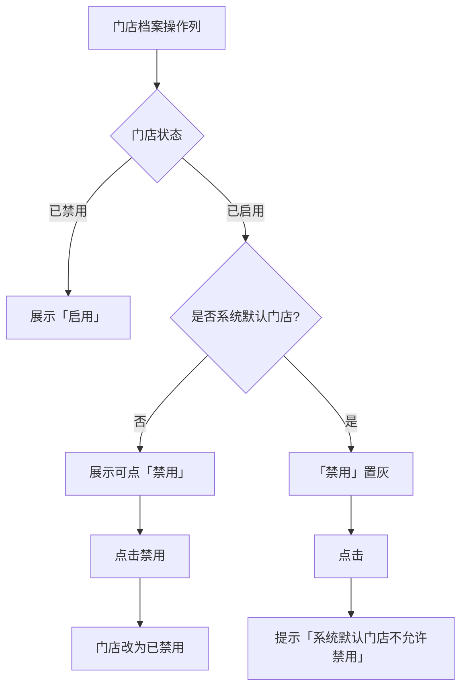

需要说明的问题：

- 系统默认门店的禁用量灰，点击仍提示，不改状态。
- 要禁用须先把默认店改到其它门店。

#### 1.3.2.3 功能描述

| 项 | 内容 |
|----|------|
| 功能类型 | 更新数据 |
| 功能描述 | 启用或禁用门店；默认店禁止禁用 |
| 前提业务 | 门店已在档案列表中 |
| 后继业务 | 被禁用后门店不可再被设为系统默认 |
| 功能约束 | 系统默认门店不允许禁用 |
| 约束描述 | 置灰 + toast「系统默认门店不允许禁用」 |
| 操作权限 | 门店档案操作账号 |

#### 1.3.2.4 界面设计

**1. 界面原型**

- 原型文件：`MDM/mdm_archive_store.html`
- 本地预览：`http://localhost:5173/MDM/mdm_archive_store`
- 布局：
  - 操作列增加「禁用」或「启用」
  - 默认店禁用链接带 `is-locked`，悬停 title「系统默认门店不允许禁用」
  - 点击后 toast，列表状态不变

#### 数据要求

| 字段名称 | 长度 | 录入方式 | 是否非空项 | 默认显示 |
|----------|------|----------|------------|----------|
| 门店状态 | - | 只读展示 + 操作链接 | Y | 正常 / 已禁用 |

#### 1.3.2.5 逻辑描述

1. 非默认且已启用：点「禁用」改为已禁用，操作列改为「启用」。
2. 已禁用：点「启用」恢复正常。
3. 默认店点禁用：toast「系统默认门店不允许禁用」，停留。
4. 与变更前差异：原先操作列没有禁用/启用，已禁用只体现在状态列。

### 1.3.3 自动绑定系统默认门店

#### 1.3.3.1 功能点：无门店参数时自动绑定默认店（不弹确认）

新用户未携带门店参数注册访问 APP/小程序时，自动绑定系统默认门店并进入该店首页，不弹出「当前门店」。系统默认店名称前绿色「线上店」标签仍可在切店页当前店卡片上展示。

#### 1.3.3.2 功能流程图

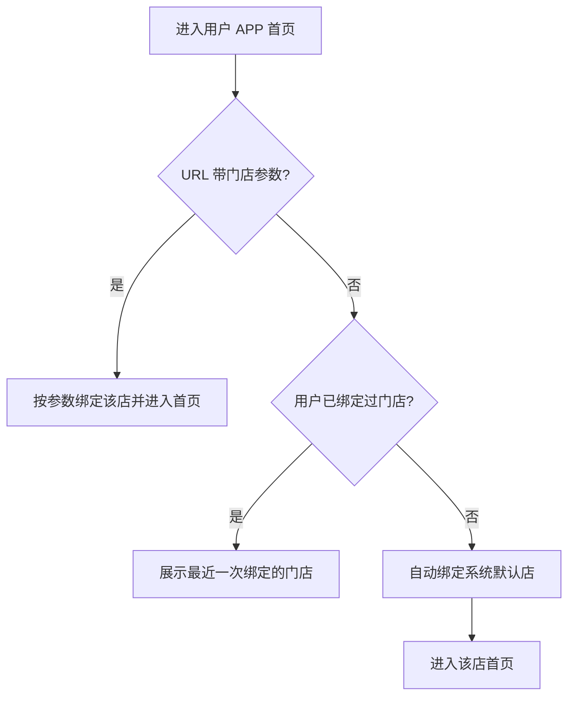

需要说明的问题：

- 无 URL 门店参数且未绑定过：自动绑定系统默认门店，无确认弹窗。
- 已绑定过：首页展示最近一次绑定的门店。
- 本期去掉地理位置授权，不再按定位弹附近地址。
- 扫码进店、切店「选他」均视为一次绑定。
- 右下角「切店验收开关」可切：新用户（自动绑默认店） / 已进入门店；已扫非默认 0 / 1 / 大于 1。

#### 1.3.3.3 功能描述

| 项 | 内容 |
|----|------|
| 功能类型 | 更新数据 |
| 功能描述 | 新用户无门店参数时自动绑定系统默认门店并进入首页 |
| 前提业务 | B 端已设置系统默认门店（未设置时 C 端回退中心店01） |
| 后继业务 | 首页按该店展示；可再从切店页扫码或切店 |
| 功能约束 | 不弹确认门店；首页无扫一扫 |
| 约束描述 | 无地理位置授权 |
| 操作权限 | 用户 APP 访客 / 登录用户 |

#### 1.3.3.4 界面设计

**1. 界面原型**

- 原型文件：`user-app/h5/home.html`
- 本地预览：`http://localhost:5173/user-app/h5/home`
- 布局：
  - 首页直接展示对应门店内容，无「当前门店」遮罩弹窗
  - 页外右下「切店验收开关」

#### 数据要求

| 字段名称 | 长度 | 录入方式 | 是否非空项 | 默认显示 |
|----------|------|----------|------------|----------|
| 当前绑定门店 | - | 系统自动写入 | Y | 无参数时为系统默认门店 |
| 线上店 | - | 只读标签 | - | 系统默认店在切店页展示 |

#### 1.3.3.5 逻辑描述

1. 未绑定且无门店参数：自动写入已绑定、当前店=系统默认店，直接进首页。
2. 已绑定过：首页展示最近一次绑定的门店。
3. URL 带门店参数：绑定该店并进入首页。
4. 与变更前差异：原先按地理位置切地址；中间版本曾弹出「当前门店」需点确认或扫一扫才能进店，弹窗一度展示「距您」，后去掉距离；最终删除该弹窗，改为自动绑定。

### 1.3.4 顶栏切店

#### 1.3.4.1 功能点：点门店名进入切换门店

首页顶栏展示当前门店名、箭头、营业时间，点击进入切换门店。不提供左侧扫一扫图标。

#### 1.3.4.2 功能流程图

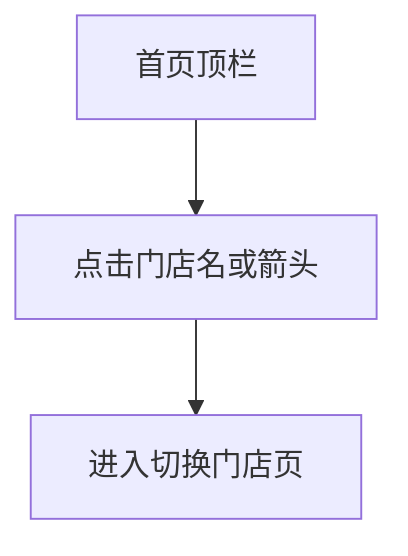

需要说明的问题：

- 扫一扫入口不在首页，在切换门店页右上角。
- 不再整块进「切换地址」页。

#### 1.3.4.3 功能描述

| 项 | 内容 |
|----|------|
| 功能类型 | 查询数据 |
| 功能描述 | 从首页进入切换门店 |
| 前提业务 | 用户已进入首页（已自动或按参数绑定门店） |
| 后继业务 | 切换门店页 |
| 功能约束 | 首页无扫一扫 |
| 约束描述 | 无 |
| 操作权限 | 用户 APP 用户 |

#### 1.3.4.4 界面设计

**1. 界面原型**

- 原型文件：`user-app/h5/home.html`
- 本地预览：`http://localhost:5173/user-app/h5/home`
- 布局：
  - 当前门店简称 + 右箭头 + 营业时间（如 08:00-22:00）
  - 无左侧扫一扫图标

#### 数据要求

| 字段名称 | 长度 | 录入方式 | 是否非空项 | 默认显示 |
|----------|------|----------|------------|----------|
| 门店名称 | - | 只读展示 / 链接 | Y | 当前绑定门店 |
| 营业时间 | - | 只读展示 | Y | 当前店营业时间 |

#### 1.3.4.5 逻辑描述

1. 点门店名或箭头进入 `switch-address.html`（页内标题为「切换门店」）。
2. 与变更前差异：原先顶栏是定位图标整块进切换地址；中间版本左侧改为扫一扫、点店名切店；最终去掉首页扫一扫，仅保留点店名切店。

### 1.3.5 切换门店

#### 1.3.5.1 功能点：按已扫非默认店展示当前店与可切店

页名改为切换门店；去掉定位与附近地址。可切门店仅来自扫过的非系统默认店；卡片不展示距离；页面背景为白色。

#### 1.3.5.2 功能流程图

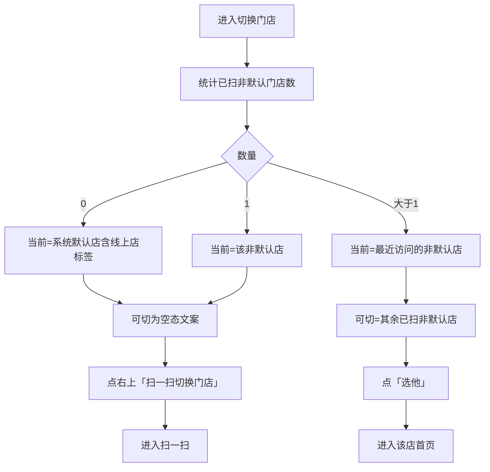

需要说明的问题：

- 空态原文：暂无可切门店，点击右上角扫一扫切换门店。
- 当前店、可切店均不展示「距您 xxkm」；可切店右侧保留「选他」。
- 页面（含滚动内容区）背景为白色。
- 从我的进入时返回仍回我的。

#### 1.3.5.3 功能描述

| 项 | 内容 |
|----|------|
| 功能类型 | 更新数据 |
| 功能描述 | 在已扫非默认门店之间切换当前店 |
| 前提业务 | 用户已绑定过门店 |
| 后继业务 | 首页按所选门店展示 |
| 功能约束 | 不可把未扫过的非默认店列入可切 |
| 约束描述 | 系统默认店不进入可切列表 |
| 操作权限 | 用户 APP 用户 |

#### 1.3.5.4 界面设计

**1. 界面原型**

- 原型文件：`user-app/h5/switch-address.html`
- 本地预览：`http://localhost:5173/user-app/h5/switch-address`
- 布局：
  - 白底手机框与滚动区
  - 顶栏返回 + 标题「切换门店」
  - 顶栏下方搜索框（占位「搜索门店名称」，见 1.3.9）
  - 「当前门店」区块，右上「扫一扫切换门店」
  - 当前店卡片：头像、店名（默认店带线上店）、营业、地址、店长
  - 「可切门店」列表或空态文案
  - 可切卡片右侧「选他」

#### 数据要求

| 字段名称 | 长度 | 录入方式 | 是否非空项 | 默认显示 |
|----------|------|----------|------------|----------|
| 当前门店 | - | 只读展示 | Y | 按已扫数量规则 |
| 可切门店 | - | 列表 / 空态 | N | 无则空态文案 |
| 扫一扫切换门店 | - | 按钮 | - | 当前门店标题右侧 |
| 选他 | - | 按钮 | - | 仅可切卡片 |
| 距您 | - | 不展示 | - | 不显示 |

#### 1.3.5.5 逻辑描述

1. 已扫非默认=0：当前为系统默认店（线上店），可切为空。
2. =1：当前为该非默认店，可切为空。
3. >1：当前为最近访问的非默认店，可切为其余已扫非默认店。
4. 点「选他」进入该店首页。
5. 可切为空时提示「暂无可切门店，点击右上角扫一扫切换门店」。
6. 与变更前差异：原先是「切换地址」，按定位展示附近门店、历史门店和收货地址，卡片右上角有距您；后去掉距离；空态曾为「扫一可切门店」；背景曾为浅灰 #f5f5f5。

### 1.3.6 扫门店推广码

#### 1.3.6.1 功能点：识别门店推广二维码进店

新增全屏扫一扫页，识别门店推广码后进入对应门店。

#### 1.3.6.2 功能流程图

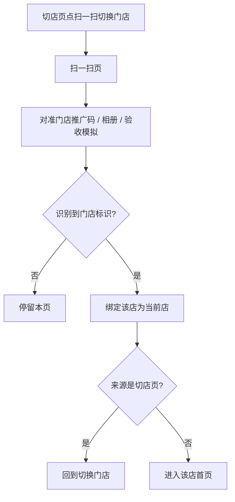

需要说明的问题：

- 入口在切换门店页右上角「扫一扫切换门店」；首页不提供扫一扫。
- 底文「扫一扫门店推广码」。
- 载荷前缀 `lengfeng-store:` + 门店 ID。
- 扫到非默认店后计入「已扫非默认」，可出现在切店列表。
- 原型「扫码验收开关」可选择模拟扫到的门店。

#### 1.3.6.3 功能描述

| 项 | 内容 |
|----|------|
| 功能类型 | 新增数据 |
| 功能描述 | 扫门店推广码绑定并进入对应门店 |
| 前提业务 | 门店 APP 已生成推广码，或验收模拟 |
| 后继业务 | 首页 / 切换门店刷新当前店 |
| 功能约束 | 无法识别的码不进店 |
| 约束描述 | 无 |
| 操作权限 | 用户 APP 用户 |

#### 1.3.6.4 界面设计

**1. 界面原型**

- 原型文件：`user-app/h5/scan-store.html`
- 本地预览：`http://localhost:5173/user-app/h5/scan-store`
- 布局：
  - 顶栏返回、手电筒、相册
  - 取景框 + 底文「扫一扫门店推广码」
  - 页外「扫码验收开关」：下拉模拟扫到哪家店，点取景框或「模拟扫码并进入」

#### 数据要求

| 字段名称 | 长度 | 录入方式 | 是否非空项 | 默认显示 |
|----------|------|----------|------------|----------|
| 门店推广码载荷 | - | 扫码识别 | Y | `lengfeng-store:` + 门店ID |

#### 1.3.6.5 逻辑描述

1. 识别成功：写入当前店并记入已扫列表（非默认才进可切）。
2. 从切店页进入则扫完回切店页，否则进首页。
3. 手电筒、相册为演示提示。
4. 与变更前差异：无此页面。

### 1.3.7 门店推广码

#### 1.3.7.1 功能点：工作台展示可被 C 端识别的二维码

门店 APP 工作台原「门店会员码」改为「门店推广码」，弹出二维码（非条形码），可分享/保存。

#### 1.3.7.2 功能流程图

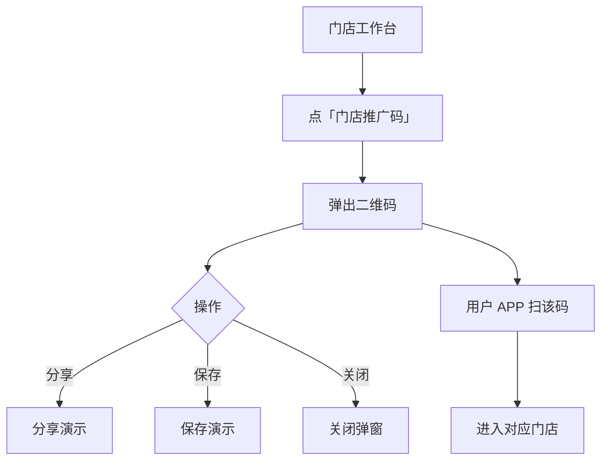

需要说明的问题：

- 二维码载荷含门店标识，用户 APP / 小程序可扫码进店。
- 不是条形码、不是仅 toast 的演示会员码。

#### 1.3.7.3 功能描述

| 项 | 内容 |
|----|------|
| 功能类型 | 查询数据 |
| 功能描述 | 展示本店推广二维码供用户扫码进店 |
| 前提业务 | 门店已登录工作台 |
| 后继业务 | 用户 APP 扫码绑定该店 |
| 功能约束 | 载荷必须带出门店 ID |
| 约束描述 | 无 |
| 操作权限 | 门店 APP 店员账号 |

#### 1.3.7.4 界面设计

**1. 界面原型**

- 原型文件：`store-app/h5/home.html`
- 本地预览：`http://localhost:5173/store-app/h5/home`
- 布局：
  - 工具区「门店推广码」
  - 弹窗：店名、二维码、分享、保存、关闭

#### 数据要求

| 字段名称 | 长度 | 录入方式 | 是否非空项 | 默认显示 |
|----------|------|----------|------------|----------|
| 门店推广码 | - | 只读二维码 | Y | 本店标识二维码 |

#### 1.3.7.5 逻辑描述

1. 点击工具打开弹窗并绘制二维码。
2. 分享/保存走演示提示。
3. 与变更前差异：原先为「门店会员码」，点击仅提示演示，没有可被 C 端识别的门店二维码。

### 1.3.8 自提门店

#### 1.3.8.1 功能点：个人中心整块进入切换门店

「我的」卡片标题改为「自提门店」；点「切换门店」或点店名、地址、店长区域均进入切换门店页，返回仍回到我的。

#### 1.3.8.2 功能流程图

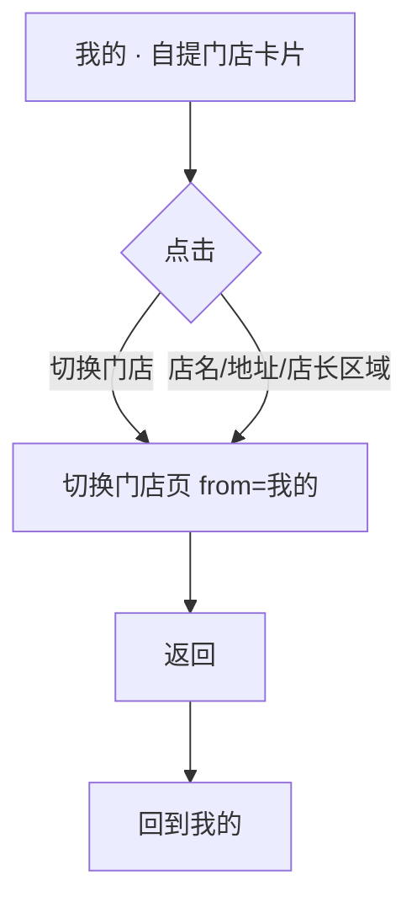

需要说明的问题：

- 本卡片仍可展示距您（与切店页/确认弹窗不同）。

#### 1.3.8.3 功能描述

| 项 | 内容 |
|----|------|
| 功能类型 | 查询数据 |
| 功能描述 | 从个人中心进入切换门店 |
| 前提业务 | 用户已有当前绑定门店 |
| 后继业务 | 切换门店页 |
| 功能约束 | 返回落到我的，不落到首页 |
| 约束描述 | 无 |
| 操作权限 | 用户 APP 用户 |

#### 1.3.8.4 界面设计

**1. 界面原型**

- 原型文件：`user-app/h5/profile.html`
- 本地预览：`http://localhost:5173/user-app/h5/profile`
- 布局：
  - 卡片标题「自提门店」
  - 右上「切换门店」
  - 下方整块门店信息（头像、店名、营业时间、地址、店长）可点

#### 数据要求

| 字段名称 | 长度 | 录入方式 | 是否非空项 | 默认显示 |
|----------|------|----------|------------|----------|
| 自提门店 | - | 只读展示 / 链接 | Y | 当前绑定门店 |

#### 1.3.8.5 逻辑描述

1. 点标题行「切换门店」或点门店信息区域，均打开切换门店页，带从来源「我的」。
2. 切店页返回链回 `profile.html`。
3. 与变更前差异：标题为「我的默认门店」；只有右上角按钮可进切店页，点门店信息本身不会跳转。

### 1.3.9 搜索门店

#### 1.3.9.1 功能点：按门店名称过滤可切门店

切换门店页顶栏下方增加搜索框，按门店名称（含首页展示名）模糊匹配可切门店。

#### 1.3.9.2 功能流程图

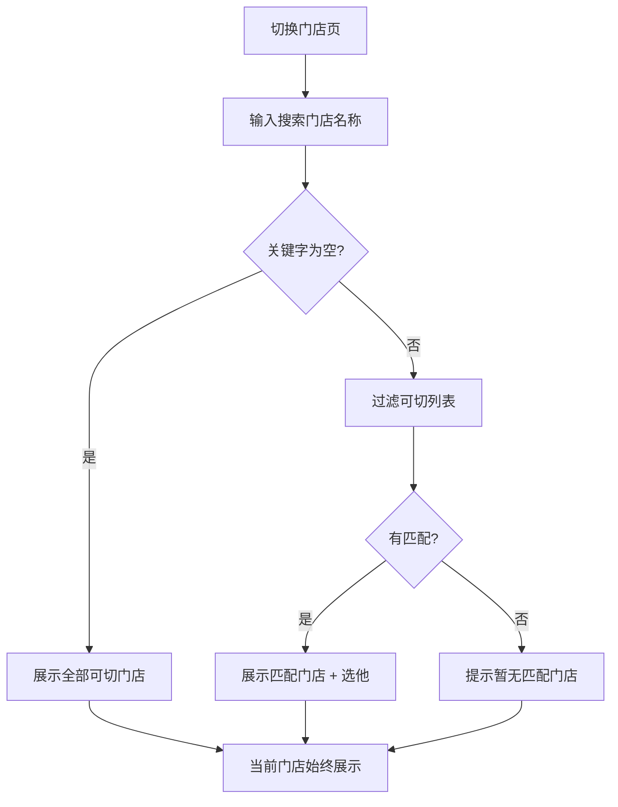

需要说明的问题：

- 占位文案：搜索门店名称。
- 输入后即时过滤，不点查询。
- 无匹配时提示「暂无匹配门店」；当前门店始终展示，不受搜索隐藏。
- 搜索只作用于可切门店，不改变当前店。

#### 1.3.9.3 功能描述

| 项 | 内容 |
|----|------|
| 功能类型 | 查询数据 |
| 功能描述 | 按门店名称模糊过滤可切门店列表 |
| 前提业务 | 已进入切换门店页 |
| 后继业务 | 点「选他」进入该店首页 |
| 功能约束 | 当前门店不被搜索隐藏 |
| 约束描述 | 无 |
| 操作权限 | 用户 APP 用户 |

#### 1.3.9.4 界面设计

**1. 界面原型**

- 原型文件：`user-app/h5/switch-address.html`
- 本地预览：`http://localhost:5173/user-app/h5/switch-address`
- 布局：
  - 顶栏下方搜索框，左侧放大镜，占位「搜索门店名称」
  - 可切列表随输入即时变化
  - 无匹配时空态「暂无匹配门店」

#### 数据要求

| 字段名称 | 长度 | 录入方式 | 是否非空项 | 默认显示 |
|----------|------|----------|------------|----------|
| 搜索门店名称 | - | 文本框 | N | 空，占位「搜索门店名称」 |

#### 1.3.9.5 逻辑描述

1. 关键字为空：展示全部可切门店；可切本身为空时仍用「暂无可切门店，点击右上角扫一扫切换门店」。
2. 有关键字且无匹配：提示「暂无匹配门店」。
3. 点「选他」仍进入该店首页。
4. 与变更前差异：无搜索框。

### 1.3.10 会员列表注册时间

#### 1.3.10.1 功能点：列表展示注册时间并按起止筛选

会员管理列表在最近消费时间后增加「注册时间」列；查询区增加注册时间起止，点查询只保留该区间内的会员。

#### 1.3.10.2 功能流程图

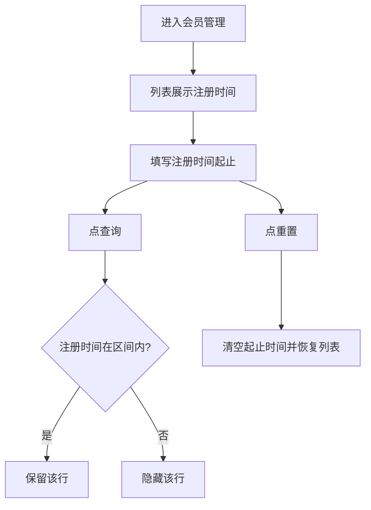

需要说明的问题：

- 查询区控件为起止日期时间（可清空）。
- 未填起止时不按注册时间过滤。
- 重置同时清空注册时间。

#### 1.3.10.3 功能描述

| 项 | 内容 |
|----|------|
| 功能类型 | 查询数据 |
| 功能描述 | 展示并按注册时间筛选会员 |
| 前提业务 | 进入会员-会员360-会员管理 |
| 后继业务 | 查看详情 / 变更绑定门店等行操作 |
| 功能约束 | 无起止则不过滤注册时间 |
| 约束描述 | 无 |
| 操作权限 | 会员管理操作员 |

#### 1.3.10.4 界面设计

**1. 界面原型**

- 原型文件：`MDM/mdm_member_c.html`
- 本地预览：`http://localhost:5173/MDM/mdm_member_c`
- 布局：
  - 查询区「注册时间」：开始时间 至 结束时间，datetime 控件，可点 × 清空
  - 表格列顺序：…最近消费时间、注册时间、状态、操作
  - 查询 / 重置按钮沿用原查询区

#### 数据要求

| 字段名称 | 长度 | 录入方式 | 是否非空项 | 默认显示 |
|----------|------|----------|------------|----------|
| 注册时间（列表） | - | 只读展示 | Y | 该会员注册时间 |
| 注册时间起 | - | 日期 | N | 空 |
| 注册时间止 | - | 日期 | N | 空 |

#### 1.3.10.5 逻辑描述

1. 点查询：只保留注册时间落在起止区间内的行；缺一侧则只约束另一侧。
2. 点重置：清空起止时间，列表恢复。
3. 与变更前差异：无注册时间列，查询区不能按注册时间筛。

### 1.3.11 变更绑定门店

#### 1.3.11.1 功能点：后台单选门店并记一次切换

正常、黑名单会员操作列增加「变更绑定门店」，打开「选择门店」弹窗（单选）；确定后记一条切换门店明细。

#### 1.3.11.2 功能流程图

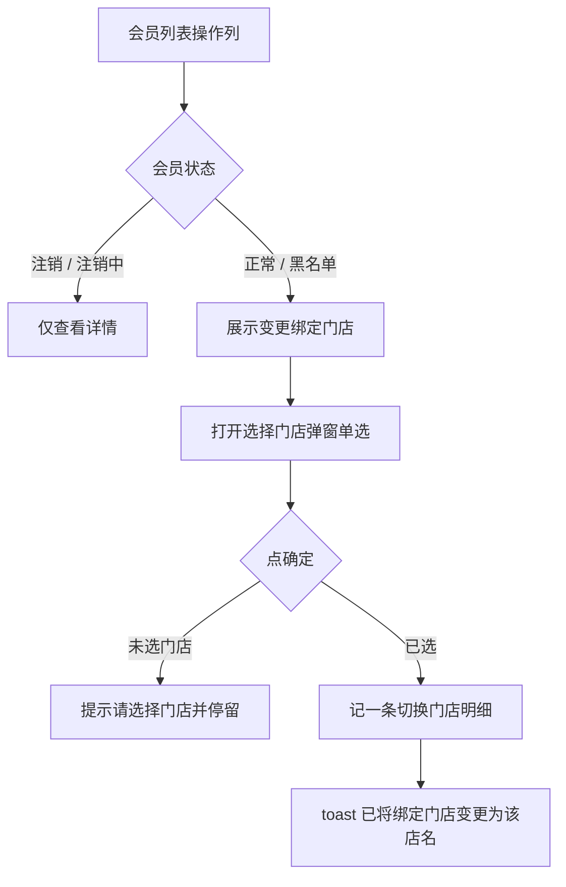

需要说明的问题：

- 弹窗标题「选择门店」，单选；未选确定时提示「请选择门店」。
- 写入明细：类型=切换门店，绑定方式=后台变更，发生时间=当前时间。
- 成功 toast：已将绑定门店变更为「xxx」。
- 注销会员 tab 操作列只有「查看详情」。

#### 1.3.11.3 功能描述

| 项 | 内容 |
|----|------|
| 功能类型 | 更新数据 |
| 功能描述 | 后台将会员当前绑定门店变更为所选门店 |
| 前提业务 | 会员状态为正常或黑名单 |
| 后继业务 | 详情绑定门店页可见该条切换明细 |
| 功能约束 | 注销、注销中不可变更 |
| 约束描述 | 无 |
| 操作权限 | 会员管理操作员 |

#### 1.3.11.4 界面设计

**1. 界面原型**

- 原型文件：`MDM/mdm_member_c.html`
- 本地预览：`http://localhost:5173/MDM/mdm_member_c`
- 布局：
  - 正常/黑名单行操作：「查看详情」「变更绑定门店」及原有发券等
  - 弹窗「选择门店」：门店列表单选、取消、确定

#### 数据要求

| 字段名称 | 长度 | 录入方式 | 是否非空项 | 默认显示 |
|----------|------|----------|------------|----------|
| 变更绑定门店 | - | 链接按钮 | - | 正常/黑名单展示 |
| 选择门店 | - | 单选 | Y | 未选 |

#### 1.3.11.5 逻辑描述

1. 点「变更绑定门店」打开选择门店弹窗。
2. 确定且已选：追加切换明细并 toast 成功文案。
3. 确定未选：提示「请选择门店」，不关闭或停留弹窗。
4. 与变更前差异：操作列无此入口。

### 1.3.12 会员详情绑定门店

#### 1.3.12.1 功能点：绑定与切换明细按发生时间倒序

会员详情「绑定门店」页同时展示绑定门店与切换门店明细（含扫码、确认门店、后台变更），按发生时间倒序。

#### 1.3.12.2 功能流程图

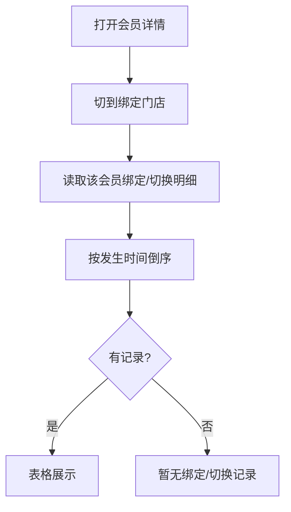

需要说明的问题：

- 类型：绑定门店 / 切换门店。
- 绑定方式示例：确认门店、扫码、后台变更。
- 列含：类型、门店名称、省市区、详细地址、绑定方式、发生时间，以及观看时长、消费金额等统计列。
- 无记录时一行提示「暂无绑定/切换记录」。

#### 1.3.12.3 功能描述

| 项 | 内容 |
|----|------|
| 功能类型 | 查询数据 |
| 功能描述 | 查看会员绑定与切换门店明细 |
| 前提业务 | 打开会员详情抽屉 |
| 后继业务 | 无 |
| 功能约束 | 按发生时间倒序 |
| 约束描述 | 无 |
| 操作权限 | 会员管理操作员 |

#### 1.3.12.4 界面设计

**1. 界面原型**

- 原型文件：`MDM/mdm_member_c.html`（会员详情抽屉 · 绑定门店）
- 本地预览：`http://localhost:5173/MDM/mdm_member_c`
- 布局：
  - 抽屉页签「绑定门店」
  - 宽表：类型、门店名称、省市区、详细地址、绑定方式、发生时间、观看时长、消费金额、下单次数、退款金额、退款次数
  - 底部分页条（原型占位）

#### 数据要求

| 字段名称 | 长度 | 录入方式 | 是否非空项 | 默认显示 |
|----------|------|----------|------------|----------|
| 类型 | - | 只读展示 | Y | 绑定门店 / 切换门店 |
| 门店名称 | - | 只读展示 | Y | 对应门店 |
| 绑定方式 | - | 只读展示 | N | 确认门店 / 扫码 / 后台变更等 |
| 发生时间 | - | 只读展示 | Y | 倒序 |

#### 1.3.12.5 逻辑描述

1. 进入页签即按发生时间从新到旧展示。
2. 后台变更、C 端确认门店、扫码进店写入的记录都会出现。
3. 与变更前差异：绑定门店页只有占位空行，不区分绑定/切换，也没有明细时间序。

