# 【576】会员黑名单和注销会员

来源清单：`2026090801`（大版本 `2026090801黑名单注销会员` / 小版本 `2026090801.3`、`2026090801.4` 合入）

# 1. 后台业务 WEB 系统

## 1.1 概述

### 需求背景

运营需要按能力维度限制异常会员（访问、下单、看播、评论），用户需要自助申请注销并由后台审核。原先会员管理只有一张列表，没有黑名单/注销分栏，C 端也没有对应门禁和注销闭环。本期按已落地原型整理为 PRD，来源清单 `2026090801`。

### 需求目标

1. 会员管理页内分三个 Tab：会员列表、黑名单、注销会员。
2. 正常会员可拉黑并勾选禁用能力；黑名单会员可编辑、查看、恢复为正常。
3. 用户 APP 按勾选的禁用项拦截，四种提示统一为「抱歉，你的账号异常，……」。
4. 用户从设置申请注销，须无交易中订单且无售后中售后单；后台审核通过或驳回；通过后自动退出，原手机号可再注册为新会员。
5. 会员列表状态与操作随黑名单、注销审核结果同步：注销中/注销仅可查看详情。

## 1.2 管理范围

| 终端 | 模块 | 变更类型 |
|------|------|----------|
| B 端 MDM | 会员管理 Tab | 新增 |
| B 端 MDM | 会员列表状态与操作 | 修改 |
| B 端 MDM | 黑名单列表 | 新增 |
| B 端 MDM | 拉入/编辑黑名单 | 新增 |
| B 端 MDM | 查看黑名单 | 新增 |
| B 端 MDM | 恢复黑名单 | 新增 |
| B 端 MDM | 注销会员列表 | 新增 |
| B 端 MDM | 注销审核 | 新增 |
| B 端 MDM | 注销备注 | 新增 |
| C 端用户 APP | 黑名单门禁 | 新增 |
| C 端用户 APP | 账号注销流程 | 新增 |
| C 端用户 APP | 注销前置校验 | 新增 |
| C 端用户 APP | 注销成功与再注册 | 修改 |
| C 端用户 APP | 注销驳回展示 | 新增 |

本期不做：

- 不把「冻结/解冻」纳入本期范围（列表里已有冻结状态，冻结会员不可拉黑，仅解冻后可拉黑）。
- 不支持后台代替用户提交注销申请。
- 不在门店 APP 套用用户 APP 黑名单门禁。
- 登录/注册流程页不套「访问页面」拦截，保证被禁访问的用户仍能看到登录页。
- 不对接真实客服会话、文件中台；原型用本机存储与验收开关模拟。

状态对照：

| 会员列表状态 | 注销会员 Tab 状态 | 含义 |
|--------------|-------------------|------|
| 正常 | 已驳回（若刚被驳回） | 可正常使用；驳回后列表回到正常 |
| 黑名单 | — | 在黑名单中，按勾选项禁用 C 端能力 |
| 注销中 | 审核中 | 用户已提交注销，等待审核 |
| 注销 | 已注销 | 审核通过，原档案保留为注销 |

## 1.3 需求详细说明

### 1.3.1 会员管理 Tab

#### 1.3.1.1 功能点：页内切换会员列表 / 黑名单 / 注销会员

会员管理由单一列表改为三个 Tab，分别维护全量会员、黑名单、注销申请与结果。

#### 1.3.1.2 功能流程图

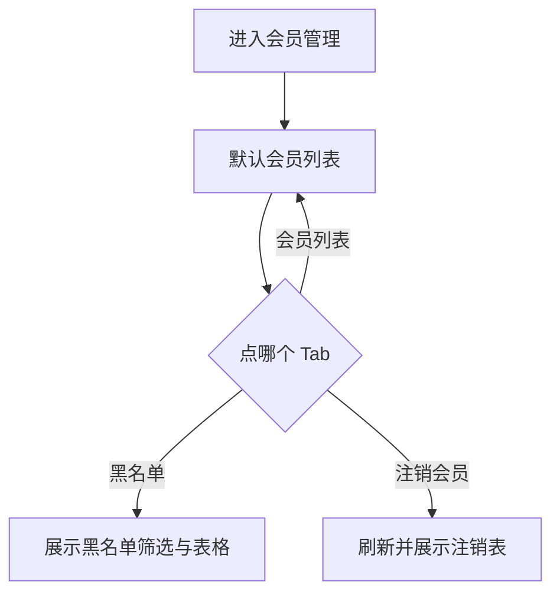

需要说明的问题：

- URL 支持 `?tab=list|blacklist|canceled` 直达对应 Tab。
- 切到「注销会员」时刷新注销表，以便带上 C 端刚提交的申请。

#### 1.3.1.3 功能描述

| 项 | 内容 |
|----|------|
| 功能类型 | 查询数据 |
| 功能描述 | 在会员管理页内切换三个业务面板 |
| 前提业务 | 进入会员 / 会员360 / 会员管理 |
| 后继业务 | 在对应 Tab 做拉黑、审核等操作 |
| 功能约束 | 同一时刻只展示一个面板 |
| 约束描述 | 无 |
| 操作权限 | 有会员管理权限的运营/客服 |

#### 1.3.1.4 界面设计

**1. 界面原型**

- 原型文件：`MDM/mdm_member_c.html`
- 本地预览：`http://localhost:5173/MDM/mdm_member_c`
- 布局：
  - 页头下方三个按钮 Tab：会员列表、黑名单、注销会员
  - 面包屑：会员 / 会员360 / 会员管理
  - 每个 Tab 自带筛选区 + 表格 + 分页
  - 空态仅注销 Tab 有「暂无注销记录」

#### 数据要求

| 字段名称 | 长度 | 录入方式 | 是否非空项 | 默认显示 |
|----------|------|----------|------------|----------|
| 当前 Tab | - | 按钮 | Y | 会员列表 |

#### 1.3.1.5 逻辑描述

1. 默认进入会员列表。
2. 点 Tab 切换面板，不离开当前页。
3. 与变更前差异：原先只有一张会员表，没有黑名单、注销会员分栏。

### 1.3.2 会员列表状态与操作

#### 1.3.2.1 功能点：按状态展示徽章与操作列

会员列表可筛并展示黑名单、注销中、注销；操作列随状态收起或展开。

#### 1.3.2.2 功能流程图

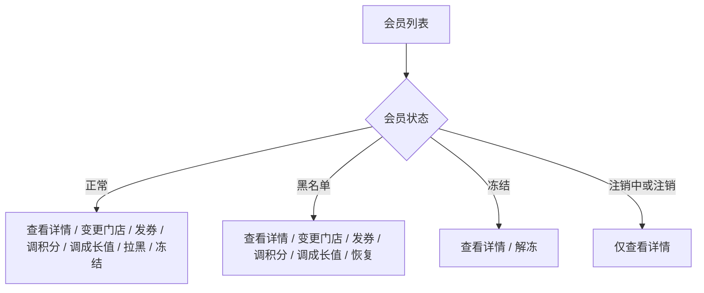

需要说明的问题：

- 冻结不在本期需求内，但会挡住拉黑：须先解冻再拉黑。
- 黑名单会员仍可发券、调积分、变更绑定门店。
- 拉黑成功后自动切到黑名单 Tab。

#### 1.3.2.3 功能描述

| 项 | 内容 |
|----|------|
| 功能类型 | 查询数据 / 更新数据 |
| 功能描述 | 列表按状态过滤，操作列按状态展示 |
| 前提业务 | 会员档案已存在 |
| 后继业务 | 拉黑、恢复、查看详情 |
| 功能约束 | 注销中、注销不可拉黑、发券、调积分 |
| 约束描述 | 无 |
| 操作权限 | 有会员管理权限的运营/客服 |

#### 1.3.2.4 界面设计

**1. 界面原型**

- 原型文件：`MDM/mdm_member_c.html`
- 本地预览：`http://localhost:5173/MDM/mdm_member_c`
- 布局：
  - 筛选「状态」下拉：全部 / 正常 / 冻结 / 黑名单 / 注销中 / 注销
  - 表格状态列彩色徽章
  - 操作列为链接按钮

#### 数据要求

| 字段名称 | 长度 | 录入方式 | 是否非空项 | 默认显示 |
|----------|------|----------|------------|----------|
| 状态 | - | 下拉 | N | 全部 |

#### 1.3.2.5 逻辑描述

1. 查询按所选状态过滤；选全部则含各状态。
2. 点「拉黑」打开拉入黑名单弹窗（见 1.3.4）。
3. 点「恢复」打开恢复确认（见 1.3.6）。
4. 与变更前差异：原先无黑名单/注销中/注销，操作列不随这些状态变化。

### 1.3.3 黑名单列表

#### 1.3.3.1 功能点：筛选并查看已拉黑会员

黑名单 Tab 独立查询已拉黑记录，展示禁用项、原因、操作人。

#### 1.3.3.2 功能流程图

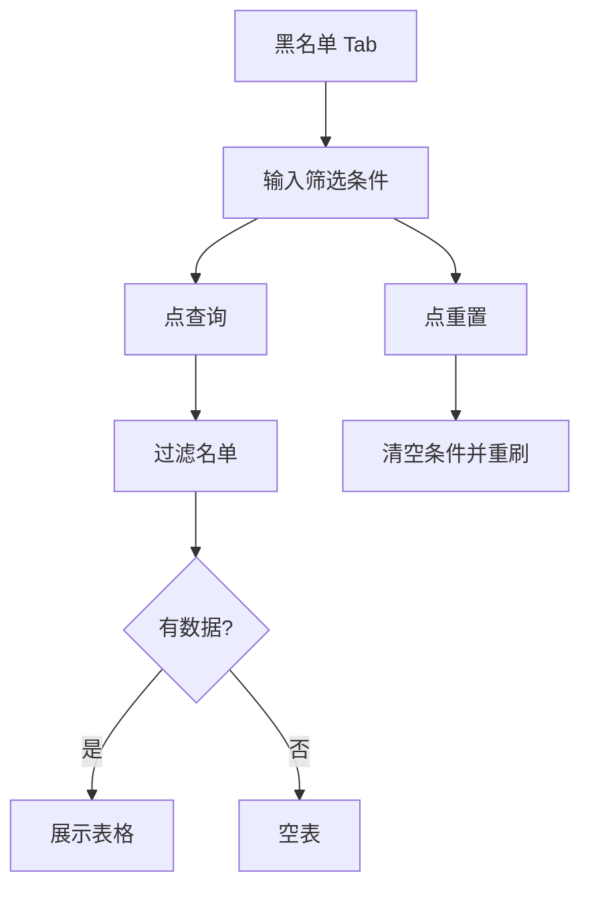

需要说明的问题：

- 禁用功能按「包含该项」过滤，不是精确等于全部勾选项。
- 手机号按数字匹配，忽略掩码中的星号以外字符。

#### 1.3.3.3 功能描述

| 项 | 内容 |
|----|------|
| 功能类型 | 查询数据 |
| 功能描述 | 按昵称、手机、ID、禁用功能、拉黑原因筛选黑名单 |
| 前提业务 | 已有拉黑记录 |
| 后继业务 | 恢复 / 查看 / 编辑 |
| 功能约束 | 筛选条件均为选填 |
| 约束描述 | 无 |
| 操作权限 | 有会员管理权限的运营/客服 |

#### 1.3.3.4 界面设计

**1. 界面原型**

- 原型文件：`MDM/mdm_member_c.html`（黑名单 Tab）
- 本地预览：`http://localhost:5173/MDM/mdm_member_c?tab=blacklist`
- 布局：
  - 筛选：用户昵称、手机号、ID、禁用功能、拉黑原因；重置 / 查询
  - 表头：序号、会员信息（头像+昵称+ID）、手机号、禁用功能（多行）、拉黑原因（文字+可选缩略图）、操作人、操作时间、操作
  - 操作：恢复、查看、编辑黑名单

#### 数据要求

| 字段名称 | 长度 | 录入方式 | 是否非空项 | 默认显示 |
|----------|------|----------|------------|----------|
| 用户昵称 | - | 文本框 | N | 空 |
| 手机号 | - | 文本框 | N | 空 |
| ID | - | 文本框 | N | 空 |
| 禁用功能 | - | 下拉 | N | 请选择 |
| 拉黑原因 | - | 文本框 | N | 空 |

#### 1.3.3.5 逻辑描述

1. 点查询按当前条件过滤；点重置清空后展示全部黑名单。
2. 原因列若有图片/视频，展示缩略图。
3. 与变更前差异：无独立黑名单列表。

### 1.3.4 拉入/编辑黑名单

#### 1.3.4.1 功能点：勾选禁用能力并填写拉黑原因

从会员列表拉黑或在黑名单编辑，配置禁用项、原因和证据材料。

#### 1.3.4.2 功能流程图

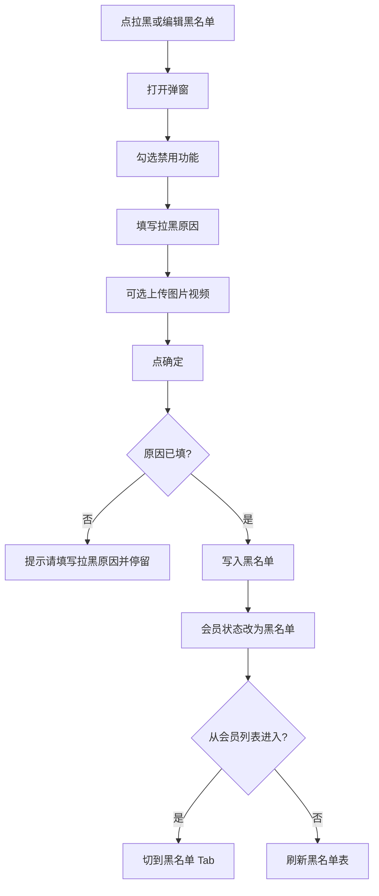

需要说明的问题：

- 禁用功能四项：禁止直播评论、观看直播、下单、访问页面。勾选 = 禁用该项。可以一项都不勾，仍算拉黑（仅改状态、不禁能力）。
- 从会员列表首次拉黑时，默认勾选「禁止直播评论」。
- 图片/视频最多 9 个；超出提示「最多上传 9 个文件」。
- 文字原因必填；图片、视频非必选。弹窗内有该提示。

#### 1.3.4.3 功能描述

| 项 | 内容 |
|----|------|
| 功能类型 | 新增数据 / 更新数据 |
| 功能描述 | 将会员拉入黑名单或更新禁用项与原因 |
| 前提业务 | 会员状态为正常（列表拉黑）或已在黑名单（编辑） |
| 后继业务 | C 端按勾选项拦截；会员列表状态变为黑名单 |
| 功能约束 | 拉黑原因必填；冻结/注销中/注销不可从列表拉黑 |
| 约束描述 | 无 |
| 操作权限 | 有会员管理权限的运营/客服 |

#### 1.3.4.4 界面设计

**1. 界面原型**

- 原型文件：`MDM/mdm_member_c.html`
- 本地预览：`http://localhost:5173/MDM/mdm_member_c`
- 布局：
  - 弹窗标题：拉入黑名单 / 编辑黑名单
  - 顶部会员卡片：头像、昵称、手机、ID
  - 禁用功能：四个复选框
  - 拉黑原因：必填标记、多行文本、字数 0/500
  - 上传区：添加照片/视频，缩略图可删，计数 n/9
  - 底栏：取消 / 确定
  - 错误提示用页面 Toast

#### 数据要求

| 字段名称 | 长度 | 录入方式 | 是否非空项 | 默认显示 |
|----------|------|----------|------------|----------|
| 禁用功能 | - | 多选 | N | 首次拉黑默认勾选禁止直播评论 |
| 拉黑原因 | 1~500 | 文本框 | Y | 空 |
| 图片视频 | 最多 9 | 上传 | N | 空 |
| 操作人 | - | 只读展示 | Y | 当前账号 |
| 操作时间 | - | 只读展示 | Y | 保存时写入 |

#### 1.3.4.5 逻辑描述

1. 原因空：Toast「请填写拉黑原因」，不关闭弹窗。
2. 保存成功：Toast「黑名单已更新」；会员列表该行状态改为黑名单，操作列改为带「恢复」。
3. 从列表拉黑成功后切换到黑名单 Tab。
4. 与变更前差异：无拉黑弹窗与禁用项配置。

### 1.3.5 查看黑名单

#### 1.3.5.1 功能点：只读查看拉黑配置

运营查看某条黑名单的禁用项、原因和材料，不可改。

#### 1.3.5.2 功能流程图

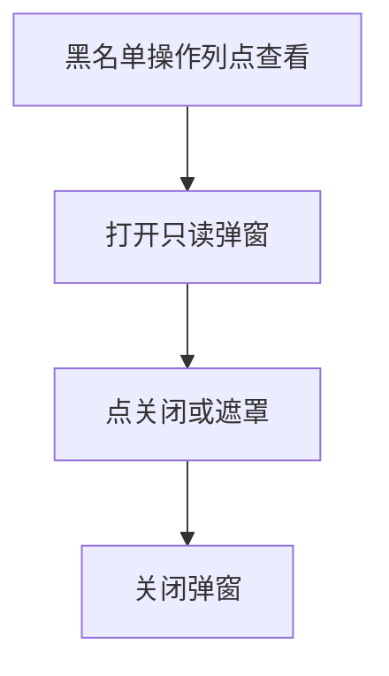

需要说明的问题：

- 标题为「查看黑名单」；底部只有「关闭」，无确定。
- 复选框、原因、媒体均为只读。

#### 1.3.5.3 功能描述

| 项 | 内容 |
|----|------|
| 功能类型 | 查询数据 |
| 功能描述 | 只读展示一条黑名单详情 |
| 前提业务 | 该会员已在黑名单 |
| 后继业务 | 无 |
| 功能约束 | 不可编辑 |
| 约束描述 | 无 |
| 操作权限 | 有会员管理权限的运营/客服 |

#### 1.3.5.4 界面设计

**1. 界面原型**

- 原型文件：`MDM/mdm_member_c.html`
- 本地预览：`http://localhost:5173/MDM/mdm_member_c?tab=blacklist`
- 布局：与编辑弹窗相同，控件禁用，底栏仅关闭。

#### 数据要求

| 字段名称 | 长度 | 录入方式 | 是否非空项 | 默认显示 |
|----------|------|----------|------------|----------|
| 禁用功能 | - | 只读展示 | - | 已保存值 |
| 拉黑原因 | 1~500 | 只读展示 | - | 已保存值 |
| 图片视频 | 最多 9 | 只读展示 | - | 已保存值 |

#### 1.3.5.5 逻辑描述

1. 打开后不改数据；关闭回到列表。
2. 与变更前差异：无查看入口。

### 1.3.6 恢复黑名单

#### 1.3.6.1 功能点：将黑名单会员恢复为正常

从会员列表或黑名单 Tab 恢复，移出名单并解除 C 端门禁。

#### 1.3.6.2 功能流程图

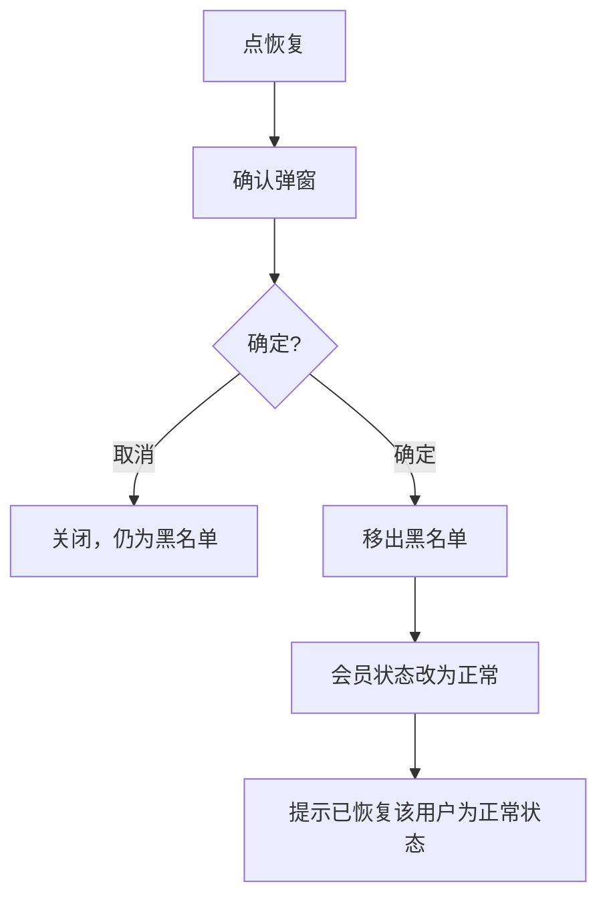

需要说明的问题：

- 确认文案按原型：「确定要恢复该用户嘛？」
- 恢复后 C 端不再命中该会员的禁用项。

#### 1.3.6.3 功能描述

| 项 | 内容 |
|----|------|
| 功能类型 | 更新数据 |
| 功能描述 | 移出黑名单，状态恢复正常 |
| 前提业务 | 会员当前为黑名单 |
| 后继业务 | 操作列恢复为正常会员操作（含拉黑） |
| 功能约束 | 仅黑名单状态可恢复 |
| 约束描述 | 无 |
| 操作权限 | 有会员管理权限的运营/客服 |

#### 1.3.6.4 界面设计

**1. 界面原型**

- 原型文件：`MDM/mdm_member_c.html`
- 本地预览：`http://localhost:5173/MDM/mdm_member_c`
- 布局：
  - 弹窗标题：恢复
  - 会员卡片 + 确认文案
  - 底栏：取消 / 确定

#### 数据要求

| 字段名称 | 长度 | 录入方式 | 是否非空项 | 默认显示 |
|----------|------|----------|------------|----------|
| 确认操作 | - | 按钮 | Y | - |

#### 1.3.6.5 逻辑描述

1. 取消或点遮罩：不改数据。
2. 确定：从黑名单删除该条，会员列表状态改为正常，Toast「已恢复该用户为正常状态」。
3. 与变更前差异：无恢复能力。

### 1.3.7 注销会员列表

#### 1.3.7.1 功能点：查询注销申请与结果

注销会员 Tab 展示审核中、已注销、已驳回记录。

#### 1.3.7.2 功能流程图

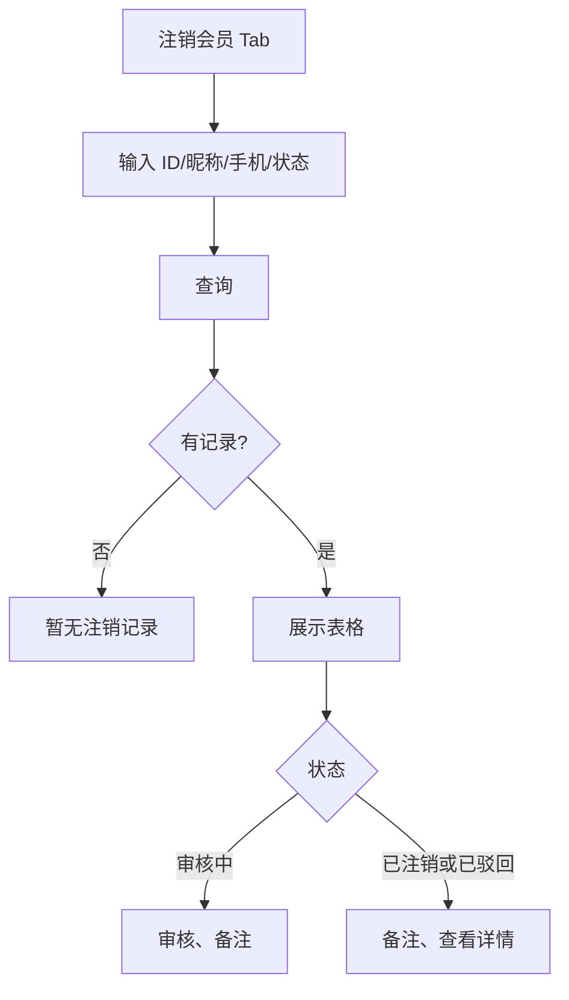

需要说明的问题：

- C 端提交申请后会出现在本表，状态为审核中；会员列表同步为注销中。
- 已驳回记录仍留在本 Tab，便于查看备注；会员列表该人已回到正常。

#### 1.3.7.3 功能描述

| 项 | 内容 |
|----|------|
| 功能类型 | 查询数据 |
| 功能描述 | 筛选并展示注销相关会员 |
| 前提业务 | 用户已提交过注销，或历史已注销 |
| 后继业务 | 审核、备注、查看详情 |
| 功能约束 | 无 |
| 约束描述 | 无 |
| 操作权限 | 有会员管理权限的运营/客服 |

#### 1.3.7.4 界面设计

**1. 界面原型**

- 原型文件：`MDM/mdm_member_c.html`（注销会员 Tab）
- 本地预览：`http://localhost:5173/MDM/mdm_member_c?tab=canceled`
- 布局：
  - 筛选：会员ID、会员昵称、手机号码、状态（全部/审核中/已注销/已驳回）
  - 表头：会员ID、会员昵称、手机号码、注册时间、注册渠道、注册平台、状态、备注、操作
  - 空态：暂无注销记录

#### 数据要求

| 字段名称 | 长度 | 录入方式 | 是否非空项 | 默认显示 |
|----------|------|----------|------------|----------|
| 会员ID | - | 文本框 | N | 空 |
| 会员昵称 | - | 文本框 | N | 空 |
| 手机号码 | - | 文本框 | N | 空 |
| 状态 | - | 下拉 | N | 全部 |

#### 1.3.7.5 逻辑描述

1. 查询按条件过滤；重置清空后重刷。
2. 审核中只给审核、备注；其它状态给备注、查看详情。
3. 与变更前差异：无注销会员 Tab。

### 1.3.8 注销审核

#### 1.3.8.1 功能点：通过或驳回用户注销申请

运营核对后选择通过注销或驳回注销，并填写审核备注。

#### 1.3.8.2 功能流程图

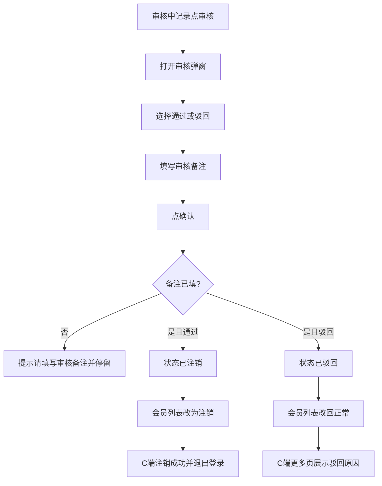

需要说明的问题：

- 默认选中「通过注销」。
- 弹窗展示用户填写的注销原因。
- 底部提示：「请确认已与用户沟通后再进行此操作。」
- 通过时写入注销时间；驳回不写注销时间。

#### 1.3.8.3 功能描述

| 项 | 内容 |
|----|------|
| 功能类型 | 更新数据 |
| 功能描述 | 审核注销申请 |
| 前提业务 | 记录状态为审核中 |
| 后继业务 | C 端退出或展示驳回；会员列表状态同步 |
| 功能约束 | 审核备注必填 |
| 约束描述 | 无 |
| 操作权限 | 有会员管理权限的运营/客服 |

#### 1.3.8.4 界面设计

**1. 界面原型**

- 原型文件：`MDM/mdm_member_c.html`
- 本地预览：`http://localhost:5173/MDM/mdm_member_c?tab=canceled`
- 布局：
  - 标题：审核
  - 会员卡片；用户注销原因提示
  - 审核结果：通过注销 / 驳回注销
  - 备注：必填，最多 500 字
  - 底栏：取消 / 确认

#### 数据要求

| 字段名称 | 长度 | 录入方式 | 是否非空项 | 默认显示 |
|----------|------|----------|------------|----------|
| 审核结果 | - | 单选 | Y | 通过注销 |
| 备注 | 1~500 | 文本框 | Y | 空或已有备注 |

#### 1.3.8.5 逻辑描述

1. 备注空：Toast「请填写审核备注」，聚焦备注框。
2. 通过：Toast「已通过注销申请」；C 端走注销成功退出。
3. 驳回：Toast「已驳回注销申请」；C 端可重新申请。
4. 与变更前差异：无审核。

### 1.3.9 注销备注

#### 1.3.9.1 功能点：给注销记录补备注

不改变审核状态，只保存备注文本。

#### 1.3.9.2 功能流程图

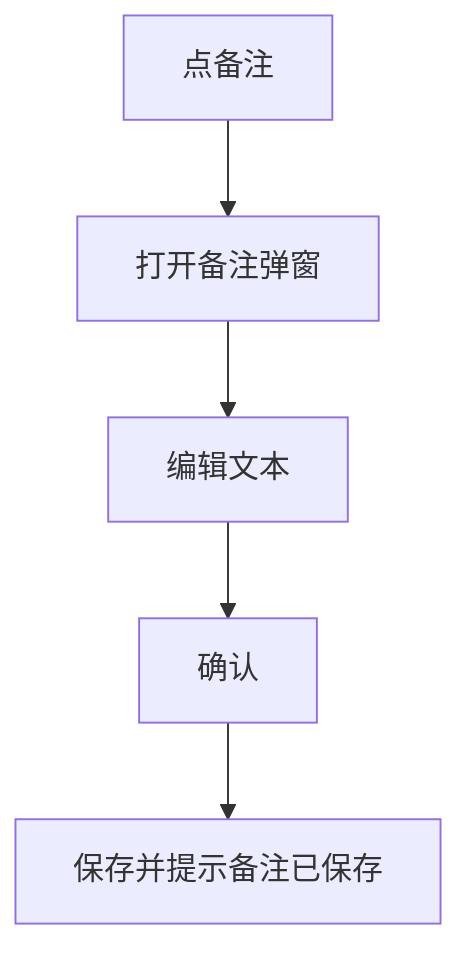

需要说明的问题：

- 选填；最多 500 字。
- 审核中、已注销、已驳回均可备注。

#### 1.3.9.3 功能描述

| 项 | 内容 |
|----|------|
| 功能类型 | 更新数据 |
| 功能描述 | 保存注销记录备注 |
| 前提业务 | 存在注销记录 |
| 后继业务 | 列表备注列更新 |
| 功能约束 | 不改变状态 |
| 约束描述 | 无 |
| 操作权限 | 有会员管理权限的运营/客服 |

#### 1.3.9.4 界面设计

**1. 界面原型**

- 原型文件：`MDM/mdm_member_c.html`
- 本地预览：`http://localhost:5173/MDM/mdm_member_c?tab=canceled`
- 布局：标题「备注」，多行文本，取消 / 确认。

#### 数据要求

| 字段名称 | 长度 | 录入方式 | 是否非空项 | 默认显示 |
|----------|------|----------|------------|----------|
| 备注 | 0~500 | 文本框 | N | 已有备注 |

#### 1.3.9.5 逻辑描述

1. 确认后写入备注，Toast「备注已保存」。
2. 与变更前差异：无备注入口。

### 1.3.10 C 端黑名单门禁

#### 1.3.10.1 功能点：按 B 端勾选项拦截用户 APP

当前登录会员若在黑名单中，按勾选的禁用项分别拦截访问、下单、看播、评论。

#### 1.3.10.2 功能流程图

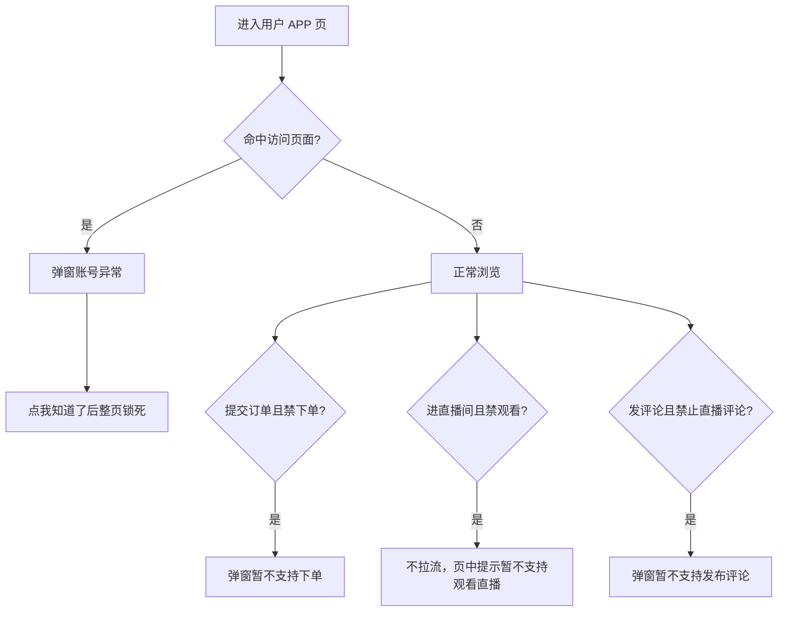

需要说明的问题：

- 拦截文案统一为「抱歉，你的账号异常，xxxxx」，不含申诉引导：
  - 访问页面：抱歉，你的账号异常，暂不支持访问。
  - 下单：抱歉，你的账号异常，暂不支持下单。
  - 观看直播：抱歉，你的账号异常，暂不支持观看直播。
  - 禁止直播评论：抱歉，你的账号异常，暂不支持发布评论。
- 弹窗按钮：「我知道了」。
- 登录、注册、找回密码等登录流程页，以及门店 APP，不套「访问页面」拦截。
- 下单拦截覆盖确认订单、积分确认订单、直播确认订单等提交动作。
- 原型提供左下角「黑名单验收开关」：勾选 = 禁用该项，点「应用并刷新」。关演示则跟 B 端黑名单。

#### 1.3.10.3 功能描述

| 项 | 内容 |
|----|------|
| 功能类型 | 查询数据 |
| 功能描述 | 按黑名单禁用项拦截 C 端能力 |
| 前提业务 | B 端已拉黑并勾选对应项 |
| 后继业务 | 运营可恢复黑名单，解除拦截 |
| 功能约束 | 按项拦截，未勾选的能力仍可用 |
| 约束描述 | 登录流程与门店 APP 不拦访问 |
| 操作权限 | 被拉黑的用户 APP 用户（被动） |

#### 1.3.10.4 界面设计

**1. 界面原型**

- 原型文件：`user-app/js/user-app-blacklist-guard.js`（挂在各用户 APP 页）
- 本地预览：
  - `http://localhost:5173/user-app/h5/home`
  - `http://localhost:5173/user-app/h5/live-room`
  - `http://localhost:5173/user-app/h5/order-confirm`
- 布局：
  - 居中白底弹窗 +「我知道了」
  - 访问拦截关闭后全页半透明遮罩锁死操作（验收开关仍可点）
  - 直播间禁看：舞台变暗，中央提示条
  - 验收开关：标题「黑名单验收开关」，主色按钮「应用并刷新」

#### 数据要求

| 字段名称 | 长度 | 录入方式 | 是否非空项 | 默认显示 |
|----------|------|----------|------------|----------|
| 禁用功能 | - | 只读展示 | - | 跟随 B 端或验收开关 |

#### 1.3.10.5 逻辑描述

1. 进入业务页先判断「访问页面」；命中则弹窗「抱歉，你的账号异常，暂不支持访问。」，关闭后锁页。
2. 提交订单命中「下单」则弹窗「抱歉，你的账号异常，暂不支持下单。」，订单不提交。
3. 直播间命中「观看直播」则不拉流，页内提示「抱歉，你的账号异常，暂不支持观看直播。」
4. 发评论命中「禁止直播评论」则弹窗「抱歉，你的账号异常，暂不支持发布评论。」，不发送。
5. 四种文案同一句式，不含「可联系客服进行申诉~」；观看直播用直播间中央提示条，其余用弹窗「我知道了」。
6. 与最初差异：C 端原先无黑名单拦截。与改文案前差异：下单、看播、评论曾用「你正在小黑屋中」，且四句末尾都带申诉引导。

### 1.3.11 账号注销流程

#### 1.3.11.1 功能点：须知 → 确认 → 审核中

用户从设置进入账号注销，确认风险并提交申请，等待后台审核；审核中可撤回。

#### 1.3.11.2 功能流程图

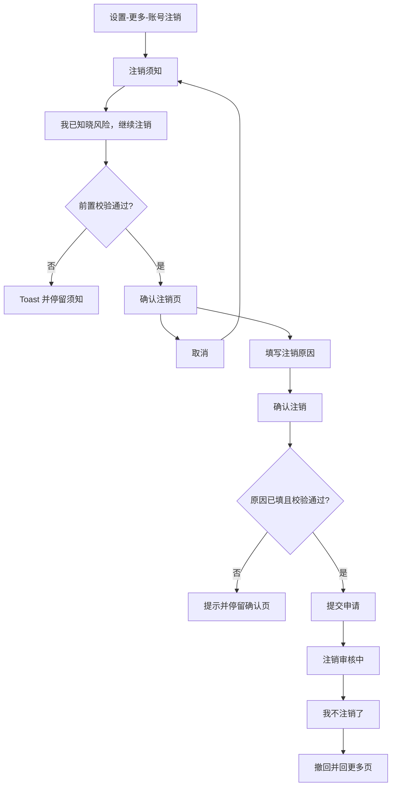

需要说明的问题：

- 须知三条：自愿放弃订单与售后权益；自愿放弃券、积分等权益；自愿放弃本账号在当前系统内的所有数据（第三条强调样式）。
- 提交后会员列表变为注销中，注销 Tab 出现审核中记录。
- 用户撤回：C 端状态清空；B 端该条记为已驳回，备注「用户主动撤回注销申请」；会员列表回到正常。

#### 1.3.11.3 功能描述

| 项 | 内容 |
|----|------|
| 功能类型 | 新增数据 / 更新数据 |
| 功能描述 | 用户提交或撤回注销申请 |
| 前提业务 | 已登录 |
| 后继业务 | 后台审核 |
| 功能约束 | 注销原因必填 |
| 约束描述 | 须先通过前置校验 |
| 操作权限 | 用户 APP 当前登录用户 |

#### 1.3.11.4 界面设计

**1. 界面原型**

- 原型文件：`user-app/h5/account-cancel.html`；入口 `user-app/h5/settings-more.html`
- 本地预览：`http://localhost:5173/user-app/h5/account-cancel`
- 布局：
  - 须知页：条款列表 + 底栏「我已知晓风险，继续注销」
  - 确认页：标题「确定要注销吗？」；注销原因；取消 / 确认注销（危险色）
  - 审核中：时钟示意、「注销审核中…」、说明期间账号将暂时无法正常使用、「我不注销了」
  - 顶栏标题审核中时改为「注销进度」

#### 数据要求

| 字段名称 | 长度 | 录入方式 | 是否非空项 | 默认显示 |
|----------|------|----------|------------|----------|
| 注销原因 | 1~200 | 文本框 | Y | 空 |

#### 1.3.11.5 逻辑描述

1. 原因空：Toast「请填写注销原因」，聚焦输入框。
2. 提交成功：Toast「注销申请已提交」，进入审核中。
3. 撤回：Toast「已取消注销申请」，返回更多页。
4. 与变更前差异：设置里无注销流程。

### 1.3.12 注销前置校验

#### 1.3.12.1 功能点：有在途订单或售后则不可申请

确认注销前须查询：没有交易中商城订单，且没有售后中的商城售后单。

#### 1.3.12.2 功能流程图

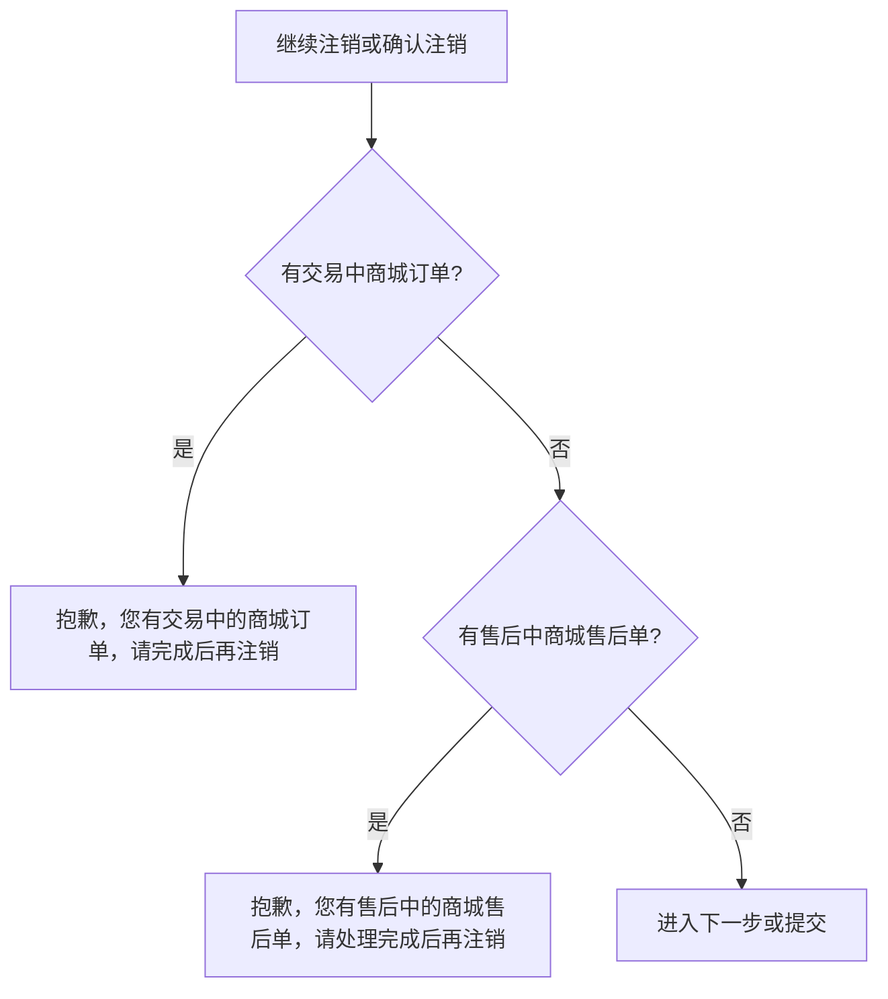

需要说明的问题：

- 须知页点继续、确认页点确认注销都要校验。
- 失败停留当前步，不提交申请。
- 原型页有开发注解说明该规则；验收可用 `?block=orders` / `?block=aftersale` / `?block=clear`。

#### 1.3.12.3 功能描述

| 项 | 内容 |
|----|------|
| 功能类型 | 查询数据 |
| 功能描述 | 校验是否允许提交注销 |
| 前提业务 | 用户进入注销流程 |
| 后继业务 | 通过后进入确认或提交 |
| 功能约束 | 交易中订单或售后中售后单任一存在即失败 |
| 约束描述 | 仅商城订单/商城售后，不含其它业务单 |
| 操作权限 | 用户 APP 当前登录用户 |

#### 1.3.12.4 界面设计

**1. 界面原型**

- 原型文件：`user-app/h5/account-cancel.html`
- 本地预览：`http://localhost:5173/user-app/h5/account-cancel`
- 布局：失败时 Toast；确认页下方开发注解说明规则。

#### 数据要求

| 字段名称 | 长度 | 录入方式 | 是否非空项 | 默认显示 |
|----------|------|----------|------------|----------|
| 交易中订单校验 | - | 系统查询 | Y | - |
| 售后中售后单校验 | - | 系统查询 | Y | - |

#### 1.3.12.5 逻辑描述

1. 有交易中订单：Toast 对应文案，不进入确认或不提交。
2. 有售后中：Toast 对应文案，同样停留。
3. 两项都无：允许继续。
4. 与变更前差异：无该校验。

### 1.3.13 注销成功与再注册

#### 1.3.13.1 功能点：通过后退出登录，原手机号可注册新会员

审核通过后账号退出；原手机号释放，再次登录/注册创建新会员档案，不复用已注销档案。审核中禁止登录。

#### 1.3.13.2 功能流程图

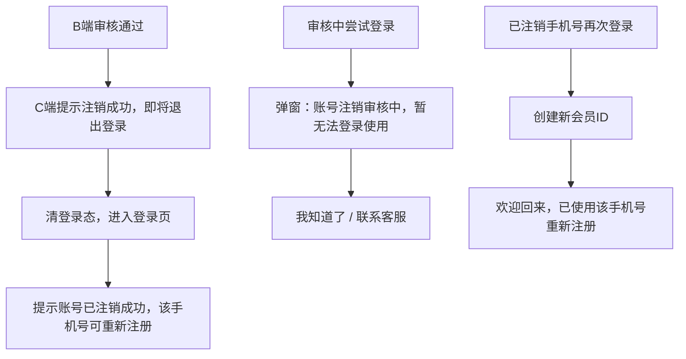

需要说明的问题：

- 已注销档案在 B 端会员列表保留，状态为「注销」，仅可查看详情。
- 再注册是新 ID，积分、券、订单不从旧档带入。
- 联系客服原型仅 Toast「请联系客服处理注销申请」。

#### 1.3.13.3 功能描述

| 项 | 内容 |
|----|------|
| 功能类型 | 更新数据 / 新增数据 |
| 功能描述 | 注销成功退出；审核中拦登录；原号再注册新档 |
| 前提业务 | 审核通过，或审核中，或手机号已释放 |
| 后继业务 | 新会员正常使用；旧档保持注销 |
| 功能约束 | 审核中不可登录；再注册不复用旧 ID |
| 约束描述 | 无 |
| 操作权限 | 该手机号用户 |

#### 1.3.13.4 界面设计

**1. 界面原型**

- 原型文件：`user-app/h5/login.html`、`user-app/h5/login-phone.html`、`user-app/h5/account-cancel.html`
- 本地预览：`http://localhost:5173/user-app/h5/login`
- 布局：
  - 登录页 Toast 成功退出文案
  - 审核中弹窗双按钮：我知道了、联系客服

#### 数据要求

| 字段名称 | 长度 | 录入方式 | 是否非空项 | 默认显示 |
|----------|------|----------|------------|----------|
| 注销状态 | - | 只读展示 | Y | none / pending / canceled / rejected |

#### 1.3.13.5 逻辑描述

1. 通过后 C 端轮询到已注销：Toast「注销成功，即将退出登录」，跳转登录页。
2. 登录页带成功标记时 Toast「账号已注销成功，已退出登录。该手机号可重新注册」。
3. 审核中登录：不写登录态，弹窗拦截。
4. 已释放手机号再次登录：新建会员，Toast「欢迎回来，已使用该手机号重新注册」。
5. 与变更前差异：登录无审核拦截，也无再注册新档规则。

### 1.3.14 注销驳回展示

#### 1.3.14.1 功能点：在更多页展示最新驳回原因

后台驳回后，用户在「更多」页看到审核不通过及原因，可修改后重新提交。

#### 1.3.14.2 功能流程图

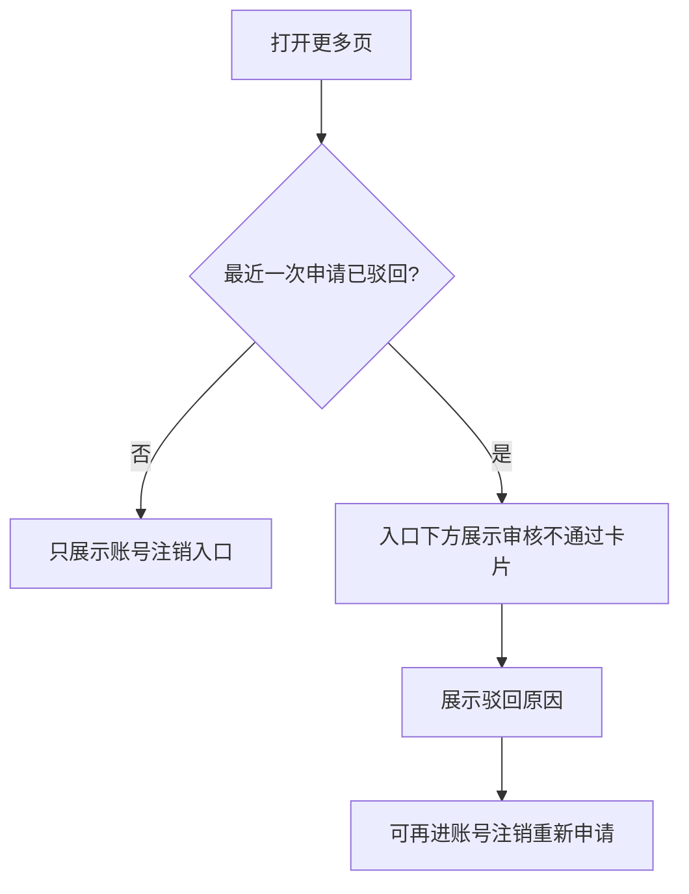

需要说明的问题：

- 只展示最新一条。
- 无原因时展示「未填写原因」。
- 卡片说明：您的账号注销申请未通过审核，可修改后重新提交。

#### 1.3.14.3 功能描述

| 项 | 内容 |
|----|------|
| 功能类型 | 查询数据 |
| 功能描述 | 展示最新注销驳回原因 |
| 前提业务 | B 端已驳回 |
| 后继业务 | 用户再次进入注销流程 |
| 功能约束 | 仅已驳回状态展示 |
| 约束描述 | 无 |
| 操作权限 | 用户 APP 当前登录用户 |

#### 1.3.14.4 界面设计

**1. 界面原型**

- 原型文件：`user-app/h5/settings-more.html`
- 本地预览：`http://localhost:5173/user-app/h5/settings-more`
- 布局：
  - 「账号注销」红色入口
  - 下方独立卡片：标题「审核不通过」、说明、分割线、驳回原因

#### 数据要求

| 字段名称 | 长度 | 录入方式 | 是否非空项 | 默认显示 |
|----------|------|----------|------------|----------|
| 驳回原因 | 0~500 | 只读展示 | N | B 端审核备注 |

#### 1.3.14.5 逻辑描述

1. 状态非已驳回：卡片隐藏。
2. 已驳回：展示原因；用户可再次走注销须知与确认。
3. 若页打开时已是注销成功态，则直接走退出登录，不停留本页。
4. 与变更前差异：无驳回反馈。
