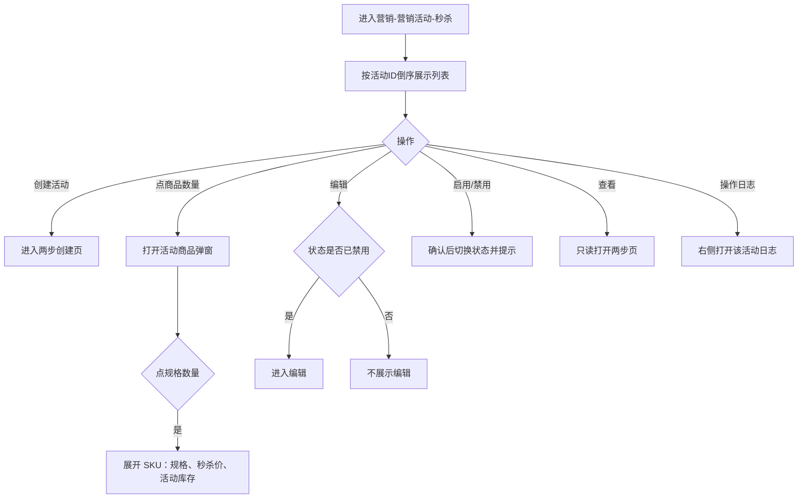
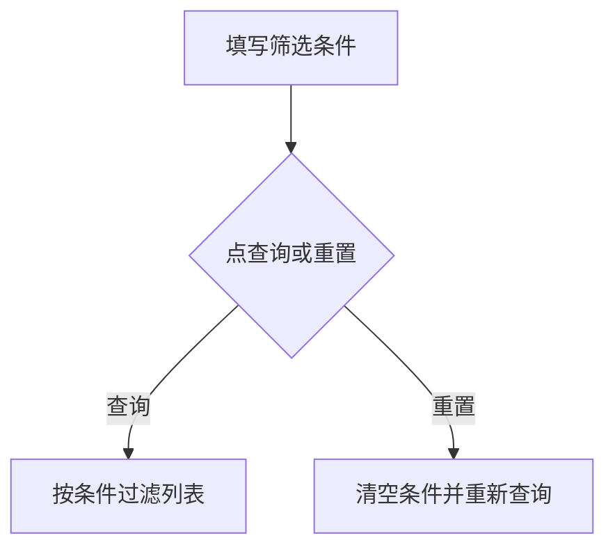
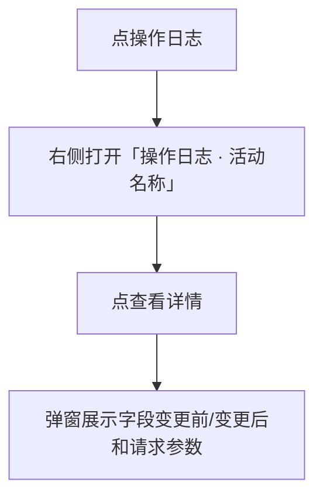
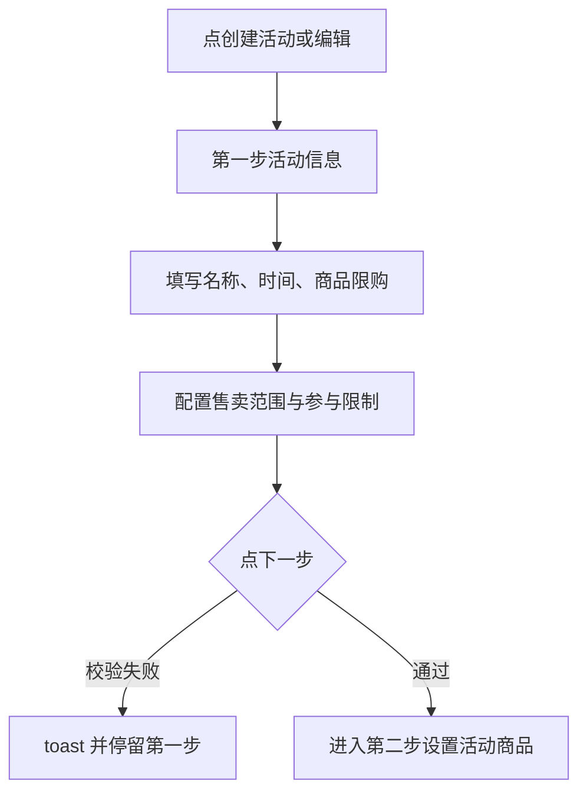
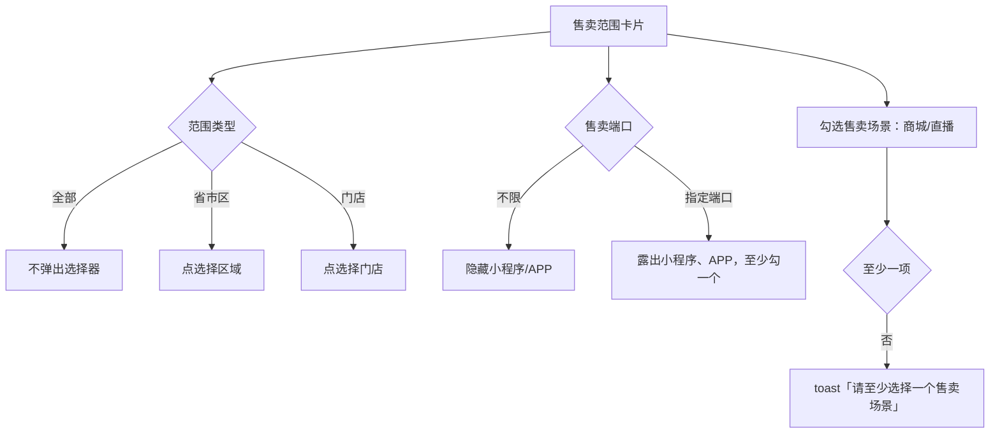
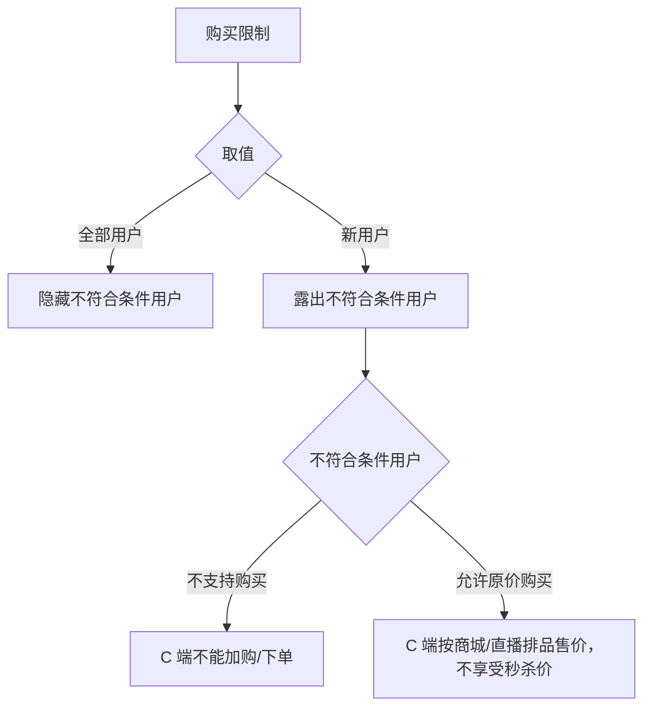
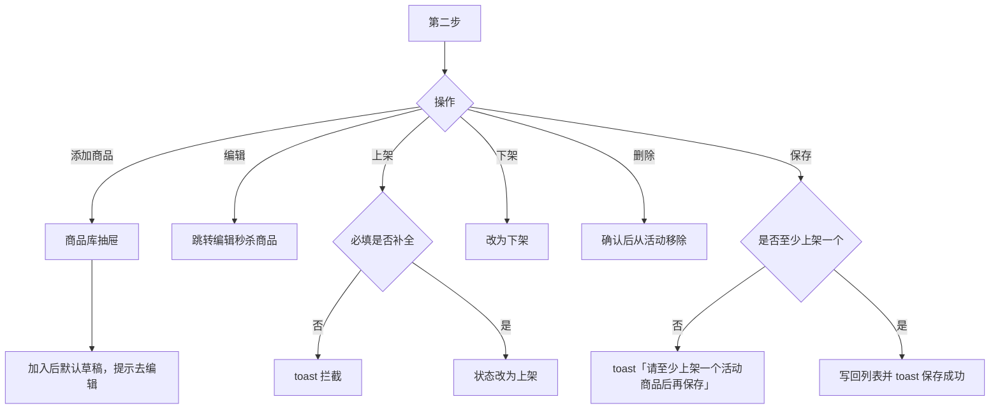
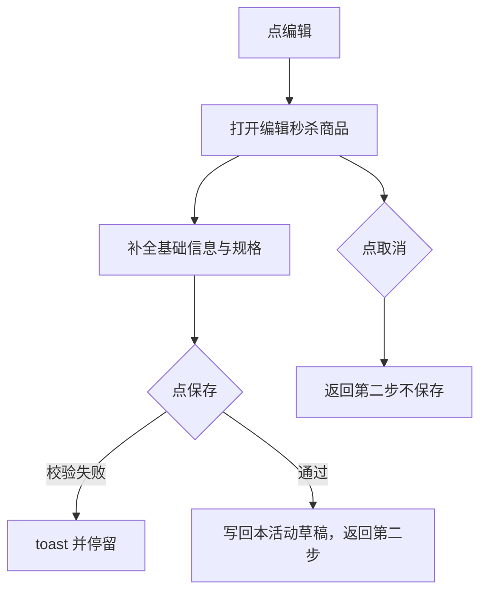
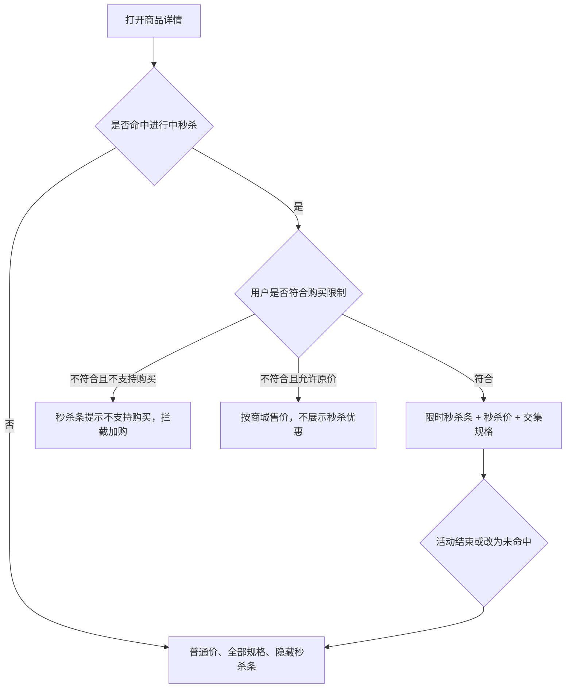
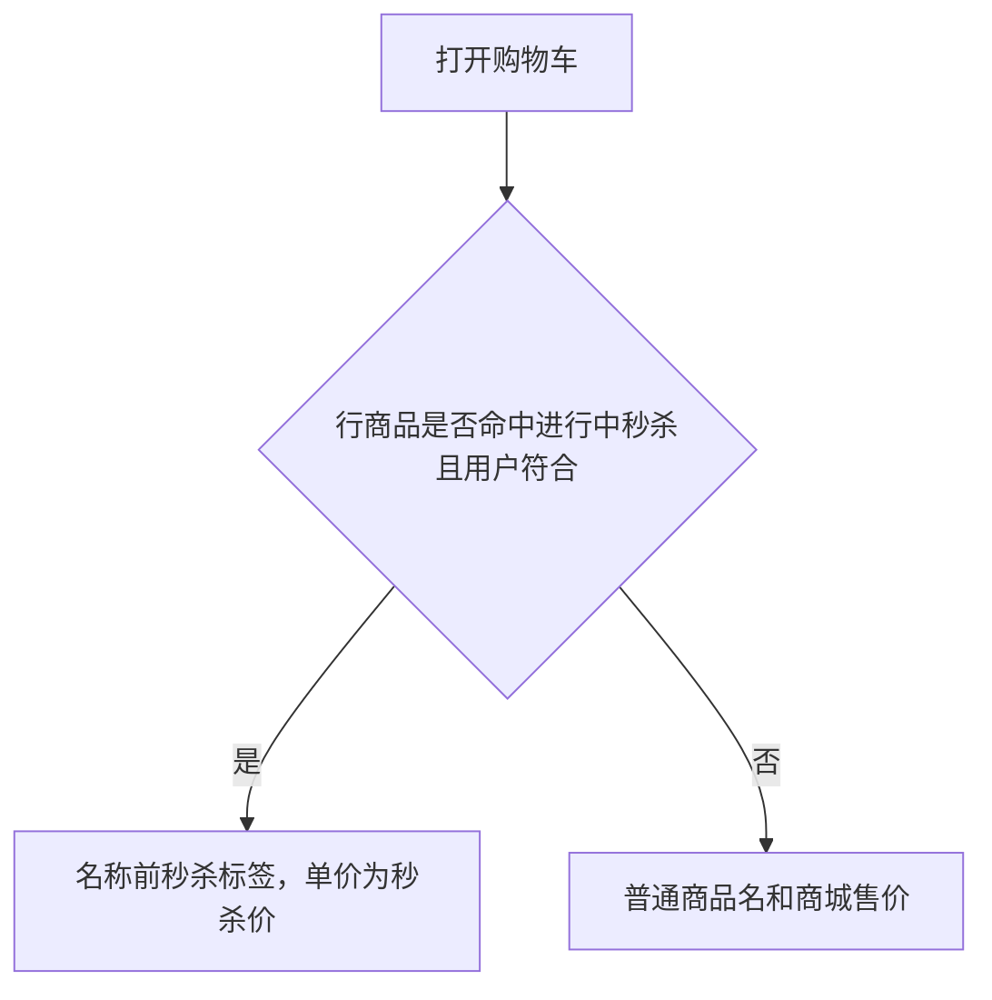

# 【605】秒杀（商品限购）

来源清单：`merged-20260902-01`（大版本 `2026090201营销秒杀` 全部小版本 `.1`～`.4`）

# 1. 后台业务 WEB 系统

## 1.1 概述

### 需求背景

营销活动原先没有秒杀。运营无法按活动配置商品限购、售卖范围、端口、场景和购买限制，也无法把商城商品做成限时秒杀价；C 端商品详情和购物车只展示普通售价与全部规格。本期按合并清单 `merged-20260902-01` 在营销-营销活动下新增秒杀：B 端两步创建活动（活动信息 + 活动商品），活动内全部商品共用商品限购；C 端命中进行中活动时展示限时秒杀样式，结束或未命中则回到普通商品属性。

### 需求目标

1. 营销-营销活动增加「秒杀」列表：按活动 ID 倒序；可筛选、创建、查看、按状态编辑/启用/禁用、看操作日志；点商品数量弹窗按 SPU / SKU 查看。
2. 创建/编辑为两步页。第一步配置活动名称、时间、商品限购、售卖范围（范围类型、售卖端口、售卖场景）、参与限制（购买限制、不符合条件用户）。第二步从商品库添加活动商品，列出售杀价，可编辑、上架、下架、删除；必须至少上架一个商品才能保存。
3. 编辑秒杀商品复刻直播排品样式，原直播库存改为活动库存；新加商品配置默认空，划线价非必填，售价文案为秒杀价；可下单库存 = min(实际库存, 活动库存)；必填补全后才能上架。
4. C 端商城商品详情：售卖范围命中且活动进行中时出「限时秒杀」条（倒计时、秒杀价、划线价、可购/已售），规格取秒杀 SKU 与普通上架 SKU 的交集；结束或未命中隐藏秒杀条，恢复普通价和全部规格。
5. C 端购物车：可享受秒杀价时名称前出秒杀标签，单价取秒杀价；否则按普通售价。

## 1.2 管理范围

| 终端 | 模块 | 变更类型 |
|------|------|----------|
| B 端 MDM | 秒杀列表 | 新增 |
| B 端 MDM | 列表筛选 | 新增 |
| B 端 MDM | 操作日志 | 新增 |
| B 端 MDM | 第一步活动信息 | 新增 |
| B 端 MDM | 售卖范围 | 修改 |
| B 端 MDM | 参与限制 | 修改 |
| B 端 MDM | 第二步设置活动商品 | 新增 |
| B 端 MDM | 商品编辑 | 新增 |
| C 端用户 APP | 商品详情 · 秒杀样式 | 修改 |
| C 端用户 APP | 购物车 · 秒杀标签 | 修改 |

本期不做：

- 真实支付时再校验新用户（原型用左下角「秒杀验收开关」模拟新/老用户与不符合条件策略）
- 直播间 C 端秒杀发放与中控排品秒杀（售卖场景可选直播，清单未做直播间详情）
- 独立权限点（沿用营销活动操作账号）

## 1.3 需求详细说明

### 1.3.1 秒杀列表

#### 1.3.1.1 功能点：按活动 ID 倒序维护秒杀活动

进入营销-营销活动-秒杀后展示活动列表，支持创建活动、按状态操作、点商品数量查看活动商品。

#### 1.3.1.2 功能流程图

需要说明的问题：

- 活动 ID 形如 `SK10005`，列表按 ID 倒序。
- 已结束仅查看和操作日志，不能编辑、启用、禁用。
- 无单独权限点。

#### 1.3.1.3 功能描述

| 项 | 内容 |
|----|------|
| 功能类型 | 查询数据 / 更新数据 / 新增数据 |
| 功能描述 | 展示秒杀活动并按状态提供编辑、查看、启用、禁用、操作日志 |
| 前提业务 | 已进入营销-营销活动 |
| 后继业务 | 创建/编辑秒杀活动、查看活动商品、查看操作日志 |
| 功能约束 | 编辑/启用仅已禁用；禁用仅未开始/进行中；已结束仅查看和操作日志 |
| 约束描述 | 启用/禁用需确认 |
| 操作权限 | 营销活动操作账号 |

#### 1.3.1.4 界面设计

**1. 界面原型**

- 原型文件：`MDM/mdm_marketing_seckill.html`
- 本地预览：`http://localhost:5173/MDM/mdm_marketing_seckill`
- 布局：
  - 页签「秒杀」；顶部业务提示：秒杀活动内所有商品共同受商品限购控制；新用户指没有支付过订单的用户（奖品中的实物商品兑换不算）；支付时会再次校验
  - 筛选区 + 「创建活动」
  - 表格列：活动ID、活动名称、活动时间、活动商品、状态、操作
  - 活动商品列展示数量，点击打开「活动商品」弹窗：默认 SPU 行，点规格数量展开 SKU
  - 状态：未开始、进行中、已结束、已禁用
  - 操作：编辑（仅已禁用）、查看、启用（仅已禁用）、禁用（未开始/进行中）、操作日志
  - 空态：暂无符合条件的秒杀活动
  - 底部分页

#### 数据要求

| 字段名称 | 长度 | 录入方式 | 是否非空项 | 默认显示 |
|----------|------|----------|------------|----------|
| 活动ID | - | 只读展示 | Y | 系统生成，倒序 |
| 活动名称 | ≤50 | 只读展示 | Y | 活动名称 |
| 活动时间 | - | 只读展示 | Y | 指定时间展示起止；永久有效展示永久有效 |
| 活动商品 | - | 可点击数量 | Y | 商品件数 |
| 状态 | - | 徽章 | Y | 未开始 / 进行中 / 已结束 / 已禁用 |
| 操作 | - | 文字链接 | Y | 随状态变化 |

#### 1.3.1.5 逻辑描述

1. 进入页面按活动 ID 倒序拉取列表。
2. 点商品数量打开「活动商品」弹窗，默认 SPU；点规格数量展开 SKU（规格、秒杀价、活动库存）。
3. 点「创建活动」进入两步创建页。
4. 已禁用可点编辑、启用；未开始/进行中可点禁用；所有状态可查看和操作日志；已结束无编辑/启用/禁用。
5. 启用：确认「确认启用活动「名称」吗？」后切换并 toast「已启用」。
6. 禁用：确认「确认禁用活动「名称」吗？」后切换并 toast「已禁用」。
7. 与变更前差异：原先营销活动下没有秒杀列表。

### 1.3.2 列表筛选

#### 1.3.2.1 功能点：按条件过滤秒杀活动

支持按活动 ID、名称、时间、活动商品、商品编码、状态查询和重置。

#### 1.3.2.2 功能流程图

需要说明的问题：

- 活动商品按商品名称匹配。
- 商品编码匹配 SPU / SKU / 条码。
- 状态下拉默认全部。

#### 1.3.2.3 功能描述

| 项 | 内容 |
|----|------|
| 功能类型 | 查询数据 |
| 功能描述 | 按条件过滤秒杀活动列表 |
| 前提业务 | 已打开秒杀列表 |
| 后继业务 | 列表刷新 |
| 功能约束 | 无 |
| 约束描述 | 无 |
| 操作权限 | 营销活动操作账号 |

#### 1.3.2.4 界面设计

**1. 界面原型**

- 原型文件：`MDM/mdm_marketing_seckill.html`
- 本地预览：`http://localhost:5173/MDM/mdm_marketing_seckill`
- 布局：
  - 活动ID、活动名称：文本
  - 活动时间：起止 datetime
  - 活动商品：商品名称文本
  - 商品编码：文本
  - 状态：全部 / 未开始 / 进行中 / 已结束 / 已禁用
  - 按钮：重置、查询

#### 数据要求

| 字段名称 | 长度 | 录入方式 | 是否非空项 | 默认显示 |
|----------|------|----------|------------|----------|
| 活动ID | - | 文本框 | N | 空，占位「请输入活动ID」 |
| 活动名称 | - | 文本框 | N | 空 |
| 活动时间 | - | 日期时间 | N | 空 |
| 活动商品 | - | 文本框 | N | 空，占位「请输入商品名称」 |
| 商品编码 | - | 文本框 | N | 空 |
| 状态 | - | 下拉 | N | 全部 |

#### 1.3.2.5 逻辑描述

1. 点查询按当前条件过滤并回到第一页。
2. 点重置清空全部条件并重新查询。
3. 无匹配时表格空态「暂无符合条件的秒杀活动」。
4. 与变更前差异：无（本次新增）。

### 1.3.3 操作日志

#### 1.3.3.1 功能点：查看活动操作日志与详情

从列表点操作日志，右侧打开该活动日志；可再看变更明细。

#### 1.3.3.2 功能流程图

需要说明的问题：

- 操作内容：创建活动 / 修改活动 / 启用活动 / 禁用活动 / 添加商品 / 编辑商品。
- 结果：成功 / 失败。
- 无单独权限点。

#### 1.3.3.3 功能描述

| 项 | 内容 |
|----|------|
| 功能类型 | 查询数据 |
| 功能描述 | 查看某秒杀活动的操作日志及变更明细 |
| 前提业务 | 已有秒杀活动 |
| 后继业务 | 无 |
| 功能约束 | 按活动隔离 |
| 约束描述 | 无 |
| 操作权限 | 营销活动操作账号 |

#### 1.3.3.4 界面设计

**1. 界面原型**

- 原型文件：`MDM/mdm_marketing_seckill.html`
- 本地预览：`http://localhost:5173/MDM/mdm_marketing_seckill`
- 布局：
  - 右侧抽屉标题「操作日志 · 活动名称」
  - 列：操作时间、操作内容、操作人、方法、结果
  - 点查看详情弹出「操作日志详情」：字段、变更前、变更后、请求参数

#### 数据要求

| 字段名称 | 长度 | 录入方式 | 是否非空项 | 默认显示 |
|----------|------|----------|------------|----------|
| 操作时间 | - | 只读展示 | Y | 记录时间 |
| 操作内容 | - | 只读展示 | Y | 见操作类型枚举 |
| 操作人 | - | 只读展示 | Y | 当前操作账号 |
| 方法 | - | 只读展示 | N | 方法名 |
| 结果 | - | 只读展示 | Y | 成功 / 失败 |

#### 1.3.3.5 逻辑描述

1. 点操作日志从右侧打开该活动日志，不离开列表。
2. 点查看详情弹出变更明细和请求参数，点关闭返回抽屉。
3. 与变更前差异：无（本次新增）。

### 1.3.4 第一步活动信息

#### 1.3.4.1 功能点：配置活动名称、时间、商品限购后进入第二步

创建/编辑秒杀活动的第一步，校验通过后进入设置活动商品。

#### 1.3.4.2 功能流程图

需要说明的问题：

- 活动名称必填最多 50 字。
- 指定时间需起止且结束晚于开始；永久有效不强制填时间。
- 商品限购：不限购 / 每单限购 / 每天限购 / 累计限购；非不限购需填件数；活动内全部商品共用。
- 查看态只读，底栏为返回。
- 售卖范围、参与限制详见 1.3.5、1.3.6。

#### 1.3.4.3 功能描述

| 项 | 内容 |
|----|------|
| 功能类型 | 新增数据 / 更新数据 |
| 功能描述 | 配置秒杀活动基础信息、售卖范围、参与限制 |
| 前提业务 | 从秒杀列表进入创建或编辑 |
| 后继业务 | 第二步设置活动商品 |
| 功能约束 | 名称、时间、限购、售卖场景必填；指定端口至少一项；新用户时不符合条件用户必填 |
| 约束描述 | 查看态不可改 |
| 操作权限 | 营销活动操作账号 |

#### 1.3.4.4 界面设计

**1. 界面原型**

- 原型文件：`MDM/mdm_marketing_seckill_form.html`
- 本地预览：`http://localhost:5173/MDM/mdm_marketing_seckill_form`
- 布局：
  - 顶栏「← 返回秒杀」；步骤：「第一步 活动信息」「第二步 设置活动商品」
  - 卡片「基础信息」：活动名称（0/50）、活动时间（指定时间 / 永久有效）、商品限购（不限购 / 每单 / 每天 / 累计 + 件数控件）
  - 卡片「售卖范围」「参与限制」见后文
  - 底栏固定：取消、下一步（第一步）；查看态为返回
  - 内容区自适应全宽，底栏 `position: fixed`

#### 数据要求

| 字段名称 | 长度 | 录入方式 | 是否非空项 | 默认显示 |
|----------|------|----------|------------|----------|
| 活动名称 | 1～50 | 文本框 | Y | 空 |
| 活动时间模式 | - | 单选 | Y | 指定时间 |
| 开始时间 | - | 日期时间 | 指定时间时 Y | 空 |
| 结束时间 | - | 日期时间 | 指定时间时 Y | 空 |
| 商品限购类型 | - | 单选 | Y | 不限购 |
| 限购件数 | ≥1 | 数字 | 非不限购时 Y | 隐藏；选非不限购后露出 |

#### 1.3.4.5 逻辑描述

1. 名称为空：toast「请输入活动名称」。超过 50 字：toast「活动名称不能超过 50 个字」。
2. 指定时间未填开始/结束：toast「请选择活动开始时间」/「请选择活动结束时间」。结束不晚于开始：toast「结束时间需晚于开始时间」。
3. 限购非不限购且件数为空：toast「请填写限购件数」。
4. 范围/端口/场景/购买限制校验见 1.3.5、1.3.6。
5. 校验通过进入第二步；取消回列表。
6. 与变更前差异：无（本次新增）。

### 1.3.5 售卖范围

#### 1.3.5.1 功能点：配置范围类型、售卖端口、售卖场景

范围类型、售卖端口、售卖场景放在同一张「售卖范围」卡片。端口选「不限」不展示小程序/APP；售卖场景可多选至少一项。

#### 1.3.5.2 功能流程图

需要说明的问题：

- 售卖端口：不限 / 指定端口。指定端口才勾选小程序、APP。
- 售卖场景从基础信息挪到售卖范围，与范围类型、售卖端口一起配置。
- C 端商城命中仅当场景含「商城」。

#### 1.3.5.3 功能描述

| 项 | 内容 |
|----|------|
| 功能类型 | 新增数据 / 更新数据 |
| 功能描述 | 配置秒杀活动售卖范围、端口和场景 |
| 前提业务 | 处于第一步活动信息 |
| 后继业务 | 下一步 / 保存；C 端按范围命中 |
| 功能约束 | 指定端口至少一项；场景至少一项；省市区/门店需已选 |
| 约束描述 | 不限时不展示端口勾选 |
| 操作权限 | 营销活动操作账号 |

#### 1.3.5.4 界面设计

**1. 界面原型**

- 原型文件：`MDM/mdm_marketing_seckill_form.html`
- 本地预览：`http://localhost:5173/MDM/mdm_marketing_seckill_form`
- 布局：
  - 范围类型：全部 / 省市区 / 门店；后两者露出选择按钮与已选标签
  - 售卖端口：不限 / 指定端口；指定端口下勾选小程序、APP
  - 售卖场景：商城、直播多选，提示「可多选，至少选择一个」

#### 数据要求

| 字段名称 | 长度 | 录入方式 | 是否非空项 | 默认显示 |
|----------|------|----------|------------|----------|
| 范围类型 | - | 单选 | Y | 全部 |
| 售卖区域 | - | 选择器 | 省市区时 Y | 隐藏 |
| 门店 | - | 选择器 | 门店时 Y | 隐藏 |
| 售卖端口 | - | 单选 | Y | 不限 |
| 指定端口 | - | 多选 | 指定端口时 Y | 隐藏 |
| 售卖场景 | - | 多选 | Y | 未勾选 |

#### 1.3.5.5 逻辑描述

1. 范围类型选省市区未选区域：toast「请选择售卖区域」。选门店未选门店：toast「请选择门店」。
2. 指定端口一个未勾：toast「请至少选择一个售卖端口」。
3. 场景一个未勾：toast「请至少选择一个售卖场景」。
4. 选「不限」隐藏小程序、APP，不要求勾选。
5. 与变更前逻辑：售卖端口选不限时仍展示已勾选的小程序、APP；售卖场景放在基础信息，不在售卖范围里。

### 1.3.6 参与限制

#### 1.3.6.1 功能点：购买限制与不符合条件用户

购买限制为全部用户或新用户；选新用户后必填不符合条件用户：不支持购买 / 允许原价购买。

#### 1.3.6.2 功能流程图

需要说明的问题：

- 新用户：没有支付过订单的用户；奖品中的实物商品兑换不算支付过的订单。避免多次生成待支付订单，支付时需再次校验。
- 原价指商城 / 直播排品中的售价。
- 默认不符合条件用户为「不支持购买」。

#### 1.3.6.3 功能描述

| 项 | 内容 |
|----|------|
| 功能类型 | 新增数据 / 更新数据 |
| 功能描述 | 限制可享受秒杀的用户，并规定不符合条件时的购买方式 |
| 前提业务 | 处于第一步活动信息 |
| 后继业务 | C 端详情/购物车按策略展示或拦截 |
| 功能约束 | 购买限制为新用户时不符合条件用户必填 |
| 约束描述 | 全部用户时隐藏不符合条件用户 |
| 操作权限 | 营销活动操作账号 |

#### 1.3.6.4 界面设计

**1. 界面原型**

- 原型文件：`MDM/mdm_marketing_seckill_form.html`
- 本地预览：`http://localhost:5173/MDM/mdm_marketing_seckill_form`
- 布局：
  - 卡片「参与限制」
  - 购买限制：全部用户 / 新用户；下方灰色说明新用户定义
  - 不符合条件用户（仅新用户时露出）：不支持购买 / 允许原价购买；说明原价含义

#### 数据要求

| 字段名称 | 长度 | 录入方式 | 是否非空项 | 默认显示 |
|----------|------|----------|------------|----------|
| 购买限制 | - | 单选 | Y | 全部用户 |
| 不符合条件用户 | - | 单选 | 新用户时 Y | 隐藏；露出后默认不支持购买 |

#### 1.3.6.5 逻辑描述

1. 购买限制选「新用户」后露出不符合条件用户。
2. 不符合且「不支持购买」：C 端不能加购/立即购买。
3. 不符合且「允许原价购买」：按商城/直播排品售价，不享受秒杀价。
4. 全部用户时隐藏本字段。
5. 与变更前逻辑：参与限制只有全部用户 / 新用户，没有不符合条件用户的处理方式。

### 1.3.7 第二步设置活动商品

#### 1.3.7.1 功能点：维护活动商品并保存

从商品库添加商品，列表展示秒杀价；可编辑、上架、下架、删除。至少上架一个商品才能保存。操作列为普通文字链接，无上下排序。

#### 1.3.7.2 功能流程图

需要说明的问题：

- 筛选只保留商品编号、商品名称，与查询按钮同一行；无类目筛选（类目列仍展示）。
- 售价列改为秒杀价。库存列为活动库存合计。
- 查看态不能添加商品；操作仅查看。
- 操作：编辑/查看、上架或下架、删除，直接显示在操作列，不单独成框，无上移/下移。

#### 1.3.7.3 功能描述

| 项 | 内容 |
|----|------|
| 功能类型 | 新增数据 / 更新数据 / 删除数据 |
| 功能描述 | 为秒杀活动添加并维护商品，保存活动 |
| 前提业务 | 第一步校验通过 |
| 后继业务 | 回秒杀列表；C 端可命中上架商品 |
| 功能约束 | 保存前至少一个上架商品；上架前必填补全 |
| 约束描述 | 查看态只读、不能添加 |
| 操作权限 | 营销活动操作账号 |

#### 1.3.7.4 界面设计

**1. 界面原型**

- 原型文件：`MDM/mdm_marketing_seckill_form.html`（`tab=products`）
- 本地预览：`http://localhost:5173/MDM/mdm_marketing_seckill_form?tab=products`
- 布局：
  - 筛选：商品编号、商品名称、重置、查询
  - 「+ 添加商品」（查看态隐藏）
  - 表格：序号、商品编号、图片、商品名称、类目、规格、秒杀价、划线价、库存、添加时间、状态、操作
  - 状态：草稿 / 上架 / 下架
  - 底栏：取消、上一步、保存

#### 数据要求

| 字段名称 | 长度 | 录入方式 | 是否非空项 | 默认显示 |
|----------|------|----------|------------|----------|
| 商品编号 | - | 文本筛选 / 只读列 | N | 空 |
| 商品名称 | - | 文本筛选 / 只读列 | N | 空 |
| 类目 | - | 只读列 | N | 商品类目（无筛选） |
| 规格 | - | 可展开 | N | 规格数量 |
| 秒杀价 | - | 只读列 | N | 来自规格配置 |
| 划线价 | - | 只读列 | N | 可空 |
| 库存 | - | 只读列 | N | 活动库存合计 |
| 添加时间 | - | 只读列 | N | 加入时间 |
| 状态 | - | 徽章 | Y | 新加入为草稿 |
| 操作 | - | 文字链接 | Y | 编辑、上架或下架、删除 |

#### 1.3.7.5 逻辑描述

1. 点添加商品打开商品库抽屉，加入后默认草稿，toast「已添加 n 件商品，请编辑完善后再上架」。
2. 草稿点上架：配送方式、展示销量、售卖单位、限购、积分兑换、秒杀价、起售量、活动库存未补全则 toast 拦截（如「请先编辑商品，补充配送方式后再上架」）。
3. 上架成功 toast「商品已上架」；下架 toast「商品已下架」。
4. 删除需确认「确认删除活动商品「名称」吗？」，成功 toast「已删除」。
5. 保存时若没有上架商品：toast「请至少上架一个活动商品后再保存」，停留本页。
6. 保存成功 toast「保存成功」并回列表。
7. 与变更前逻辑：筛选含类目；操作有上下排序且 flex 成独立线框；保存只需活动里有商品、不要求已上架；售价列文案为售价。

### 1.3.8 商品编辑

#### 1.3.8.1 功能点：编辑秒杀活动商品（活动库存）

从活动商品列表点编辑进入。样式复刻直播排品，直播库存改为活动库存。保存只写回本活动，不更新中央商品库。

#### 1.3.8.2 功能流程图

需要说明的问题：

- 去掉商品类目。
- 刚从商品库加入时：配送方式、展示销量、售卖单位、限购配置、积分兑换、秒杀价、划线价、起售量、活动库存默认为空。
- 划线价非必填；售价文案为秒杀价。
- 真实库存有上限时，可下单库存 = min(实际库存, 活动库存)。
- 活动库存必填且不超过配送仓剩余可售。
- 查看态只读无保存。

#### 1.3.8.3 功能描述

| 项 | 内容 |
|----|------|
| 功能类型 | 更新数据 |
| 功能描述 | 配置秒杀活动内商品信息与规格，占用活动库存 |
| 前提业务 | 活动中已有该商品 |
| 后继业务 | 第二步可上架；C 端按配置展示 |
| 功能约束 | 名称、配送、展示销量、至少一个 SKU、售卖单位、限购、积分兑换、秒杀价、起售量、活动库存必填 |
| 约束描述 | 不更新中央商品库；活动库存与代采、商城、直播排品共享配送仓库存 |
| 操作权限 | 营销活动操作账号 |

#### 1.3.8.4 界面设计

**1. 界面原型**

- 原型文件：`MDM/mdm_marketing_seckill_product.html`
- 本地预览：`http://localhost:5173/MDM/mdm_marketing_seckill_product`
- 布局：
  - 「← 返回秒杀活动」+ 商品 ID
  - 基础信息：商品名称、预计到店时间、配送方式、展示销量、文字描述（无商品类目）
  - 售卖规格：选择 SKU、规格卡片（秒杀价、划线价、起售量、活动库存等）
  - 活动库存旁提示取小规则
  - 媒体与详情、商品详情编辑器
  - 底栏：取消、保存；提示编辑仅作用于本秒杀活动商品

#### 数据要求

| 字段名称 | 长度 | 录入方式 | 是否非空项 | 默认显示 |
|----------|------|----------|------------|----------|
| 商品名称 | - | 文本框 | Y | 商品库名称 |
| 预计到店时间 | - | 文本 + 下拉（天/小时） | N | 空 |
| 配送方式 | - | 单选 | Y | 新加商品为空 |
| 展示销量 | - | 单选 + 数字 | Y | 新加为空；自定义时露出数字 |
| 文字描述 | - | 多行文本 | N | 空 |
| 选择 SKU | - | 下拉多选 | Y | 至少 1 个 |
| 售卖单位 | - | 下拉 | Y | 请选择 |
| 限购配置 | - | 下拉 | Y | 请选择 |
| 积分兑换 | - | 下拉 | Y | 请选择 |
| 秒杀价 | - | 数字 | 非纯积分时 Y | 空 |
| 划线价 | - | 数字 | N | 空 |
| 起售量 | - | 数字 | Y | 空 |
| 现货库存 / 实际库存 | - | 只读 | N | 仓库数据 |
| 活动库存 | - | 数字 | Y | 空；不超过配送仓剩余可售 |
| 商品图片 | ≤10 张 | 上传 | N | 可沿用商品库 |
| 商品详情 | - | 富文本 | N | 空或沿用 |

#### 1.3.8.5 逻辑描述

1. 名称为空：toast「请输入商品名称」。未选配送/展示销量/SKU：对应 toast。
2. 规格缺售卖单位、限购、积分兑换、秒杀价、起售量、活动库存：toast「请补充 xxx 的 …」。
3. 活动库存超过配送仓剩余可售：toast「活动库存不能超过配送仓剩余可售（n）」。
4. 保存写回本活动，返回第二步；取消不保存返回第二步。
5. 与变更前逻辑：编辑页有商品类目；新加商品带默认配送快递、实际销量、售价和库存，可直接上架；售价文案为售价，划线价按必填处理。

### 1.3.9 秒杀样式

#### 1.3.9.1 功能点：商品详情命中进行中秒杀时展示限时秒杀

售卖范围命中且活动进行中时，详情顶部出限时秒杀条；规格取秒杀与普通上架 SKU 交集。结束或未命中则完全回到普通商品详情。

#### 1.3.9.2 功能流程图

需要说明的问题：

- 规格取秒杀 SKU ∩ 普通上架 SKU。
- 可下单库存 = min(实际库存, 活动库存)。
- 左下角「秒杀验收开关」可切换命中/未命中、进行中/已结束、新/老用户、购买限制、不符合条件策略；页面被业务态锁死时开关仍可操作。
- 未配置秒杀的商品（如饺子）始终普通样式。
- 演示命中商品：金钱牛腱（`beef-tendon`）。

#### 1.3.9.3 功能描述

| 项 | 内容 |
|----|------|
| 功能类型 | 查询数据 |
| 功能描述 | 按秒杀活动命中结果切换详情样式与可售规格 |
| 前提业务 | B 端已配置含商城场景的进行中秒杀且商品已上架 |
| 后继业务 | 加购进入购物车 |
| 功能约束 | 仅商城场景；须范围命中且活动进行中才出秒杀样式 |
| 约束描述 | 结束/未命中必须回到普通价和全部规格 |
| 操作权限 | C 端登录用户；验收开关仅原型 |

#### 1.3.9.4 界面设计

**1. 界面原型**

- 原型文件：`user-app/h5/goods-detail.html`
- 本地预览：`http://localhost:5173/user-app/h5/goods-detail.html?id=beef-tendon`
- 布局：
  - 命中进行中：顶部「限时秒杀」条，右侧「距结束 HH:MM:SS」，秒杀价、划线价、可购库存、已售；隐藏普通价行；规格为交集
  - 不符合且不支持购买：条内备注「不符合参与条件，不支持购买」
  - 结束或未命中：隐藏秒杀条，恢复普通售价、划线价、已售、配送和全部规格
  - 左下角「秒杀验收开关」：下拉/勾选 + 橙色「应用并刷新」

#### 数据要求

| 字段名称 | 长度 | 录入方式 | 是否非空项 | 默认显示 |
|----------|------|----------|------------|----------|
| 限时秒杀 | - | 只读展示 | 命中时 Y | 隐藏；命中后展示 |
| 距结束倒计时 | - | 只读展示 | 命中时 Y | --:--:-- |
| 秒杀价 | - | 只读展示 | 命中时 Y | 活动配置 |
| 划线价 | - | 只读展示 | N | 有则展示 |
| 可购库存 | - | 只读展示 | 命中时 Y | min(实际, 活动) |
| 已售 | - | 只读展示 | N | 展示销量 |
| 规格 | - | 点选 | Y | 命中为交集；否则全部上架规格 |
| 验收：售卖范围 | - | 下拉 | N | 命中 |
| 验收：活动状态 | - | 下拉 | N | 进行中 |
| 验收：用户身份 | - | 下拉 | N | 新用户或当前模拟 |
| 验收：不符合条件 | - | 下拉 | N | 不支持购买 |

#### 1.3.9.5 逻辑描述

1. 打开命中商品且活动进行中：详情为限时秒杀样式，规格为交集，可购取较小库存。
2. 不符合且不支持购买：不能加购/立即购买，toast「当前用户不符合秒杀参与条件，不支持购买」。
3. 允许原价购买：按商城售价，不享受秒杀价。
4. 验收开关把售卖范围改为未命中、或活动状态改为已结束后刷新：立刻隐藏秒杀条，恢复普通商品详情。
5. 与变更前逻辑：详情只展示普通售价和全部规格；中间版本命中时只有红色价带，秒杀感不够。

### 1.3.10 秒杀标签

#### 1.3.10.1 功能点：购物车行展示秒杀标签与秒杀价

售卖范围命中且可享受秒杀价时，商品名称前展示秒杀标签，单价取秒杀价；否则按普通售价。

#### 1.3.10.2 功能流程图

需要说明的问题：

- 活动结束、未命中或按原价购买时去掉秒杀价和标签。
- 与商品详情共用同一套命中逻辑和验收开关。

#### 1.3.10.3 功能描述

| 项 | 内容 |
|----|------|
| 功能类型 | 查询数据 |
| 功能描述 | 购物车行按秒杀命中结果展示标签和单价 |
| 前提业务 | 购物车中有商城商品 |
| 后继业务 | 结算金额按行单价汇总 |
| 功能约束 | 仅可享受秒杀价时打标签 |
| 约束描述 | 无 |
| 操作权限 | C 端登录用户 |

#### 1.3.10.4 界面设计

**1. 界面原型**

- 原型文件：`user-app/h5/cart.html`
- 本地预览：`http://localhost:5173/user-app/h5/cart.html`
- 布局：
  - 命中行：名称前橙色「秒杀」标签，单价为秒杀价
  - 未命中/结束/原价：无标签，单价为商城售价
  - 左下角同一「秒杀验收开关」

#### 数据要求

| 字段名称 | 长度 | 录入方式 | 是否非空项 | 默认显示 |
|----------|------|----------|------------|----------|
| 秒杀标签 | - | 只读展示 | 命中可享时 Y | 无 |
| 单价 | - | 只读展示 | Y | 秒杀价或普通售价 |

#### 1.3.10.5 逻辑描述

1. 行命中进行中秒杀且用户符合条件：展示秒杀标签和秒杀价，合计按秒杀价。
2. 活动结束、未命中或按原价购买：去掉标签，单价回普通售价。
3. 验收开关切换后刷新立即生效。
4. 与变更前逻辑：购物车只展示普通商品名和商城售价，无秒杀标签。
