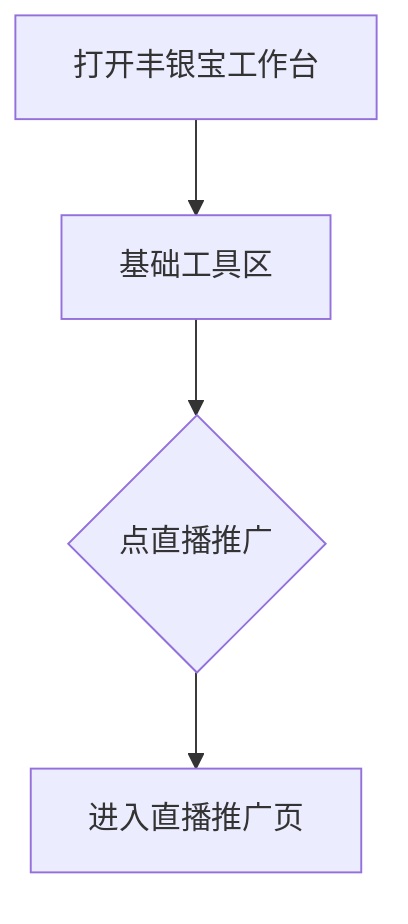
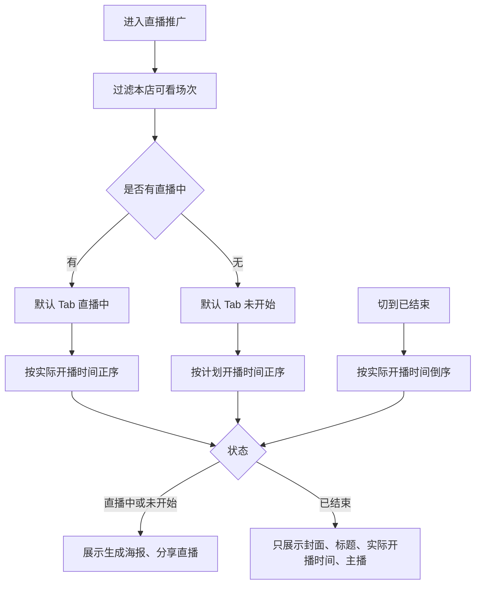
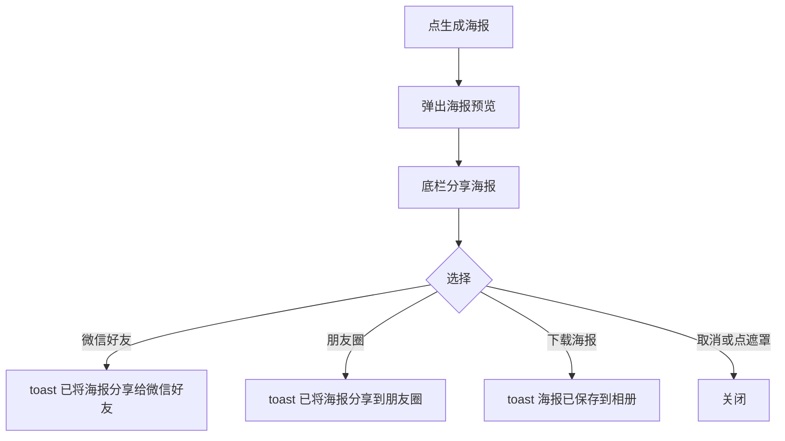
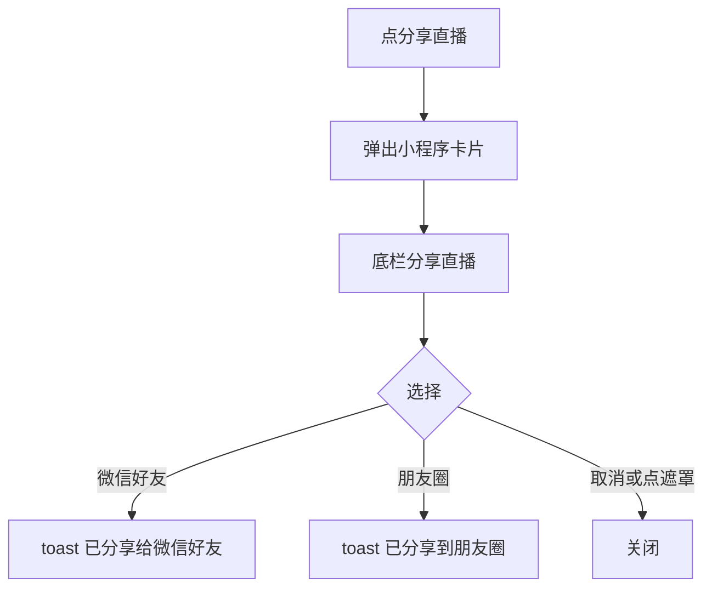
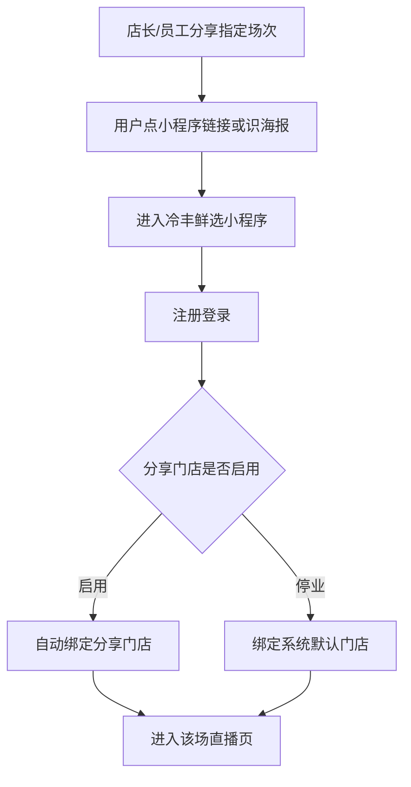
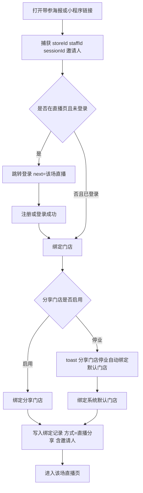
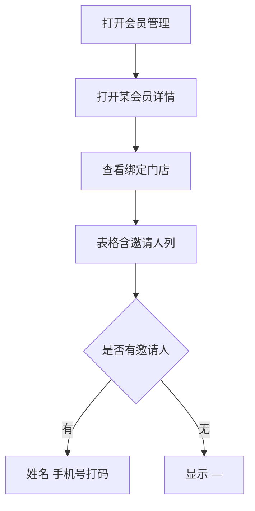

# 【628】丰银宝支持通过分享冷丰鲜选直播场次链接绑定推广会员

来源清单：`merged-20260904-01`（大版本 `2026090401直播推广` 全部小版本 `.1`～`.2`）

# 1. 后台业务 WEB 系统

## 1.1 概述

### 需求背景

门店店长/员工只能用门店推广码拉新，无法把本店可看的冷丰鲜选直播场次直接分享到微信。用户点开链接或扫海报后，既没有携带门店和店员参数，也不会在注册登录后自动绑到分享门店并进入该场直播。B 端会员「绑定门店」明细也看不到邀请人。本期按合并清单 `merged-20260904-01` 在丰银宝工作台增加直播推广：店员分享指定场次（海报或小程序卡片），链接携带当前门店和当前账号；用户登录后绑定分享门店并进入该场直播；门店停业则绑系统默认门店；会员绑定记录展示邀请人。

### 需求目标

1. 丰银宝工作台「门店推广码」右侧增加「直播推广」，店长/员工均可进入本店可看场次列表。
2. 列表分直播中 / 未开始 / 已结束；仅官方全量、定向含本店、区域覆盖本店的已启用场次可见，草稿不展示。有直播中则默认进直播中（实际开播正序），否则默认未开始（计划开播正序）；已结束按实际开播倒序。已结束卡片不展示生成海报、分享直播。
3. 直播中、未开始可生成海报（封面、状态、标题、直播时间、冷丰鲜选品牌与口号、二维码）和分享直播（小程序卡片：品牌、标题、5:4 封面、底栏「小程序」）。海报与链接均携带门店、店员参数，目标为该场直播页。
4. 列表上方展示推广路径：分享到微信群 → 点链接或识海报 → 进冷丰鲜选 → 注册登录后绑分享门店 → 进该场直播；门店停业则绑系统默认门店。
5. 未登录打开带参直播链接先登录；登录成功后绑店并进入该场直播。已登录当场绑店并留在该场。参数随页内跳转一直带上。
6. 会员管理「绑定门店」明细在绑定方式后增加邀请人：姓名（手机号）；无则「—」。直播分享产生的记录绑定方式为「直播分享」。

## 1.2 管理范围

| 终端 | 模块 | 变更类型 |
|------|------|----------|
| 门店 APP | 工作台 · 直播推广入口 | 修改 |
| 门店 APP | 直播推广 · 场次列表 | 新增 |
| 门店 APP | 直播推广 · 生成海报 | 新增 |
| 门店 APP | 直播推广 · 分享直播 | 新增 |
| 门店 APP | 直播推广 · 推广路径 | 修改 |
| C 端用户 APP | 直播分享带参绑店 | 修改 |
| B 端 MDM | 会员管理 · 绑定门店 | 修改 |

本期不做：

- 真实微信 SDK 拉起好友/朋友圈（原型用 toast 演示）
- 直播场次后台创建、可见范围配置本身（沿用已有场次数据）
- 邀请人业绩、佣金统计
- 非直播渠道（扫店码、切店）写入邀请人

## 1.3 需求详细说明

### 1.3.1 工作台 · 直播推广入口

#### 1.3.1.1 功能点：从基础工具进入直播推广

工作台「基础工具」在「门店推广码」右侧增加「直播推广」，店长/员工点入后进入本门店可看的直播场次列表。

#### 1.3.1.2 功能流程图

需要说明的问题：

- 入口权限与工作台一致，店长/员工均可进入。
- 不改变门店推广码原有逻辑。

#### 1.3.1.3 功能描述

| 项 | 内容 |
|----|------|
| 功能类型 | 查询数据 |
| 功能描述 | 从工作台进入本店可看的直播场次列表 |
| 前提业务 | 已登录丰银宝，当前门店有效 |
| 后继业务 | 直播推广 · 场次列表 |
| 功能约束 | 无单独权限点 |
| 约束描述 | 无 |
| 操作权限 | 当前门店店长、员工 |

#### 1.3.1.4 界面设计

**1. 界面原型**

- 原型文件：`store-app/h5/home.html`
- 本地预览：`http://localhost:5173/store-app/h5/home`
- 布局：
  - 工作台「基础工具」网格
  - 「门店推广码」右侧新增「直播推广」（黄色图标 + 文案）
  - 其后仍为「客户订单」等原入口
  - 点「直播推广」跳转 `live-promo.html`

#### 数据要求

| 字段名称 | 长度 | 录入方式 | 是否非空项 | 默认显示 |
|----------|------|----------|------------|----------|
| 直播推广 | - | 按钮入口 | Y | 文案「直播推广」 |

#### 1.3.1.5 逻辑描述

1. 点「直播推广」进入直播推广页。
2. 与变更前差异：基础工具原先只有门店推广码、客户订单等，没有直播推广入口。

### 1.3.2 场次列表

#### 1.3.2.1 功能点：按状态查看本店可看场次

直播推广页展示本门店可看场次。三个 Tab：直播中、未开始、已结束。直播中/已结束展示实际开播时间，未开始展示计划开播时间。已结束不展示生成海报、分享直播。

#### 1.3.2.2 功能流程图

需要说明的问题：

- 可见范围：官方全量可见；定向须包含本店；区域须覆盖本店。草稿不展示。
- 当前演示门店：冷丰生鲜超市（`ONS303445581201`）。
- 空态文案：暂无本门店可看的直播场次。

#### 1.3.2.3 功能描述

| 项 | 内容 |
|----|------|
| 功能类型 | 查询数据 |
| 功能描述 | 按 Tab 展示本店可看直播场次，直播中/未开始可分享 |
| 前提业务 | 已从工作台进入直播推广 |
| 后继业务 | 生成海报、分享直播 |
| 功能约束 | 仅本店可看且非草稿；已结束不可分享 |
| 约束描述 | 无 |
| 操作权限 | 当前门店店长、员工 |

#### 1.3.2.4 界面设计

**1. 界面原型**

- 原型文件：`store-app/h5/live-promo.html`
- 本地预览：`http://localhost:5173/store-app/h5/live-promo`
- 布局：
  - 顶栏：返回工作台、「直播推广」标题
  - Tab：直播中 / 未开始 / 已结束
  - 列表上方「推广路径」（见 1.3.5）
  - 卡片：封面（角标状态）、标题、时间、主播
  - 直播中、未开始：底部「生成海报」「分享直播」
  - 已结束：无操作按钮
  - 空态：暂无本门店可看的直播场次

#### 数据要求

| 字段名称 | 长度 | 录入方式 | 是否非空项 | 默认显示 |
|----------|------|----------|------------|----------|
| 直播封面图 | - | 只读展示 | Y | 场次封面 |
| 直播标题 | - | 只读展示 | Y | 场次名称 |
| 计划开播时间 | - | 只读展示 | 未开始为 Y | 文案「计划开播 yyyy-MM-dd HH:mm:ss」 |
| 实际开播时间 | - | 只读展示 | 直播中/已结束为 Y | 文案「开播时间 yyyy-MM-dd HH:mm:ss」 |
| 主播名称 | - | 只读展示 | Y | 「主播 xxx」 |
| 生成海报 | - | 按钮 | 非已结束 | 次按钮 |
| 分享直播 | - | 按钮 | 非已结束 | 主按钮 |

#### 1.3.2.5 逻辑描述

1. 进入页面过滤本店可看场次：官方全量、定向含本店、区域覆盖本店；草稿剔除。
2. 有直播中默认「直播中」并按实际开播正序；没有则默认「未开始」并按计划开播正序。
3. 「已结束」按实际开播倒序；卡片不出现生成海报、分享直播。
4. 当前 Tab 无数据时展示空态。
5. 与变更前差异：原先无此页；后又从三个 Tab 都可分享，改为已结束不可分享。

### 1.3.3 生成海报

#### 1.3.3.1 功能点：生成带参直播海报

点「生成海报」弹出该场海报预览。封面宽对齐、限定最大高度，高度不够用实际高度，超出裁剪下方。状态旁为标题，再为直播时间。底部左侧品牌「冷丰鲜选」及口号，右侧小程序/APP 均可扫的二维码。二维码与分享动作携带当前门店、当前账号。

#### 1.3.3.2 功能流程图

需要说明的问题：

- 海报二维码指向冷丰鲜选该场直播页，参数：`sessionId`、`storeId`、`staffId`、`inviteName`、`invitePhone`。
- 未开始海报时间取计划开播；直播中取实际开播。
- 真实微信分享本期用 toast 演示。

#### 1.3.3.3 功能描述

| 项 | 内容 |
|----|------|
| 功能类型 | 查询数据 |
| 功能描述 | 预览并分享/下载带门店与邀请人参数的直播海报 |
| 前提业务 | 场次为直播中或未开始 |
| 后继业务 | C 端打开海报二维码进入绑店流程 |
| 功能约束 | 已结束不可用 |
| 约束描述 | 无 |
| 操作权限 | 当前门店店长、员工 |

#### 1.3.3.4 界面设计

**1. 界面原型**

- 原型文件：`store-app/h5/live-promo.html`
- 本地预览：`http://localhost:5173/store-app/h5/live-promo`
- 布局：
  - 遮罩 + 白色海报卡
  - 封面图（宽对齐、限高、超出裁下方）
  - 状态框 + 直播标题
  - 直播时间：直播时间：yyyy.MM.dd HH:mm:ss
  - 底栏左侧：冷丰鲜选 logo、名称、口号「游九州风物，集万家鲜香，看冷丰直播」；右侧二维码
  - 底栏「分享海报」：微信好友、朋友圈、下载海报、取消

#### 数据要求

| 字段名称 | 长度 | 录入方式 | 是否非空项 | 默认显示 |
|----------|------|----------|------------|----------|
| 直播封面 | - | 只读展示 | Y | 场次封面 |
| 状态 | - | 只读徽章 | Y | 直播中 / 未开始 |
| 直播标题 | - | 只读展示 | Y | 场次名称 |
| 直播时间 | - | 只读展示 | Y | 未开始=计划开播；直播中=实际开播 |
| 冷丰鲜选 | - | 只读展示 | Y | 品牌名 + 口号 |
| 二维码 | - | 只读展示 | Y | 带参直播页链接 |

#### 1.3.3.5 逻辑描述

1. 仅直播中、未开始可点生成海报。
2. 点微信好友 / 朋友圈 / 下载海报后 toast 并关闭；取消或点遮罩关闭。
3. 海报与链接携带当前门店、当前登录账号（店员 ID、姓名、手机号）。
4. 与变更前差异：无（本次新增）。

### 1.3.4 分享直播

#### 1.3.4.1 功能点：分享小程序直播卡片

点「分享直播」弹出小程序卡片预览：顶栏品牌「冷丰鲜选」，下方直播标题，封面 5:4 宽对齐，超出裁剪下方、高度不够留白，底栏「小程序」。底栏操作为微信好友、朋友圈、取消。分享链接携带当前门店和当前账号。

#### 1.3.4.2 功能流程图

需要说明的问题：

- 链接目标：`user-app/h5/live-room.html`，参数同海报。
- 真实微信分享本期用 toast 演示。

#### 1.3.4.3 功能描述

| 项 | 内容 |
|----|------|
| 功能类型 | 查询数据 |
| 功能描述 | 以小程序卡片形式分享带参直播链接 |
| 前提业务 | 场次为直播中或未开始 |
| 后继业务 | C 端打开链接进入绑店流程 |
| 功能约束 | 已结束不可用 |
| 约束描述 | 无 |
| 操作权限 | 当前门店店长、员工 |

#### 1.3.4.4 界面设计

**1. 界面原型**

- 原型文件：`store-app/h5/live-promo.html`
- 本地预览：`http://localhost:5173/store-app/h5/live-promo`
- 布局：
  - 小程序卡片：顶栏 logo +「冷丰鲜选」；标题；封面 5:4；底栏链接图标 +「小程序」
  - 底栏「分享直播」：微信好友、朋友圈、取消（无下载）

#### 数据要求

| 字段名称 | 长度 | 录入方式 | 是否非空项 | 默认显示 |
|----------|------|----------|------------|----------|
| 冷丰鲜选 | - | 只读展示 | Y | 顶栏品牌 |
| 直播标题 | - | 只读展示 | Y | 场次名称 |
| 直播封面图 | - | 只读展示 | Y | 5:4，超出裁下、不够留白 |
| 小程序 | - | 只读展示 | Y | 底栏文案 |

#### 1.3.4.5 逻辑描述

1. 仅直播中、未开始可点分享直播。
2. 点微信好友 / 朋友圈 toast 后关闭；取消或点遮罩关闭。
3. 分享链接携带 `sessionId`、`storeId`、`staffId`、`inviteName`、`invitePhone`。
4. 与变更前差异：无（本次新增）。

### 1.3.5 推广路径

#### 1.3.5.1 功能点：展示从分享到进直播的路径说明

列表上方固定展示推广路径，说明店长/员工分享指定场次后，用户如何进小程序、登录绑店并进入该场直播。

#### 1.3.5.2 功能流程图

需要说明的问题：

- 分享始终携带当前门店、当前店员。
- 路径文案与 C 端实际绑店逻辑一致（见 1.3.6）。

#### 1.3.5.3 功能描述

| 项 | 内容 |
|----|------|
| 功能类型 | 查询数据 |
| 功能描述 | 在列表上方说明直播推广全路径 |
| 前提业务 | 已进入直播推广页 |
| 后继业务 | 无 |
| 功能约束 | 只读说明 |
| 约束描述 | 无 |
| 操作权限 | 当前门店店长、员工 |

#### 1.3.5.4 界面设计

**1. 界面原型**

- 原型文件：`store-app/h5/live-promo.html`
- 本地预览：`http://localhost:5173/store-app/h5/live-promo`
- 布局：
  - 标题「推广路径」
  - 五步：
    1. 店长/员工分享指定场次到微信群（链接和海报均携带当前门店、店员）
    2. 用户点击小程序链接或识别海报
    3. 进入冷丰鲜选小程序
    4. 注册登录后自动绑定分享门店（门店停业则绑定系统默认门店）
    5. 进入该场直播页

#### 数据要求

| 字段名称 | 长度 | 录入方式 | 是否非空项 | 默认显示 |
|----------|------|----------|------------|----------|
| 推广路径 | - | 只读说明 | Y | 上述五步 |

#### 1.3.5.5 逻辑描述

1. 进入页面即展示，不随 Tab 切换隐藏。
2. 与变更前差异：原先只有场次列表，没有推广路径说明。

### 1.3.6 直播分享带参绑店

#### 1.3.6.1 功能点：带参进入冷丰鲜选后登录绑店并进该场直播

用户从丰银宝海报或小程序链接进入冷丰鲜选。链接携带门店和当前账号。参数写入会话并随页内跳转一直带上。未登录打开带参直播页先进入注册登录；登录成功后绑定分享门店，再进入该场直播。已登录则当场绑店并留在该场。门店停业则提示「分享门店停业，自动绑定默认门店」并绑系统默认门店。

#### 1.3.6.2 功能流程图

需要说明的问题：

- URL 参数：`sessionId`、`storeId`（或 `store`）、`staffId`（或 `inviter` / `inviteId`）、`inviteName`、`invitePhone`。
- 登录成功后 `next` 允许回到 `live-room.html`，不再只回首页或我的。
- 绑定记录写入 `mdm_member_store_bind_log_v1`，供会员管理读取。
- 原型右下/左下「直播分享验收开关」可切登录态、分享门店启用/禁用；页面被锁死时开关仍可操作。
- 示例带参预览：`http://localhost:5173/user-app/h5/live-room?sessionId=sess-live-01&storeId=ONS303445581201&staffId=STAFF-001&inviteName=牛店长&invitePhone=13812348001`

#### 1.3.6.3 功能描述

| 项 | 内容 |
|----|------|
| 功能类型 | 新增数据 / 更新数据 |
| 功能描述 | 带参进入后登录绑定分享门店（或默认门店）并进入被推广的直播场次 |
| 前提业务 | 链接携带门店和店员参数 |
| 后继业务 | 会员管理可查看绑定门店与邀请人 |
| 功能约束 | 未登录必须先登录；停业门店不可绑，改绑系统默认门店 |
| 约束描述 | 同一邀请签名重复进入不重复写绑定日志 |
| 操作权限 | C 端用户 |

#### 1.3.6.4 界面设计

**1. 界面原型**

- 原型文件：`user-app/h5/live-room.html`、`user-app/h5/home.html`、`user-app/h5/login.html`、`user-app/h5/login-register.html`
- 本地预览：
  - `http://localhost:5173/user-app/h5/live-room?sessionId=sess-live-01&storeId=ONS303445581201&staffId=STAFF-001&inviteName=牛店长&invitePhone=13812348001`
  - `http://localhost:5173/user-app/h5/home`
  - `http://localhost:5173/user-app/h5/login`
- 布局：
  - 未登录打开带参直播页：整页跳转登录，登录成功后回到该场直播
  - 已登录：留在直播页并完成绑店
  - 停业：toast「分享门店停业，自动绑定默认门店」
  - 验收开关标题「直播分享验收开关」：登录态（已登录/未登录）、分享门店（已启用/已禁用），橙色「应用并刷新」

#### 数据要求

| 字段名称 | 长度 | 录入方式 | 是否非空项 | 默认显示 |
|----------|------|----------|------------|----------|
| storeId | - | URL 参数 | Y | 当前分享门店 |
| staffId | - | URL 参数 | Y | 当前店员 |
| 邀请人姓名 | - | URL 参数 | N | 缺省「牛店长」 |
| 邀请人手机号 | - | URL 参数 | N | 缺省 13812348001 |
| sessionId | - | URL 参数 | Y（回直播页） | 被推广场次 |

#### 1.3.6.5 逻辑描述

1. 打开带参链接后把门店、店员、邀请人、场次写入会话；页内 `a[href]` 跳转继续带参。
2. 未登录访问直播间：跳转 `login.html?next=live-room.html?...`。
3. 登录/注册成功：绑定分享门店（停业则绑系统默认门店并 toast），再进入该场直播。
4. 已登录访问带参直播间：当场绑店并留在该场。
5. 绑定方式记为「直播分享」，邀请人记为「姓名（手机号）」，手机号中间四位打码。
6. 与变更前差异：原先 URL 仅带 storeId 时进首页立即绑店、无邀请人、无停业回退提示；带参打开直播间不强制登录，登录成功后不一定回到该场直播。

### 1.3.7 绑定门店 · 邀请人

#### 1.3.7.1 功能点：绑定明细展示邀请人

会员详情「绑定门店」表在「绑定方式」后增加「邀请人」。通过直播分享绑定的记录展示店员姓名和手机号，如「牛店长（138****8001）」；无邀请人显示「—」。

#### 1.3.7.2 功能流程图

需要说明的问题：

- 演示会员 U10001 预置一条：绑定方式「直播分享」，邀请人「牛店长（138****8001）」，门店「冷丰生鲜超市」。
- C 端直播分享产生的新记录写入同一本地存储，刷新会员详情可见。

#### 1.3.7.3 功能描述

| 项 | 内容 |
|----|------|
| 功能类型 | 查询数据 |
| 功能描述 | 在绑定门店明细中展示邀请人 |
| 前提业务 | 会员已有绑定门店记录 |
| 后继业务 | 无 |
| 功能约束 | 只读 |
| 约束描述 | 无 |
| 操作权限 | 会员管理操作账号 |

#### 1.3.7.4 界面设计

**1. 界面原型**

- 原型文件：`MDM/mdm_member_c.html`
- 本地预览：`http://localhost:5173/MDM/mdm_member_c`
- 布局：
  - 打开会员详情 → 「绑定门店」
  - 列顺序：类型、门店名称、省市区、详细地址、绑定方式、**邀请人**、发生时间、观看时长、消费金额、下单次数、退款金额、退款次数
  - 邀请人：有则「姓名（138****8001）」；无则「—」

#### 数据要求

| 字段名称 | 长度 | 录入方式 | 是否非空项 | 默认显示 |
|----------|------|----------|------------|----------|
| 邀请人 | - | 只读展示 | N | 无则 —；直播分享为姓名（手机号打码） |

#### 1.3.7.5 逻辑描述

1. 绑定门店表在绑定方式后展示邀请人。
2. 直播分享记录展示邀请店员姓名和打码手机号。
3. 与变更前差异：原先绑定明细无邀请人列。
