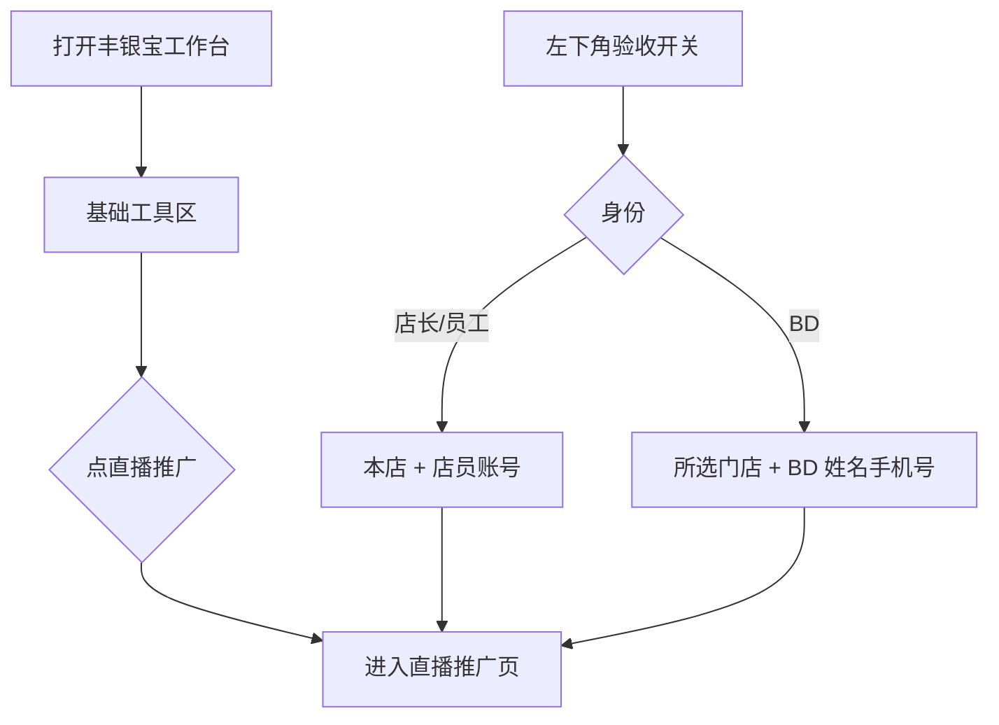
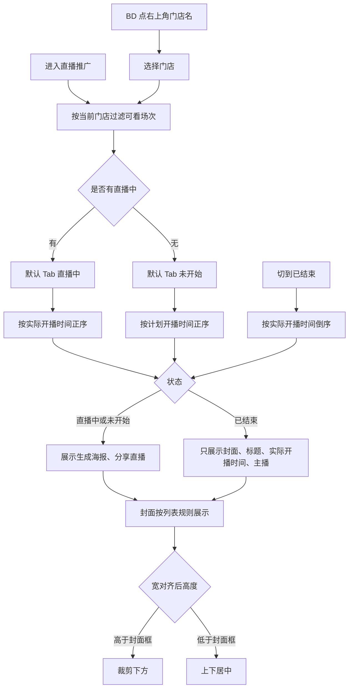
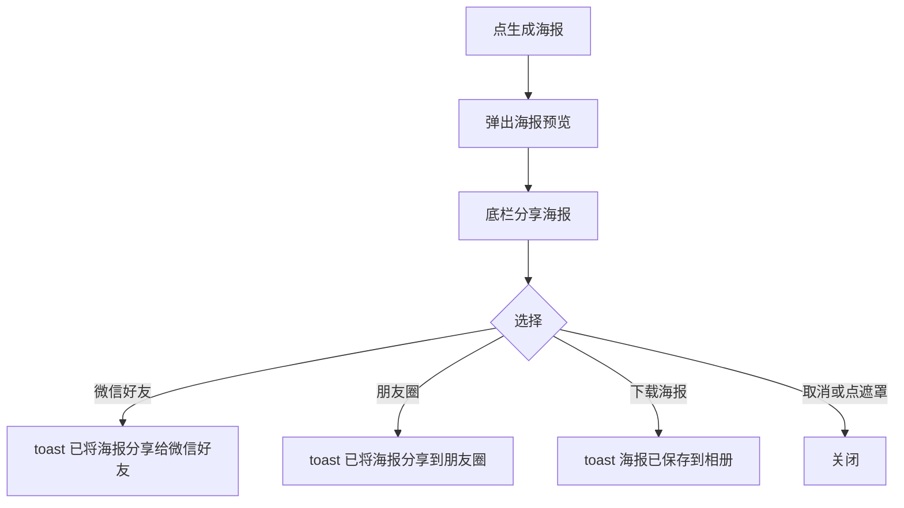
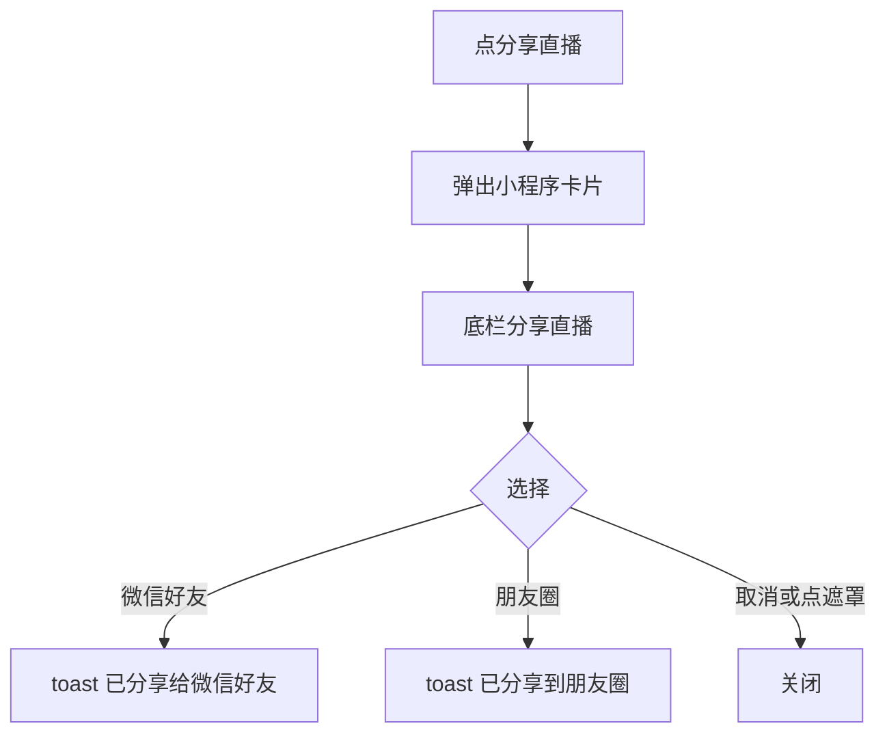
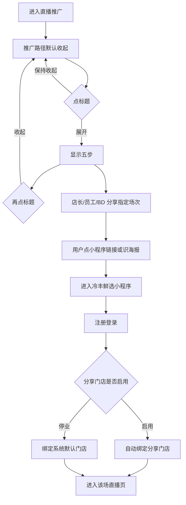
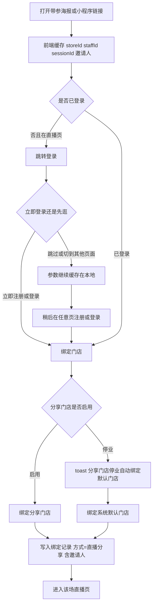
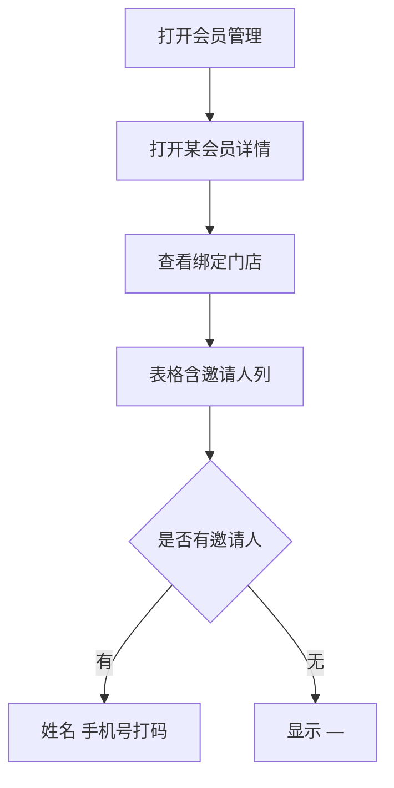
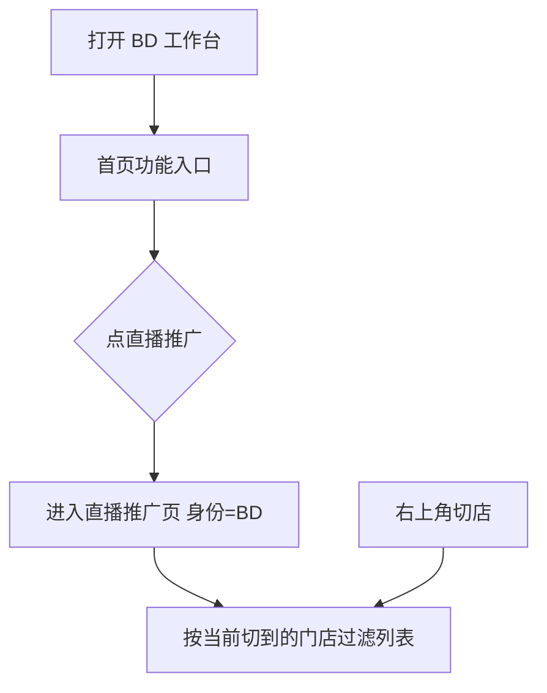

# 【628】丰银宝支持通过分享冷丰鲜选直播场次链接绑定推广会员

来源清单：`merged-20260905-02`（大版本 `2026090401直播推广` 全部小版本 `.1`～`.5`）

# 1. 后台业务 WEB 系统

## 1.1 概述

### 需求背景

门店店长/员工只能用门店推广码拉新，无法把本店可看的冷丰鲜选直播场次直接分享到微信。BD 切到某门店后也不能看直播推广列表，分享无法带上当前所在门店和 BD 本人。用户点开链接或扫海报后，既没有携带门店和推广人参数，也不会在注册登录后自动绑到分享门店并进入该场直播；若先逛其他页再登录，参数更容易丢失。B 端会员「绑定门店」明细也看不到邀请人。本期按合并清单 `merged-20260905-02` 在丰银宝和 BD 工作台增加直播推广：店长/员工/BD 分享指定场次（海报或小程序卡片），链接携带当前门店和当前推广人账号；用户登录后绑定分享门店并进入该场直播，先逛后登录同样有效；门店停业则绑系统默认门店；会员绑定记录展示邀请人。

### 需求目标

1. 丰银宝工作台「门店推广码」右侧增加「直播推广」，店长/员工均可进入本店可看场次列表。BD 切到某门店后也可从丰银宝工作台进入；左下角「直播推广验收开关」可切店长/员工或 BD 并选当前门店。
2. BD 工作台「进货」右侧增加「直播推广」，进入后身份为当前 BD，绑定门店为当前切到的门店，右上角可再切店。
3. 列表分直播中 / 未开始 / 已结束；仅官方全量、定向含当前门店、区域覆盖当前门店的已启用场次可见，草稿不展示。有直播中则默认进直播中（实际开播正序），否则默认未开始（计划开播正序）；已结束按实际开播倒序。已结束卡片不展示生成海报、分享直播。列表封面宽对齐后超出裁下方，高度不够则上下居中。页内展示当前门店和推广人。
4. 直播中、未开始可生成海报和分享直播。海报封面限定最大高度：宽对齐后不足则用实际高度，超出裁下方。分享直播为小程序卡片（品牌、标题、5:4 封面、底栏「小程序」），封面宽对齐后超出裁下方、高度不够则上下居中。海报与链接均携带当前门店、当前推广人账号，目标为该场直播页。店长/员工带本店和店员账号；BD 带当前所在门店及 BD 姓名、手机号。
5. 列表上方展示推广路径（默认收起，点标题展开/收起）：店长/员工/BD 分享到微信群 → 点链接或识海报 → 进冷丰鲜选 → 注册登录后绑分享门店 → 进该场直播；门店停业则绑系统默认门店。
6. 冷丰鲜选打开带参链接后前端一直缓存参数。未登录打开带参直播页先登录；也可先跳过或切到其他页面，稍后注册/登录仍绑定分享门店并进入该场直播。已登录当场绑店并留在该场。
7. 会员管理「绑定门店」明细在绑定方式后增加邀请人：姓名（手机号）；无则「—」。直播分享产生的记录绑定方式为「直播分享」，邀请人可为店员或 BD。

## 1.2 管理范围

| 终端 | 模块 | 变更类型 |
|------|------|----------|
| 门店 APP | 工作台 · 直播推广入口 | 修改 |
| BD APP | 工作台 · 直播推广入口 | 修改 |
| 门店 APP | 直播推广 · 场次列表 | 新增 |
| 门店 APP | 直播推广 · 生成海报 | 新增 |
| 门店 APP | 直播推广 · 分享直播 | 新增 |
| 门店 APP | 直播推广 · 推广路径 | 修改 |
| C 端用户 APP | 直播分享带参绑店 | 修改 |
| B 端 MDM | 会员管理 · 绑定门店 | 修改 |

本期不做：

- 真实微信 SDK 拉起好友/朋友圈（原型用 toast 演示）
- 直播场次后台创建、可见范围配置本身（沿用已有场次数据）
- 邀请人业绩、佣金统计
- 非直播渠道（扫店码、切店）写入邀请人

## 1.3 需求详细说明

### 1.3.1 工作台 · 直播推广入口

#### 1.3.1.1 功能点：从基础工具进入直播推广

工作台「基础工具」在「门店推广码」右侧增加「直播推广」。店长/员工点入后进入本门店可看的直播场次列表。BD 切到某门店后，页头展示该店和 BD 姓名，同样可点「直播推广」进入该店列表。

#### 1.3.1.2 功能流程图

需要说明的问题：

- 入口权限：店长/员工看本店；BD 切到某店后也可进入。
- 不改变门店推广码原有逻辑。
- 左下角「直播推广验收开关」：身份（店长/员工、BD）、当前门店（仅 BD 可选），橙色「应用并刷新」。

#### 1.3.1.3 功能描述

| 项 | 内容 |
|----|------|
| 功能类型 | 查询数据 |
| 功能描述 | 从工作台进入当前身份对应门店的直播场次列表 |
| 前提业务 | 已登录丰银宝；BD 需已切到某门店 |
| 后继业务 | 直播推广 · 场次列表 |
| 功能约束 | 无单独权限点 |
| 约束描述 | 无 |
| 操作权限 | 当前门店店长、员工；已切店的 BD |

#### 1.3.1.4 界面设计

**1. 界面原型**

- 原型文件：`store-app/h5/home.html`
- 本地预览：`http://localhost:5173/store-app/h5/home`
- 布局：
  - 工作台「基础工具」网格
  - 「门店推广码」右侧新增「直播推广」（黄色图标 + 文案）
  - 其后仍为「客户订单」等原入口
  - 店长：页头为本店名、店长头像
  - BD 切店后：页头为当前门店名，副文案「BD · 李泽峰 · 已切到该店」
  - 左下角「直播推广验收开关」
  - 点「直播推广」跳转 `live-promo.html`（BD 带 `from`、`role`、`storeId`）

#### 数据要求

| 字段名称 | 长度 | 录入方式 | 是否非空项 | 默认显示 |
|----------|------|----------|------------|----------|
| 直播推广 | - | 按钮入口 | Y | 文案「直播推广」 |
| 身份 | - | 下拉 | Y（验收） | 店长/员工 |
| 当前门店 | - | 下拉 | BD 为 Y | 冷丰生鲜超市 / 中心店01 / 西溪湿地南门店 / 蒋村公交站店 |

#### 1.3.1.5 逻辑描述

1. 点「直播推广」进入直播推广页。
2. 验收开关切到 BD 并选门店后刷新：页头改为该店和 BD 姓名，再点直播推广进入该店列表。
3. 与变更前差异：基础工具原先只有门店推广码、客户订单等，没有直播推广入口；工作台固定店长身份，BD 切店后不能进入。

### 1.3.2 场次列表

#### 1.3.2.1 功能点：按状态查看本店可看场次

直播推广页展示当前门店可看场次。页内展示当前门店和推广人。三个 Tab：直播中、未开始、已结束。直播中/已结束展示实际开播时间，未开始展示计划开播时间。已结束不展示生成海报、分享直播。每条卡片左侧为直播封面图，按下列规则展示，三个 Tab 相同。BD 切到某店后，右上角可再切店，列表按该店可见范围刷新。

#### 1.3.2.2 功能流程图

需要说明的问题：

- 可见范围：官方全量可见；定向须包含当前门店；区域须覆盖当前门店。草稿不展示。
- 店长/员工当前门店：冷丰生鲜超市（`ONS303445581201`），推广人牛店长。
- BD 当前门店为切到的门店，推广人李泽峰（13822118801）。
- 空态文案：暂无本门店可看的直播场次。
- **直播列表封面图展示规则**（与海报、分享卡片不同，只适用于列表左侧封面框）：
  1. 先把封面图按封面框**宽度对齐**（宽度撑满框，高度按原图比例缩放）。
  2. 宽对齐后，图的高度**高于**封面框：从顶部起展示，**裁剪下方**多出的部分，不裁左右、不居中裁上下。
  3. 宽对齐后，图的高度**不够**封面框：图在框内**上下居中**展示，上下可留出封面框底色，**不拉伸、不放大铺满**。
  4. 宽对齐后高度刚好等于封面框：完整展示。
  5. 三个 Tab（直播中 / 未开始 / 已结束）同一套规则。

#### 1.3.2.3 功能描述

| 项 | 内容 |
|----|------|
| 功能类型 | 查询数据 |
| 功能描述 | 按 Tab 展示当前门店可看直播场次，直播中/未开始可分享 |
| 前提业务 | 已从丰银宝工作台或 BD 工作台进入直播推广 |
| 后继业务 | 生成海报、分享直播 |
| 功能约束 | 仅当前门店可看且非草稿；已结束不可分享 |
| 约束描述 | 无 |
| 操作权限 | 当前门店店长、员工；已切店的 BD |

#### 1.3.2.4 界面设计

**1. 界面原型**

- 原型文件：`store-app/h5/live-promo.html`
- 本地预览：`http://localhost:5173/store-app/h5/live-promo`
- BD 切店预览：`http://localhost:5173/store-app/h5/live-promo?from=bd-app&role=bd`
- 布局：
  - 顶栏：返回（店长回丰银宝工作台，BD 从 BD 工作台进入则回 BD 工作台）、「直播推广」标题
  - BD：右上角当前门店名，点开「切换门店」
  - Tab：直播中 / 未开始 / 已结束
  - 列表上方「推广路径」（见 1.3.5，默认收起）
  - 当前门店、推广人说明条（如「当前门店 冷丰生鲜超市 · 推广人 李泽峰 138****8801」）
  - 卡片：左侧封面框 + 状态角标、标题、时间、主播
  - 封面图展示：宽对齐 → 超出裁剪下方；宽对齐后高度不够则上下居中，不铺满拉伸（详见上方规则）
  - 直播中、未开始：底部「生成海报」「分享直播」
  - 已结束：无操作按钮
  - 空态：暂无本门店可看的直播场次
  - 左下角「直播推广验收开关」

#### 数据要求

| 字段名称 | 长度 | 录入方式 | 是否非空项 | 默认显示 |
|----------|------|----------|------------|----------|
| 直播封面图 | - | 只读展示 | Y | 按封面框宽对齐；高于框裁下方，不够则上下居中，不拉伸铺满 |
| 直播标题 | - | 只读展示 | Y | 场次名称 |
| 计划开播时间 | - | 只读展示 | 未开始为 Y | 文案「计划开播 yyyy-MM-dd HH:mm:ss」 |
| 实际开播时间 | - | 只读展示 | 直播中/已结束为 Y | 文案「开播时间 yyyy-MM-dd HH:mm:ss」 |
| 主播名称 | - | 只读展示 | Y | 「主播 xxx」 |
| 生成海报 | - | 按钮 | 非已结束 | 次按钮 |
| 分享直播 | - | 按钮 | 非已结束 | 主按钮 |
| 当前门店 | - | 只读展示 / BD 可点选 | Y | 当前切到或所属门店 |
| 推广人 | - | 只读展示 | Y | 店长/员工为牛店长；BD 为李泽峰 + 打码手机号 |

#### 1.3.2.5 逻辑描述

1. 进入页面过滤当前门店可看场次：官方全量、定向含当前门店、区域覆盖当前门店；草稿剔除。
2. 有直播中默认「直播中」并按实际开播正序；没有则默认「未开始」并按计划开播正序。
3. 「已结束」按实际开播倒序；卡片不出现生成海报、分享直播。
4. 当前 Tab 无数据时展示空态。
5. 页内展示当前门店和推广人。BD 点右上角门店名切换后，列表按新店刷新，推广人仍为 BD 姓名和手机号。
6. 直播列表封面图展示规则：
   1. 封面图先按封面框宽度对齐（宽度撑满，高度按原图比例）。
   2. 宽对齐后高于封面框：顶部对齐，裁剪下方。
   3. 宽对齐后高度不够：在框内上下居中，不拉伸、不放大铺满。
   4. 三个 Tab 相同。
7. 与变更前差异：原先没有直播推广场次列表；后来固定按冷丰生鲜超市和店长身份，BD 切店后看不到、也不能换店。

### 1.3.3 生成海报

#### 1.3.3.1 功能点：生成带参直播海报

点「生成海报」弹出该场海报预览。封面宽对齐、限定最大高度，高度不够用实际高度，超出裁剪下方。状态旁为标题，再为直播时间。底部左侧品牌「冷丰鲜选」及口号，右侧小程序/APP 均可扫的二维码。二维码与分享动作携带当前门店、当前推广人账号：店长/员工为店员姓名和手机号，BD 为 BD 姓名和手机号。

#### 1.3.3.2 功能流程图

需要说明的问题：

- 海报二维码指向冷丰鲜选该场直播页，参数：`sessionId`、`storeId`、`staffId`、`inviteName`、`invitePhone`。
- 店长/员工：`storeId` 为本店，`staffId`/`inviteName`/`invitePhone` 为牛店长账号。
- BD：`storeId` 为当前切到的门店，`staffId` 为 `BD20240001`，`inviteName` 李泽峰，`invitePhone` 13822118801。
- 未开始海报时间取计划开播；直播中取实际开播。
- 真实微信分享本期用 toast 演示，toast 带出门店和推广人。

#### 1.3.3.3 功能描述

| 项 | 内容 |
|----|------|
| 功能类型 | 查询数据 |
| 功能描述 | 预览并分享/下载带门店与邀请人参数的直播海报 |
| 前提业务 | 场次为直播中或未开始 |
| 后继业务 | C 端打开海报二维码进入绑店流程 |
| 功能约束 | 已结束不可用 |
| 约束描述 | 无 |
| 操作权限 | 当前门店店长、员工；已切店的 BD |

#### 1.3.3.4 界面设计

**1. 界面原型**

- 原型文件：`store-app/h5/live-promo.html`
- 本地预览：`http://localhost:5173/store-app/h5/live-promo`
- 布局：
  - 遮罩 + 白色海报卡
  - 封面图（宽对齐、限定最大高度；不足最大高度用实际高度，超出裁下方）
  - 状态框 + 直播标题
  - 直播时间：直播时间：yyyy.MM.dd HH:mm:ss
  - 底栏左侧：冷丰鲜选 logo、名称、口号「游九州风物，集万家鲜香，看冷丰直播」；右侧二维码
  - 底栏「分享海报」：微信好友、朋友圈、下载海报、取消

#### 数据要求

| 字段名称 | 长度 | 录入方式 | 是否非空项 | 默认显示 |
|----------|------|----------|------------|----------|
| 直播封面 | - | 只读展示 | Y | 场次封面 |
| 状态 | - | 只读徽章 | Y | 直播中 / 未开始 |
| 直播标题 | - | 只读展示 | Y | 场次名称 |
| 直播时间 | - | 只读展示 | Y | 未开始=计划开播；直播中=实际开播 |
| 冷丰鲜选 | - | 只读展示 | Y | 品牌名 + 口号 |
| 二维码 | - | 只读展示 | Y | 带参直播页链接 |

#### 1.3.3.5 逻辑描述

1. 仅直播中、未开始可点生成海报。
2. 点微信好友 / 朋友圈 / 下载海报后 toast 并关闭；取消或点遮罩关闭。
3. 海报与链接携带当前门店、当前推广人账号。店长/员工带牛店长；BD 带李泽峰姓名和手机号。
4. 封面宽对齐：低于最大高度按实际高度展示；超出最大高度裁剪下方。
5. 与变更前差异：原先没有海报分享；后来固定带冷丰生鲜超市和牛店长，BD 身份也不会换成 BD 账号或其所在门店。

### 1.3.4 分享直播

#### 1.3.4.1 功能点：分享小程序直播卡片

点「分享直播」弹出小程序卡片预览：顶栏品牌「冷丰鲜选」，下方直播标题，封面 5:4 宽对齐，超出裁剪下方、高度不够则上下居中，底栏「小程序」。底栏操作为微信好友、朋友圈、取消。分享链接携带当前门店和当前推广人账号（店长/员工为店员，BD 为 BD 姓名和手机号）。

#### 1.3.4.2 功能流程图

需要说明的问题：

- 链接目标：`user-app/h5/live-room.html`，参数同海报。
- 真实微信分享本期用 toast 演示。

#### 1.3.4.3 功能描述

| 项 | 内容 |
|----|------|
| 功能类型 | 查询数据 |
| 功能描述 | 以小程序卡片形式分享带参直播链接 |
| 前提业务 | 场次为直播中或未开始 |
| 后继业务 | C 端打开链接进入绑店流程 |
| 功能约束 | 已结束不可用 |
| 约束描述 | 无 |
| 操作权限 | 当前门店店长、员工；已切店的 BD |

#### 1.3.4.4 界面设计

**1. 界面原型**

- 原型文件：`store-app/h5/live-promo.html`
- 本地预览：`http://localhost:5173/store-app/h5/live-promo`
- 布局：
  - 小程序卡片：顶栏 logo +「冷丰鲜选」；标题；封面 5:4；底栏链接图标 +「小程序」
  - 底栏「分享直播」：微信好友、朋友圈、取消（无下载）

#### 数据要求

| 字段名称 | 长度 | 录入方式 | 是否非空项 | 默认显示 |
|----------|------|----------|------------|----------|
| 冷丰鲜选 | - | 只读展示 | Y | 顶栏品牌 |
| 直播标题 | - | 只读展示 | Y | 场次名称 |
| 直播封面图 | - | 只读展示 | Y | 5:4，宽对齐后超出裁下、高不够上下居中 |
| 小程序 | - | 只读展示 | Y | 底栏文案 |

#### 1.3.4.5 逻辑描述

1. 仅直播中、未开始可点分享直播。
2. 点微信好友 / 朋友圈 toast 后关闭；取消或点遮罩关闭。
3. 分享链接携带 `sessionId`、`storeId`、`staffId`、`inviteName`、`invitePhone`。店长/员工带本店和牛店长；BD 带当前所在门店和李泽峰姓名、手机号。
4. 封面 5:4：宽对齐后超出裁剪下方；高度不够则上下居中。
5. 与变更前差异：原先没有小程序卡片分享直播；后来固定带冷丰生鲜超市和牛店长。

### 1.3.5 推广路径

#### 1.3.5.1 功能点：展示从分享到进直播的路径说明

列表上方展示推广路径，说明店长/员工/BD 分享指定场次后，用户如何进小程序、登录绑店并进入该场直播。进入页面默认收起，只显示标题和「展开」；点标题可展开五步，再点「收起」。

#### 1.3.5.2 功能流程图

需要说明的问题：

- 进入页面默认收起，只露标题和「展开」；刷新后仍默认收起，不记住展开状态。
- 点标题即可展开/收起：展开后显示五步，文案改为「收起」；再点则收回。
- 分享始终携带当前门店、当前推广人账号（店长/员工为店员，BD 为 BD 姓名和手机号）。
- 路径文案与 C 端实际绑店逻辑一致（见 1.3.6）。

#### 1.3.5.3 功能描述

| 项 | 内容 |
|----|------|
| 功能类型 | 查询数据 |
| 功能描述 | 在列表上方说明直播推广全路径，默认收起，点标题展开/收起 |
| 前提业务 | 已进入直播推广页 |
| 后继业务 | 无 |
| 功能约束 | 只读说明 |
| 约束描述 | 无 |
| 操作权限 | 当前门店店长、员工；已切店的 BD |

#### 1.3.5.4 界面设计

**1. 界面原型**

- 原型文件：`store-app/h5/live-promo.html`
- 本地预览：`http://localhost:5173/store-app/h5/live-promo`
- 布局：
  - 标题行：「推广路径」+ 右侧「展开」/「收起」
  - 默认收起：只露标题行
  - 展开后五步：
    1. 店长/员工/BD 分享指定场次到微信群（链接和海报均携带当前门店、当前推广人账号）
    2. 用户点击小程序链接或识别海报
    3. 进入冷丰鲜选小程序
    4. 注册登录后自动绑定分享门店（门店停业则绑定系统默认门店）
    5. 进入该场直播页

#### 数据要求

| 字段名称 | 长度 | 录入方式 | 是否非空项 | 默认显示 |
|----------|------|----------|------------|----------|
| 推广路径 | - | 只读说明 | Y | 默认收起；展开后为上述五步 |

#### 1.3.5.5 逻辑描述

1. 进入页面默认收起，不随 Tab 切换隐藏；刷新后仍默认收起。
2. 点标题展开五步，按钮改为「收起」；再点则收回，只露标题。
3. 与变更前差异：原先进入页面即完整展开五步，不能收起。

### 1.3.6 直播分享带参绑店

#### 1.3.6.1 功能点：带参进入冷丰鲜选后登录绑店并进该场直播

用户从丰银宝海报或小程序链接进入冷丰鲜选。链接携带门店和当前账号。前端把参数写入本地缓存，之后无论停留在入口页还是切到首页、我的、订单等其他页面，参数一直保留。未登录打开带参直播页先进入注册登录；也可先跳过登录去逛其他页，稍后注册/登录仍绑定分享门店。登录成功后绑定分享门店，再进入该场直播。已登录则当场绑店并留在该场。门店停业则提示「分享门店停业，自动绑定默认门店」并绑系统默认门店。

#### 1.3.6.2 功能流程图

需要说明的问题：

- URL 参数：`sessionId`、`storeId`（或 `store`）、`staffId`（或 `inviter` / `inviteId`）、`inviteName`、`invitePhone`。
- 参数写入本地缓存后一直保留：用户通过链接打开小程序/APP 后不直接登录，切换到其他页面再注册/登录，仍绑定到分享门店。
- 登录成功后 `next` 允许回到 `live-room.html`，不再只回首页或我的。
- 绑定记录写入 `mdm_member_store_bind_log_v1`，供会员管理读取。
- 原型右下/左下「直播分享验收开关」可切登录态、分享门店启用/禁用；页面被锁死时开关仍可操作。
- 示例带参预览：
  - 店长：`http://localhost:5173/user-app/h5/live-room?sessionId=sess-live-01&storeId=ONS303445581201&staffId=STAFF-001&inviteName=牛店长&invitePhone=13812348001`
  - BD：`http://localhost:5173/user-app/h5/live-room?sessionId=sess-live-01&storeId=ONS-CENTER-01&staffId=BD20240001&inviteName=李泽峰&invitePhone=13822118801`

#### 1.3.6.3 功能描述

| 项 | 内容 |
|----|------|
| 功能类型 | 新增数据 / 更新数据 |
| 功能描述 | 带参进入后登录绑定分享门店（或默认门店）并进入被推广的直播场次 |
| 前提业务 | 链接携带门店和推广人参数 |
| 后继业务 | 会员管理可查看绑定门店与邀请人 |
| 功能约束 | 未登录必须先登录；停业门店不可绑，改绑系统默认门店 |
| 约束描述 | 同一邀请签名重复进入不重复写绑定日志 |
| 操作权限 | C 端用户 |

#### 1.3.6.4 界面设计

**1. 界面原型**

- 原型文件：`user-app/h5/live-room.html`、`user-app/h5/home.html`、`user-app/h5/login.html`、`user-app/h5/login-register.html`、`user-app/h5/profile.html`
- 本地预览：
  - `http://localhost:5173/user-app/h5/live-room?sessionId=sess-live-01&storeId=ONS303445581201&staffId=STAFF-001&inviteName=牛店长&invitePhone=13812348001`
  - `http://localhost:5173/user-app/h5/home`
  - `http://localhost:5173/user-app/h5/login`
  - `http://localhost:5173/user-app/h5/profile`
- 布局：
  - 未登录打开带参直播页：整页跳转登录；可立即登录，或跳过/切到其他页面后再登录
  - 已登录：留在直播页并完成绑店
  - 停业：toast「分享门店停业，自动绑定默认门店」
  - 验收开关标题「直播分享验收开关」：登录态（已登录/未登录）、分享门店（已启用/已禁用），橙色「应用并刷新」

#### 数据要求

| 字段名称 | 长度 | 录入方式 | 是否非空项 | 默认显示 |
|----------|------|----------|------------|----------|
| storeId | - | URL 参数 | Y | 当前分享门店 |
| staffId | - | URL 参数 | Y | 当前推广人账号：店员 STAFF-001 或 BD BD20240001 |
| 邀请人姓名 | - | URL 参数 | N | 店长缺省「牛店长」；BD 为「李泽峰」 |
| 邀请人手机号 | - | URL 参数 | N | 店长缺省 13812348001；BD 为 13822118801 |
| sessionId | - | URL 参数 | Y（回直播页） | 被推广场次 |

#### 1.3.6.5 逻辑描述

1. 打开带参链接后把门店、店员、邀请人、场次写入本地缓存；页内跳转和当前 URL 继续带参。
2. 未登录访问直播间：跳转登录。可立即注册/登录，也可先跳过或切到首页、我的等其他页面；缓存不丢。
3. 之后任意时刻注册/登录成功：读取缓存绑定分享门店（停业则绑系统默认门店并 toast），再进入该场直播。
4. 已登录访问带参直播间：当场绑店并留在该场。
5. 绑定方式记为「直播分享」，邀请人记为「姓名（手机号）」，手机号中间四位打码；店员或 BD 均可作为邀请人。
6. 与变更前差异：原先 URL 仅带 storeId 时进首页立即绑店、无邀请人、无停业回退提示；带参打开直播间不强制登录，登录成功后不一定回到该场直播；未登录先逛其他页再登录时可能丢参、绑不到分享门店。

### 1.3.7 绑定门店 · 邀请人

#### 1.3.7.1 功能点：绑定明细展示邀请人

会员详情「绑定门店」表在「绑定方式」后增加「邀请人」。通过直播分享绑定的记录展示推广人姓名和手机号，如「牛店长（138****8001）」或「李泽峰（138****8801）」；无邀请人显示「—」。

#### 1.3.7.2 功能流程图

需要说明的问题：

- 演示会员 U10001 预置一条：绑定方式「直播分享」，邀请人「牛店长（138****8001）」，门店「冷丰生鲜超市」。
- C 端直播分享产生的新记录写入同一本地存储，刷新会员详情可见。

#### 1.3.7.3 功能描述

| 项 | 内容 |
|----|------|
| 功能类型 | 查询数据 |
| 功能描述 | 在绑定门店明细中展示邀请人 |
| 前提业务 | 会员已有绑定门店记录 |
| 后继业务 | 无 |
| 功能约束 | 只读 |
| 约束描述 | 无 |
| 操作权限 | 会员管理操作账号 |

#### 1.3.7.4 界面设计

**1. 界面原型**

- 原型文件：`MDM/mdm_member_c.html`
- 本地预览：`http://localhost:5173/MDM/mdm_member_c`
- 布局：
  - 打开会员详情 → 「绑定门店」
  - 列顺序：类型、门店名称、省市区、详细地址、绑定方式、**邀请人**、发生时间、观看时长、消费金额、下单次数、退款金额、退款次数
  - 邀请人：有则「姓名（138****8001）」；无则「—」

#### 数据要求

| 字段名称 | 长度 | 录入方式 | 是否非空项 | 默认显示 |
|----------|------|----------|------------|----------|
| 邀请人 | - | 只读展示 | N | 无则 —；直播分享为姓名（手机号打码） |

#### 1.3.7.5 逻辑描述

1. 绑定门店表在绑定方式后展示邀请人。
2. 直播分享记录展示邀请人姓名和打码手机号（店员或 BD）。
3. 与变更前差异：原先绑定明细无邀请人列。

### 1.3.8 BD 工作台 · 直播推广入口

#### 1.3.8.1 功能点：从 BD 工作台进入直播推广

BD 工作台首页功能入口在「进货」右侧增加「直播推广」。点入后进入直播推广列表，身份为当前 BD（李泽峰），绑定门店为当前切到的门店。

#### 1.3.8.2 功能流程图

需要说明的问题：

- 入口与「进货」并列，不改变进货原有切店逻辑。
- 返回：从 BD 工作台进入时，直播推广页返回 BD 工作台。

#### 1.3.8.3 功能描述

| 项 | 内容 |
|----|------|
| 功能类型 | 查询数据 |
| 功能描述 | BD 从工作台进入当前所在门店的直播场次列表 |
| 前提业务 | 已登录 BD 工作台 |
| 后继业务 | 直播推广 · 场次列表 |
| 功能约束 | 无单独权限点 |
| 约束描述 | 无 |
| 操作权限 | BD |

#### 1.3.8.4 界面设计

**1. 界面原型**

- 原型文件：`MDM/mdm_bd_workbench.html`
- 本地预览：`http://localhost:5173/MDM/mdm_bd_workbench`
- 布局：
  - 首页功能网格，「进货」右侧新增「直播推广」
  - 点入跳转 `store-app/h5/live-promo.html?from=bd-app&role=bd`

#### 数据要求

| 字段名称 | 长度 | 录入方式 | 是否非空项 | 默认显示 |
|----------|------|----------|------------|----------|
| 直播推广 | - | 按钮入口 | Y | 文案「直播推广」 |

#### 1.3.8.5 逻辑描述

1. 点「直播推广」进入直播推广页，身份为当前 BD，门店为当前切到的门店。
2. 列表、海报、分享规则同 1.3.2～1.3.4。
3. 与变更前差异：BD 工作台没有直播推广入口，无法查看或分享门店直播。

