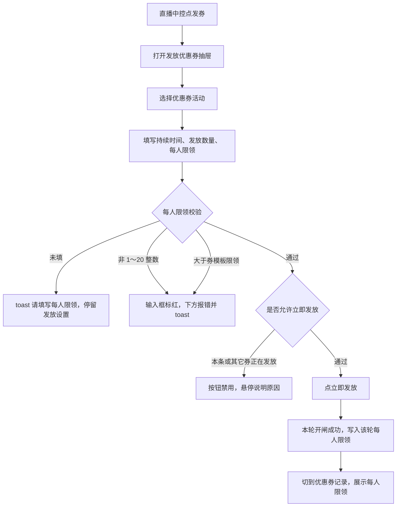
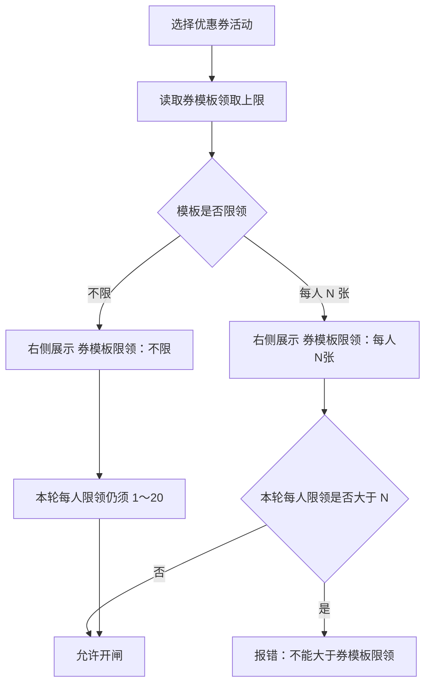
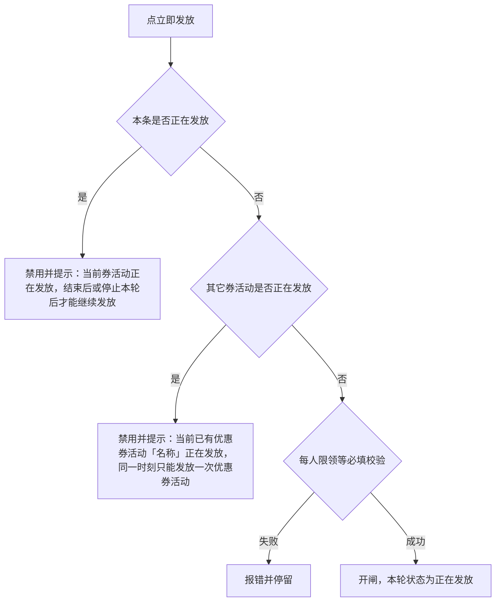

# 【659】直播中控发券自定义每轮次每人可领取的数量+优惠券一个时刻只能发放一场正在进行的发券活动

来源清单：`merged-20260907-01`（大版本 `2026090701直播中控发券` 全部小版本 `.1`～`.2`）

# 1. 后台业务 WEB 系统

## 1.1 概述

### 需求背景

直播中控发券原先只配本轮持续时间和发放数量。运营无法按轮次限制每人领几张，也看不到券模板自己的限领；用户实际能不能领，只受券模板控制，中控发券时对不上。另外，其它券正在发放时的提示写成「前一个券活动尚未发放完毕」，容易理解成库存没发完就不能发下一场。本期按合并清单 `merged-20260907-01` 在直播中控「发放优惠券」增加每轮每人限领，并与券模板限领同时生效；同一时刻只允许一场优惠券活动处于正在发放。

### 需求目标

1. 每轮发放可配置「每人限领」：整数 1～20 张，必填，默认 1。
2. 发放设置旁用只读文字展示当前券模板限领（不限 / 每人 N 张）；活动卡片上也带出券模板限领。本轮每人限领不能大于券模板限领。
3. 悬停「？」说明：每轮限制领取数量除了受当轮设置外还受券模板限领控制。超过 20 或大于模板限领时，输入框标红、字段下报错并 toast。
4. 同一时刻只能有一场优惠券活动正在发放：本条进行中须结束或停止本轮后才能续发；其它券活动不能开闸，提示文案明确为「同一时刻只能发放一次优惠券活动」。
5. 优惠券记录展示该轮每人限领。

## 1.2 管理范围

| 终端 | 模块 | 变更类型 |
|------|------|----------|
| B 端 MDM | 直播中控 · 发放优惠券 · 每人限领 | 新增 |
| B 端 MDM | 直播中控 · 发放优惠券 · 券模板限领 | 新增 |
| B 端 MDM | 直播中控 · 发放优惠券 · 同一时刻只发一场 | 修改 |

本期不做：

- 不改券模板配置页的领取上限（仍在营销-优惠券维护）
- 不改福袋、签到、观看奖励的发放互斥或限领
- 不改 C 端直播间领券界面（清单未涉及用户 APP）
- 无单独权限点（沿用直播中控操作账号）

## 1.3 需求详细说明

### 1.3.1 发放优惠券 · 每人限领

#### 1.3.1.1 功能点：每轮自定义每人可领取数量

运营在直播中控发券抽屉为每一轮填写每人限领，开闸后本轮按该数量限制领取，并受券模板限领叠加控制。

#### 1.3.1.2 功能流程图

需要说明的问题：

- 每人限领按「轮」保存，不同轮可以不同。
- 实际领取还受券模板限领约束：模板限领 1 张且用户此前已领过，本轮即使配置了每人限领也无法再领。
- 「？」悬停用页面浮层展示完整说明，不被抽屉滚动区裁切。

#### 1.3.1.3 功能描述

| 项 | 内容 |
|----|------|
| 功能类型 | 新增数据 / 更新数据 |
| 功能描述 | 每轮发券配置每人限领，校验通过后随本轮开闸写入发放记录 |
| 前提业务 | 场次已绑定优惠券活动；已进入直播中控发券抽屉 |
| 后继业务 | 优惠券记录展示该轮每人限领；观众领取同时受本轮限领和券模板限领约束 |
| 功能约束 | 直播已结束、券模板禁用/过期、库存发完、本轮正在发放时不可改并开闸 |
| 约束描述 | 无单独权限点 |
| 操作权限 | 直播中控操作账号 |

#### 1.3.1.4 界面设计

**1. 界面原型**

- 原型文件：`MDM/mdm_live_control.html`
- 本地预览：`http://localhost:5173/MDM/mdm_live_control?sessionId=sess-001`
- 布局：
  - 中间栏点「发券」打开右侧抽屉，标题「发放优惠券」
  - Tab：发放优惠券 / 优惠券记录
  - 发放设置两列：持续时间（分钟）、发放数量（张）；下一整行：每人限领输入框，右侧只读「券模板限领：…」，标签旁「？」
  - 底栏：取消、立即发放
  - 错误出现在每人限领输入框下方（红字），并 toast；「？」悬停浮层展示完整说明
  - 优惠券记录卡片增加指标「每人限领」（如每人 1 张）

#### 数据要求

| 字段名称 | 长度 | 录入方式 | 是否非空项 | 默认显示 |
|----------|------|----------|------------|----------|
| 每人限领 | 1～20 的整数 | 文本框（数字） | Y | 1 |
| 持续时间 | 正整数（分钟） | 文本框（数字） | Y | 空 |
| 发放数量 | 正整数（张） | 文本框（数字） | Y | 空 |

录入说明：单位为张。打开抽屉或未填时默认 1。

#### 1.3.1.5 逻辑描述

1. 打开发券抽屉进入「发放优惠券」Tab，每人限领默认 1。
2. 悬停或聚焦「？」：浮层展示「每轮限制领取数量除了受当轮设置外还受券模板限领控制，即：券模板限领1张，而用户之前已经领取，那么此时该用户将无法再次领取」。浮层不被抽屉裁切。
3. 未填点「立即发放」：toast「请填写每人限领」，停留发放设置。
4. 输入不是 1～20 的整数（含超过 20）：输入框标红，下方「每人限领须为 1～20 的整数」，并 toast 同一文案；「立即发放」禁用。
5. 输入大于当前券模板限领：输入框标红，下方「每人限领不能大于券模板限领（每人 N 张）」，并 toast；「立即发放」禁用。
6. 校验通过且允许发放：点「立即发放」开闸成功，toast「「券名称」开闸成功」，切到优惠券记录，本轮卡片展示该轮每人限领。
7. 与变更前差异：发放设置原先没有每人限领，记录也不展示该指标；说明气泡曾被抽屉裁切，超 20 在不能发放时看不到报错。

### 1.3.2 发放优惠券 · 券模板限领

#### 1.3.2.1 功能点：展示券模板限领并约束本轮每人限领

发放设置读取当前所选券模板的领取上限，用只读文字展示在本轮每人限领输入框右侧；本轮填写值不得大于该上限。

#### 1.3.2.2 功能流程图

需要说明的问题：

- 券模板限领来自优惠券模板配置（不限或每人 N 次/张），中控只读、不可改。
- 活动卡片副标题同步展示「券模板限领：不限 / 每人 N 张」。
- 模板不限时，本轮仍受 1～20 约束。

#### 1.3.2.3 功能描述

| 项 | 内容 |
|----|------|
| 功能类型 | 查询数据 |
| 功能描述 | 展示所选券模板限领，并作为本轮每人限领的上限 |
| 前提业务 | 优惠券活动已关联启用中的券模板 |
| 后继业务 | 本轮每人限领校验、观众领取 |
| 功能约束 | 只读 |
| 约束描述 | 无 |
| 操作权限 | 直播中控操作账号 |

#### 1.3.2.4 界面设计

**1. 界面原型**

- 原型文件：`MDM/mdm_live_control.html`
- 本地预览：`http://localhost:5173/MDM/mdm_live_control?sessionId=sess-001`
- 布局：
  - 每人限领输入框右侧灰色文字：「券模板限领：不限」或「券模板限领：每人 3 张」
  - 不单独占用只读输入框
  - 活动卡片副标题在发放轮次后追加「券模板限领：…」

#### 数据要求

| 字段名称 | 长度 | 录入方式 | 是否非空项 | 默认显示 |
|----------|------|----------|------------|----------|
| 券模板限领 | - | 只读展示 | Y | 随所选活动变化：不限 / 每人 N 张 |

#### 1.3.2.5 逻辑描述

1. 选中某条优惠券活动后，从券模板读取领取上限并刷新右侧文案。
2. 本轮每人限领大于模板限领：不能开闸，报错「每人限领不能大于券模板限领（每人 N 张）」。
3. 模板不限：右侧显示「不限」，本轮只需满足 1～20。
4. 与变更前差异：原先发放设置不展示券模板限领；曾做成单独一行只读输入框，现改为跟在本轮限领输入右侧的文字。

### 1.3.3 发放优惠券 · 同一时刻只发一场

#### 1.3.3.1 功能点：同一时刻只能有一场优惠券活动正在发放

全场优惠券活动同一时刻只允许一个发放窗口处于进行中。本条正在发放时不能续发下一轮；其它券活动不能开闸。

#### 1.3.3.2 功能流程图

需要说明的问题：

- 「正在发放」指存在进行中的发放窗口（未到期且未点停止），不是「还有剩余库存」。
- 停止本轮或到期结束后，未领取库存回滚到本活动可发数量，可以续发本条或改发其它券。
- 福袋、签到、观看奖励不套用本条互斥。

#### 1.3.3.3 功能描述

| 项 | 内容 |
|----|------|
| 功能类型 | 更新数据 |
| 功能描述 | 保证同一时刻只有一场优惠券活动处于正在发放 |
| 前提业务 | 场次已绑定至少一条优惠券活动 |
| 后继业务 | 停止本轮 / 到期结束后方可再发 |
| 功能约束 | 已结束场次不可发放 |
| 约束描述 | 无 |
| 操作权限 | 直播中控操作账号 |

#### 1.3.3.4 界面设计

**1. 界面原型**

- 原型文件：`MDM/mdm_live_control.html`
- 本地预览：`http://localhost:5173/MDM/mdm_live_control?sessionId=sess-001`
- 布局：
  - 正在发放的活动卡片带「正在发放」标签
  - 底栏「立即发放」禁用时，悬停按钮可看到拦截原因
  - 优惠券记录进行中卡片可点「停止」结束本轮

#### 数据要求

| 字段名称 | 长度 | 录入方式 | 是否非空项 | 默认显示 |
|----------|------|----------|------------|----------|
| - | - | - | - | 无新增录入字段 |

#### 1.3.3.5 逻辑描述

1. 本条已有进行中窗口：不能点「立即发放」，提示「当前券活动正在发放，结束后或停止本轮后才能继续发放」。
2. 其它券活动有进行中窗口：不能开闸，提示「当前已有优惠券活动「名称」正在发放，同一时刻只能发放一次优惠券活动」。
3. 无进行中窗口时，即使本条或其它条仍有剩余库存，也可以发下一轮或改发其它券。
4. 与变更前差异：原先已拦截其它券正在发放，但文案是「前一个券活动尚未发放完毕，不能发放下一个券活动」，容易理解成库存没发完。
