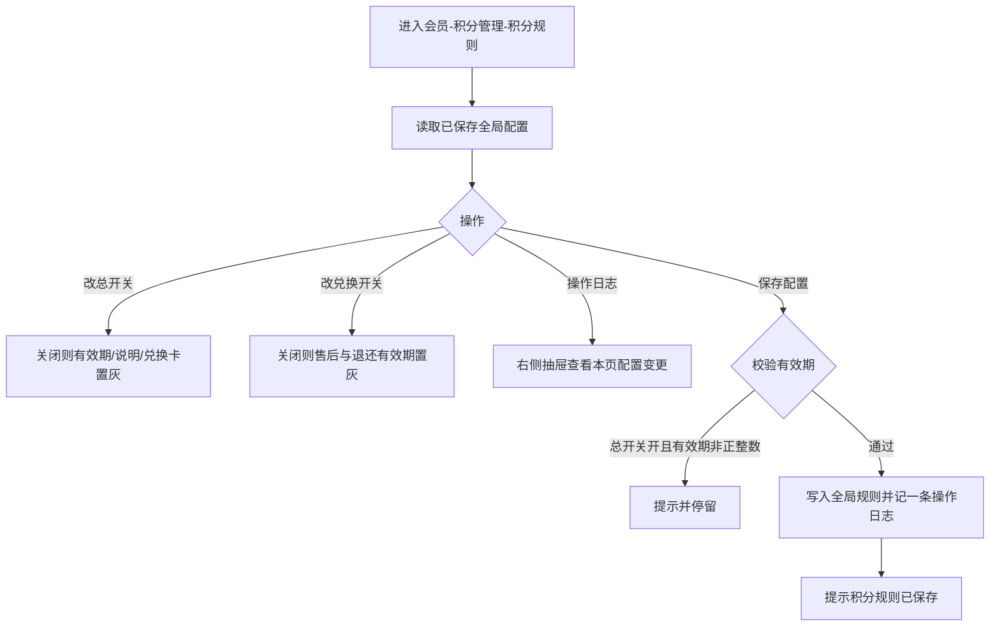
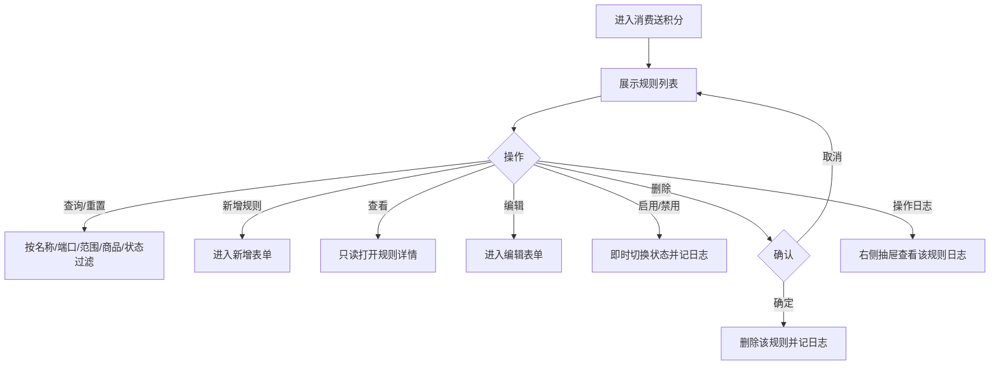
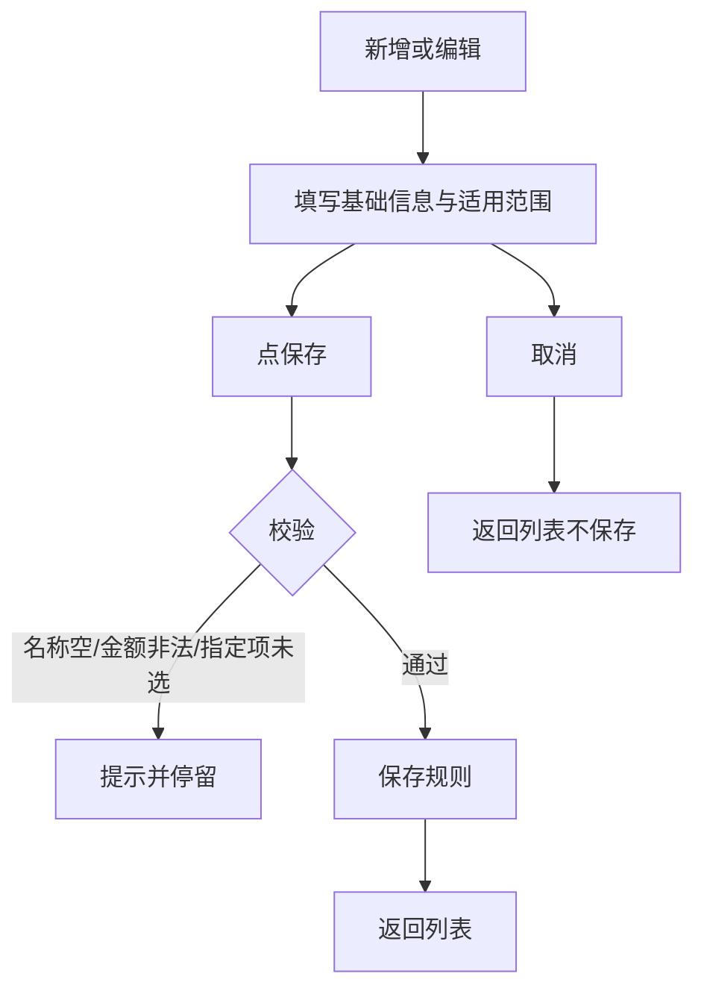
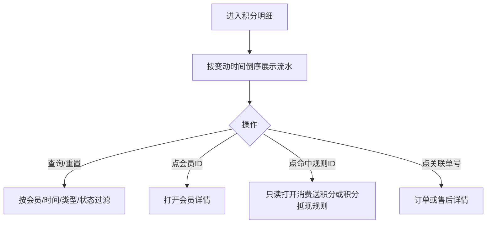
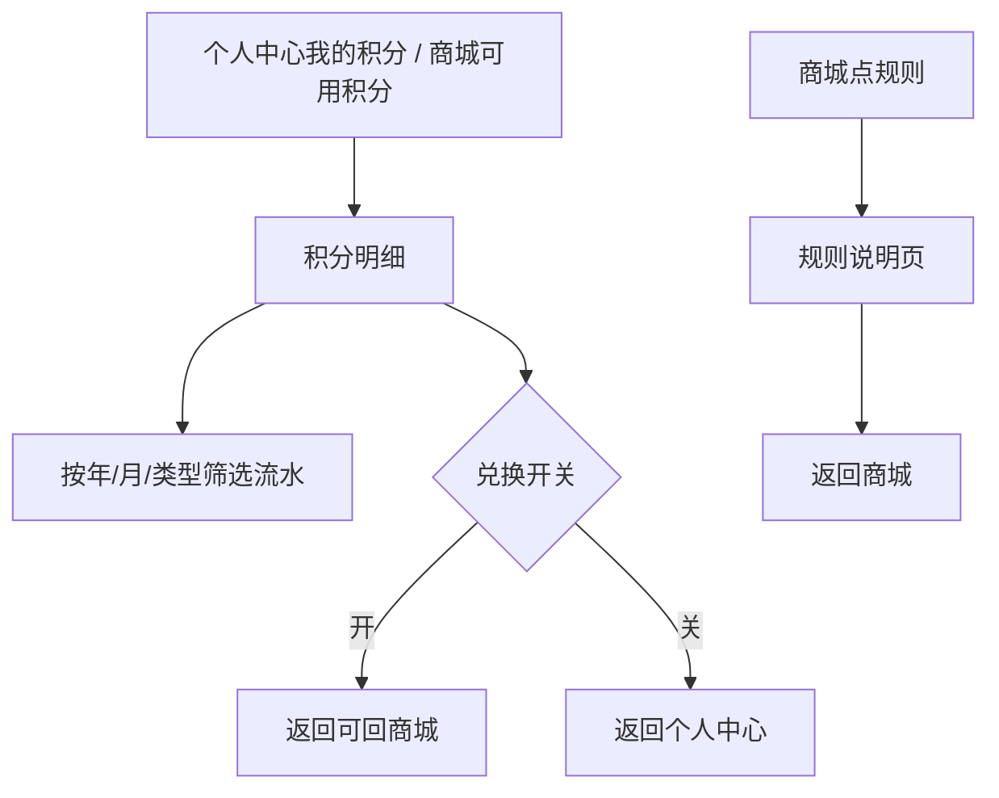
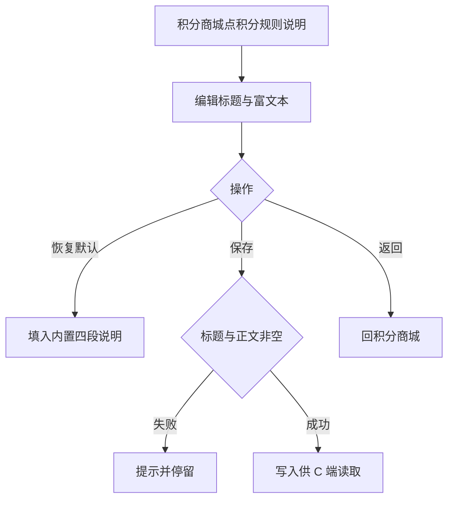

# 【670】积分规则、积分获取、积分明细

来源清单：`2026090802`（由《积分整体需求》按会员原型拆出。菜单「消费送积分」即「积分获取」。）

本文件只覆盖会员侧积分规则、消费送积分、积分明细，以及用户查看流水和规则说明。积分抵现见《790-积分抵现》，积分商城见《791-积分商城》。

# 1. 后台业务 WEB 系统

## 1.1 概述

### 需求背景

积分原先把有效期、消费送积分、积分抵现写在同一配置页。会员原型已把全局规则、消费送积分、积分明细拆开。本文件整理这三块，作为研发对照口径。

### 需求目标

1. **积分规则（全局）**：「开启积分功能」为全局总开关。关闭后用户端隐藏「我的积分」入口；积分兑换商品不展示、不可兑换；福袋 / 观看任务等活动积分发放禁用并提示「积分能力已下线」；消费赠送停止；确认订单不展示积分抵现。未勾选支持售后时只隐藏用户端申请入口，PC 后台售后操作仍保留。底栏「保存配置」为独立权限点（无权限不展示按钮，页面不放权限勾选）；另提供操作日志（对齐营销-优惠券-操作日志）。
2. **积分获取（消费送积分）**：独立规则列表，按端口、售卖范围、商品配置「每消费 X 元送 1 积分」及不足 1 积分的处理；多规则命中取最新创建，未命中不赠送。列表可查看（只读）、编辑、启停、删除，并有操作日志。
3. **积分明细**：B 端按会员、时间、类型、状态查流水。消费赠送 / 积分抵现流水展示命中规则 ID，高亮可点进规则只读详情。明细页不提供手工调整。C 端展示当前 / 可用 / 冻结积分及流水，规则说明读营销侧富文本。

## 1.2 管理范围

| 终端 | 模块 | 变更类型 |
|------|------|----------|
| B 端 MDM | 会员 · 积分管理 · 积分规则 | 新增 |
| B 端 MDM | 会员 · 积分管理 · 消费送积分（积分获取） | 新增 |
| B 端 MDM | 会员 · 积分管理 · 积分明细 | 新增 |
| B 端 MDM | 营销 · 积分商城 · 积分规则说明 | 新增 |
| C 端用户 APP | 个人中心 · 我的积分 | 修改 |
| C 端用户 APP | 积分明细 / 规则说明 | 新增 |
| C 端用户 APP | 直播间 · 观看奖励 / 福袋积分发放 | 修改 |

本期不做：

- 积分明细手工调整（筛选栏无「调整」，不写手工调账流水）
- 积分抵现（见《790-积分抵现》）、积分商城（见《791-积分商城》）
- C 端确认订单按消费送积分规则实时计算「本单可获积分」
- 消费送积分规则增加「生效时段」字段
- 会员积分规则页「规则说明」文本与营销「积分规则说明」富文本合并（C 端规则页读营销侧）
- 除「保存配置」外，其余按钮不拆独立权限点

## 1.3 需求详细说明

### 1.3.1 积分规则（全局）

#### 1.3.1.1 功能点：配置积分总开关、有效期与兑换商品规则

运营在会员-积分管理-积分规则维护全局能力：是否开启积分、积分自获得之日起多少天失效、是否允许积分兑换商品及兑换售后是否退还积分。

#### 1.3.1.2 功能流程图

需要说明的问题：

- 本页只做全局设置。消费送积分、积分抵现分别在对应规则列表配置。
- 可兑换商品清单在营销-积分商城配置，不在本页维护。
- 退还积分有效期原型仅「保留原有效期」一项，按兑换扣减的逆序退回原批次。
- 「是否支持售后」未勾选时，只隐藏用户端积分兑换商品的申请售后 / 申请退款入口，不弹「暂不支持售后」；已有售后进度仍可查看。PC 后台售后单不读此开关、不拦截操作。
- 「开启积分功能」是全局总开关，关闭并保存后立即约束用户端与活动发分（见逻辑描述）。
- 「保存配置」为独立权限点，由权限系统控制；无权限不展示该按钮。原型页不放置权限勾选。

#### 1.3.1.3 功能描述

| 项 | 内容 |
|----|------|
| 功能类型 | 更新数据 |
| 功能描述 | 保存积分总开关、有效期、规则说明、兑换商品开关与售后退还规则 |
| 前提业务 | 操作账号可进入会员-积分管理 |
| 后继业务 | 积分商城入口、C 端抵现、明细过期天数读取本配置 |
| 功能约束 | 总开关关闭后兑换子项不可改 |
| 约束描述 | 无 |
| 操作权限 | 会员-积分管理操作账号；「保存配置」为独立权限点 |

#### 1.3.1.4 界面设计

**1. 界面原型**

- 原型文件：`MDM/mdm_member_points_rule.html`
- 本地预览：`http://localhost:5173/MDM/mdm_member_points_rule`
- 布局：
  - Tab「积分规则」
  - 业务提示：本页为全局设置
  - 卡片「积分规则」：开关、有效期、规则说明
  - 卡片「积分兑换商品规则」：兑换开关、是否支持售后、退还积分有效期；标题旁帮助提示去营销-积分商城配置商品
  - 底栏固定：操作日志、保存配置（「保存配置」为独立权限点，无权限时不展示该按钮；页面上不放权限勾选）

#### 数据要求

| 字段名称 | 长度 | 录入方式 | 是否非空项 | 默认显示 |
|----------|------|----------|------------|----------|
| 开启积分功能 | — | 勾选 | N | 勾选；全局总开关 |
| 积分有效期 | 正整数天 | 数字框 + 单位「天」 | 总开关开启时 Y | 365 |
| 规则说明 | 不限 | 多行文本 | N | 空 |
| 开启积分兑换商品 | — | 勾选 | N | 勾选 |
| 支持售后 | — | 勾选 | N | 勾选；未勾选仅约束 C 端申请入口 |
| 退还积分有效期 | — | 单选 | N | 保留原有效期 |

#### 1.3.1.5 逻辑描述

1. 总开关关闭：有效期、规则说明、兑换卡片置灰；并同时发生：
   1. 用户端个人中心「我的积分」入口隐藏。
   2. 积分商城 / 商品详情 / 确认兑换不展示、不支持兑换；直开这些页提示「积分能力已下线」并回到个人中心。
   3. 福袋（奖品为积分）、观看任务等活动的积分发放禁用，操作或到账时提示「积分能力已下线」。
   4. 消费赠送停止发放（即使命中消费送积分规则）。
   5. 确认订单（快递/自提/补货结算）不展示「积分抵扣」入口。
2. 总开关开启时有效期须为正整数天，否则提示「请填写有效的积分有效期（正整数天）」并停留。
3. 兑换开关关闭：售后与退还有效期置灰。售后关闭：退还有效期置灰。
4. 底栏「操作日志」打开右侧抽屉，界面与字段与营销-优惠券-操作日志一致：列表含操作时间、操作内容、操作人、方法、结果、查看详情；详情含结果标签、操作时间/人、查询对象、客户端IP、来源服务、耗时、变更明细表、请求参数 JSON。演示操作人「张征」。保存配置成功后按字段 diff 追加一条「保存配置」日志。
5. 「保存配置」为独立权限点（权限系统控制，页面不展示权限勾选）。无权限时底栏不展示该按钮，也无法提交。有权限且保存成功提示「积分规则已保存」。积分商城列表顶部开关只读同步本页「开启积分功能 ∩ 开启积分兑换商品」；「去配置」跳到本页兑换卡片。
6. 未勾选支持售后并保存后：用户端积分兑换订单不再展示申请退款 / 申请售后，也不会弹出暂不支持售后；PC 后台售后单仍可操作。勾选后用户端入口恢复，售后成功按规则退还积分。字段旁说明：「未勾选时，仅隐藏用户端申请售后入口；PC 后台售后操作仍保留。」

### 1.3.2 积分获取 · 消费送积分列表

#### 1.3.2.1 功能点：维护多套消费送积分规则

运营在会员-积分管理-消费送积分查看、筛选、新增、编辑、启用/禁用、删除规则，可只读查看规则详情，并可查看该规则的操作日志。同一订单若多条规则都满足，取**最新创建**；**未命中任何规则时不赠送积分**。

#### 1.3.2.2 功能流程图

需要说明的问题：

- 规则 ID 形如 `PC10001`。
- 列表无生效时段字段；「同一时段」以创建时间最新为准。
- 赠送以订单实付金额计算，不足门槛部分不累计（配置在表单，列表展示摘要）。

#### 1.3.2.3 功能描述

| 项 | 内容 |
|----|------|
| 功能类型 | 查询数据 / 更新数据 / 新增数据 / 删除数据 |
| 功能描述 | 列表维护消费送积分规则并按条件筛选 |
| 前提业务 | 全局积分规则可单独配置；本列表不依赖营销侧旧页 |
| 后继业务 | 订单支付成功按命中规则赠送（支付成功冻结，交易成功可用，见积分明细） |
| 功能约束 | 无单独权限点 |
| 约束描述 | 无 |
| 操作权限 | 会员-积分管理操作账号 |

#### 1.3.2.4 界面设计

**1. 界面原型**

- 原型文件：`MDM/mdm_member_points_consume.html`
- 本地预览：`http://localhost:5173/MDM/mdm_member_points_consume`
- 布局：
  - 业务提示：多规则取最新创建；未命中不赠送
  - 筛选：规则名称、适用端口、售卖范围（选省市区/门店时出现具体区域或门店）、适用商品、状态
  - 工具栏：新增规则
  - 表格：规则ID、规则名称、赠送规则、适用端口、售卖范围、适用商品、状态、更新时间、操作（查看、编辑、启用/禁用、删除、操作日志）
  - 操作日志：右侧抽屉，界面与内容 1:1 对齐营销-优惠券-操作日志
  - 空态：表格无数据

#### 数据要求

| 字段名称 | 长度 | 录入方式 | 是否非空项 | 默认显示 |
|----------|------|----------|------------|----------|
| 规则名称 | — | 文本框 | N | 空 |
| 适用端口 | — | 下拉 | N | 全部 |
| 售卖范围 | — | 下拉 | N | 全部 |
| 具体省市区 | — | 三级联动 | 范围为省市区时按筛选需要 | 隐藏 |
| 具体门店 | — | 可搜索下拉 | 范围为门店时按筛选需要 | 隐藏 |
| 适用商品 | — | 文本框 | N | 空，占位商品名称/编码 |
| 状态 | — | 下拉 | N | 全部（已启用 / 已禁用） |

#### 1.3.2.5 逻辑描述

1. 查询按当前条件前端过滤；重置清空条件后重刷。
2. 新增进入无 id 表单；编辑带 `?id=PCxxxxx`；查看带 `?id=PCxxxxx&mode=view`，表单控件全部禁用，不展示保存，只能返回。
3. 启用/禁用即时生效并 toast。删除需确认。创建、保存、启用、禁用、删除均写入该规则操作日志。
4. 行内「操作日志」打开右侧抽屉，列与详情弹层与营销-优惠券-操作日志一致（操作时间、操作内容、操作人、方法、结果、查看详情；详情含变更明细与请求参数）。
5. 命中：规则已启用，且订单端口、门店/区域、商品满足适用范围；多条按创建时间降序取第一条。未命中不赠送。

### 1.3.3 积分获取 · 消费送积分规则配置

#### 1.3.3.1 功能点：配置赠送规则与适用范围

新增或编辑一条消费送积分规则：名称、启用状态、每消费多少元送 1 积分、积分不足 1 时的处理，以及端口 / 售卖范围 / 适用商品。

#### 1.3.3.2 功能流程图

需要说明的问题：

- 「积分不足 1 时」：计 1 积分 / 不赠送 / 四舍五入。原始积分 ≥ 1 时向下取整。
- 指定端口须至少勾选小程序或 APP；售卖范围非全部须选区域或门店；适用商品非全部须选出具体项。

#### 1.3.3.3 功能描述

| 项 | 内容 |
|----|------|
| 功能类型 | 新增数据 / 更新数据 |
| 功能描述 | 保存单条消费送积分规则 |
| 前提业务 | 从消费送积分列表进入 |
| 后继业务 | 列表展示；下单命中后按规则计算赠送积分 |
| 功能约束 | 名称最多 40 字 |
| 约束描述 | 无 |
| 操作权限 | 会员-积分管理操作账号 |

#### 1.3.3.4 界面设计

**1. 界面原型**

- 原型文件：`MDM/mdm_member_points_consume_form.html`
- 本地预览：`http://localhost:5173/MDM/mdm_member_points_consume_form`
- 布局：
  - Tab「新增消费送积分」或「编辑消费送积分」或「查看消费送积分」
  - 返回消费送积分
  - 同列表的业务提示
  - 卡片「基础信息」
  - 卡片「适用范围」
  - 底栏固定：取消 / 保存；查看态仅「返回」，输入框与选择控件全部禁用，不可提交

#### 数据要求

| 字段名称 | 长度 | 录入方式 | 是否非空项 | 默认显示 |
|----------|------|----------|------------|----------|
| 规则名称 | 1~40 | 文本框 | Y | 空 |
| 状态 | — | 勾选「启用」 | N | 勾选 |
| 赠送规则 | 金额 ≥ 0.01 | 数字框（每消费 X 元可赠送 1 积分） | Y | 1.00 |
| 积分不足1时 | — | 单选 | Y | 计1积分 |
| 适用端口 | — | 单选不限/指定 + 勾选小程序、APP | 指定时至少一项 | 不限 |
| 售卖范围 | — | 单选全部/省市区/门店 + 选择区域/门店 | 非全部时 Y | 全部 |
| 适用商品 | — | 单选全部商品/适用商品/适用类目/排除商品/排除类目 + 选择范围 | 非全部时 Y | 全部商品 |

#### 1.3.3.5 逻辑描述

1. 名称空、金额非法、指定端口未勾、区域/门店未选、商品范围未选：提示对应错误并停留。
2. 赠送规则失焦保留 2 位小数；以订单实付计算，不足门槛不累计。
3. 保存成功返回列表；新规则排在列表前部。取消不保存。
4. 与变更前：原先写在积分规则同一页，无法按门店/端口/商品拆多套规则。

### 1.3.4 B 端积分明细

#### 1.3.4.1 功能点：查询会员积分流水

运营按会员、变动时间、变动类型、状态查看流水；流水按批次管理有效期，扣减 FIFO（跳过冻结批次）。

#### 1.3.4.2 功能流程图

需要说明的问题：

- 消费赠送：支付成功即赠送为冻结，订单交易成功后变可用。
- 有效期读全局规则 `validityDays`，默认 365 天。
- 售后 / 兑换取消默认保留原有效期退回原批次。
- 本页只查询流水，不提供手工调整入口。

#### 1.3.4.3 功能描述

| 项 | 内容 |
|----|------|
| 功能类型 | 查询数据 |
| 功能描述 | 展示积分增减流水及批次剩余、状态 |
| 前提业务 | 会员已有积分变动或演示数据 |
| 后继业务 | 无 |
| 功能约束 | 无 |
| 约束描述 | 无 |
| 操作权限 | 会员-积分管理操作账号 |

#### 1.3.4.4 界面设计

**1. 界面原型**

- 原型文件：`MDM/mdm_member_points_detail.html`
- 本地预览：`http://localhost:5173/MDM/mdm_member_points_detail`
- 布局：
  - 筛选：会员、变动时间从至、变动类型、状态；按钮重置 / 查询
  - 表格：流水号、会员ID、昵称、手机号、变动类型、变动积分（增加绿/减少红）、本批剩余、变动后余额、命中规则ID（高亮可点）、关联单号、备注、变动时间、过期时间、状态、操作人
  - 分页
  - 状态徽章：可用 / 冻结 / 过期；扣减类状态为「—」

#### 数据要求

| 字段名称 | 长度 | 录入方式 | 是否非空项 | 默认显示 |
|----------|------|----------|------------|----------|
| 会员 | — | 文本框 | N | 空，会员ID/昵称/手机号 |
| 变动时间 | — | 日期时间从至 | N | 空 |
| 变动类型 | — | 下拉 | N | 全部 |
| 状态 | — | 下拉 | N | 全部（可用/冻结/过期） |

变动类型取值：消费赠送、会员升级、签到、福袋、观看任务、积分兑换、积分兑换取消、积分抵现、积分兑换售后、积分抵现售后。

#### 1.3.4.5 逻辑描述

1. 查询后按变动时间倒序；默认 10 条/页。
2. 会员 ID 链会员详情；`ORD-` 链零售订单；售后单号或售后类型链售后详情。
3. 消费赠送展示命中的消费送积分规则 ID；积分抵现 / 积分抵现售后展示命中的积分抵现规则 ID；其余类型无命中规则显示「—」。规则 ID 橙色高亮，点击进入对应规则只读详情（`mode=view`）。规则已删除则提示未找到并返回列表。
4. 备注可含 FIFO / 退回原批次说明。

### 1.3.5 C 端积分明细与规则说明

#### 1.3.5.1 功能点：用户查看积分流水与规则文案

个人中心或商城 Hero 进入积分明细；商城「规则」进入规则说明（读营销侧富文本）。

#### 1.3.5.2 功能流程图

需要说明的问题：

- 演示：可用 161、冻结 45、当前 206。
- C 端规则说明读 `mdm_marketing_points_rule_desc_v1`，不是会员积分规则页的 `ruleDesc`。

#### 1.3.5.3 功能描述

| 项 | 内容 |
|----|------|
| 功能类型 | 查询数据 |
| 功能描述 | 展示积分概览、流水与规则说明 |
| 前提业务 | 用户已登录（原型演示账号） |
| 后继业务 | 无 |
| 功能约束 | 无 |
| 约束描述 | 无 |
| 操作权限 | 登录用户 |

#### 1.3.5.4 界面设计

**1. 界面原型**

- 原型文件：`user-app/h5/points-detail.html`、`user-app/h5/points-rule-desc.html`
- 本地预览：`http://localhost:5173/user-app/h5/points-detail` 、 `http://localhost:5173/user-app/h5/points-rule-desc`
- 布局：
  - 明细：当前 / 可用 / 冻结三列；年、月、类型下拉；流水列表
  - 规则说明：标题 + 富文本正文；返回商城

#### 数据要求

| 字段名称 | 长度 | 录入方式 | 是否非空项 | 默认显示 |
|----------|------|----------|------------|----------|
| 年份 / 月份 / 类型 | — | 下拉 | N | 当前筛选 |
| 说明标题 / 正文 | 标题 ≤50 | B 端富文本编辑，C 端只读 | Y | 默认四段说明 |

#### 1.3.5.5 逻辑描述

1. 明细页筛选即时过滤，无独立查询按钮。
2. 规则页无正文时用内置默认：获取、抵现、兑换、有效期说明。
3. 兑换总开关关闭时，「我的积分」进明细而非商城。

### 1.3.6 积分规则说明（营销编辑）

#### 1.3.6.1 功能点：编辑 C 端展示的积分规则文案

从积分商城点「积分规则说明」进入，编辑标题与正文，保存后 C 端规则页展示。

#### 1.3.6.2 功能流程图

需要说明的问题：

- 与会员-积分规则页的「规则说明」不是同一存储。
- 默认正文含积分获取、抵现、兑换、有效期说明。

#### 1.3.6.3 功能描述

| 项 | 内容 |
|----|------|
| 功能类型 | 更新数据 |
| 功能描述 | 保存 C 端规则说明 |
| 前提业务 | 从积分商城进入 |
| 后继业务 | C 端 `points-rule-desc.html` 展示 |
| 功能约束 | 标题最多 50 字；正文须有字或图 |
| 约束描述 | 无 |
| 操作权限 | 营销活动操作账号 |

#### 1.3.6.4 界面设计

**1. 界面原型**

- 原型文件：`MDM/mdm_marketing_points_rule_desc.html`
- 本地预览：`http://localhost:5173/MDM/mdm_marketing_points_rule_desc`
- 布局：返回积分商城；标题输入；富文本；底栏恢复默认、保存。

#### 数据要求

| 字段名称 | 长度 | 录入方式 | 是否非空项 | 默认显示 |
|----------|------|----------|------------|----------|
| 说明标题 | ≤50 | 文本框 | Y | 积分规则说明 |
| 说明正文 | — | 富文本 | Y | 内置默认 HTML |

#### 1.3.6.5 逻辑描述

1. 标题空或正文空：不可保存。
2. 恢复默认覆盖当前编辑内容。
3. 保存后 C 端规则页立即按新文案展示（原型读 localStorage）。
