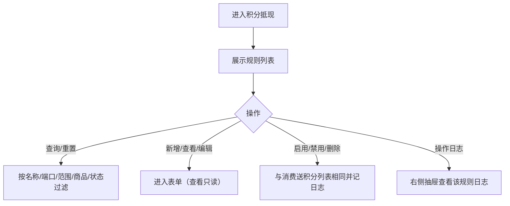
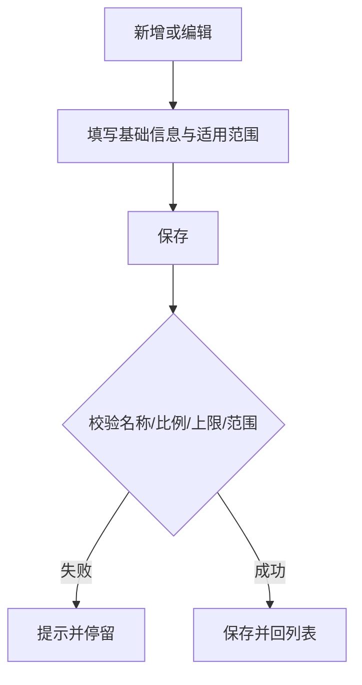
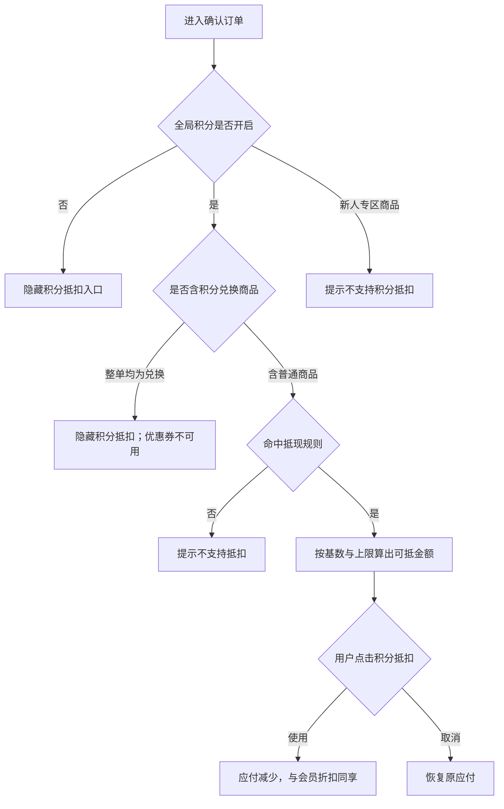
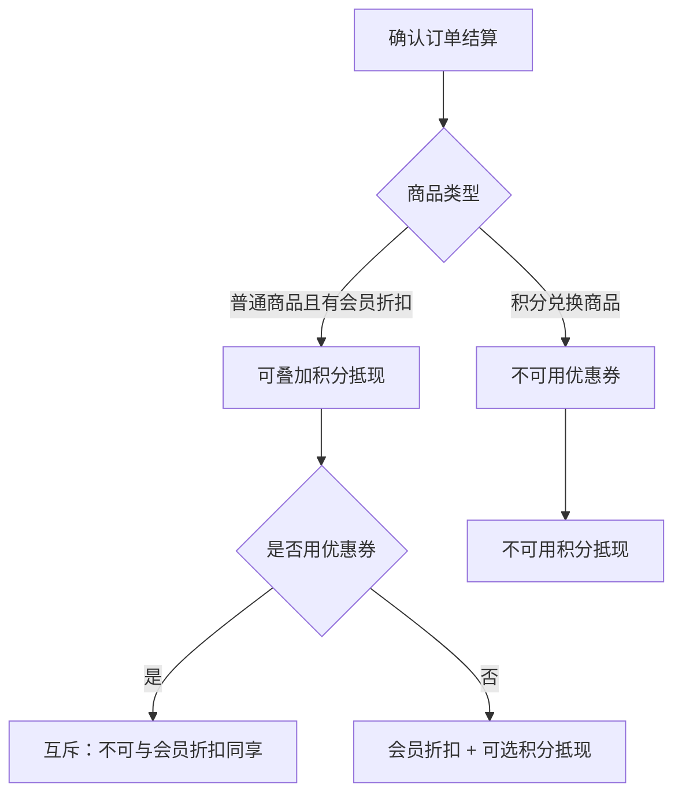

# 【790】积分抵现

来源清单：`2026090802`（由《670-积分抵现、积分商城》拆出。）

本文件只覆盖积分抵现：规则列表、规则配置、确认订单抵扣，以及会员折扣、优惠券、积分兑换的同享与互斥。积分规则、积分获取、积分明细见《670-积分规则、积分获取、积分明细》。积分商城见《791-积分商城》。全局总开关仍在积分规则页配置，本文件只引用其结果。

# 1. 后台业务 WEB 系统

## 1.1 概述

### 需求背景

积分抵现原先和全局规则写在一起。会员原型已有独立的积分抵现规则列表。本文件整理抵现规则和确认订单抵扣，作为研发对照口径。

### 需求目标

**积分抵现**：独立规则列表，配置抵扣比例、单笔最大比例与金额上限及适用范围；多规则命中取最新创建，未命中不支持抵现；C 端确认订单按规则计算可抵金额。与会员折扣同享，与优惠券、积分兑换互斥。列表可查看、编辑、启停、删除，并有操作日志。

## 1.2 管理范围

| 终端 | 模块 | 变更类型 |
|------|------|----------|
| B 端 MDM | 会员 · 积分管理 · 积分抵现 | 新增 |
| C 端用户 APP | 确认订单 · 积分抵现 / 优惠叠加 | 修改 |

本期不做：

- 积分规则、消费送积分、积分明细（见《670-积分规则、积分获取、积分明细》）
- 积分商城、兑换商品、积分兑换售后（见《791-积分商城》）
- 积分抵现规则增加「生效时段」字段（页面提示「同一时段」取最新创建，原型无开始/结束时间）

## 1.3 需求详细说明

### 1.3.1 积分抵现列表

#### 1.3.1.1 功能点：维护多套积分抵现规则

结构与消费送积分列表对称。未命中任何规则时**不支持积分抵现**。

#### 1.3.1.2 功能流程图

需要说明的问题：

- 规则 ID 形如 `PX10001`。
- 列表「抵扣规则」展示：1 积分抵 X 元；上限 Y% / Z 元。

#### 1.3.1.3 功能描述

| 项 | 内容 |
|----|------|
| 功能类型 | 查询数据 / 更新数据 / 新增数据 / 删除数据 |
| 功能描述 | 列表维护积分抵现规则 |
| 前提业务 | 全局积分开关开启后 C 端才实际抵扣 |
| 后继业务 | C 端确认订单按命中规则计算可抵金额 |
| 功能约束 | 无单独权限点 |
| 约束描述 | 无 |
| 操作权限 | 会员-积分管理操作账号 |

#### 1.3.1.4 界面设计

**1. 界面原型**

- 原型文件：`MDM/mdm_member_points_cash.html`
- 本地预览：`http://localhost:5173/MDM/mdm_member_points_cash`
- 布局：与消费送积分列表相同；表格第三列为「抵扣规则」；业务提示为未命中不支持积分抵现；行操作含查看、编辑、启用/禁用、删除、操作日志，抽屉 1:1 对齐营销-优惠券-操作日志。

#### 数据要求

筛选字段与消费送积分列表相同（规则名称、适用端口、售卖范围、适用商品、状态）。

#### 1.3.1.5 逻辑描述

1. 查询、重置、新增、查看、编辑、启用/禁用、删除、操作日志同消费送积分列表。
2. 命中逻辑同消费送积分；未命中则 C 端不支持抵扣。
3. 全局积分开关关闭时，即使有规则命中也不抵扣。

### 1.3.2 积分抵现规则配置

#### 1.3.2.1 功能点：配置抵扣比例、上限与适用范围

新增或编辑一条抵现规则：名称、启用、每 1 积分抵多少元、每笔订单最大可抵扣比例、最大可抵扣金额，以及端口 / 售卖范围 / 适用商品。

#### 1.3.2.2 功能流程图

需要说明的问题：

- 无「积分不足 1 时」字段（与消费送积分的差异）。
- 抵扣金额向下取整到「每积分抵扣金额」的整数倍（C 端计算）。

#### 1.3.2.3 功能描述

| 项 | 内容 |
|----|------|
| 功能类型 | 新增数据 / 更新数据 |
| 功能描述 | 保存单条积分抵现规则 |
| 前提业务 | 从积分抵现列表进入 |
| 后继业务 | C 端确认订单读取命中规则 |
| 功能约束 | 名称最多 40 字；最大比例 1~100 整数 |
| 约束描述 | 无 |
| 操作权限 | 会员-积分管理操作账号 |

#### 1.3.2.4 界面设计

**1. 界面原型**

- 原型文件：`MDM/mdm_member_points_cash_form.html`
- 本地预览：`http://localhost:5173/MDM/mdm_member_points_cash_form`
- 布局：返回积分抵现；基础信息 + 适用范围两张卡片；底栏取消 / 保存。查看态 Tab 为「查看积分抵现」，控件全部禁用，仅返回，不可提交。适用范围控件与消费送积分表单相同。

#### 数据要求

| 字段名称 | 长度 | 录入方式 | 是否非空项 | 默认显示 |
|----------|------|----------|------------|----------|
| 规则名称 | 1~40 | 文本框 | Y | 空 |
| 状态 | — | 勾选「启用」 | N | 勾选 |
| 抵扣比例 | ≥ 0.01 元 | 数字框（每 1 积分可抵扣 X 元） | Y | 0.01 |
| 每笔订单最大可抵扣比例 | 1~100 整数 | 数字框 + % | Y | 50 |
| 最大可抵扣金额 | ≥ 0.01 | 数字框 + 元 | Y | 100.00 |
| 适用端口 / 售卖范围 / 适用商品 | — | 同消费送积分 | 同消费送积分 | 不限 / 全部 / 全部商品 |

#### 1.3.2.5 逻辑描述

1. 必填与范围校验失败提示并停留。
2. 金额保留 2 位小数；比例为整数百分数。
3. 保存回列表。取消不保存。
4. 与消费送积分差异：核心是抵扣比例 + 两道上限，没有不足 1 积分处理。

### 1.3.3 C 端确认订单 · 积分抵现

#### 1.3.3.1 功能点：下单时按规则使用积分抵扣普通商品金额

用户在确认订单看到「积分抵扣」行，可使用或取消；仅普通商品计入可抵基数，积分兑换商品、新人专区商品不参与。

#### 1.3.3.2 功能流程图

需要说明的问题：

- 原型演示可用积分为 161。
- 可抵上限 = min(普通商品金额 × 最大比例, 最大可抵金额, 可用积分 × 每积分抵扣额)，再向下对齐到每积分金额的整数倍。
- 全页确认订单部分为演示 toast；购物车/直播确认半屏可切换使用与否。
- 叠加互斥见 1.3.4：积分抵现与会员折扣同享；与优惠券、积分兑换互斥。

#### 1.3.3.3 功能描述

| 项 | 内容 |
|----|------|
| 功能类型 | 查询数据 / 更新数据 |
| 功能描述 | 按命中的抵现规则计算并使用积分抵扣 |
| 前提业务 | B 端已配置启用的抵现规则且全局积分开启 |
| 后继业务 | 支付成功后积分明细记「积分抵现」扣减 |
| 功能约束 | 积分兑换商品不计入可抵基数；与优惠券、积分兑换互斥 |
| 约束描述 | 与会员折扣同享 |
| 操作权限 | 登录用户 |

#### 1.3.3.4 界面设计

**1. 界面原型**

- 原型文件：`user-app/h5/order-confirm.html`、`user-app/h5/checkout.html`
- 本地预览：`http://localhost:5173/user-app/h5/order-confirm` 、 `http://localhost:5173/user-app/h5/checkout`
- 布局：费用行「积分抵扣」；汇总「积分抵扣 -¥X.XX」；含积分兑换商品时另有「积分兑换 N 积分」行。

#### 数据要求

| 字段名称 | 长度 | 录入方式 | 是否非空项 | 默认显示 |
|----------|------|----------|------------|----------|
| 积分抵扣 | — | 点击切换使用 | N | 按规则计算后的可用/已用文案 |
| 抵扣金额 | — | 只读展示 | — | -¥X.XX |

#### 1.3.3.5 逻辑描述

1. 全局关：确认订单不展示「积分抵扣」行（不是灰显文案）。
2. 全局开但未命中规则：不支持抵扣（未命中提示「未命中积分抵现规则，不支持抵扣」）。
3. 新人专区：提示「新人专区商品不支持积分抵扣」。
4. 整单均为积分兑换：不展示积分抵扣，优惠券提示「积分兑换商品不可与优惠券同享」。
5. 普通商品：积分抵现可与会员折扣同享；已享会员折扣时优惠券提示「已享会员折扣，不可与优惠券同享」。
6. 使用成功 toast「已使用积分抵扣（仅普通商品）」；取消「已取消积分抵扣」。
7. 与变更前：确认订单无按 B 端规则计算的积分抵扣。

### 1.3.4 优惠叠加与互斥

#### 1.3.4.1 功能点：会员折扣、积分兑换、优惠券、积分抵现的同享 / 互斥

结算时按下表叠加。会员折扣与积分抵现可同享；积分兑换不与优惠券、积分抵现同享。

#### 1.3.4.2 功能流程图

需要说明的问题：

- 表内「互斥」指同一订单同一商品范围内不可同时使用；「同享」指可同时生效。
- 含积分兑换商品的订单：兑换行不参与积分抵现基数；整单不可用优惠券。
- 仅普通商品且当前等级有会员折扣：优惠券入口提示已享会员折扣，不可与优惠券同享；积分抵现仍可用。

#### 1.3.4.3 功能描述

| 项 | 内容 |
|----|------|
| 功能类型 | 交互控制 |
| 功能描述 | 约束确认订单优惠叠加 |
| 前提业务 | 全局积分开启；会员等级已配置折扣或订单含积分兑换 |
| 后继业务 | 应付金额按可用优惠计算 |
| 功能约束 | 见下表 |
| 约束描述 | 无 |
| 操作权限 | 登录用户 |

#### 1.3.4.4 界面设计

**1. 界面原型**

- 原型文件：`user-app/h5/order-confirm.html`、`user-app/h5/checkout.html`、`user-app/h5/live-room.html`
- 本地预览：
  - `http://localhost:5173/user-app/h5/order-confirm`
  - `http://localhost:5173/user-app/h5/checkout`
- 布局：确认订单「优惠券」「积分抵扣」行；互斥时入口隐藏或 toast 说明原因。

#### 数据要求

| 能力 | 互斥 | 同享 |
|------|------|------|
| 会员折扣 | 优惠券 | 积分抵现 |
| 积分兑换 | 优惠券、积分抵现 | — |

#### 1.3.4.5 逻辑描述

1. 会员折扣与优惠券互斥：已享会员折扣时不可再选优惠券，toast「已享会员折扣，不可与优惠券同享」。
2. 会员折扣与积分抵现同享：普通商品可同时用会员折扣和积分抵现。
3. 积分兑换与优惠券互斥：积分兑换商品不可用券，toast「积分兑换商品不可与优惠券同享」。
4. 积分兑换与积分抵现互斥：兑换商品不计入抵现基数；整单均为兑换时不展示积分抵扣入口。
5. 相对初版：未写清叠加表；积分抵现仅排除兑换行基数，优惠券与会员折扣无互斥提示。
