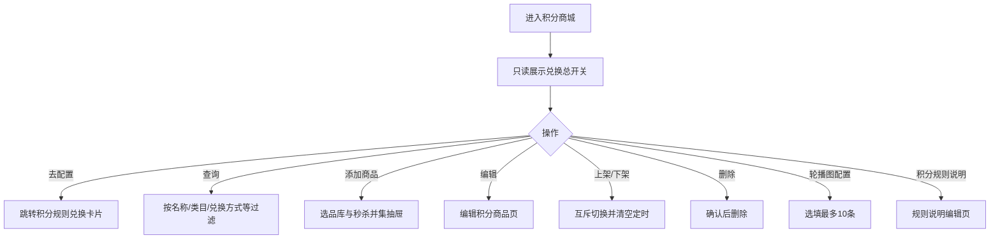
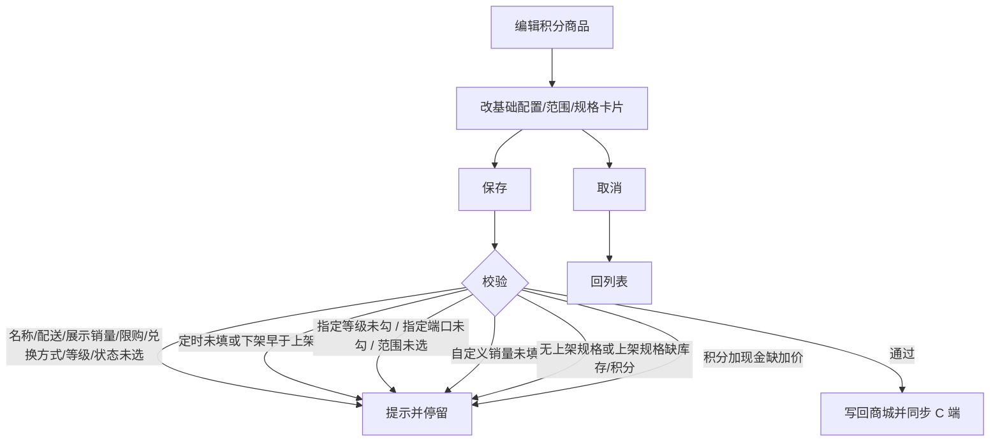
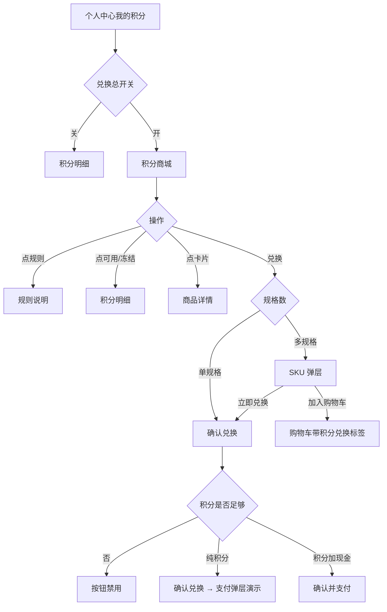
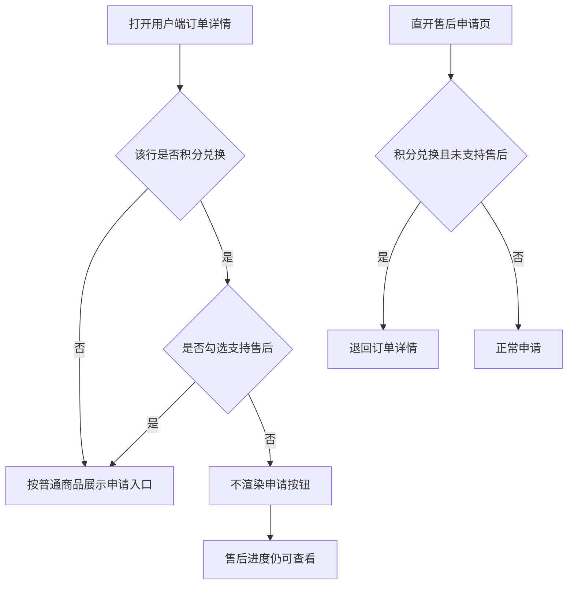

# 【791】积分商城

来源清单：`2026090802`（由《670-积分抵现、积分商城》拆出。）

本文件只覆盖营销积分商城：可兑换商品、C 端兑换，以及积分兑换订单的售后入口。积分规则、积分获取、积分明细见《670-积分规则、积分获取、积分明细》。积分抵现及优惠叠加见《790-积分抵现》。兑换总开关、是否支持售后仍在积分规则页配置，本文件只引用其结果。

# 1. 后台业务 WEB 系统

## 1.1 概述

### 需求背景

可兑换商品原先散落在营销演示页。营销活动下已有积分商城。本文件整理商城列表、编辑积分商品和用户端兑换，作为研发对照口径。

### 需求目标

**积分商城**：营销活动下维护可兑换商品（兑换方式、配送方式、范围、定时上下架、可空轮播、规则说明）；列表无采购价；编辑页基础配置对齐秒杀商品；规格用卡片，上架/下架控制是否出现在商城。兑换总开关只读，去积分规则页配置；C 端走商城 → 详情 → 确认兑换。未勾选支持售后时只隐藏用户端申请入口。

## 1.2 管理范围

| 终端 | 模块 | 变更类型 |
|------|------|----------|
| B 端 MDM | 营销 · 营销活动 · 积分商城 | 新增 |
| B 端 MDM | 营销 · 积分商城 · 编辑积分商品 | 新增 |
| C 端用户 APP | 积分商城 / 商品详情 / 确认兑换 | 新增 |
| C 端用户 APP | 订单详情 · 积分兑换售后入口 | 修改 |

本期不做：

- 积分规则、消费送积分、积分明细（见《670-积分规则、积分获取、积分明细》）
- 积分抵现、确认订单抵扣与优惠叠加（见《790-积分抵现》）
- 营销侧旧入口「积分首页 / 消费赠积分 / 积分管理」与会员侧数据打通

## 1.3 需求详细说明

### 1.3.1 B 端积分商城列表

#### 1.3.1.1 功能点：维护可兑换商品清单

运营在营销-营销活动-积分商城筛选、添加、编辑、上下架、删除积分商品；配置轮播图；入口去编辑规则说明。顶部「积分商城」开关只读，须到积分规则页配置。

#### 1.3.1.2 功能流程图

需要说明的问题：

- 可选商品 = 选品库「可售卖渠道含电商直播且售卖中」与秒杀活动已配置商品的并集；秒杀来源在添加抽屉带「秒杀」标签。
- 列表只展示至少 1 个规格上架的商品；多规格默认可展开。
- 已兑换数量为 C 端实际兑换，售后不回退库存。
- 选品库已删的商品仅可删除，不可再编辑上下架。
- 定时上下架：当前时间落在上架~下架区间内则展示为上架。
- 列表不再展示采购价；列多时表格区域可左右滑动。
- 轮播图选填，最多 10 条；可以一条都不配。未配置或无有效图片时 C 端不展示轮播区。

#### 1.3.1.3 功能描述

| 项 | 内容 |
|----|------|
| 功能类型 | 查询数据 / 更新数据 / 新增数据 / 删除数据 |
| 功能描述 | 维护积分商城商品与轮播 |
| 前提业务 | 选品库有售卖中且渠道含电商直播的商品，或秒杀活动已配置商品 |
| 后继业务 | C 端商城读取至少 1 个规格上架的商品 |
| 功能约束 | 开关不可在本页修改 |
| 约束描述 | 无 |
| 操作权限 | 营销活动操作账号 |

#### 1.3.1.4 界面设计

**1. 界面原型**

- 原型文件：`MDM/mdm_marketing_points_mall.html`
- 本地预览：`http://localhost:5173/MDM/mdm_marketing_points_mall`
- 布局：
  - 只读开关条 + 状态文案 + 「去配置」
  - 筛选：商品名称/编码、类目、兑换方式、配送方式、适用范围、状态、是否定时上下架、兑换积分区间
  - 工具栏：添加商品、轮播图配置、积分规则说明
  - 表格：序号（倒序）、名称、编码、图、类目、规格、划线价、库存（可排序）、兑换积分、已兑换（可排序）、配送方式、兑换方式、适用范围、状态、定时上下架、操作
  - 空态：「暂无符合条件的商品」
  - 分页：20/50/100 条、跳页

#### 数据要求

| 字段名称 | 长度 | 录入方式 | 是否非空项 | 默认显示 |
|----------|------|----------|------------|----------|
| 商品名称/编码 | — | 文本框 | N | 空 |
| 商品类目 | — | 下拉 | N | 全部 |
| 兑换方式 | — | 下拉 | N | 全部（纯积分兑换 / 积分加现金） |
| 配送方式 | — | 下拉 | N | 全部（快递配送 / 自提） |
| 适用范围 | — | 下拉 + 区域或门店 | N | 全部 |
| 状态 | — | 下拉 | N | 全部（上架 / 下架） |
| 是否设置定时上下架 | — | 下拉 | N | 全部 |
| 兑换积分 | — | 数字区间 | N | 空 |

轮播图弹窗：选填，最多 10 条。有配置时标题必填最多 40 字、图片必填（JPG/PNG/GIF/WEBP ≤2MB）、跳转链接选填。允许一条都不配并保存。

#### 1.3.1.5 逻辑描述

1. 开关关闭：C 端不展示积分商城入口（进明细）。本页开关 disabled。
2. 添加商品打开选品抽屉，未添加/已添加可筛；列出选品库与秒杀并集。新建默认纯积分、100 积分、下架、不限购，仅第一规格上架。
3. 行内上架/下架会清掉定时字段。删除二次确认。
4. 库存、已兑换列可排序。表格一行放不下时可左右滑动。
5. 轮播可空保存；C 端无有效图时隐藏轮播区。

### 1.3.2 编辑积分商品

#### 1.3.2.1 功能点：配置单件积分商品的兑换与售卖范围

从列表编辑进入。无独立「商品信息」卡与顶部说明。基础配置样式与字段对齐秒杀-商品-基础信息，并增加商品限购、兑换方式、适用会员等级、商品状态。商品配置为选择 SKU + 规格卡片（与秒杀一致），卡片底栏「下架 / 上架」。

#### 1.3.2.2 功能流程图

需要说明的问题：

- 兑换方式全规格共用。
- 至少上架 1 个规格；上架规格库存、起售量、兑换积分必填。
- 积分加现金时上架规格须填加价金额（≥0）。
- 已兑换只读，售后不回退。
- 规格池 = 选品库 SKU ∪ 秒杀已配 SKU ∪ 已保存兑换配置。商品限购只在 SPU，规格上不配限购。
- 规格卡片「下架 / 上架」对应是否出现在积分商城；不是「关闭兑换 / 开启兑换」。

#### 1.3.2.3 功能描述

| 项 | 内容 |
|----|------|
| 功能类型 | 更新数据 |
| 功能描述 | 保存积分商品配置 |
| 前提业务 | 商品已从选品库或秒杀并集加入积分商城 |
| 后继业务 | 列表与 C 端详情/兑换读取 |
| 功能约束 | 见校验 |
| 约束描述 | 无 |
| 操作权限 | 营销活动操作账号 |

#### 1.3.2.4 界面设计

**1. 界面原型**

- 原型文件：`MDM/mdm_marketing_points_mall_form.html`
- 本地预览：`http://localhost:5173/MDM/mdm_marketing_points_mall_form`
- 布局：
  - 面包屑「营销 / 营销活动 / 积分商城 / 编辑积分商品」
  - 页头返回积分商城，右侧展示商品 ID
  - 卡片「基础配置」（两列栅格，控件对齐秒杀商品基础信息）
  - 卡片「售卖范围」：范围类型、售卖端口
  - 卡片「商品配置」：选择 SKU、规格卡片、重置规格
  - 卡片「媒体与详情」
  - 底栏固定：取消、保存

#### 数据要求

| 字段名称 | 长度 | 录入方式 | 是否非空项 | 默认显示 |
|----------|------|----------|------------|----------|
| 商品名称 | — | 文本框 | Y | 选品库名称，可改 |
| 预计到店时间 | — | 文本框 + 单位天下拉 | N | 空；单位天/小时 |
| 配送方式 | — | 单选 | Y | 快递配送 / 自提 |
| 展示销量 | — | 单选实际/自定义；自定义时数字框 | Y；自定义时销量 Y | 实际销量 |
| 文字描述 | — | 多行文本 | N | 空 |
| 商品限购 | — | 单选不限购/每单/每天/累计；非不限购时件数 | Y；非不限购时件数 Y | 不限购 |
| 兑换方式 | — | 单选 | Y | 纯积分兑换 |
| 适用会员等级 | — | 全部 / 指定 + 多选 | Y；指定时至少 1 个等级 | 全部 |
| 商品状态 | — | 单选上架/下架/定时上下架 | Y | 下架 |
| 上架时间 / 下架时间 | — | 日期时间 | 定时上下架时 Y | 空；下架须晚于上架 |
| 范围类型 | — | 单选全部/省市区/门店 | 非全部时须选出 | 全部 |
| 售卖端口 | — | 不限 / 指定小程序、APP | 指定时 Y | 不限 |
| 选择 SKU | — | 下拉多选 | 至少 1 个 | 已上架规格 |
| 展示规格名称 | — | 文本框 | N | 规格名 |
| 商品条形码 / 规格值 / 基础单位 / 采购价 / 现货库存 / 实际库存 / 已兑换 | — | 只读 | — | 选品库或已存 |
| 售卖系数 / 售卖单位 | — | 文本 / 下拉 | N | 已存或空 |
| 兑换积分 | ≥1 | 数字 | 上架时 Y | 100 |
| 加价金额 | ≥0 | 数字 | 积分加现金且上架时 Y | 0 |
| 划线价 | ≥0 | 数字 | N | 空 |
| 起售量 | ≥1 | 数字 | 上架时 Y | 1 |
| 兑换库存 | ≥0 | 数字 | 上架时 Y | 已存 |
| 下架 / 上架 | — | 按钮 | 至少 1 个规格上架 | 已上架显示下架 |
| 商品图片 | ≤5MB | 多图上传 | N | 主图，首张为列表主图 |
| 商品详情 | — | 富文本 | N | 空 |

#### 1.3.2.5 逻辑描述

1. 校验失败停留在编辑页并 toast（如请填写商品名称、请选择配送方式、请至少上架一个规格）。
2. 点「下架」后该规格不再出现在积分商城列表，按钮变为「上架」；点「上架」恢复，提示「该规格已上架 / 已下架」。
3. 选择「自定义销量」出现销量输入；选择每单/每天/累计后同行出现限购件数；选择定时上下架须填上架至下架时间。
4. 重置规格恢复进入编辑前的规格快照。删除规格至少留 1 个。点缩略图可换规格图。
5. 保存成功同步列表与用户端兑换页。取消回列表不保存。
6. 相对初版：去掉只读「商品信息」卡和顶部说明；履约方式改为配送方式（快递/自提）；规格从横向表改为秒杀同款卡片；按钮由关闭/开启兑换改为下架/上架。

### 1.3.3 C 端积分商城与兑换

#### 1.3.3.1 功能点：浏览积分商品并兑换

兑换总开关开启时，个人中心「我的积分」进入积分商城；有有效轮播才展示轮播区；可按兑换方式筛选、进详情、加入购物车或立即兑换，确认页扣积分（加现金则还需支付）。

#### 1.3.3.2 功能流程图

需要说明的问题：

- 商城列表原型未按区域/门店/端口/等级过滤，仅过滤上架规格。
- 加入购物车配送：快递配送 → express，自提 → pickup（历史「平台配送」按自提）。
- 演示可用积分 161，不足则确认按钮禁用。
- B 端未配置或清空轮播后，C 端不占位、不轮播。

#### 1.3.3.3 功能描述

| 项 | 内容 |
|----|------|
| 功能类型 | 查询数据 / 新增数据 |
| 功能描述 | 展示积分商品并生成兑换订单 |
| 前提业务 | 全局积分开且兑换开；B 端有上架商品 |
| 后继业务 | 订单详情、积分明细记兑换扣减 |
| 功能约束 | 积分不足不可确认 |
| 约束描述 | 无 |
| 操作权限 | 登录用户 |

#### 1.3.3.4 界面设计

**1. 界面原型**

- 原型文件：`user-app/h5/points-mall.html`、`user-app/h5/points-product-detail.html`、`user-app/h5/points-order-confirm.html`、`user-app/h5/profile.html`、`user-app/h5/cart.html`
- 本地预览：
  - `http://localhost:5173/user-app/h5/points-mall`
  - `http://localhost:5173/user-app/h5/points-product-detail`
  - `http://localhost:5173/user-app/h5/points-order-confirm`
  - `http://localhost:5173/user-app/h5/profile`
- 布局：
  - 个人中心 VIP 区「我的积分」展示当前积分（可用+冻结）
  - 商城：橙色 Hero（可用/冻结/规则）、有配置才展示轮播、Tab 全部/纯积分/积分+现金、筛选、商品卡片「兑换」
  - 详情：大图、价格、规格、配送（快递配送 / 自提）、详情、底栏加入购物车 / 立即兑换
  - 确认兑换：地址、商品、配送方式、汇总、底栏确认兑换或确认并支付；支付弹层微信支付/支付宝

#### 数据要求

| 字段名称 | 长度 | 录入方式 | 是否非空项 | 默认显示 |
|----------|------|----------|------------|----------|
| 兑换方式 Tab | — | 单选 Tab | N | 全部 |
| 规格 / 数量 | — | 弹层选择 + 步进器 | Y | 起售量 |
| 确认兑换 | — | 按钮 | — | 积分不足时禁用 |

C 端价格展示：`100积分` 或 `100积分 + ¥1`。

#### 1.3.3.5 逻辑描述

1. 兑换总开关关闭：访问商城会跳到积分明细；个人中心「我的积分」也进明细。
2. 单规格点兑换直接确认页，数量为起售量；多规格先选 SKU。
3. 纯积分走确认兑换；积分加现金走确认并支付。支付为演示弹层，成功后到订单详情发货态。
4. 购物车积分兑换商品名称带【积分兑换】标签。
5. 首页无积分入口，入口在个人中心。
6. 无有效轮播（未配置或无图片）时整块隐藏，不占位。

### 1.3.4 C 端订单详情 · 积分兑换售后入口

#### 1.3.4.1 功能点：未勾选支持售后时隐藏用户端申请入口

积分规则未勾选「支持售后」时，用户端积分兑换商品行不展示「申请售后 / 申请退款」，也不弹「暂不支持售后」。已有售后进度条仍可点进查看。PC 后台售后单不受此开关拦截。

#### 1.3.4.2 功能流程图

需要说明的问题：

- 普通商品行不受本开关影响。
- 验收可用右下角「积分兑换售后验收开关」：跟随后台 / 已勾选 / 未勾选，点「应用并刷新」。
- 自提订单详情同样隐藏「申请退款」。

#### 1.3.4.3 功能描述

| 项 | 内容 |
|----|------|
| 功能类型 | 查询数据 / 交互控制 |
| 功能描述 | 按积分规则控制 C 端售后申请入口展示 |
| 前提业务 | 全局积分规则已保存「是否支持售后」 |
| 后继业务 | 勾选后可走既有售后申请流程 |
| 功能约束 | 仅约束用户端申请入口 |
| 约束描述 | 不关闭 PC 后台售后 |
| 操作权限 | 登录用户；验收开关仅原型演示 |

#### 1.3.4.4 界面设计

**1. 界面原型**

- 原型文件：`user-app/h5/order-detail.html`、`user-app/h5/order-detail-pickup.html`
- 本地预览：
  - `http://localhost:5173/user-app/h5/order-detail.html?status=completed&pointsItem=2`
  - `http://localhost:5173/user-app/h5/order-detail-pickup.html?pointsItem=2`
- 布局：商品行操作区；未支持售后时积分兑换行无申请按钮；右下角验收开关面板（白底、主色 `#ff7019`）

#### 数据要求

| 字段名称 | 长度 | 录入方式 | 是否非空项 | 默认显示 |
|----------|------|----------|------------|----------|
| 申请售后 / 申请退款 | — | 按钮 | — | 支持售后且可退时展示 |
| 积分兑换售后验收开关 | — | 下拉 + 应用并刷新 | N | 跟随后台规则 |

#### 1.3.4.5 逻辑描述

1. 未勾选支持售后：积分兑换行不渲染申请入口，点击也不会 alert。
2. 已有售后进度条仍展示，可进入售后详情。
3. 直接打开选择售后类型 / 申请表单页时，若该商品为积分兑换且未支持售后，退回订单详情。
4. 相对初版：入口仍展示、点击后弹「抱歉，积分兑换商品暂不支持售后」；现改为直接隐藏入口，避免理解成后台也不能做售后。
