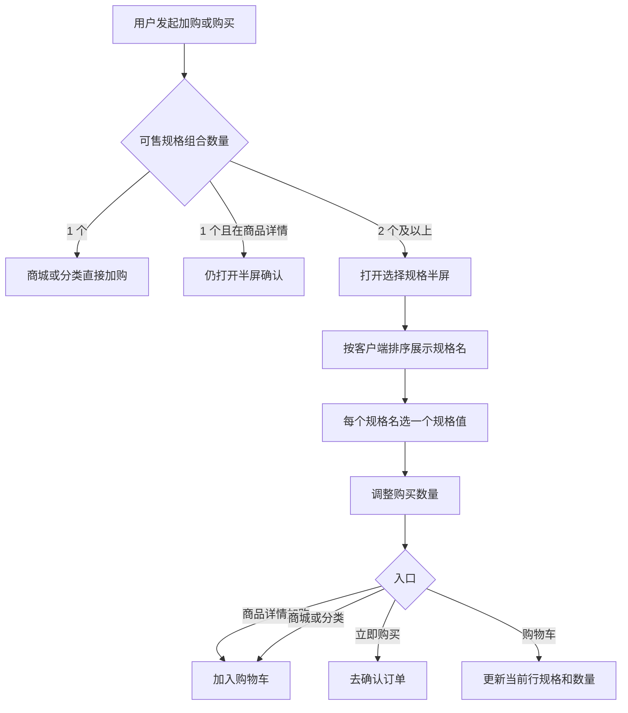

# 选品库规格客户端排序与客户端多规格交互 产品需求文档

---

## 文档信息

| 字段 | 内容 |
|------|------|
| 文档版本 | v1.0 |
| 状态 | 草稿 |
| 作者 | 待填写 |
| 最后更新 | 2026-09-23 |
| 审阅人 | 待填写 |
| 原型 | 选品库添加商品-销售信息-规格管理；用户 APP 商品详情、商城、分类、购物车、黑灯直播间、确认订单 |

**变更记录**

| 版本 | 日期 | 修改人 | 说明 |
|------|------|--------|------|
| v1.0 | 2026-09-23 | 待填写 | 在现有规格管理上补充客户端排序，并写明用户端多规格交互与展示顺序 |

---

## 一、背景与目标

### 1.1 背景

选品库添加商品的销售规格已经可用：运营维护全局规格名称，在商品上选择规格名、填写规格值，系统按规格值组合生成规格详情。规格管理里的「排序」只决定后台列表和「规格名」下拉的先后，数字越大越靠前。

商品可以配置多个规格名（例如颜色、重量）。这些规格名在用户端需要按运营指定的顺序出现，不能跟随后台列表用的「排序」，也不能跟添加商品时的偶然顺序。规格管理已增加「客户端排序」字段，本需求把该字段接到用户端多规格展示，并固定用户选规格的交互。

### 1.2 目标

**业务目标**

- 运营用「客户端排序」控制用户看到的规格名顺序，调整后用户端各选规格入口顺序一致。
- 用户在商品详情、商城、分类、购物车、直播间商品里，用同一套半屏完成选规格，减少选错规格后再下单。

**产品目标**

- 「排序」与「客户端排序」职责分开：前者只影响后台，「客户端排序」只影响用户端规格名展示顺序。
- 一个商品有多个规格名时，用户端按「客户端排序」从大到小展示这些规格名。
- 多规格商品必须先选规格再加购或下单；单规格商品在商城、分类可直接加购。

### 1.3 范围说明

**本期包含**

- 规格管理中「客户端排序」的录入、展示和校验（在现有规格管理上迭代，不重做规格管理）。
- 商品配置多个规格名时，用户端规格名区块的排序规则。
- 用户 APP 多规格半屏：商品详情、商城、分类、购物车、黑灯直播间内嵌商品详情。
- 确认订单只展示已选规格，不在确认页改规格。

**本期不包含**

- 用「客户端排序」重排规格管理列表，或重排商品里「规格名」下拉、规格详情表的列顺序。这两处仍按「排序」和现有规则。
- 给单个规格值单独做排序。规格值顺序仍是运营在该商品上添加的先后。
- 每个规格值单独上传图片。半屏里的规格图用商品主图。
- 门店端进货选规格。用户端与门店端数据保持分开，本需求不改门店进货。
- 规格管理增加删除。现有列表只有新建和编辑。

---

## 二、用户分析

### 2.1 目标用户

**运营 / 选品**

- 在选品库维护规格名称，并给商品配置一个或多个规格名及其规格值。
- 需要后台自己看的顺序，和用户端卖货时的规格顺序分开控制。

**用户 APP 购物用户**

- 在商品详情、商城、分类、直播间看到多规格商品，需要看清规格并选中后再加购或下单。
- 在购物车里发现规格选错时，直接改规格，不必回到商品详情。

### 2.2 用户痛点

| # | 痛点 | 描述 | 影响程度 |
|---|------|------|----------|
| 1 | 后台顺序和卖货顺序绑在一起 | 「排序」一改，后台下拉和用户看到的规格顺序一起变，运营无法只调整用户端 | 高 |
| 2 | 多规格没有统一选法 | 商城、详情、购物车如果各写一套，用户不知道当前选中哪一个规格 | 高 |
| 3 | 购物车不能改规格 | 规格选错只能删掉重加，数量也要重填 | 中 |

### 2.3 用户故事

作为选品运营，我希望给规格名称单独填写客户端排序，以便多个规格在用户端按我指定的顺序展示，同时不打乱后台规格列表。

作为购物用户，我希望多规格商品先弹出规格选择，以便确认规格和数量后再加入购物车或下单。

作为购物用户，我希望在购物车点击规格重新选择，以便改规格时保留在当前购物车里完成。

---

## 三、功能需求

### 3.1 规格管理（现有能力，本期只增加客户端排序）

**模块说明**：入口为选品库 → 添加商品 → 销售信息 → 规格管理。规格名称是全局字典，不是某个商品私有。现有名称、排序、新建、编辑保持不变。

#### FR-SPEC-001 维护规格名称与后台排序

**优先级**：P0  
**描述**：规格管理列表展示名称、排序、操作。新建和编辑可填写规格名称、排序。排序为整数，空值按 0 保存。说明文案为「数字越大，排序越靠前」。列表和商品上「规格名」下拉按排序从大到小；排序相同则按创建先后，先创建的在前。规格名称必填，最多 20 字，不可与已有名称重复。

**验收标准**：

- [ ] 列表列顺序为名称、排序、客户端排序、操作；排序和客户端排序的问号说明均为「数字越大，排序越靠前」。
- [ ] 只改「排序」时，规格管理列表和规格名下拉顺序变化；「客户端排序」列的数字变化不会改变这两处顺序。
- [ ] 名称为空、重名、排序不是整数时，不能保存，并提示对应原因。

**异常情况**：排序允许负整数。未填写时保存为 0。

---

#### FR-SPEC-002 客户端排序

**优先级**：P0  
**描述**：新建规格、编辑规格增加「客户端排序」。列表在「排序」和「操作」之间展示该值。输入规则与排序相同：整数，空值按 0，输入框下方说明「值越大排序越靠前」。该字段只供用户端决定规格名展示顺序，不改变后台列表、规格名下拉、规格详情列的顺序。

**验收标准**：

- [ ] 新建和编辑都能填写并保存客户端排序，再次打开仍是上次保存的整数。
- [ ] 客户端排序不是整数时提示「客户端排序请输入整数」，不关闭弹窗。
- [ ] 两个规格的客户端排序不同、排序相同：后台列表顺序不变，用户端规格名顺序按客户端排序从大到小。

**异常情况**：允许负整数。未填写保存为 0。全部为 0 时，用户端顺序见 FR-CLIENT-001 的相同值规则。

---

#### FR-SPEC-003 商品上配置多个规格

**优先级**：P0  
**描述**：销售信息可添加多条规格。每条选择一个规格名（来自规格管理，已被本商品占用的名称不可再选），并添加一个或多个规格值。规格值在本条内不可重复，顺序为添加先后。已填写规格值的规格名参与组合，生成规格详情。规格详情的列顺序仍按商品上添加规格的先后，不按客户端排序重排。

**验收标准**：

- [ ] 同一商品不能选择两个相同规格名。
- [ ] 规格值按添加顺序保留；删除中间某个值后，其余值相对顺序不变。
- [ ] 两个规格名都有规格值时，规格详情行数等于各规格值数量相乘。

**异常情况**：规格名已选但没有规格值时，该条不参与组合，也不在用户端展示。

---

### 3.2 用户端规格顺序

#### FR-CLIENT-001 多个规格名按客户端排序展示

**优先级**：P0  
**描述**：商品在用户端展示规格时，先取出该商品已填写规格值的规格名。每个规格名一块。块的顺序只看规格管理里该名称的「客户端排序」：数字越大越靠前。客户端排序相同，则按该商品添加这条规格的先后，先添加的在前。块内规格值按商品上的添加顺序，不按客户端排序重排。

**验收标准**：

- [ ] 商品配置「颜色」（客户端排序 10）和「重量」（客户端排序 20）时，用户端先展示重量，再展示颜色。
- [ ] 两条客户端排序都是 0 时，用户端顺序与商品上添加规格的先后一致。
- [ ] 只改「排序」、不改「客户端排序」时，用户端规格名顺序不变。
- [ ] 规格值「红、蓝」先加红再加蓝，用户端该块内先红后蓝。

**异常情况**：规格名已从字典改名时，商品上的规格名跟随新名称，排序仍用该条记录的客户端排序。字典中找不到该名称时，该块排在所有能匹配到的规格名之后，多条都找不到时保持商品上的添加顺序。

---

### 3.3 选择规格半屏

**模块说明**：商品详情、商城、分类、购物车、黑灯直播间内嵌商品详情共用这一套半屏。从手机框底部弹出，点遮罩或关闭可收起，不改已选结果。

半屏内容自上而下：

1. 商品图、价格、商品名、「已选」。
2. 规格块。价格为「¥」加金额；商品另有积分时在金额后展示「+N积分」。商品名沿用当前商品名称。
3. 「购买数量」，步进 1，范围 1–99。
4. 底部通栏按钮。文案按入口区分，见各 FR。

「已选」为「已选 」加上当前各规格值，多个规格值按规格名块的顺序用空格连接。

#### FR-CLIENT-002 规格块的列表与大图

**优先级**：P0  
**描述**：每个规格名一块。该块只有 1 个规格值时，不提供列表/大图切换，只用列表样式。有 2 个及以上规格值时，标题行右侧出现切换：当前是列表时按钮为「大图」，当前是大图时按钮为「列表」。默认列表。切换只影响当前这块，不改变已选值。

列表：规格值横向排列，宽度随文字，一行放不下就换到下一行。同一块里可以上一行并排、下一行单独一条，这是换行结果，不是另一种样式。

大图：每行 3 个。上图下文，文案最多两行。选中项为橙色描边，文字仍为深色。图片用商品主图。

标题：商品只有一个规格名时，标题为「规格」，不带数量。商品有多个规格名时，每块标题用该规格名称，不带数量。

**验收标准**：

- [ ] 只有一个规格值时看不到「大图」或「列表」。
- [ ] 两个及以上规格值时，可在列表和大图之间切换，已选项保持选中。
- [ ] 单规格名商品的标题是「规格」，不是「规格 (2)」这类带数量的文案。
- [ ] 多规格名商品的块标题是规格名称，顺序符合 FR-CLIENT-001。

**异常情况**：规格值为空的规格名不渲染该块。

---

#### FR-CLIENT-003 商品详情选规格

**优先级**：P0  
**描述**：商品详情底部「加入购物车」「立即购买」都先打开半屏。加入购物车入口的按钮为「加入购物车」；立即购买入口的按钮为「立即下单」。页面上若仅用于确认规格、不直接下单，按钮为「确定」。打开时选中该商品默认规格；没有默认规格时选中排序后的第一个可售组合。数量从 1 开始。确认后按所选规格和数量加购或进入下单。未选全每个规格名时，按钮不可用，并提示「请选择规格」。

**验收标准**：

- [ ] 从「加入购物车」进入，确认后该规格按所选数量进入购物车，并提示已加入购物车。
- [ ] 从「立即购买」进入，确认后带着所选规格和数量进入确认订单。
- [ ] 关闭半屏不改变购物车。

**异常情况**：商品当前不可售时不打开半屏，沿用商品不可售提示。

---

#### FR-CLIENT-004 商城与分类加购

**优先级**：P0  
**描述**：商城、分类的加购使用同一规则。可售规格组合只有 1 个时，直接按该规格数量 1 加入购物车，不打开半屏。可售组合有 2 个及以上时，打开半屏，按钮为「加入购物车」，标题规则同 FR-CLIENT-002。确认后加入购物车并提示。半屏标题不带规格数量。

**验收标准**：

- [ ] 只有一个可售组合时，点加购后购物车数量加 1，不出现半屏。
- [ ] 有多个可售组合时，未确认前购物车不变；确认后写入所选规格和数量。
- [ ] 分类页加购与商城一致。

**异常情况**：不可售商品不可加购。

---

#### FR-CLIENT-005 购物车修改规格

**优先级**：P0  
**描述**：购物车商品行展示履约方式（自提或快递）和当前规格。多规格商品的规格可点击，并带向下箭头。点击打开同一半屏，带入当前规格和当前数量，按钮为「确定」。确认后只更新这一行的规格和数量，不新增一行。单规格商品的规格不可点击。积分兑换商品不走这套规格选择。

**验收标准**：

- [ ] 多规格行点击规格后，半屏里当前规格为选中，数量与购物车行一致。
- [ ] 改规格和数量后点确定，该行规格文案和数量更新，购物车仍是一行。
- [ ] 关闭半屏时，该行规格和数量保持打开前的值。
- [ ] 只有一个可售组合的商品，规格不是按钮，没有箭头。

**异常情况**：确认时数量限制在 1–99。该行来自直播加购时，规格和数量与直播侧购物车一起更新。

---

#### FR-CLIENT-006 直播间与确认订单

**优先级**：P1  
**描述**：黑灯直播间里打开的商品详情，选规格半屏与商品详情一致，包括规格名顺序、列表/大图和按钮文案。确认订单展示已选规格的完整名称，不提供改规格；要修改须回到购物车。

**验收标准**：

- [ ] 直播间商品详情的规格块顺序与商品详情页相同。
- [ ] 确认订单上的规格文案与购物车该行一致，且不能点开半屏。

**异常情况**：无。

---

### 3.4 功能优先级

| 功能 | 描述 | 优先级 | 工作量估算 | 备注 |
|------|------|--------|------------|------|
| 客户端排序录入 | 规格管理列表与新建/编辑 | P0 | S | 后台已有字段 |
| 用户端规格名排序 | 按客户端排序展示多个规格名 | P0 | S | 不改变后台列表顺序 |
| 选择规格半屏 | 列表/大图、数量、分入口按钮 | P0 | M | 详情、商城、分类、购物车、直播间 |
| 购物车改规格 | 点击规格更新当前行 | P0 | S | 单规格不可点 |
| 确认订单展示 | 只读完整规格名 | P1 | S | 不新增改规格 |

---

## 四、非功能需求

### 4.1 性能要求

- 打开选择规格半屏时，规格块应随半屏一起出现，不先出空白再补规格。
- 规格名、规格值在常规商品规模（规格名不超过 5 个、单个规格名的规格值不超过 30 个）下，切换列表/大图无明显等待。

### 4.2 可用性

- 半屏可关闭，关闭不等于确认。
- 选中态在列表和大图中都能一眼区分。
- 规格标题不使用「规格 (数量)」这种带数字的写法。

### 4.3 安全性

- 客户端排序和排序只允许整数，不接受小数和其他字符。
- 规格名称按文本展示，不把用户输入当成页面脚本执行。

### 4.4 兼容性

- 用户端以现有手机框宽度为准（393 宽的原型壳）。
- 列表换行在该宽度下生效；大图固定每行 3 个。

---

## 五、方案设计

### 5.1 信息架构

| 位置 | 作用 |
|------|------|
| 选品库 / 添加商品 / 销售信息 / 规格管理 | 维护规格名称、排序、客户端排序 |
| 选品库 / 添加商品 / 销售信息 / 销售规格 | 为当前商品选择规格名并填写规格值 |
| 用户 APP / 商品详情 | 加入购物车、立即购买前选规格 |
| 用户 APP / 商城、分类 | 单规格直接加购，多规格先选规格 |
| 用户 APP / 购物车 | 多规格可改选 |
| 用户 APP / 黑灯直播间 | 内嵌商品详情，规则同商品详情 |
| 用户 APP / 确认订单 | 只展示已选规格 |

### 5.2 排序规则

| 场景 | 规则 |
|------|------|
| 规格管理列表 | 按「排序」从大到小；相同则先创建的在前 |
| 商品「规格名」下拉 | 与规格管理列表相同 |
| 规格详情列 | 按该商品添加规格的先后，不看客户端排序 |
| 用户端规格名块 | 按「客户端排序」从大到小；相同则按该商品添加先后 |
| 用户端规格值 | 按该商品添加规格值的先后 |

### 5.3 核心交互

商品详情即使只有一个可售组合，也打开半屏，方便确认数量。商城和分类在只有一个可售组合时直接加购。

### 5.4 半屏按钮

| 入口 | 按钮文案 | 确认结果 |
|------|----------|----------|
| 商品详情 · 加入购物车 | 加入购物车 | 写入购物车 |
| 商品详情 · 立即购买 | 立即下单 | 进入确认订单 |
| 商品详情 · 只确认规格 | 确定 | 关闭并记住规格 |
| 商城、分类 | 加入购物车 | 写入购物车 |
| 购物车 | 确定 | 更新当前行 |

### 5.5 原型引用

- 后台：`MDM/mdm_product_selection.html`，添加商品抽屉的销售信息和规格管理。
- 用户端：`user-app/h5/goods-detail.html`、`user-app/h5/mall.html`、`user-app/h5/category.html`、`user-app/h5/cart.html`、`user-app/h5/live-room.html`、`user-app/h5/order-confirm.html`。

---

## 六、数据指标

### 6.1 北极星指标

多规格商品加购时，已选择规格再提交的占比。目标：商城、分类、商品详情、购物车的多规格加购都经过规格确认，不出现未选规格就进购物车。

### 6.2 过程指标

| 指标 | 当前值 | 目标值 | 衡量周期 |
|------|--------|--------|----------|
| 多规格半屏打开后完成确认的比例 | [待确认] | 高于直接关闭比例 | 周 |
| 购物车通过规格入口改规格的次数 | [待确认] | 可统计即可 | 周 |
| 因规格选错发起的退款占比 | [待确认] | 不高于上线前 | 月 |

### 6.3 反指标

- 单规格商品在商城、分类的加购步数不增加。
- 后台规格列表的查找效率不因客户端排序变差：列表顺序仍由「排序」决定。

### 6.4 埋点

| 事件 | 时机 | 属性 |
|------|------|------|
| 打开规格半屏 | 半屏展示 | 商品、入口（详情加购 / 立即购买 / 商城 / 分类 / 购物车 / 直播间） |
| 确认规格 | 点击底部按钮且选择完整 | 商品、规格组合、数量、入口 |
| 关闭规格半屏 | 未确认就关闭 | 商品、入口 |
| 切换规格样式 | 点击大图或列表 | 商品、规格名、切换后的样式 |

---

## 七、里程碑计划

| 里程碑 | 交付内容 | 目标日期 | 负责人 |
|--------|----------|----------|--------|
| M1 需求冻结 | 本 PRD 评审通过 | [待确认] | 产品 |
| M2 原型确认 | 后台客户端排序与用户端半屏对照验收 | [待确认] | 产品 |
| M3 研发完成 | 用户端规格名顺序接上客户端排序 | [待确认] | 研发 |
| M4 测试完成 | 按第三章验收标准通过 | [待确认] | 测试 |
| M5 上线 | 选品库与用户 APP 一起发布 | [待确认] | 产品 |

---

## 八、风险与依赖

### 8.1 风险

| 风险 | 概率 | 影响 | 应对方案 |
|------|------|------|----------|
| 运营把「排序」和「客户端排序」填反 | 中 | 中 | 两处说明都写「值越大排序越靠前」，并在列表用列名区分用途 |
| 历史商品没有客户端排序 | 高 | 中 | 空值按 0；相同时按商品上添加规格的先后，避免顺序跳动 |
| 规格值很多时半屏过长 | 低 | 中 | 半屏内部滚动，底部按钮保持可见 |

### 8.2 依赖

| 依赖方 | 需要的支持 | 预期时间 | 状态 |
|--------|------------|----------|------|
| 选品库规格字典 | 提供规格名称和客户端排序 | 随本期 | 原型已有字段 |
| 商品销售规格 | 提供规格名、规格值及添加顺序 | 随本期 | 现有销售信息 |
| 用户 APP 购物车 | 一行商品可更新规格和数量 | 随本期 | 原型已支持点击规格 |

---

## 附录

### 术语

| 术语 | 含义 |
|------|------|
| 规格名 | 规格管理里的名称，如颜色、重量、包。一个商品可选多个，但不能重复 |
| 规格值 | 某个规格名下的可选项，如红色、500g。顺序为添加先后 |
| 排序 | 后台用。决定规格管理列表和规格名下拉，数字越大越靠前 |
| 客户端排序 | 用户端用。决定一个商品上多个规格名的展示顺序，数字越大越靠前 |
| 可售规格组合 | 已填写规格值的规格名做组合后、当前可售的一条规格 |

### 示例

商品添加顺序为颜色、重量。颜色的客户端排序为 1，重量为 5。颜色的规格值先添加「红」再添加「蓝」，重量先添加「500g」再添加「1kg」。

用户端半屏自上而下为：

1. 重量：500g、1kg
2. 颜色：红、蓝

后台规格管理列表不因这次客户端排序改变。商品规格详情的列仍先颜色、后重量。
